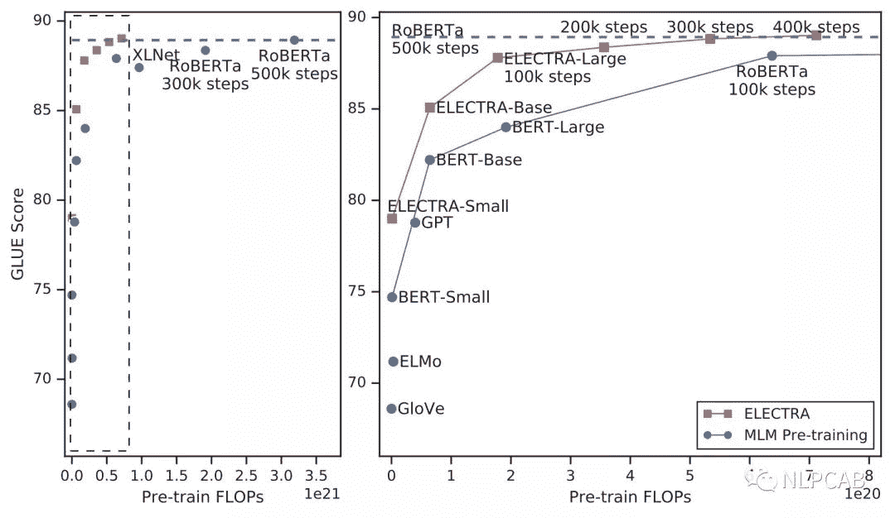
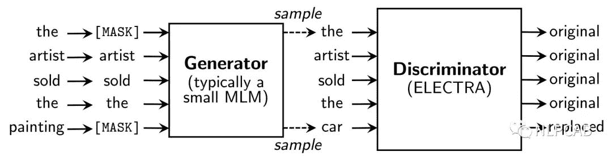
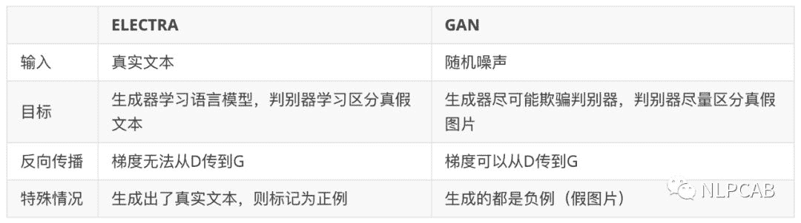
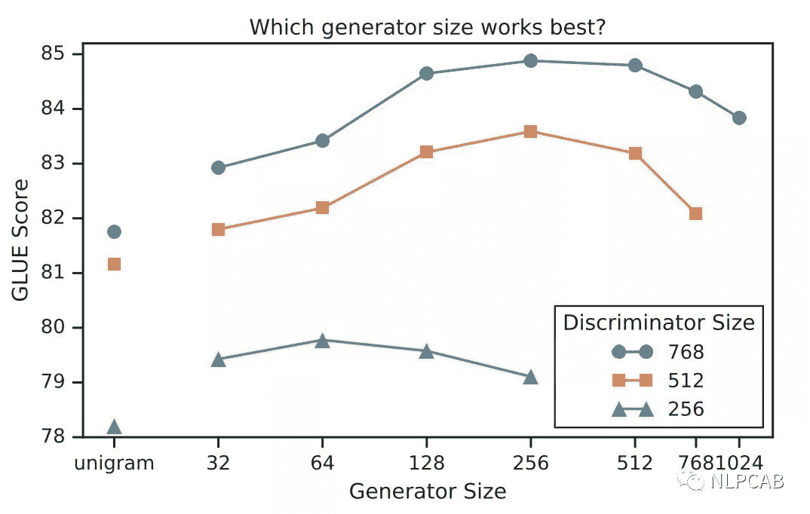
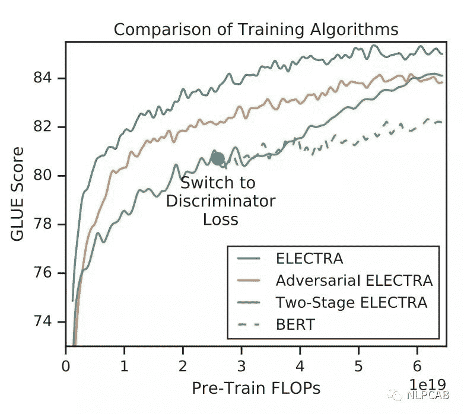
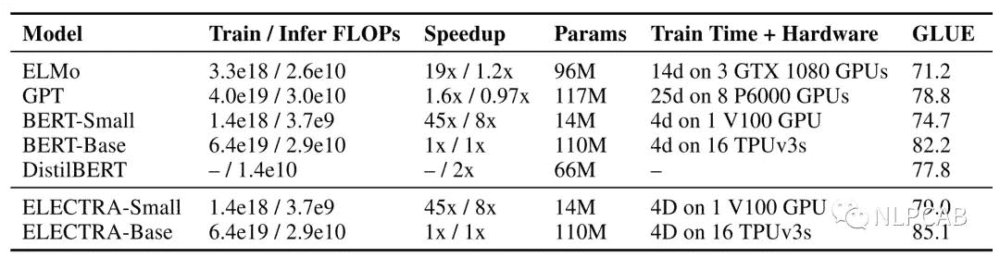
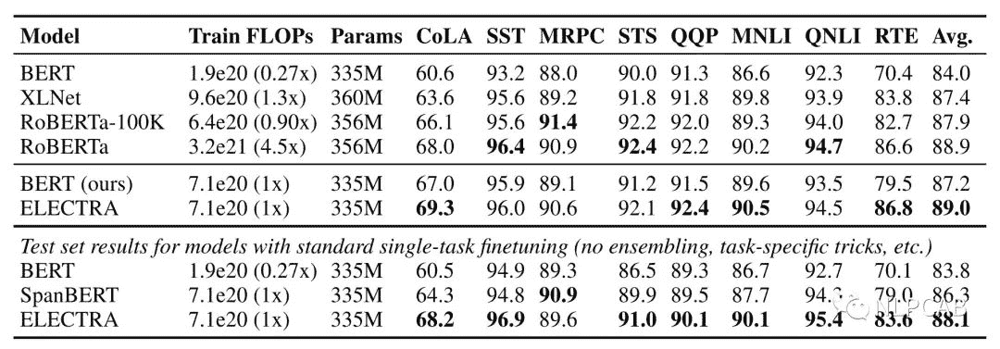
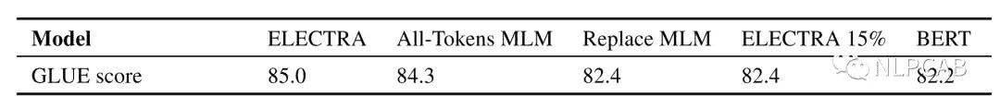
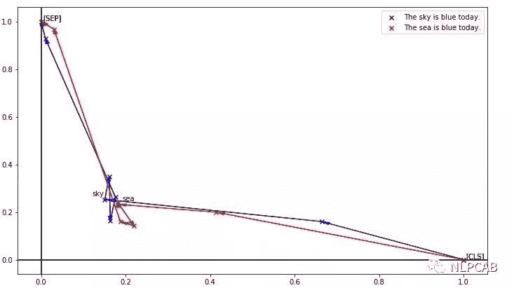

> BERT推出这一年来，除了XLNet，其他的改进都没带来太多惊喜，无非是越堆越大的模型和数据，以及动辄1024块TPU，让工程师们不知道如何落地。今天要介绍的ELECTRA是我在ICLR盲审中淘到的宝贝（9月25日已截稿），也是BERT推出以来我见过最赞的改进，通过类似GAN的结构和新的预训练任务，在更少的参数量和数据下，不仅吊打BERT，而且仅用1/4的算力就达到了当时SOTA模型RoBERTa的效果。

### 1\. 简介

ELECTRA的全称是Efficiently Learning an Encoder that Classifies Token Replacements Accurately，先来直观感受一下ELECTRA的效果：

右边的图是左边的放大版，纵轴是GLUE分数，横轴是FLOPs (floating point operations)，Tensorflow中提供的浮点数计算量统计。从上图可以看到，同等量级的ELECTRA是一直碾压BERT的，而且在训练更长的步数之后，达到了当时的SOTA模型——RoBERTa的效果。从左图曲线上也可以看到，ELECTRA效果还有继续上升的空间。

### 2\. 模型结构

**NLP式的Generator-Discriminator**

ELECTRA最主要的贡献是提出了新的预训练任务和框架，把生成式的Masked language model(MLM)预训练任务改成了判别式的Replaced token detection(RTD)任务，判断当前token是否被语言模型替换过。那么问题来了，我随机替换一些输入中的字词，再让BERT去预测是否替换过可以吗？可以的，因为我就这么做过，但效果并不好，因为随机替换**太简单了**。

那怎样使任务复杂化呢？。。。咦，咱们不是有预训练一个MLM模型吗？

于是作者就干脆使用一个MLM的G-BERT来对输入句子进行更改，然后丢给D-BERT去判断哪个字被改过，如下：

于是，我们NLPer终于成功地把CV的GAN拿过来了！

**Replaced Token Detection**

但上述结构有个问题，输入句子经过生成器，输出改写过的句子，因为句子的字词是离散的，所以梯度在这里就断了，判别器的梯度无法传给生成器，于是生成器的训练目标还是MLM（作者在后文也验证了这种方法更好），判别器的目标是序列标注（判断每个token是真是假），两者同时训练，但**判别器的梯度不会传给生成器**，目标函数如下：

因为判别器的任务相对来说容易些，RTD loss相对MLM loss会很小，因此加上一个系数，作者训练时使用了50。

另外要注意的一点是，**在优化判别器时计算了所有token上的loss，而以往计算BERT的MLM loss时会忽略没被mask的token**。作者在后来的实验中也验证了在所有token上进行loss计算会提升效率和效果。

事实上，ELECTRA使用的Generator-Discriminator架构与GAN还是有不少差别，作者列出了如下几点：

### 3\. 实验及结论

创新总是不易的，有了上述思想之后，可以看到作者进行了大量的实验，来验证模型结构、参数、训练方式的效果。

**Weight Sharing**

生成器和判别器的权重共享是否可以提升效果呢？作者设置了相同大小的生成器和判别器，在不共享权重下的效果是83.6，只共享token embedding层的效果是84.3，共享所有权重的效果是84.4。作者认为**生成器对embedding有更好的学习能力**，因为在计算MLM时，softmax是建立在所有vocab上的，之后反向传播时会更新所有embedding，而判别器只会更新输入的token embedding。最后作者只使用了embedding sharing。

**Smaller Generators**

从权重共享的实验中看到，生成器和判别器只需要共享embedding的权重就足矣了，那这样的话是否可以缩小生成器的尺寸进行训练效率提升呢？作者在保持原有hidden size的设置下减少了层数，得到了下图所示的关系图：

可以看到，**生成器的大小在判别器的1/4到1/2之间效果是最好的**。作者认为原因是**过强的生成器会增大判别器的难度**（判别器：小一点吧，我太难了）。

**Training Algorithms**

实际上除了MLM loss，作者也尝试了另外两种训练策略：

1.  Adversarial Contrastive Estimation：ELECTRA因为上述一些问题无法使用GAN，但也可以以一种对抗学习的思想来训练。作者将生成器的目标函数由最小化MLM loss换成了**最大化判别器在被替换token上的RTD loss**。但还有一个问题，就是新的生成器loss无法用梯度下降更新生成器，于是作者用强化学习Policy Gradient的思想，将被替换token的交叉熵作为生成器的reward，然后进行梯度下降。强化方法优化下来生成器在MLM任务上可以达到54%的准确率，而之前MLE优化下可以达到65%。

2.  Two-stage training：即先训练生成器，然后freeze掉，用生成器的权重初始化判别器，再接着训练相同步数的判别器。

对比三种训练策略，得到下图：

可见“隔离式”的训练策略效果还是最好的，而两段式的训练虽然弱一些，作者猜测是生成器太强了导致判别任务难度增大，但最终效果也比BERT本身要强，进一步证明了判别式预训练的效果。

**Small model? Big model？**

这两节真是吊打之前的模型，作者重申了他的主要目的是提升预训练效率，于是做了GPU单卡就可以愉快训练的ELECTRA-Small和BERT-Small，接着和尺寸不变的ELMo、GPT等进行对比，结果如下：

数据简直优秀，仅用14M参数量，以前13%的体积，在提升了训练速度的同时还提升了效果，这里我疯狂点赞。

小ELECTRA的本事我们见过了，那大ELECTRA行吗？直接上图：

上面是各个模型在GLUE dev/text上的表现，可以看到ELECTRA仅用了1/4的计算量就达到了RoBERTa的效果。而且作者使用的是XLNet的语料，大约是126G，但RoBERTa用了160G。由于时间和精力问题，作者们没有把ELECTRA训练更久（应该会有提升），也没有使用各种榜单Trick，所以真正的GLUE test上表现一般（现在的T5是89.7，RoBERTa是88.5，没看到ELECTRA）。

**Efficiency Analysis**

前文中提到了，BERT的loss只计算被替换的15%个token，而ELECTRA是全部都计算的，所以作者又做了几个实验，探究哪种方式更好一些：

1.  ELECTRA 15%：让判别器只计算15% token上的损失

2.  Replace MLM：训练BERT MLM，输入不用[MASK]进行替换，而是其他生成器。这样可以消除这种pretrain-finetune直接的diff。

3.  All-Tokens MLM：接着用Replace MLM，只不过BERT的目标函数变为预测所有的token，比较接近ELECTRA。

三种实验结果如下：

可以看到：

1.  对比ELECTRA和ELECTRA 15%：在所有token上计算loss确实能提升效果

2.  对比Replace MLM和BERT：[MASK]标志确实会对BERT产生影响，而且BERT目前还有一个trick，就是被替换的10%情况下使用原token或其他token，如果没有这个trick估计效果会差一些。

3.  对比All-Tokens MLM和BERT：如果BERT预测所有token 的话，效果会接近ELECTRA

另外，作者还发现，ELECTRA体积越小，相比于BERT就提升的越明显，说明fully trained的ELECTRA效果会更好。另外作者推断，**由于ELECTRA是判别式任务，不用对整个数据分布建模，所以更parameter-efficient**。

### 4\. 总结

无意中发现了这篇还在ICLR盲审的ELECTRA，读完摘要就觉得发现了新大陆，主要是自己也试过Replaced Token Detection这个任务，因为平时任务效果的分析和不久前看的一篇文章，让我深刻感受到了**BERT虽然对上下文有很强的编码能力，却缺乏细粒度语义的表示**，我用一张图表示大家就明白了：

这是把token编码降维后的效果，可以看到sky和sea明明是天与海的区别，却因为上下文一样而得到了极为相似的编码。细粒度表示能力的缺失会对真实任务造成很大影响，如果被针对性攻击的话更是无力，所以当时就想办法加上更细粒度的任务让BERT去区分每个token，不过同句内随机替换的效果并不好，弱鸡的我也没有再往前想一步，不然就也ICLR了。相信这个任务很多人都想到过，不过都没有探索这么深入，这也告诫我们，idea遍地都是，往下挖才能有SOTA。

**ELECTRA是BERT推出这一年来我见过最赞的idea，它不仅提出了能打败MLM的预训练任务，更推出了一种十分适用于NLP的类GAN框架**。毕竟GAN太牛逼了，看到deepfake的时候我就想，什么时候我们也能deepcheat，但听说GAN在NLP上的效果一直不太好（只懂皮毛，要学起来了，轻拍），这次ELECTRA虽然只用了判别器，但个人认为也在一定程度上打开了潘多拉魔盒。

另外，整篇文章都干货满满，不再像之前的BERT+模型一样可以用“more data+params+steps+GPU+MONEY”简单概括。推荐大家去通读正文+附录，里面还有一些失败尝试我没有讲。

如果ELECTRA去直播，我一定给它刷一辆游艇。

### 参考资料

ELECTRA: PRE-TRAINING TEXT ENCODERS AS DISCRIMINATORS RATHER THAN GENERATORS

