点击上方“**Datawhal****e**”，选择“星标”公众号

第一时间获取价值内容

<section>

</section>

<section>

<section style="text-align: left">

<section>

<section>

<section>

<section style="text-align: justify">

**Attention的产生**

</section>

</section>

</section>

</section>

</section>

</section>

<section>起因： 《Sequence to Sequence Learning with Neural Networks》</section>

<section>Attention模型的引入原因：</section>

1.  <section>

    <section>seq2seq将输入序列都压缩成一个固定大小的隐变量，就像我们的压缩文件一样，这个过程是有损压缩的，会迫使丢失许多输入序列中的信息。</section>

    </section>

2.  <section>

    <section>存在着难以对齐的问题。 比如中译音“我爱你” “I love you”,输入序列中的“我”应该与“I”对齐(贡献最大),然而在seq2seq模型中，“我”对"I","love","you"的贡献都是一致的</section>

    </section>

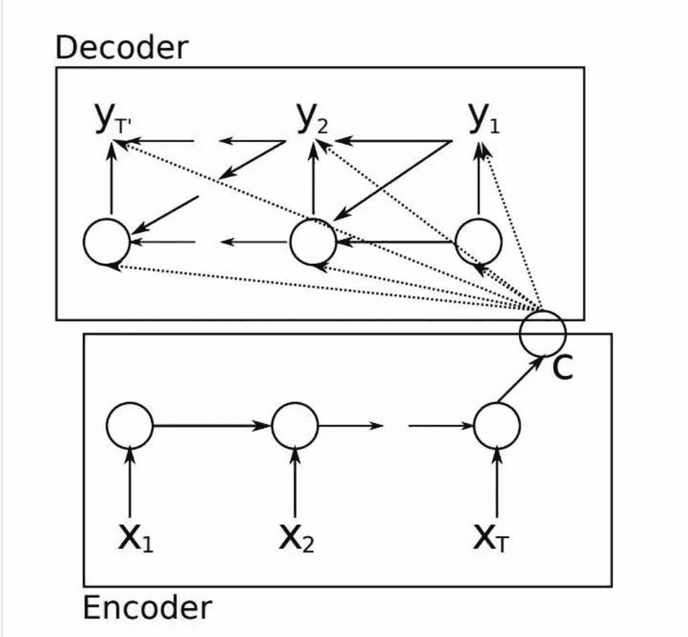

<section>

<section style="text-align: left">

<section>

<section>

<section>

<section style="text-align: justify">

**Attention的发展**

</section>

</section>

</section>

</section>

</section>

</section>

### **Show, attend and tell: Neural image caption generation with visual attention**

<section>本文可以算是第一篇Attention论文.</section>

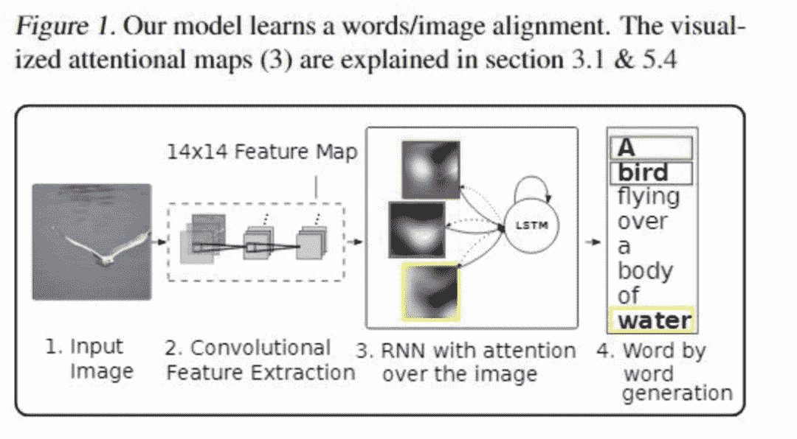

<section>该任务是实现图文转换。与前面讲述的seq2seq的问题一样，在之前的图文转换任务中也是存在着难以对齐的问题。所谓难以对齐就是毫无重点。</section>

<section>本文提出了两种attention：</section>

1.  <section>sort Attention</section>

2.  <section>hard Attention</section>

<section>本文的模型结构：</section>

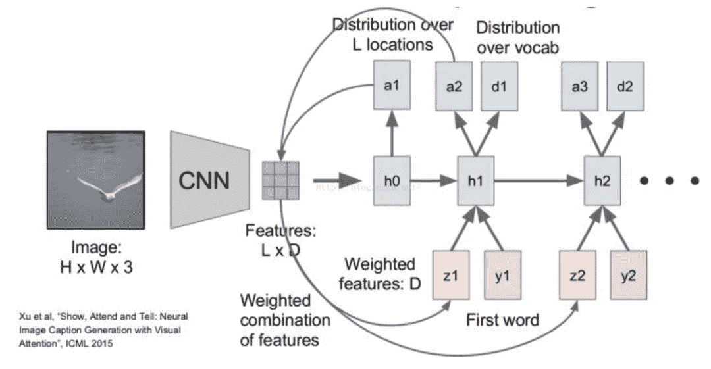

<section>将图片通过一个CNN转换成的L D.这里称L个向量为L个注释向量(annotation vector)，D为特征维度，可以认为提取了图片中L个区域的特征。对这L个区域向量加权相加来表示这张图片。由于不同时刻的关注点是不同的，annotation vector还要与decoder中的隐状态进行交互，以便知道下一时刻的关注区域。</section>

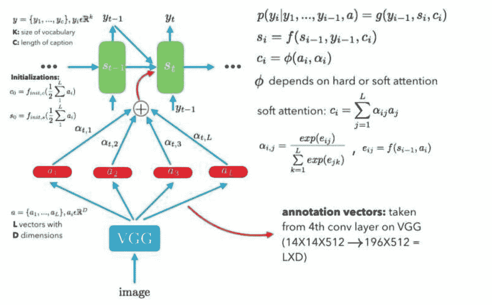

<section>这里编码器是VGG，解码器是LSTM。LTSM输入是不同时刻的图片的关注点信息，然后生成当前时刻的单词。</section>

<section>

<section style="text-align: left">

<section>

<section>

<section>

<section style="text-align: justify">

**Attention的计算**

</section>

</section>

</section>

</section>

</section>

</section>

<section>如上所属，attention的值不仅与annotation vector 有关还与上一时刻解码器的隐状态有关。 因此有：</section>

<section style="text-align: center"><embed style="width: 20.034ex" src="https://mmbiz.qlogo.cn/mmbiz_svg/3a3QxMHZ8YxfaUIIic9J4CzhFnJJMlrylywZC1QKFHJHdeWvriaMQVHeetApqmicP4MG7LbbjGXfcFOYib3xC6ryX0uyZzuYiakdx/0?wx_fmt=svg"></section>

<section>其中t表示时刻t，i表示第i个区域,a是我们得到的attention weight分布.</section>

<section>f实际上是对齐函数，用于计算对齐的分数，常见的对齐函数有： dot product，general，multilayer perceptron</section>

1.  <section>Soft attention： 直接使用attention的权重对L个向量加权相加，这么做的好处是整个问题是可微的，可以利用BP end to end</section>

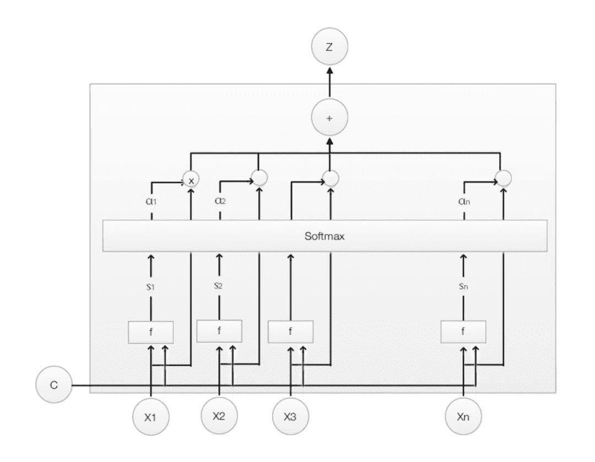

<section>Hard attention：Hard attention很粗暴，挑出最大权重的向量，剔除其余向量(置0)。显然这种形式的模型是不可微的，为了实现BP，这里采用蒙特卡洛采样的方法来估计模块的梯度。</section>

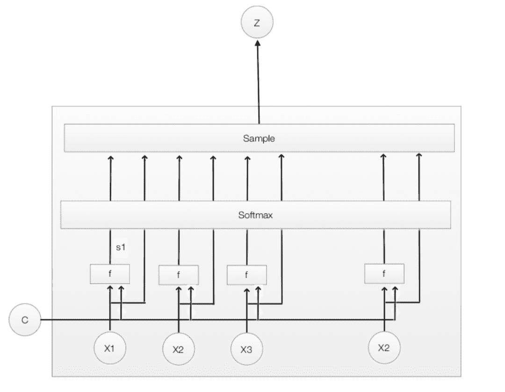

<section>帮助我们在t时刻选出了第i个向量 是我们最后选中的的向量，引入一个变量 ,当区域i被选中时取值为1，否则为0.则有：</section>

<section>问题如何生成 ,在本文中，将 视为隐变量，为参数是 的多元伯努利分布(伯努利是两点分布)</section>

<section style="text-align: left">$P(s_{t,i}=1|s_{t<j},a)=\alpha_{t,i} $=""</section>

<section style="text-align: center"><embed style="width: 57.775ex" src="https://mmbiz.qlogo.cn/mmbiz_svg/3a3QxMHZ8YxfaUIIic9J4CzhFnJJMlryla1ibbrnLDWpn7LcW9SU0oHTJ5SCiaoiaQ2nuc3GafT4l3kedT6mxUsPOIJibfW4mos3I/0?wx_fmt=svg"></section>

<section style="text-align: center"><embed style="width: 25.601ex" src="https://mmbiz.qlogo.cn/mmbiz_svg/3a3QxMHZ8YxfaUIIic9J4CzhFnJJMlrylwOcTB4HfUQ2MXkYwzKybV3nMX0ULwOWom3DpuB2Zre5M0f51nbYoV4EGITEpj3ibY/0?wx_fmt=svg"></section>

<section>这个可以认为是我们的带隐变量的目标函数：</section>

<section>对目标函数求梯度：</section>

<section style="text-align: center"><embed style="width: 52.75ex" src="https://mmbiz.qlogo.cn/mmbiz_svg/3a3QxMHZ8YxfaUIIic9J4CzhFnJJMlrylpwYcSnZfA9YUKSErHKEO8GTQicmVnaXSxymAUyZibBlxNd1o3TIXUpwkuxZWkabqLj/0?wx_fmt=svg"></section>

<section>用N次蒙特卡洛采用(抛银币)来近似：</section>

<section style="text-align: center"><embed style="width: 23.3ex" src="https://mmbiz.qlogo.cn/mmbiz_svg/3a3QxMHZ8YxfaUIIic9J4CzhFnJJMlrylLURp7ZmGSmm17Jt0gYY44KZ95ywSmCqmGBicGEqLFAD0JGXXWdDQtiaZBt2SHMxV2K/0?wx_fmt=svg"></section>

<section style="text-align: center"><embed style="width: 59.818ex" src="https://mmbiz.qlogo.cn/mmbiz_svg/3a3QxMHZ8YxfaUIIic9J4CzhFnJJMlryl8lV93ZiaMI7Y5KoAGJr3GA9oXJvGNxCFDibSc5dh5fcl4Lsic9YWyAW8Riam5YvT6eNE/0?wx_fmt=svg"></section>

<section>在用蒙特卡洛方法估计梯度时可以用滑动平均来减小梯度的方差.在第k个mini-batch时,滑动平均被估计为先前对数似然伴随指数衰减的累加和，</section>

<section style="text-align: center"><embed style="width: 29.142ex" src="https://mmbiz.qlogo.cn/mmbiz_svg/3a3QxMHZ8YxfaUIIic9J4CzhFnJJMlrylfmNWUEaJNFZIVEZvQ0jpLf9xStU34kXiaXgobdOLD6UgymYFFu4pxS3Z3R1tGHDQf/0?wx_fmt=svg"></section>

<section>

<section style="text-align: left">

<section>

<section>

<section>

<section style="text-align: justify">

**总结**

</section>

</section>

</section>

</section>

</section>

</section>

<section>总的来说这里率先引入了soft attention与hard attention，通过在每一时刻给图片各个区域分配attention权重，来提升语句与特定图块的相关性。</section>

<section>结果：</section>

<section style="text-align: center">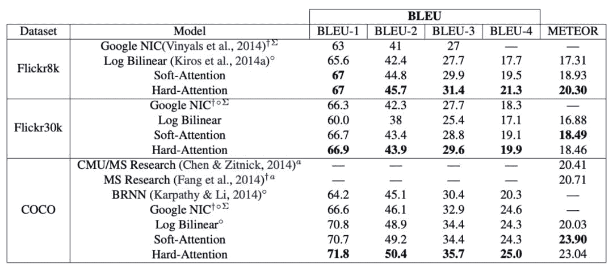

</section>

<section>

<section>

<section>

<section>

<section style="text-align: left">

<section>

<section>

<section>

<section style="text-align: justify">

**Learning Phrase Representations using RNN Encoder-Decoder for Statistical Machine Translation**

</section>

</section>

</section>

</section>

</section>

</section>

</section>

<section>

<section>本文可以算是第一篇在seq2seq中引入的Attention论文(2015.07).</section>

</section>

</section>

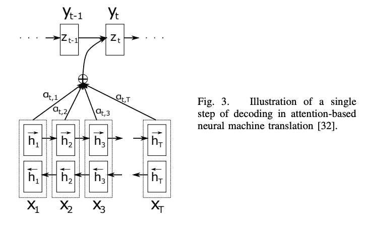

<section>本文同样涉及了soft attention，hard attention.求解形式与上一篇并无差异。</section>

<section>并且文中考虑了四种应用场景： 1\. Neural Machine Translation 2\. Image Caption Generation 3\. Video Description Generation 4\. End-to-End Neural Speech Recognition

</section>

<section>

<section style="text-align: left">

<section>

<section>

<section>

<section style="text-align: justify">

**Effective Approaches to Attention-based Neural Machine Translation**

</section>

</section>

</section>

</section>

</section>

</section>

<section>本文比上一篇晚发表了2个月。 。 。</section>

<section>文章提出了两种attention的改进版本，即global attention和local attention。</section>

1.  <section>global attention</section>

<section>global attention 在计算context vector  的时候会考虑encoder所产生的全部hidden state。 其实就是第一篇文章的attetion方法。</section>

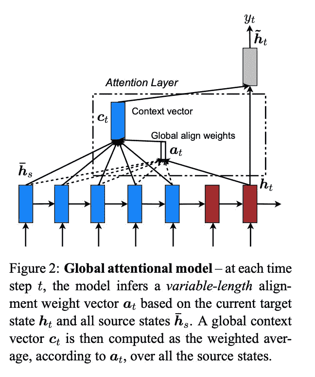

<section>local attention</section>

<section>本文认为local attention为hard attention和soft attention的混合体(优势上的混合),因为他的计算复杂度要低于global attention，soft attention，而且与hard attention 不同的是,local attention 几乎处处可微，易于训练。</section>

<section>local attention克服了每个source hidden state都要扫描的缺点,计算开销大，而且对于长句不利,为了提升效率，提出了 local attention。 每次只focus 一部分的source position。</section>

<section>这里 context vector  的计算只focus窗口 内的2D+1个source hidden state.设 是一个source position index,可以理解为 attention的“焦点”，作为模型的参数，D根据经验来选择。</section>

<section>关于 的计算，文章给出了两种计算方案： 1） Monotonic alignment(local-m)</section>

<section>2)predictive alignment(local-p)</section>

<section style="text-align: center"><embed style="width: 31.91ex" src="https://mmbiz.qlogo.cn/mmbiz_svg/3a3QxMHZ8YxfaUIIic9J4CzhFnJJMlrylsCSuFPsFbzCRdXdXTPe75Xy1Iic6OlhA47t5v0hm8KN0PQpVU3dWHclu7W7pLRCZD/0?wx_fmt=svg"></section>

<section>其中 和 是模型的参数，S是source sentence的长度，易知 .</section>

<section>权重 的计算为：</section>

<section style="text-align: center"><embed style="width: 35.695ex" src="https://mmbiz.qlogo.cn/mmbiz_svg/3a3QxMHZ8YxfaUIIic9J4CzhFnJJMlryle3pK3fzTn8S34U9Fmky8QTCY5LM0icR7gt40dVfckBicNXlMpt4pV8cYRkwMeKn0fa/0?wx_fmt=svg"></section>

<section>可以看出，距离中心 越远的位置，其位置上的source hidden state 对应的权重就会被压缩地越厉害。 这里 设置为D/2.</section>

<section>这里的 <embed style="width: 31.002ex" src="https://mmbiz.qlogo.cn/mmbiz_svg/3a3QxMHZ8YxfaUIIic9J4CzhFnJJMlryljQDJKxcYYxO7MTHCwhibsicqPaCAr5XNONE8ITibRF5SgMoseCM1yyIAYormEb6H0Ru/0?wx_fmt=svg"></section>

<section>其中score函数其实就是第一篇里介绍的对齐函数，存在三种dot product，general，concat。</section>

<section>实验对比：</section>

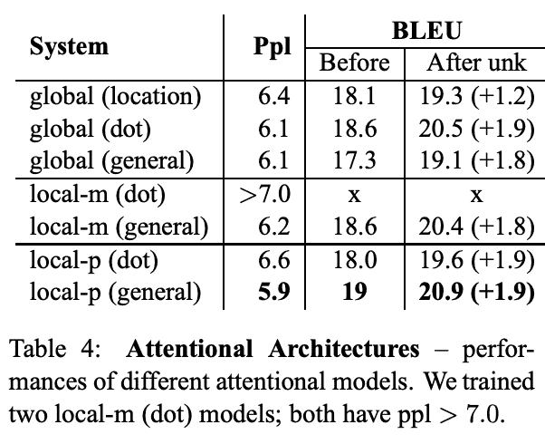

<section>

<section style="text-align: left">

<section>

<section>

<section>

<section style="text-align: justify">

**Attention-Based Multi-Perspective Convolutional Neural Networks for Textual Similarity Measurement**

</section>

</section>

</section>

</section>

</section>

</section>

<section>本文的任务是STS(semantic textual similarity)指给定一个检索句子和比较的句子，计算他们的相似度得分。</section>

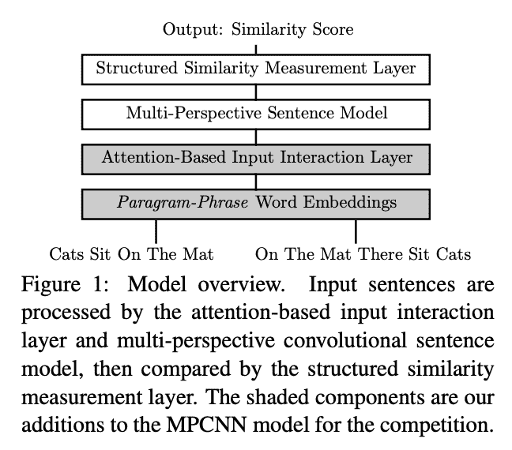

<section>过去的模型，把输入的句子独立对待，忽略了句子的上下文交互。attention也就是因此而引入的。</section>

<section>本文的基础模型结构是： MPCNN(multi-perspective con- volutional neural network model).主要包括两个部分： 1). multi-perspective sentence model 2). structured similarity measurement layer</section>

1.  <section>multi-perspective sentence model</section>

<section>multi-perspective sentence model 使用的是卷积神经网络，通过使用不同类型的卷积核，不同类型的池化方式，不同大小的卷积窗口，来得到每个句子的不同粒度的表达。</section>

<section>a. 卷积层有两种卷积的方式： (1)粒度为word的卷积;(2)粒度为embedding 维度上的卷积。 前者相当于n-gram特征抽取，后者抽取的是向量每一维度上的信息。 作者认为后面这种方式由于粒度更小有助于充分地提取出输入的特征信息。 作者使用了这两种方式以获得更丰富的表达。</section>

<section>b. 卷积窗口大小： 不同卷积窗口的大小捕捉不同n-gram的长度下的信息，这里窗口大小是{1, 2, 3，∞}, 表示输入句子中unigrams, bigrams, trigrams和不使用卷积层。</section>

<section>c. 池化方式： 池化层可以保留一个卷积模型中最显著和最通用的特性，这里使用max，min,mean三种方式。</section>

1.  <section>Structured Similarity Measurement</section>

<section>Structured Similarity Measurement Layer的目标是计算句子表达的相似度。</section>

<section>Structured Similarity Measurement Layer的目标是计算句子表达的相似度。 作者认为最后生成的句子向量中的每一个部分的意义各不相同，直接应用传统的相似度计算方法如余弦相似度在两个句子向量上并不是最优的，应该对句子向量中的各个部分进行相应的比较和计算(Structured Comparision)。 为了使得句子向量中的局部间的比较和计算更加有效，我们需要考虑如下方面：</section>

<section>(1) 是否来自相同的building block； (2) 是否来自相同卷积窗口大小下的卷积结果； (3) 是否来自相同的pooling层； (4) 是否来自相同的Feature Map；</section>

<section>至少满足以上两个条件时，才比较句子中的相应部分时，作者采用了两种算法比较相似性。 一种只针对粒度为词的卷积，另一种则同时针对粒度为词的卷积和粒度为embedding 维度上的卷积。</section>

<section>在句子局部的相似度计算之后，作者叠加了两层的线性层，并在中间使用了tanh激活函数，最后使用log-softmax输出。 更多的细节参考He et al. 2015。</section>

<section>

<section style="text-align: left">

<section>

<section>

<section>

<section style="text-align: justify">

**Attention-Based Input Interaction Layer**

</section>

</section>

</section>

</section>

</section>

</section>

<section>本文作者在上述模型的基础上，增加了一层基于attention的交互层。 其目的就是在刚做完embedding以后，给两个句子更相关的部分赋予更多的权值。</section>

<section>输入序列 ,其中 ,铜鼓计算对应向量的余弦相似度得到attention。</section>

<section style="text-align: center"><embed style="width: 27.953ex" src="https://mmbiz.qlogo.cn/mmbiz_svg/3a3QxMHZ8YxfaUIIic9J4CzhFnJJMlrylUbxxr3q5UASnPziaKaw4oOUltWavQPMrIdQXs1Pl6nRamOn8dzpZ7oQeuBVtnNfUz/0?wx_fmt=svg"></section>

<section>得到了attention权值矩阵后，可以计算每个句子对应的attention向量，并归一化：</section>

<section>最后拼接起来得到attention 的re-weighted向量</section>

<section style="text-align: center"><embed style="width: 41.795ex" src="https://mmbiz.qlogo.cn/mmbiz_svg/3a3QxMHZ8YxfaUIIic9J4CzhFnJJMlryl71JVM9cb6Abt0NVwn7ulGPksszryJzQlZgmRrEVFV1ib0xrickAcuf2WTrhXRgiasPd/0?wx_fmt=svg"></section>

<section>作者没有添加额外的参数，只是简单的余弦距离去作为attention权值然后做归一化，并在实验中取得了不错的结果。</section>

<section>

<section style="text-align: left">

<section>

<section>

<section>

<section style="text-align: justify">

**ABCNN: Attention-Based Convolutional Neural Network for Modeling Sentence Pairs**

</section>

</section>

</section>

</section>

</section>

</section>

<section>本文的任务是(sentence pair)句子配对.这包括了Answer Selection（AS），Paraphrase identification（PI），Textual entailment（TE）</section>

<section>基础模型： BCNN(Basic Bi-CNN)</section>

<section>BCNN有四个部分： 1\. 输入层，2\. 卷积层，3\. 池化层，4\. 输出层</section>

<section>特别要指出卷积层。 这里卷积层采用的是宽卷积（Wide convolution）。 即对句子的边缘部分进行，使得输出的序列长度大于输入的序列长度。 (宽卷积常用于卷积核大小相对于输入向量长度较大时)</section>

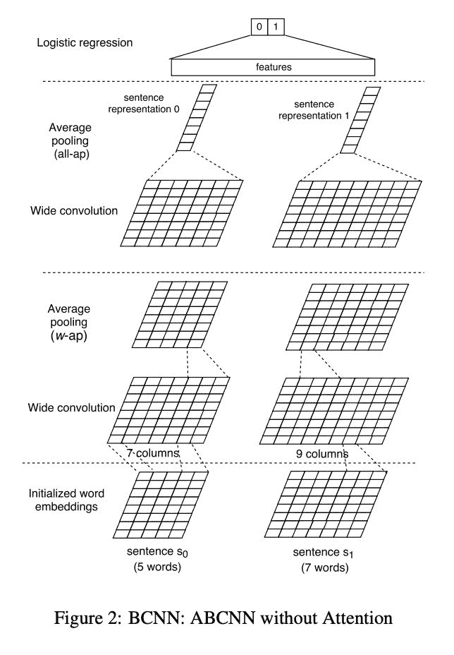

<section>这里提出了三种ABCNN</section>

1.  <section>ABCNN-1</section>

</section>

<section style="text-align: center">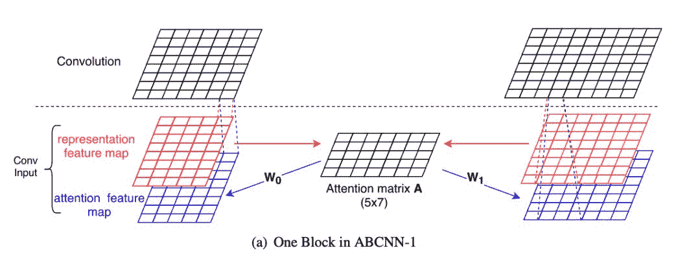</section>

<section>ttention 矩阵的计算</section>

<section style="text-align: center"><embed style="width: 34.669ex" src="https://mmbiz.qlogo.cn/mmbiz_svg/3a3QxMHZ8YxfaUIIic9J4CzhFnJJMlrylZLfpiaQspIWibc0ribyAeyeictK52EZfNOmU0hxWOqBXlAchzrKCdQKTz6Gl5lvjls7ic/0?wx_fmt=svg"></section>

<section>可以从上图看出矩阵中的一列代表一个词，行代表特征。</section>

<section>这里的match-score可以用多种方式进行计算，本文采用的是 来计算。</section>

<section>句子中attention特征的计算：</section>

<section>这里的输出被送入到了卷积层。</section>

1.  <section>ABCNN-2</section>

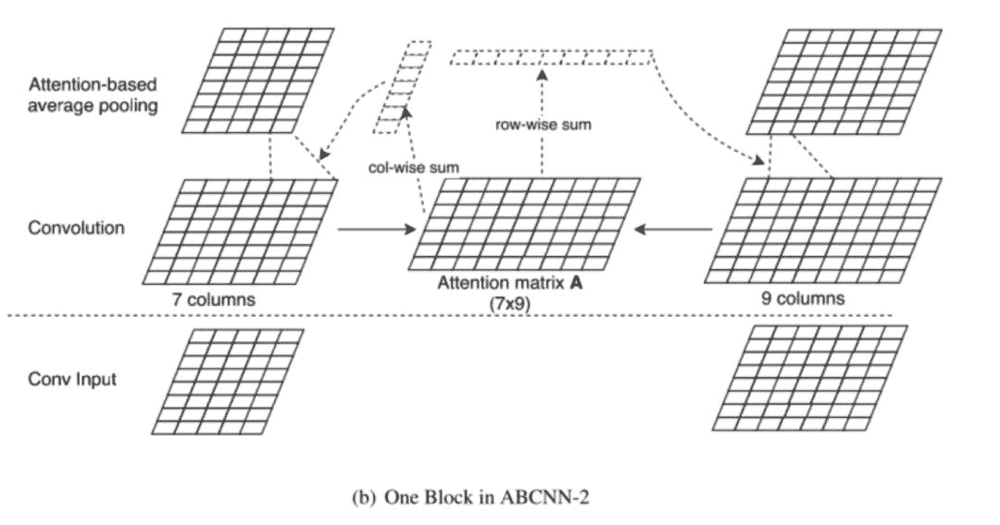

<section>这里Attention矩阵的计算方式与ABCNN-1类似，不同的是在ABCNN-1的基础上对两个句子的unit进行求和作为unit的attention 值，即</section>

<section>然后利用这个attention值对卷积层的输出进行加权，具体公式如下：</section>

<section style="text-align: center"><embed style="width: 37.816ex" src="https://mmbiz.qlogo.cn/mmbiz_svg/3a3QxMHZ8YxfaUIIic9J4CzhFnJJMlrylqSS9SMfdAUpEOaCcF5YxQY9iaictyjYiapWDicokvxONma2PaIc4UiabetZe6lGlhoicxH/0?wx_fmt=svg"></section>

<section>这里的输出输入到了pooling层中。</section>

1.  <section>ABCNN-3</section>

<section>将上述两个结构进行叠加。 在输入和池化都引入注意力。</section>

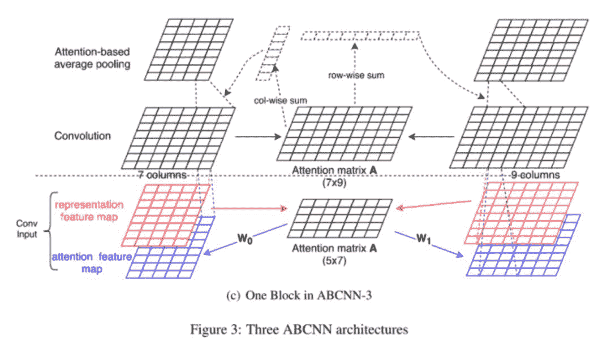

<section>本文实际上提出了两种引入attention 的位置，一种是在Conv前(ABCNN-1),一种是Conv后(ABCNN-2).从结果来看，Attention放在Conv后的效果比前面的效果更好。可能的原因是Word embedding经过Conv相当于提取了n-gram，能表示上下文。conv 之后再结合 Attention 能比单纯 input 之后的 Attention 包含更多的信息。</section>

<section>

<section style="text-align: left">

<section>

<section>

<section>

<section style="text-align: justify">

**Graph Attention Network(GAT)**

</section>

</section>

</section>

</section>

</section>

</section>

<section>

<section style="text-align: left">

<section>

<section>

<section>

<section style="text-align: justify">

**小结1**

</section>

</section>

</section>

</section>

</section>

</section>

<section>之后的一系列论文如《Multi-Attention CNN for FGVC： MA-CNN》,《Coupled Multi-Layer Attentions for Co-Extraction of Aspect and Opinion Terms》等尽管实现的任务都花里胡哨的，并引入了Attention，但是attention的使用方式还是千篇一律。</section>

<section>

<section style="text-align: left">

<section>

<section>

<section>

<section style="text-align: justify">

**Attention is all you need**

</section>

</section>

</section>

</section>

</section>

</section>

<section>提出的动机：</section>

1.  <section>

    <section>跳出原来千篇一律的attention形式，不使用CNN，不使用RNN，光靠attention，实现高并行化</section>

    </section>

2.  <section>

    <section>抓取更强的长距离依赖关系</section>

    </section>

<section>创新点：</section>

1.  <section>

    <section>总结了attention的通用形式</section>

    </section>

2.  <section>

    <section>提出了self attention，multi-head attention</section>

    </section>

3.  <section>

    <section>Transform结构</section>

    </section>

<section>

<section style="text-align: left">

<section>

<section>

<section>

<section style="text-align: justify">

**总结Attention的通用格式**

</section>

</section>

</section>

</section>

</section>

</section>

<section>作者将Attention理解为q，k，v的形式</section>

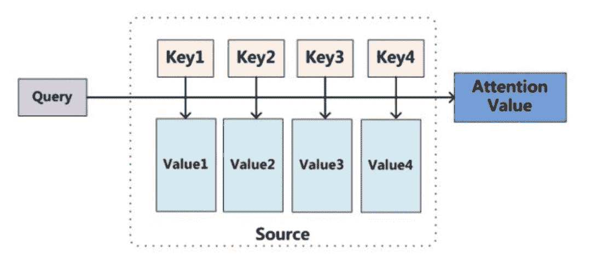

<section>其实旗面介绍的attention都可以套用该框架。</section>

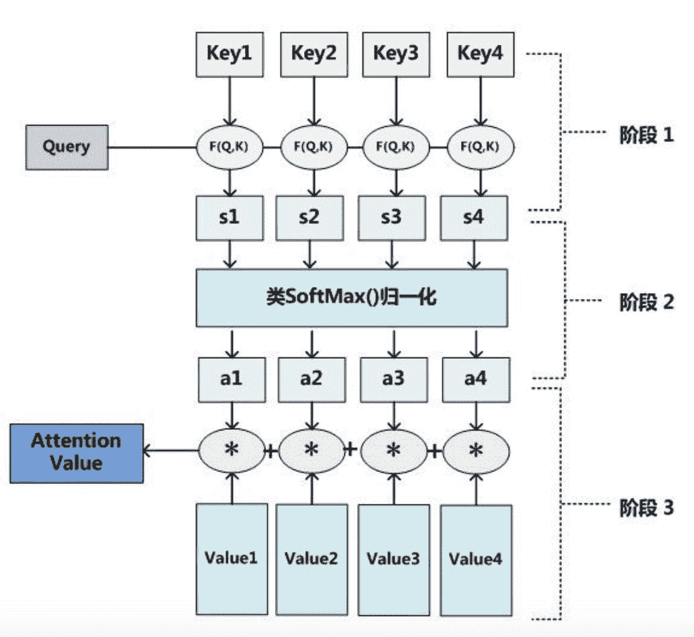

<section>

<section style="text-align: left">

<section>

<section>

<section>

<section style="text-align: justify">

**提出self attention, multi-head attention**

</section>

</section>

</section>

</section>

</section>

</section>

<section>这里的self attention 指的是用到自身的信息来计算attention。 传统的attention都是考虑用外部信息来计算attention。</section>

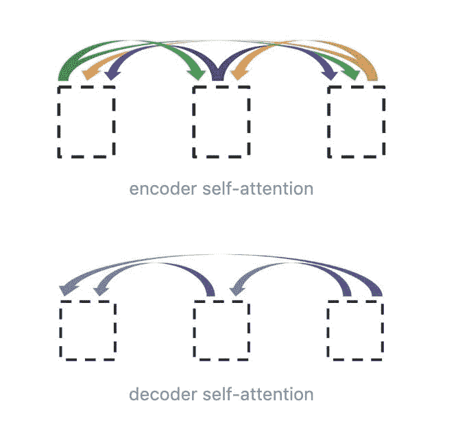

<section>这里采用的attention计算方式也与之前的不同，采用 Scaled Dot-Product 的形式。</section>

<section style="text-align: center"><embed style="width: 38.436ex" src="https://mmbiz.qlogo.cn/mmbiz_svg/3a3QxMHZ8YxfaUIIic9J4CzhFnJJMlrylFWiavnKjMyBH9cnkgW26Yf5iaNJGnThkrqh8nshBVD8eenZQ7OLEVwowqV0T3lMmYd/0?wx_fmt=svg"></section>

<section>注意： 分母是为了归一化，避免造成进入softmax函数的饱和区，其梯度较小。</section>

<section>采用multi-head attention为的就是让不同head学习到不同的子空间语义。 显然实验也证实这种形式的结果较好。</section>

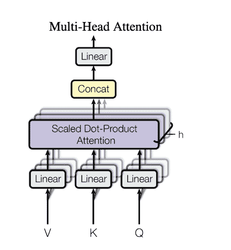

<section>在self attention中其实在做的当前文本句中单词依赖关系分数的计算。</section>

<section>比如“Think Machines”两个单词</section>

<section style="text-align: center">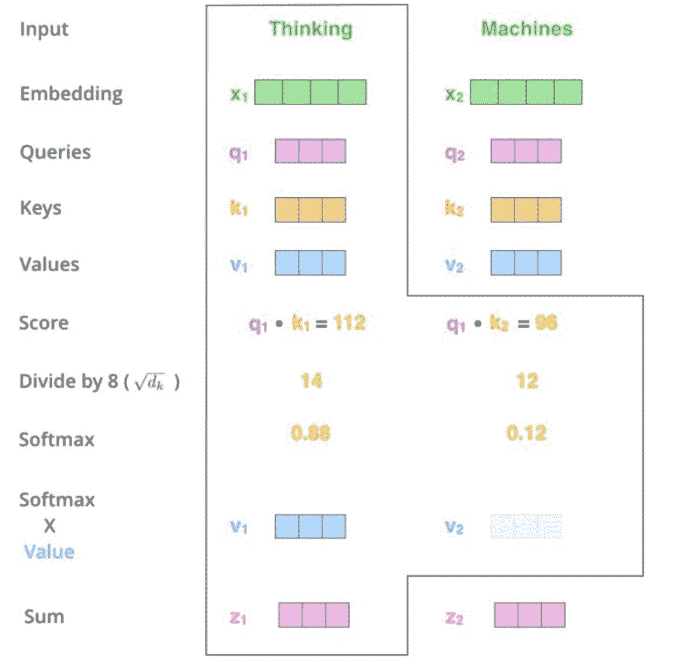</section>

<section style="text-align: left">优点：</section>

1.  <section>

    <section>由于self attention 是对整个文本句求attention的，所以他能抓取到当前单词和该文本句中所有单词的依赖关系强度。 这方面的能力显然比RNN的获取长依赖的能力强大的多。</section>

    </section>

2.  <section>

    <section>此时不在用RNN的这种串行模式，即每一步计算依赖于上一步的计算结果。 因此可以像CNN一样并行处理，而CNN只能捕获局部信息，通过层叠获取全局联系增强视野</section>

    </section>

<section>缺点： 很显然，既是并行又能全局，但他不能捕捉语序顺序。 这是很糟糕的，有点像词袋模型。 因为相同单词不同词序的含义会有很大差别。 为了克服这个问题，作者引入了Position embedding。 这是后话了。</section>

<section>

<section style="text-align: left">

<section>

<section>

<section>

<section style="text-align: justify">

**Transform**

</section>

</section>

</section>

</section>

</section>

</section>

<section>Transform是一大法宝，影响深远。</section>

<section style="text-align: center">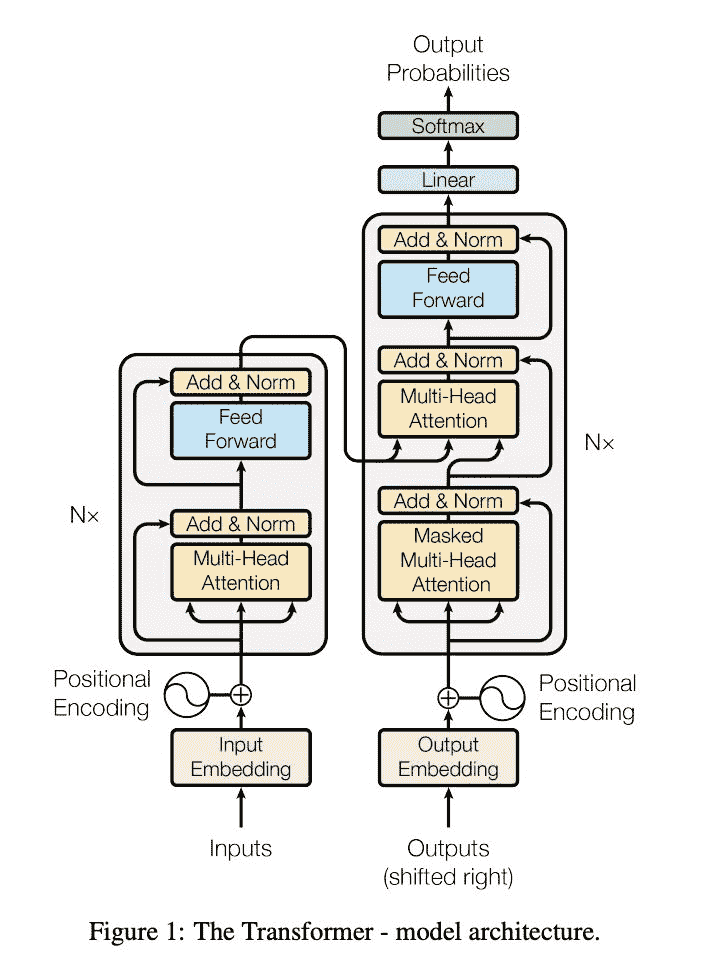</section>

<section>从上图粗看，Transform仍延续着一个Encoder一个Decoder的形式。</section>

<section>重要部件：</section>

1.  <section>Positional embedding:正如上面所说，self attention缺乏位置信息，这是不合理的。 为了引入位置信息，这里用了一个部件position embedding。</section>

<section>这里考虑每个token的position embedding的向量维度也是d维的，与input embedding的输出一样，然后将input embedding和position embedding 加起来组成最终的embedding输入到上面的encoder/decoder中去。 这里的position embedding计算公式如下：</section>

<section style="text-align: center"><embed style="width: 33.116ex" src="https://mmbiz.qlogo.cn/mmbiz_svg/3a3QxMHZ8YxfaUIIic9J4CzhFnJJMlrylibP5dIOYZmRvEssFaNrXcl4eW1VAAdCk8mEAwVIVlTMWlsFXkhmTmLTlR7chehO5J/0?wx_fmt=svg"></section>

<section style="text-align: center"><embed style="width: 35.099ex" src="https://mmbiz.qlogo.cn/mmbiz_svg/3a3QxMHZ8YxfaUIIic9J4CzhFnJJMlrylCDF8icwbkabO968THY1s6Wic7xMvI9nlM9nScKl5neG2oIKyzN5ibK0qD9hPSY2jZBC/0?wx_fmt=svg"></section>

<section>其中pos表示位置的index，i表示dimension index。</section>

<section>Position Embedding本身是一个绝对位置的信息，但在语言中，相对位置也很重要，Google选择前述的位置向量公式的一个重要原因是： 由于我们有</section>

<section style="text-align: center"><embed style="width: 34.368ex" src="https://mmbiz.qlogo.cn/mmbiz_svg/3a3QxMHZ8YxfaUIIic9J4CzhFnJJMlrylHzgkibuJJ1CoeQpKQk0wNLvZtVOSJF9EpgrtfeIZq9W6OBpj04p8aNIdWNNEziaqq9/0?wx_fmt=svg"></section>

<section style="text-align: center"><embed style="width: 34.306ex" src="https://mmbiz.qlogo.cn/mmbiz_svg/3a3QxMHZ8YxfaUIIic9J4CzhFnJJMlrylXib9kBZgSYPa4NI4ImEKyxb66YeWNHeop6KDH15IFibF0kXfJrqTrMAl4ubZOt4wnp/0?wx_fmt=svg"></section>

<section>这表明位置p+k的向量可以表示成位置p的向量的线性变换，这提供了表达相对位置信息的可能性。</section>

1.  <section>residual connection 无论是encoder还是decoder我们都能看到存在这residual connection这种跳跃连接。</section>

<section>随着深度的增加会导致梯度出现弥散或者爆炸，更为严重的是会导致**模型退化** （也就是在训练集上性能饱和甚至下降，与过拟合不同）。 深度残差网络就是为了解决退化的问题。 其实引入残差连接，也是为了尽可能保留原始输入x的信息。</section>

1.  <section>Layer Normalization</section>

<section>与 BN 不同，LN 是一种横向的规范化</section>

<section style="text-align: center">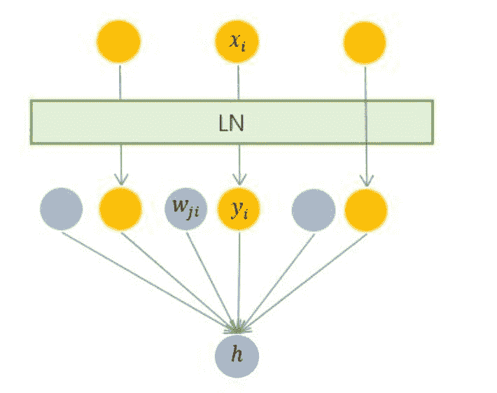</section>

<section>LN针对单个训练样本进行，不依赖于其他数据。避免了受mini batch中其他数据的影响。</section>

<section>BN适用于不同mini batch数据分布差异不大的情况，而且BN需要开辟变量存每个节点的均值和方差，空间消耗略大； 而且 BN适用于有mini_batch的场景。</section>

1.  <section>Masked Multi-Head Attention</section>

<section>这里用mask来遮蔽当前位置后面的单词。 实现也很简单，采用一个上三角都为1，下三角为0的矩阵。</section>

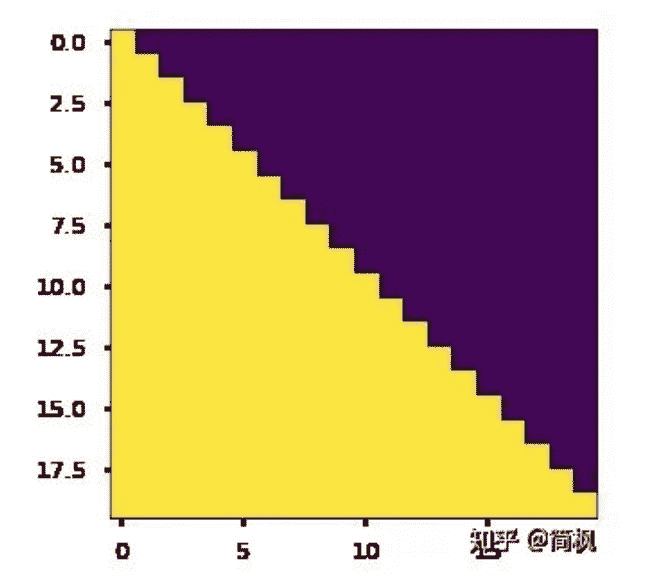

<section>小结一下：本文对attention的概念进行了本质上的转变。传统的attention是在端尾计算源文本各个token对该时刻单词的贡献。而self attention将这个过程提到了端口，计算当前句子中token的相关性来充分各个token的表达其语义。简单的讲就是传统的attention是为了使输出端表达充分，而self attention 是为了使输入端表达充分。尽管他们的形式都可以用Q，K，V框架来解释。</section>

<section>

<section style="text-align: left">

<section>

<section>

<section>

<section style="text-align: justify">

**An Attentive Survey of Attention Models**

</section>

</section>

</section>

</section>

</section>

</section>

<section>《An Attentive Survey of Attention Models》 今年提出香农科技提出的一篇关于attention的综述论文。</section>

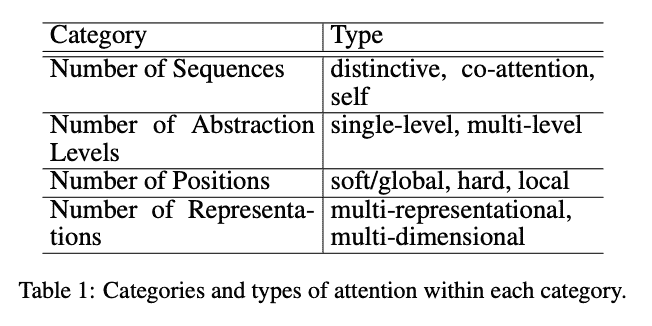

<section>本文给attention作出了分类，分为四种分类方法：</section>

1.  <section>number of sequences： a)distinctive:只考虑了涉及单个输入和相应输出序列的情况（例如seq2seq中的attention）</section>

<section>b)co-attention:同时对多个输入序列进行操作，并共同学习它们的注意权重，以捕获这些输入之间的交互（例如前面介绍的ABCNN）</section>

<section>c)inner attention:使用注意力来学习输入序列中对应于相同输入序列中的每个标记的相关标记.(例如self attention)</section>

1.  <section>Number of abstraction levels</section>

<section>按照输入特征的抽象层次来分，这里的抽象层次可以是词粒度、短语粒度、句子粒度、文档粒度。</section>

<section>a)single-level:只为原始输入序列计算注意权重</section>

<section>b)multi-level:注意力可以按顺序应用于输入序列的多个抽象层次[例如在两个不同的抽象层次（即单词级别和句子级别）上使用了注意力模型来完成文档分类任务]</section>

1.  <section>Number of positions a)soft attention： 它使用输入序列所有隐藏状态的加权平均值来构建上下文向量</section>

<section>b)hard attention:其中上下文向量是从输入序列中随机采样的隐藏状态计算出来的</section>

<section>c)global attention:与soft attention一样</section>

<section>d)local attention:是hard attention和soft attention的一种折中</section>

1.  <section>Number of representations</section>

<section>a)multi-Representational Attention model:通过多个特征表示捕捉输入的不同方面,注意可以用来为这些不同的表示分配重要权重，这些表示可以确定最相关的方面，而忽略输入中的噪声和冗余。</section>

<section>b)multi-dimensional:这种attention 作用在维度上。 attention的权重表示各个维度上的重要性。</section>

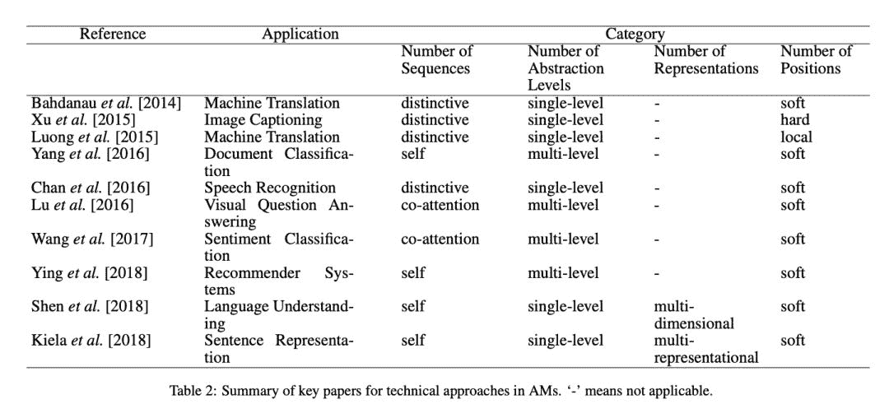

<section>然后作者又对带有attention的网络结构进行饿了分类</section>

1.  <section>

    <section>Encoder-Decoder</section>

    </section>

2.  <section>

    <section>Memory Networks</section>

    </section>

<section>像问答和聊天机器人这样的应用程序需要能够从事实数据库中的信息中学习。 网络的输入是一个知识数据库和一个查询，其中一些事实比其他事实更与查询相关。 端到端memory networks通过使用一组内存块存储事实数据库来实现这一点，并使用attention在回答查询时在内存中为每个事实建立关联模型。</section>

<section>使用attention还提供了计算优势，使目标连续，并通过反向传播支持端到端训练。 端到端内存网络可以看作是AM的一种泛化，它不是只在单个序列上建模注意力，而是在一个包含大量序列(事实)的数据库上建模注意力。</section>

1.  <section>Networks without RNNs 最具代表性的就是Transformer。</section>

<section>

<section style="text-align: left">

<section>

<section>

<section>

<section style="text-align: justify">

**未完待续**

</section>

</section>

</section>

</section>

</section>

</section>

<section>其实还有很多要补充的，比如Memory Network中的attention(外部记忆作为V)以及Graph neural network里的attention，尽管理论上都是一个道理，但是还要对的起标题的all。 待补充。

</section>

