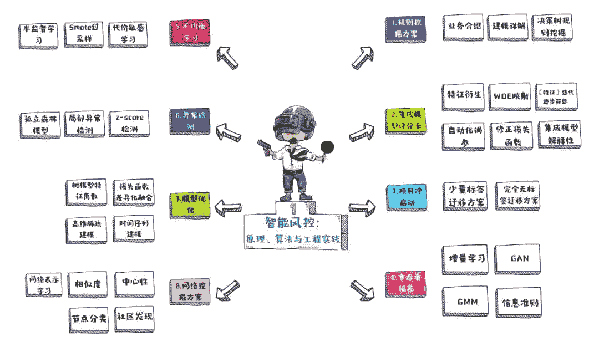
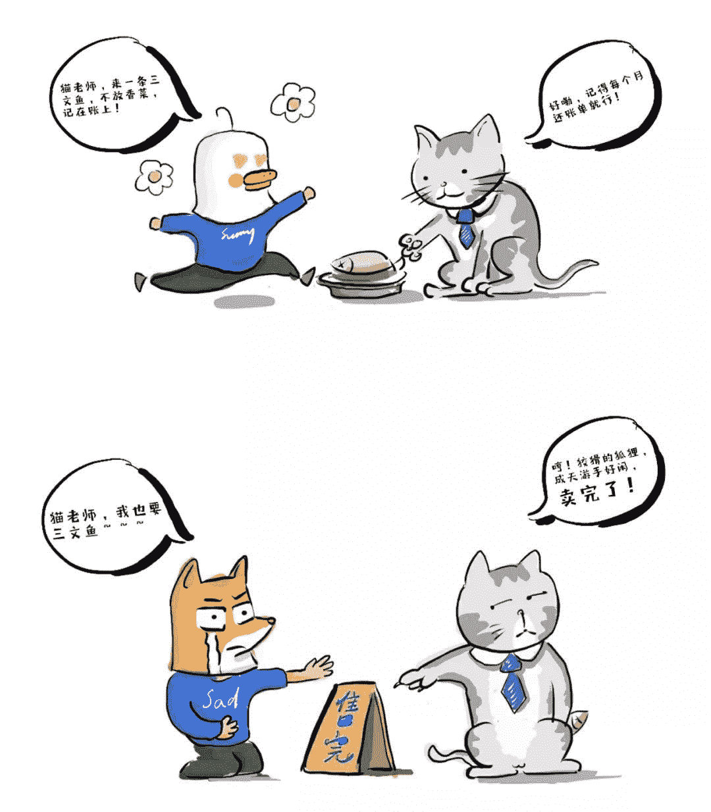
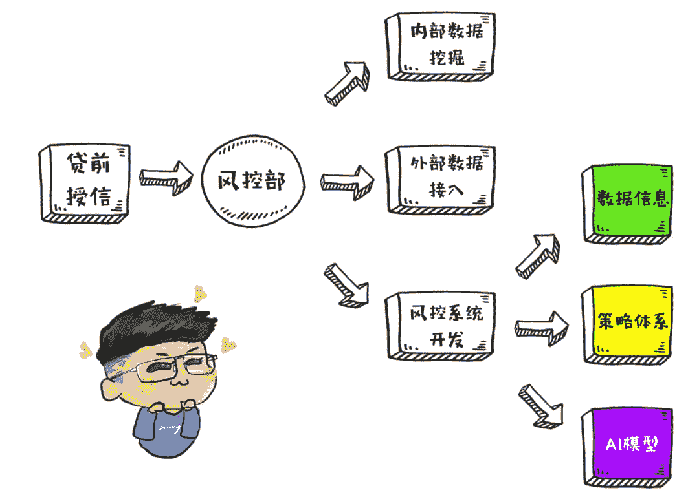
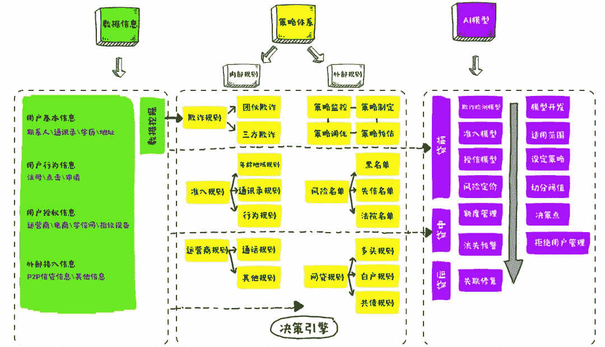
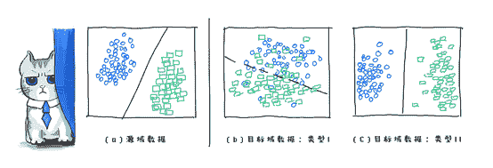
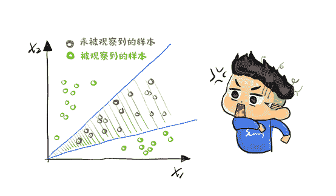
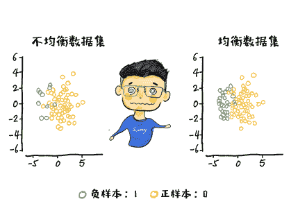
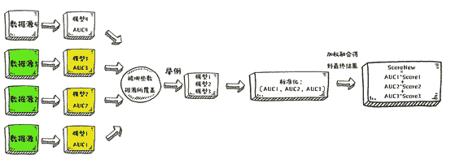
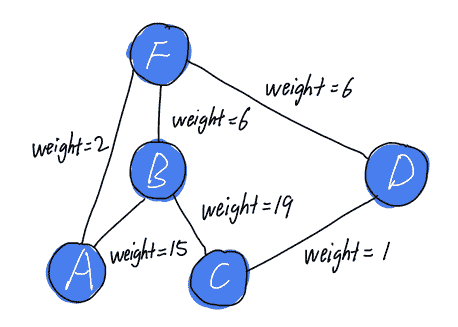

**本文主要内容**

本文详细梳理风控领域的基本概念，并将风控模型的使用场景分为8大板块，逐一解析机器学习在其中的应用。

**风控领域的特点**

风控领域是新兴的机器学习应用场景之一，其特点非常明显：

*   负样本占比极少，是均衡学习的算法的主战场之一。有标签样本稀缺，从而使得半监督和无监督算法在风控场景下大放异彩。

*   业务对模型解释性要求偏高。同时对时效性有一定要求，这要求在实际建模中要学会去权衡模型复杂度与精度，并且适当的优化算法内核。

*   业务模型多样。每一个模型都和业务目标有着非常高的联系，因此每一个从业者对业务和模型都有很好的理解，从而为业务定制合适的模型。

*   风控数据源丰富。围绕着人展开的数据皆可用，而数据多样带来的就是新兴技术的井喷，结构化数据、图像、文本等等多个领域的方法都在风控领域有一定应用。

**信用管理与风险**

信用贷款的逻辑可以参见这幅漫画

信用好的小鸡是可以赊账的。面对平时信用较差的狐狸，猫老师则想办法拒绝他的赊账需求。这就是基本的信用价值。

信用管理主要分为两个概念，信用和管理。信用意味着先买后付，即使用信用值预支金钱购买相应服务。而管理即通过用户信息对用户的信用度进行评估，并根据信用情况定制风险规避策略。所谓风险控制（风控），即针对用户风险进行管理规避的过程。

**风险分类**

在信贷领域有两类风险：一类是信用风险，一类是欺诈风险。

*   信用风险：指借款人的还款能力和还款意愿在贷款后出现问题。通常由于不可抗力因素导致用户的经济能力和思想状态发生改变。

*   欺诈风险：指借款人的贷款目的不正当。在贷款初始便没有还款计划。多见于有组织有纪律的中介平台。

一般情况下，借款人出现信用风险，金融机构可通过风险定价策略等手段进行防范，风险可控性较大。而借款人在一开始，就以骗贷为目的进行借贷并且贷款成功，则金融机构会造成相当一部分的损失。因为平台不仅没有盈利，还会被欺诈者骗走本金。

尤其在遇上团伙欺诈时，信贷业务会在短时间内遭受非常严重的打击。金融机构面对欺诈风险几乎毫无处置能力，因此欺诈检测是信贷中的风险管控最重要的一环。

而风险的管控，主要依靠信贷领域的两大类系统：一类是信用评分系统，另一类是欺诈检测系统。信用评分系统是对借款人还款能力和还款意愿进行评估，针对的是信用风险。而欺诈检测系统则是对借款人的目的是否正当进行判断，针对的是欺诈风险。

# **一、自动化规则挖掘**

互联网金融是传统信贷业务在互联网场景下的继承与拓展。互联网金融风控体系主要由三大部分组成：数据信息、策略体系、人工智能模型。

数据信息：包括用户基本信息、用户行为信息、用户授权信息、外部接入信息。

*   策略体系：包括反欺诈规则、准入规则、运营商规则、风险名单、网贷规则。

*   人工智能模型：包括欺诈检测模型、准入模型、授信模型、风险定价、额度管理、流失预警、失联修复。优质策略的制定需要资深的业务经验以及优秀的数据敏感度保驾护航。因此基于单变量分析以及专家思想从经验出发的策略生成，是风控领域最常用的两种方法。

然而对于多规则组合的探索优化以及具体规则的阈值确定，需要借助于决策树（Decision Tree）模型。依托于基尼指数和均方差最小化原理对策略的组合进行贪心搜索，从而得到业务期望的优质策略。

# **二、评分卡模型**

信用评分模型的主要目的是为了衡量一个用户的信用风险。相比于策略规则，评分模型的灵活度更高。不会根据某个变量直接对样本群体进行“一刀切”，而是从多个角度进行综合判定。

在数据源固化的情况下，模型的效果通常与特征工程直接相关。而业内有两套相异的建模方法。一个是简单特征工程与复杂模型结合。另一个是复杂特征工程与简单模型结合。

在之前的漫画中为什么猫老师不为狡猾的赊账？

因为…

传统的评分卡采用逻辑回归模型，就是一种复杂特征工程与简单模型结合的方法。简单特征工程与复杂模型结合的例子有很多，如XGBoost、LightGBM、CNN、RNN、DeepFM等。集成模型在结构化数据上可以自动的实现特征交叉组合。但仍需要部分人工特征工程以保证模型效果。

而深度学习作为一种表示学习方法，可以自动的抽取数据中的重要信息，其在部分结构化数据上也有较好的表现。复杂模型的优点在于其对新手更加友好，且相比于人工特征工程，其效果通常更好。缺点是对数据量和计算资源的要求较高。否则难以收敛。

对于复杂模型在风控领域的应用，其最大的问题还在于贷前审批对模型的解释性要求极高，因此对于复杂模型解释性的问题，也需要进行额外关注。SHAP作为一种拥有一致性的特征贡献评判方法，根据训练样本的子集计算整体模型预测均值，可以提供复杂模型中的特征影响期望。对于复杂模型的解释有大帮助。

# **三、项目冷启动**

冷启动，指在没有或只有很少量数据的情况下，从0到1建立业务模型的过程。对于冷启动，基本准则为策略先行，模型为辅。由于策略分析以及模型训练都必须有一定的数据积累，在冷启动业务中，缺乏数据困扰着很多从业者。

近年来，研究者们提出了多种实现域自适应的模型和算法，本书介绍其中比较常用的三大类算法。第一类方法：对源域中的样本赋予某种权重，使其分布靠近目标域。第二类方法：寻找一个低维子空间，使得源域和目标域的数据样本在映射到该子空间后服从相同或相近的分布。第三类方法：利用低秩矩阵重构数据点，实现域之间的鲁棒自适应。

部分迁移模型的主要作用为对源域样本进行筛选，从而用于目标域的策略辅助决策。因此即使业务需求是在线上部署策略，迁移模型对其线下分析也有很大帮助。而对于初步数据积累的场景，迁移学习大多可以有效的辅助模型进行决策优化。

# **四、幸存者偏差**

幸存者偏差（SurvivorshipBias）与样本不均衡（Imbalance Learning）问题都是由于风控模型的拒绝属性导致的。但表现形式略有不同。幸存者偏差是指，每次模型迭代时，使用的样本都是被前一个模型筛选过的，从而导致的样本空间不完备。

只有高于前一版模型分数阈值的样本，才可以进入当前模型进行训练，这些人就是幸存者。他们不携带或者很少携带被拒绝的人的信息，导致样本逐渐偏离真实分布。如下图所示。

只有绿色样本出现在样本集中，这些绿色的点即为幸存者。而灰色样本由于被模型拒绝，导致未被模型观察到。根据有偏差的样本集学习得到的模型，在应对没能被表征的人群时，很难给出准确的结果。久而久之，随着模型迭代，区分能力强的特征被弱化，甚至对模型起到完全相反的作用（如某个特征的权重系数由正数变为负数）。

因此，需要使用无偏样本进行修正。在该场景下，迁移学习、增量学习（Incremental Learning）、生成对抗网络（GenerativeAdversative Nets，GAN）、高斯聚类模型（GaussianMixture Model，GMM）、半监督学习等都有一定应用。

**五、不均衡学习**

通常二分类机器学习任务，期望两种类别的样本是均衡的，即两类样本的总量接近相同。因为在梯度下降过程中，不同类别的样本量有较大差异时，很难收敛到最优解。但在很多真实场景下，数据集往往是不平衡的。也就是说，在数据集中，有一类含有的数据要远远多于其他类的数据。

尤其是在风控场景下，负样本的占比要远远小于正样本的占比。通常的思想是从现有数据出发，通过加权或构造更多的相似数据用于样本均衡训练。因此代价敏感学习、迁移学习、多种采样算法、半监督学习在该领域均有一定应用。

# **六、异常检测**

# 离群点是指样本空间中，分布远离其余样本的点的集合。通常认为样本集由真实数据和噪声组成。离群点是和大部分观测量之间有明显不同的观测值，属于样本集中的一部分，它既有可能是真实数据产生的，也有可能是噪声带来的。噪声被定义为被测量的变量的随机误差或方差。而离群点的定义是数据集中包含一些数据对象，它们偏离整体数据集的趋势。

而噪声普遍被认为是正常数据和异常的边界，可以视为一种离群点，但未必能达到异常的标准。大多异常检测算法需要指定量化指标，来度量样本点的离群程度。通常情况下，异常的离群程度是大于噪声的。然而在实际应用中，两者并不容易区分。

欺诈检测可以细分为个体欺诈检测与团伙欺诈检测。其中个体欺诈具有占比极小、与整体显著不同的特点。这与离群点的性质相同。因此常将异常检测技术用于个体欺诈检测。在实践中，配合相关的业务经验，可以达到较好的效果。

然而无监督模型的建模难点并不在于模型，而在于特征的选取。由于没有标签，因此特征的构造并不能通过数据分析手段进行，通常需要结合领域知识进行精准的特征构造。

# **七、模型优化**

为了在信用评分模型中取得较好的表现，通常要经历数据清洗、特征工程、模型组合三个步骤。模型组合，是指根据不同的数据或模型特点，选择合适的模型训练，再将多个模型进行融合，从而直接或间接地提升模型在未来样本上的表现。如动态数据源模型组合就是一种组合优化方法。

此外，还有多损失函数适应性组合、决策树与线性模型组合、深度学习与图算法组合等方法。

# **八、网络挖掘**

知识图谱是用于识别团伙欺诈的主要手段，它采用基于图的数据结构，以图的方式存储知识并返回经过加工和推理的关联信息。知识图谱在金融领域的主要应用场景有欺诈检测、信用评级、失联管理等。工业界常用的网络挖掘方法包括：计算节点属性、社区发现算法、节点分类算法、网络表示学习等。

通过网络中的中心度和相似度计算，可以进行基本的团伙欺诈检测规则抽取。比如在网络中中心度超过某一阈值或者和其他节点的相似度超过某一阈值，即会触发预警。但是通过对每一个样本进行遍历的比对相似度，是一种非常低效的做法，实际中更常使用的是社区发现算法。

而每一个节点的二度联系人和三度联系人，可以作为用户失联后的潜在联系人。由于用户失联后，贷后管理人员无法进行适当的施压，通过网络输出多度联系人，成为了当前失联补全模型的主要手段。

此外，每一个节点的中心度也可以抽取出来，放入风控模型中作为一种来源于知识图谱的信息，与其他类型的数据一同建立监督模型。类似的方法还有网络表示学习，如随机游走、图卷积神经网络等。

END

文章内容整理自梅子行老师的手绘风系列书籍——《智能风控》中的《智能风控：原理、算法与工程实践》一书，该书预计2019年12月正式出版。扫描下图二维码上华章电子书小程序，可抢先获取电子版原稿。

稿件会逐章更新，并迭代为最终印刷版本。参与订购抢先版电子书的小伙伴，待实体书正式发售后，将会免费获赠签名实体书一本~

封面概览

作者：梅子行

系列畅销书《智能风控》作者。历任多家知名金融科技公司风控算法研究员、数据挖掘工程师等职位。现供职于智能物流独角兽——满帮科技。师承Experian、Discover等顶级风控专家。擅长深度学习、复杂网络、迁移学习、异常检测等非传统机器学习方法。热衷于数据挖掘以及算法的跨领域优化实践。

公众号与知乎专栏：“大数据风控与机器学习”。

