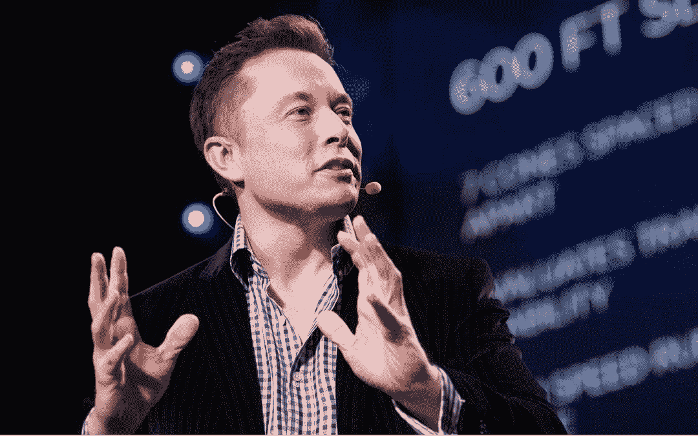

网上关于各种降维算法的资料参差不齐，同时大部分不提供源代码。这里有个 GitHub 项目整理了使用 Python 实现了 11 种经典的数据抽取(数据降维)算法，包括：PCA、LDA、MDS、LLE、TSNE 等，并附有相关资料、展示效果;非常适合机器学习初学者和刚刚入坑数据挖掘的小伙伴。

为什么要进行数据降维?

所谓降维，即用一组个数为 d 的向量 Zi 来代表个数为 D 的向量 Xi 所包含的有用信息，其中 d<D，通俗来讲，即将高维度下降至低维度；将高维数据下降为低维数据。

通常，我们会发现大部分数据集的维度都会高达成百乃至上千，而经典的 MNIST，其维度都是 64。

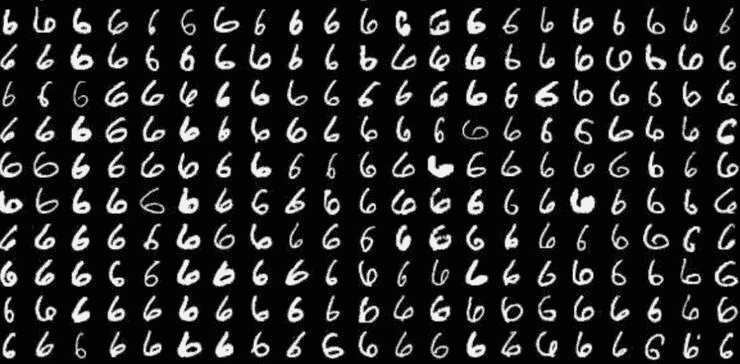

MNIST 手写数字数据集

但在实际应用中，我们所用到的有用信息却并不需要那么高的维度，而且每增加一维所需的样本个数呈指数级增长，这可能会直接带来极大的「维数灾难」;而数据降维就可以实现：

*   使得数据集更易使用

*   确保变量之间彼此独立

*   降低算法计算运算成本

去除噪音一旦我们能够正确处理这些信息，正确有效地进行降维，这将大大有助于减少计算量，进而提高机器运作效率。而数据降维，也常应用于文本处理、人脸识别、图片识别、自然语言处理等领域。

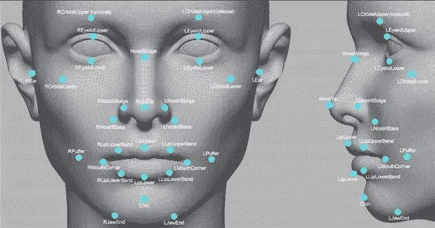

数据降维原理

往往高维空间的数据会出现分布稀疏的情况，所以在降维处理的过程中，我们通常会做一些数据删减，这些数据包括了冗余的数据、无效信息、重复表达内容等。

例如：现有一张 1024*1024 的图，除去中心 50*50 的区域其它位置均为零值，这些为零的信息就可以归为无用信息;而对于对称图形而言，对称部分的信息则可以归为重复信息。

因此，大部分经典降维技术也是基于这一内容而展开，其中降维方法又分为线性和非线性降维，非线性降维又分为基于核函数和基于特征值的方法。

*   线性降维方法：PCA 、ICA LDA、LFA、LPP(LE 的线性表示)

*   非线性降维方法：

*   基于核函数的非线性降维方法——KPCA 、KICA、KDA

*   基于特征值的非线性降维方法(流型学习)——ISOMAP、LLE、LE、LPP、LTSA、MVU

哈尔滨工业大学计算机技术专业的在读硕士生 Heucoder 则整理了 PCA、KPCA、LDA、MDS、ISOMAP、LLE、TSNE、AutoEncoder、FastICA、SVD、LE、LPP 共 12 种经典的降维算法，并提供了相关资料、代码以及展示，下面将主要以 PCA 算法为例介绍降维算法具体操作。

主成分分析(PCA)降维算法

PCA 是一种基于从高维空间映射到低维空间的映射方法，也是最基础的无监督降维算法，其目标是向数据变化最大的方向投影，或者说向重构误差最小化的方向投影。它由 Karl Pearson 在 1901 年提出，属于线性降维方法。与 PCA 相关的原理通常被称为最大方差理论或最小误差理论。这两者目标一致，但过程侧重点则不同。

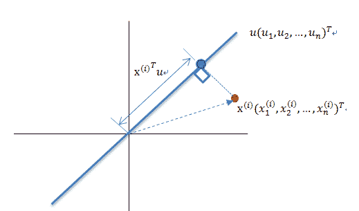

最大方差理论降维原理

将一组 N 维向量降为 K 维(K 大于 0，小于 N)，其目标是选择 K 个单位正交基，各字段两两间 COV(X,Y) 为 0，而字段的方差则尽可能大。因此，最大方差即使得投影数据的方差被最大化，在这过程中，我们需要找到数据集 Xmxn 的最佳的投影空间 Wnxk、协方差矩阵等，其算法流程为：

*   算法输入：数据集 Xmxn;

*   按列计算数据集 X 的均值 Xmean，然后令 Xnew=X−Xmean;

*   求解矩阵 Xnew 的协方差矩阵，并将其记为 Cov;

*   计算协方差矩阵 COV 的特征值和相应的特征向量;

*   将特征值按照从大到小的排序，选择其中最大的 k 个，然后将其对应的 k 个特征向量分别作为列向量组成特征向量矩阵 Wnxk;

*   计算 XnewW，即将数据集 Xnew 投影到选取的特征向量上，这样就得到了我们需要的已经降维的数据集 XnewW。

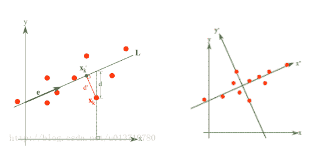

最小误差理论降维原理

而最小误差则是使得平均投影代价最小的线性投影，这一过程中，我们则需要找到的是平方错误评价函数 J0(x0) 等参数。

详细步骤可参考《从零开始实现主成分分析 (PCA) 算法》：

https://blog.csdn.net/u013719780/article/details/78352262

主成分分析(PCA)代码实现

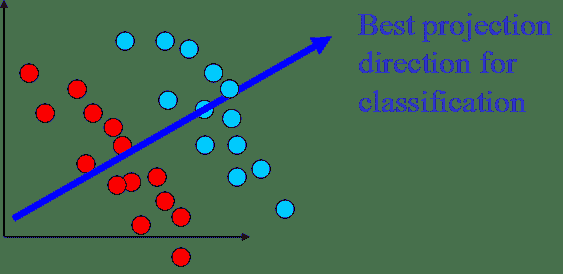

关于 PCA 算法的代码如下：

from __future__ import print_function

from sklearn import datasets

import matplotlib.pyplot as plt

import matplotlib.cm as cmx

import matplotlib.colors as colors

import numpy as np

%matplotlib inline

def shuffle_data(X, y, seed=None):

   if seed:

     np.random.seed(seed)

   idx = np.arange(X.shape[0])

   np.random.shuffle(idx)

   return X[idx], y[idx]

# 正规化数据集 X

def normalize(X, axis=-1, p=2):

   lp_norm = np.atleast_1d(np.linalg.norm(X, p, axis))

   lp_norm[lp_norm == 0] = 1

   return X / np.expand_dims(lp_norm, axis)

# 标准化数据集 X

def standardize(X):

   X_std = np.zeros(X.shape)

   mean = X.mean(axis=0)

   std = X.std(axis=0)

   # 做除法运算时请永远记住分母不能等于 0 的情形

   # X_std = (X - X.mean(axis=0)) / X.std(axis=0) 

   for col in range(np.shape(X)[1]):

     if std[col]:

       X_std[:, col] = (X_std[:, col] - mean[col]) / std[col]

   return X_std

# 划分数据集为训练集和测试集

def train_test_split(X, y, test_size=0.2, shuffle=True, seed=None):

   if shuffle:

     X, y = shuffle_data(X, y, seed)

   n_train_samples = int(X.shape[0] * (1-test_size))

   x_train, x_test = X[:n_train_samples], X[n_train_samples:]

   y_train, y_test = y[:n_train_samples], y[n_train_samples:]

   return x_train, x_test, y_train, y_test

# 计算矩阵 X 的协方差矩阵

def calculate_covariance_matrix(X, Y=np.empty((0,0))):

   if not Y.any():

      Y = X

   n_samples = np.shape(X)[0]

   covariance_matrix = (1 / (n_samples-1)) * (X - X.mean(axis=0)).T.dot(Y - Y.mean(axis=0))

   return np.array(covariance_matrix, dtype=float)

# 计算数据集 X 每列的方差

def calculate_variance(X):

   n_samples = np.shape(X)[0]

   variance = (1 / n_samples) * np.diag((X - X.mean(axis=0)).T.dot(X - X.mean(axis=0)))

   return variance

# 计算数据集 X 每列的标准差

def calculate_std_dev(X):

   std_dev = np.sqrt(calculate_variance(X))

   return std_dev

# 计算相关系数矩阵

def calculate_correlation_matrix(X, Y=np.empty([0])):

   # 先计算协方差矩阵

   covariance_matrix = calculate_covariance_matrix(X, Y)

   # 计算 X, Y 的标准差

   std_dev_X = np.expand_dims(calculate_std_dev(X), 1)

   std_dev_y = np.expand_dims(calculate_std_dev(Y), 1)

   correlation_matrix = np.divide(covariance_matrix, std_dev_X.dot(std_dev_y.T))

   return np.array(correlation_matrix, dtype=float)

class PCA():

   """

   主成份分析算法 PCA，非监督学习算法.

   """

   def __init__(self):

     self.eigen_values = None

     self.eigen_vectors = None

     self.k = 2

   def transform(self, X):

     """ 

     将原始数据集 X 通过 PCA 进行降维

     """

     covariance = calculate_covariance_matrix(X)

     # 求解特征值和特征向量

     self.eigen_values, self.eigen_vectors = np.linalg.eig(covariance)

     # 将特征值从大到小进行排序，注意特征向量是按列排的，即 self.eigen_vectors 第 k 列是 self.eigen_values 中第 k 个特征值对应的特征向量

     idx = self.eigen_values.argsort()[::-1]

     eigenvalues = self.eigen_values[idx][:self.k]

     eigenvectors = self.eigen_vectors[:, idx][:, :self.k]

     # 将原始数据集 X 映射到低维空间

     X_transformed = X.dot(eigenvectors)

     return X_transformed

def main():

   # Load the dataset

   data = datasets.load_iris()

   X = data.data

   y = data.target

   # 将数据集 X 映射到低维空间

   X_trans = PCA().transform(X)

   x1 = X_trans[:, 0]

   x2 = X_trans[:, 1]

   cmap = plt.get_cmap('viridis')

   colors = [cmap(i) for i in np.linspace(0, 1, len(np.unique(y)))]

   class_distr = []

   # Plot the different class distributions

   for i, l in enumerate(np.unique(y)):

       _x1 = x1[y == l]

       _x2 = x2[y == l]

       _y = y[y == l]

       class_distr.append(plt.scatter(_x1, _x2, color=colors[i]))

   # Add a legend

   plt.legend(class_distr, y, loc=1)

   # Axis labels

   plt.xlabel('Principal Component 1')

   plt.ylabel('Principal Component 2')

   plt.show()

if __name__ == "__main__":

   main()

最终，我们将得到降维结果如下。其中，如果得到当特征数 (D) 远大于样本数 (N) 时，可以使用一点小技巧实现 PCA 算法的复杂度转换。

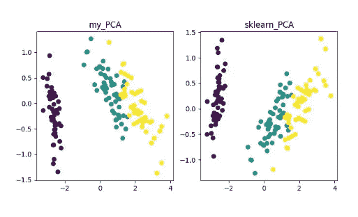

PCA 降维算法展示

当然，这一算法虽然经典且较为常用，其不足之处也非常明显。它可以很好的解除线性相关，但是面对高阶相关性时，效果则较差;同时，PCA 实现的前提是假设数据各主特征是分布在正交方向上，因此对于在非正交方向上存在几个方差较大的方向，PCA 的效果也会大打折扣。

其它降维算法及代码地址

*   **KPCA(kernel PCA)**

KPCA 是核技术与 PCA 结合的产物，它与 PCA 主要差别在于计算协方差矩阵时使用了核函数，即是经过核函数映射之后的协方差矩阵。

引入核函数可以很好的解决非线性数据映射问题。kPCA 可以将非线性数据映射到高维空间，在高维空间下使用标准 PCA 将其映射到另一个低维空间。

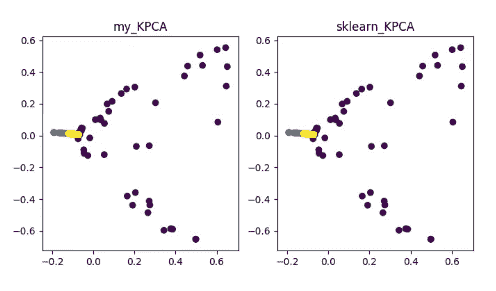

KPCA 降维算法展示

详细内容可参见 《Python 机器学习》之特征抽取——kPCA：

https://blog.csdn.net/weixin_40604987/article/details/79632888

代码地址：

https://github.com/heucoder/dimensionality_reduction_alo_codes/blob/master/codes/PCA/KPCA.py

*   **LDA(Linear Discriminant Analysis)**

LDA 是一种可作为特征抽取的技术，其目标是向最大化类间差异，最小化类内差异的方向投影，以利于分类等任务即将不同类的样本有效的分开。LDA 可以提高数据分析过程中的计算效率，对于未能正则化的模型，可以降低维度灾难带来的过拟合。

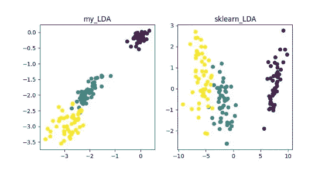

LDA 降维算法展示

详细内容可参见《数据降维—线性判别分析(LDA)》：

https://blog.csdn.net/ChenVast/article/details/79227945

代码地址：

https://github.com/heucoder/dimensionality_reduction_alo_codes/tree/master/codes/LDA

*   **MDS(multidimensional scaling)**

MDS 即多维标度分析，它是一种通过直观空间图表示研究对象的感知和偏好的传统降维方法。该方法会计算任意两个样本点之间的距离，使得投影到低维空间之后能够保持这种相对距离从而实现投影。

由于 sklearn 中 MDS 是采用迭代优化方式，下面实现了迭代和非迭代的两种。

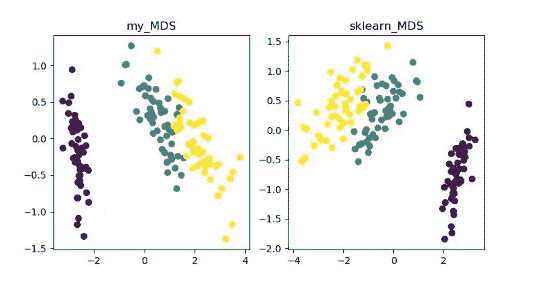

MDS 降维算法展示

详细内容可参见《MDS 算法》

https://blog.csdn.net/zhangweiguo_717/article/details/69663452

代码地址：

https://github.com/heucoder/dimensionality_reduction_alo_codes/tree/master/codes/MDS

*   **ISOMAP**

Isomap 即等度量映射算法，该算法可以很好地解决 MDS 算法在非线性结构数据集上的弊端。

MDS 算法是保持降维后的样本间距离不变，Isomap 算法则引进了邻域图，样本只与其相邻的样本连接，计算出近邻点之间的距离，然后在此基础上进行降维保距。

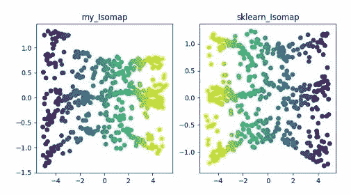

ISOMAP 降维算法展示

详细内容可参见《Isomap》

https://blog.csdn.net/zhangweiguo_717/article/details/69802312

代码地址：

https://github.com/heucoder/dimensionality_reduction_alo_codes/tree/master/codes/ISOMAP

LLE(locally linear embedding)LLE 即局部线性嵌入算法，它是一种非线性降维算法。该算法核心思想为每个点可以由与它相邻的多个点的线性组合而近似重构，然后将高维数据投影到低维空间中，使其保持数据点之间的局部线性重构关系，即有相同的重构系数。在处理所谓的流形降维的时候，效果比 PCA 要好很多。

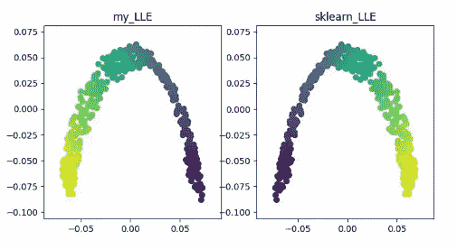

LLE 降维算法展示

详细内容可参见《LLE 原理及推导过程》

https://blog.csdn.net/scott198510/article/details/76099630

代码地址：

https://github.com/heucoder/dimensionality_reduction_alo_codes/tree/master/codes/LLE

*   **t-SNE**

t-SNE 也是一种非线性降维算法，非常适用于高维数据降维到 2 维或者 3 维进行可视化。它是一种以数据原有的趋势为基础，重建其在低纬度(二维或三维)下数据趋势的无监督机器学习算法。

下面的结果展示参考了源代码，同时也可用 tensorflow 实现(无需手动更新参数)。

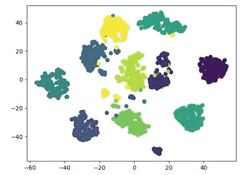

t-SNE 降维算法展示

详细内容可参见《t-SNE 使用过程中的一些坑》：

http://bindog.github.io/blog/2018/07/31/t-sne-tips/

代码地址：

https://github.com/heucoder/dimensionality_reduction_alo_codes/tree/master/codes/T-SNE

*   **LE(Laplacian Eigenmaps)**

LE 即拉普拉斯特征映射，它与 LLE 算法有些相似，也是以局部的角度去构建数据之间的关系。它的直观思想是希望相互间有关系的点(在图中相连的点)在降维后的空间中尽可能的靠近;以这种方式，可以得到一个能反映流形的几何结构的解。

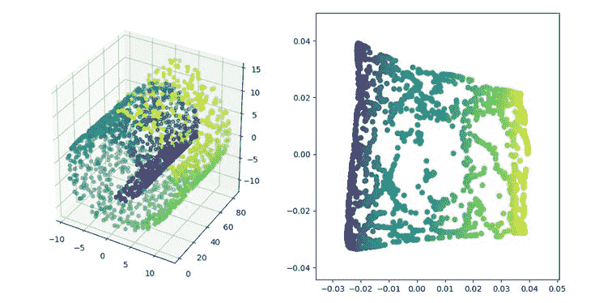

LE 降维算法展示

详细内容可参见《拉普拉斯特征图降维及其 python 实现》：

https://blog.csdn.net/HUSTLX/article/details/50850342

代码地址：

https://github.com/heucoder/dimensionality_reduction_alo_codes/tree/master/codes/LE

*   **LPP(Locality Preserving Projections)**

LPP 即局部保留投影算法，其思路和拉普拉斯特征映射类似，核心思想为通过最好的保持一个数据集的邻居结构信息来构造投影映射，但 LPP 不同于 LE 的直接得到投影结果，它需要求解投影矩阵。

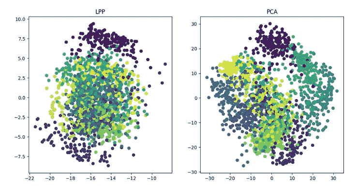

LPP 降维算法展示

详情请参见《局部保留投影算法 (LPP) 详解》：

https://blog.csdn.net/qq_39187538/article/details/90402961

代码地址：

https://github.com/heucoder/dimensionality_reduction_alo_codes/tree/master/codes/LPP

***《dimensionality_reduction_alo_codes》项目作者简介**

Heucoder，目前是哈尔滨工业大学计算机技术在读硕士生，主要活跃于互联网领域，知乎昵称为「超爱学习」，其 github 主页地址为：https://github.com/heucoder。

Github 项目地址:

https://github.com/heucoder/dimensionality_reduction_alo_codes

* * *

经过8年多的发展，LSGO软件技术团队在「地理信息系统」、「数据统计分析」、「计算机视觉」等领域积累了丰富的研发经验，也建立了人才培养的完备体系，目前深耕的领域为「机器学习与量化金融」，欢迎对计算机技术感兴趣的同学加入，与我们共同成长进步。

后台回复「**搜搜搜**」，随机获取电子资源！

欢迎关注，请扫描二维码：

