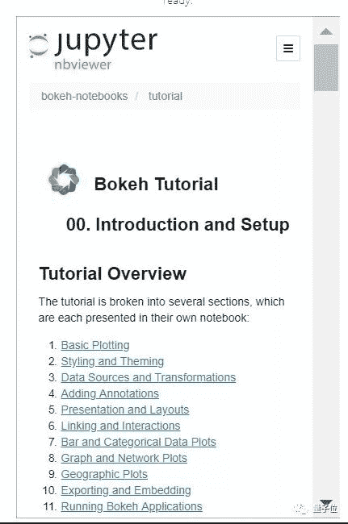

点击上方“**Datawhal****e**”，选择“星标”公众号

第一时间获取价值内容

转自量子位，作者乾明

GitHub 上，一份用 Python 做交互式图形的资源火了。

这一工具名为 **Bokeh**，官方介绍称，它能读取大型数据集或者流数据，以简单快速的方式为网页提供优美、高交互性能的图形。

比如，有人用它做出了这样的图：

有人做出了这样的图：

还有其他各种图：

也有人用它做了图去 TED 上演讲：

“美观、实用” 是不少用户给出的评价，甚至有人想让这份工具用起来更方便，尝试去汉化它的官方文档。

## Bokeh 使用指南

Bokeh，是由非营利组织 NumFocus 提供支持，大家可以免费使用，官方网站地址：

https://bokeh.pydata.org/en/latest/

Bokeh 面向用户开放三个层次的接口：

*   低级接口能为应用开发者提供高度灵活的图形表示（支持自定义一些顶层的组件）

*   中级接口主要用于绘制曲线（会默认加载一些低级的组件）

*   高级接口用于快速简单地构建复杂图形

官方支持 Python 2.7 和 3.5 + 版本，在其他版本的 Python 上功能可能会受限。

想要使用这一资源，最直接的办法是去 GitHub 上下载。项目地址：

https://github.com/bokeh/bokeh

不过，官方推荐的安装方式是使用 Anaconda Python 及其附带的 Conda 包管理系统，这是一个专门为 Python/R 语言打造的数据科学平台，下载地址：

https://www.anaconda.com/distribution/

在工具使用方面，官方也提供了详尽的用户指南，包括快速安装运行、了解基础概念、如何处理数据、绘图、添加注释交互等等：

有人正在将 Bokeh 的用户指南汉化：

https://github.com/DonaldDai/Bokeh-CN

在具体实现方面，官方提供了教程与示例：

教程是基于 Jupyter Notebook 提供的，Bokeh 本身也与 Jupyter Notebook 无缝集成，使用起来也比较方便。对于给出的每一个示例，官方也都给出了背后实现的代码。

如果你对这一工具有兴趣，或者正好需要这样一个工具，不妨去尝试下：

GitHub 传送门：
https://github.com/bokeh/bokeh

Bokeh 官网传送门：

https://bokeh.pydata.org/en/latest/

