点击上方“**Datawhal****e**”，选择“星标”公众号

第一时间获取价值内容


来源 | AI开发者

**简  介**

据《福布斯》报道，每天大约会有 250 万字节的数据被产生。然后，可以使用数据科学和机器学习技术对这些数据进行分析，以便提供分析和作出预测。尽管在大多数情况下，在开始任何统计分析之前，需要先对最初收集的数据进行预处理。有许多不同的原因导致需要进行预处理分析，例如：

*   收集的数据格式不对（如 SQL 数据库、JSON、CSV 等）

*   缺失值和异常值

*   标准化

*   减少数据集中存在的固有噪声（部分存储数据可能已损坏）

*   数据集中的某些功能可能无法收集任何信息以供分析

在本文中，我将介绍如何使用 python 减少 kaggle Mushroom Classification 数据集中的特性数量。本文中使用的所有代码在 kaggle 和我的 github 帐号上都有。

减少统计分析期间要使用的特征的数量可能会带来一些好处，例如：

*   提高精度

*   降低过拟合风险

*   加快训练速度

*   改进数据可视化

*   增加我们模型的可解释性

事实上，统计上证明，当执行机器学习任务时，存在针对每个特定任务应该使用的最佳数量的特征（图 1）。如果添加的特征比必要的特征多，那么我们的模型性能将下降（因为添加了噪声）。真正的挑战是找出哪些特征是最佳的使用特征（这实际上取决于我们提供的数据量和我们正在努力实现的任务的复杂性）。这就是特征选择技术能够帮到我们的地方！

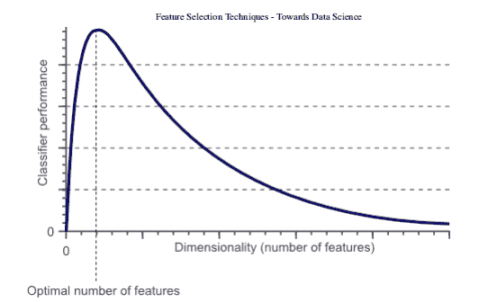

图 1：分类器性能和维度之间的关系

**特征选择**

有许多不同的方法可用于特征选择。其中最重要的是：

1.过滤方法=过滤我们的数据集，只取包含所有相关特征的子集（例如，使用 Pearson 相关的相关矩阵）。

2.遵循过滤方法的相同目标，但使用机器学习模型作为其评估标准（例如，向前/向后/双向/递归特征消除）。我们将一些特征输入机器学习模型，评估它们的性能，然后决定是否添加或删除特征以提高精度。因此，这种方法可以比滤波更精确，但计算成本更高。

3.嵌入方法。与过滤方法一样，嵌入方法也使用机器学习模型。这两种方法的区别在于，嵌入的方法检查 ML 模型的不同训练迭代，然后根据每个特征对 ML 模型训练的贡献程度对每个特征的重要性进行排序。

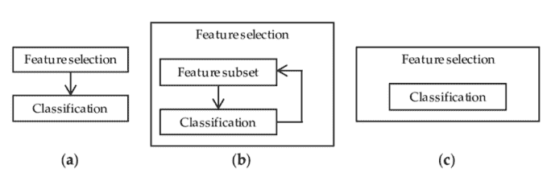

图 2：过滤器、包装器和嵌入式方法表示 [3]

**实践**

在本文中，我将使用 Mushroom Classification 数据集，通过查看给定的特征来尝试预测蘑菇是否有毒。在这样做的同时，我们将尝试不同的特征消除技术，看看它们会如何影响训练时间和模型整体的精度。

首先，我们需要导入所有必需的库。

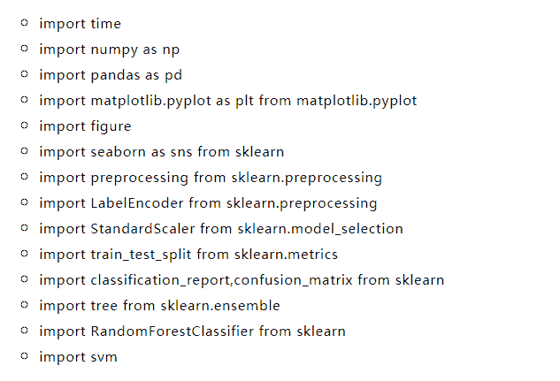

我们将在本例中使用的数据集如下图所示。

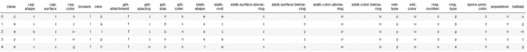

图 3：Mushroom Classification 数据集

在将这些数据输入机器学习模型之前，我决定对所有分类变量进行 one hot 编码，将数据分为特征（x）和标签（y），最后在训练集和测试集中进行。

```
X = df.drop(['class'], axis = 1)Y = df['class']X = pd.get_dummies(X, prefix_sep='_')Y = LabelEncoder().fit_transform(Y)
X2 = StandardScaler().fit_transform(X)
X_Train, X_Test, Y_Train, Y_Test = train_test_split(X2, Y, test_size = 0.30,  random_state = 101)
```

**特征重要性**

基于集合的决策树模型（如随机森林）可以用来对不同特征的重要性进行排序。了解我们的模型最重要的特征对于理解我们的模型如何做出预测（使其更易于解释）是至关重要的。同时，我们可以去掉那些对我们的模型没有任何好处的特征。

```
start = time.process_time()trainedforest = RandomForestClassifier(n_estimators=700).fit(X_Train,Y_Train)print(time.process_time() - start)predictionforest = trainedforest.predict(X_Test)print(confusion_matrix(Y_Test,predictionforest))print(classification_report(Y_Test,predictionforest))
```

如下图所示，使用所有特征训练一个随机森林分类器，在大约 2.2 秒的训练时间内获得 100% 的准确率。在下面的每个示例中，每个模型的训练时间都将打印在每个片段的第一行，供你参考。

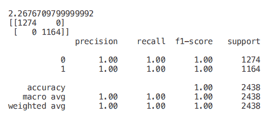

一旦我们的随机森林分类器得到训练，我们就可以创建一个特征重要性图，看看哪些特征对我们的模型预测来说是最重要的（图 4）。在本例中，下面只显示了前 7 个特性。

```
figure(num=None, figsize=(20, 22), dpi=80, facecolor='w', edgecolor='k')
feat_importances = pd.Series(trainedforest.feature_importances_, index= X.columns)feat_importances.nlargest(7).plot(kind='barh')
```

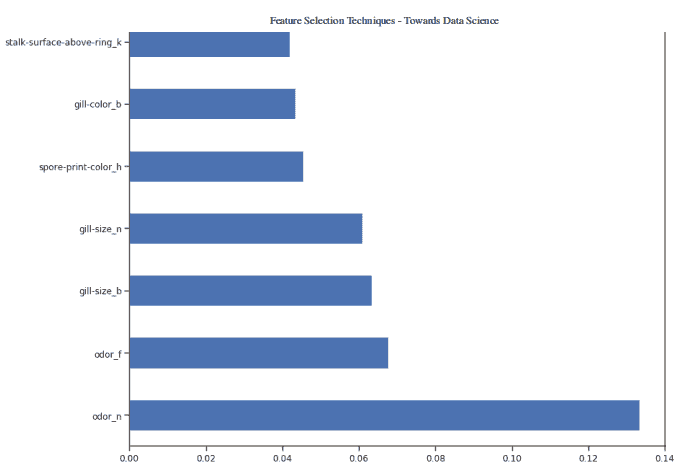

图 4：特征重要性图

现在我们知道了哪些特征被我们的随机森林认为是最重要的，我们可以尝试使用前 3 个来训练我们的模型。

```
X_Reduced = X[['odor_n','odor_f', 'gill-size_n','gill-size_b']]X_Reduced = StandardScaler().fit_transform(X_Reduced)X_Train2, X_Test2, Y_Train2, Y_Test2 = train_test_split(X_Reduced, Y, test_size = 0.30,  random_state = 101)
start = time.process_time()trainedforest = RandomForestClassifier(n_estimators=700).fit(X_Train2,Y_Train2)print(time.process_time() - start)predictionforest = trainedforest.predict(X_Test2)print(confusion_matrix(Y_Test2,predictionforest))print(classification_report(Y_Test2,predictionforest))
```

正如我们在下面看到的，仅仅使用 3 个特征，只会导致准确率下降 0.03%，训练时间减少一半。

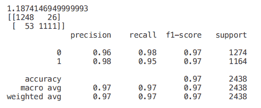

我们还可以通过可视化一个训练过的决策树来理解如何进行特征选择。

```
start = time.process_time()trainedtree = tree.DecisionTreeClassifier().fit(X_Train, Y_Train)print(time.process_time() - start)predictionstree = trainedtree.predict(X_Test)print(confusion_matrix(Y_Test,predictionstree))print(classification_report(Y_Test,predictionstree))
```

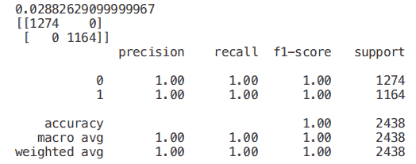

树结构顶部的特征是我们的模型为了执行分类而保留的最重要的特征。因此，只选择顶部的前几个特征，而放弃其他特征，可能创建一个准确度非常可观的模型。

```
import graphvizfrom sklearn.tree import DecisionTreeClassifier, export_graphviz

data = export_graphviz(trainedtree,out_file=None,feature_names= X.columns,        class_names=['edible', 'poisonous'],         filled=True, rounded=True,         max_depth=2,        special_characters=True)graph = graphviz.Source(data)graph
```

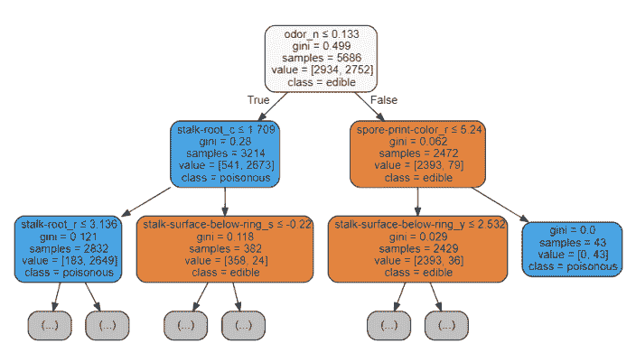

图 5：决策树可视化

**递归特征消除（RFE）**

递归特征消除（RFE）将机器学习模型的实例和要使用的最终期望特征数作为输入。然后，它递归地减少要使用的特征的数量，采用的方法是使用机器学习模型精度作为度量对它们进行排序。

创建一个 for 循环，其中输入特征的数量是我们的变量，这样就可以通过跟踪在每个循环迭代中注册的精度，找出我们的模型所需的最佳特征数量。使用 RFE 支持方法，我们可以找出被评估为最重要的特征的名称（rfe.support 返回一个布尔列表，其中 true 表示一个特征被视为重要，false 表示一个特征不重要）。

```
from sklearn.feature_selection import RFE
model = RandomForestClassifier(n_estimators=700)rfe = RFE(model, 4)start = time.process_time()RFE_X_Train = rfe.fit_transform(X_Train,Y_Train)RFE_X_Test = rfe.transform(X_Test)rfe = rfe.fit(RFE_X_Train,Y_Train)print(time.process_time() - start)print("Overall Accuracy using RFE: ", rfe.score(RFE_X_Test,Y_Test))
```

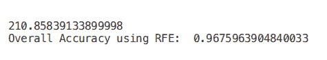

**SelecFromModel**

selectfrommodel 是另一种 scikit 学习方法，可用于特征选择。此方法可用于具有 coef 或 feature 重要性属性的所有不同类型的 scikit 学习模型（拟合后）。与 rfe 相比，selectfrommodel 是一个不太可靠的解决方案。实际上，selectfrommodel 只是根据计算出的阈值（不涉及优化迭代过程）删除不太重要的特性。

为了测试 selectfrommodel 的有效性，我决定在这个例子中使用一个 ExtraTreesClassifier。

ExtratreesClassifier（极端随机树）是基于树的集成分类器，与随机森林方法相比，它可以产生更少的方差（因此减少了过拟合的风险）。随机森林和极随机树的主要区别在于极随机树中节点的采样不需要替换。

```
from sklearn.ensemble import ExtraTreesClassifierfrom sklearn.feature_selection import SelectFromModel
model = ExtraTreesClassifier()start = time.process_time()model = model.fit(X_Train,Y_Train)model = SelectFromModel(model, prefit=True)print(time.process_time() - start)Selected_X = model.transform(X_Train)
start = time.process_time()trainedforest = RandomForestClassifier(n_estimators=700).fit(Selected_X, Y_Train)print(time.process_time() - start)Selected_X_Test = model.transform(X_Test)predictionforest = trainedforest.predict(Selected_X_Test)print(confusion_matrix(Y_Test,predictionforest))print(classification_report(Y_Test,predictionforest))
```

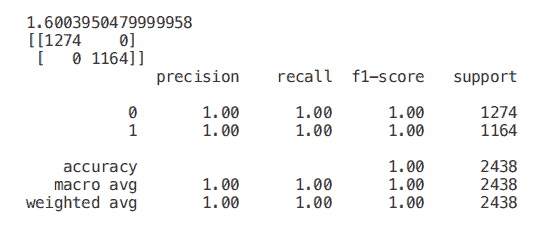

**相关矩阵分析**

为了减少数据集中的特征数量，另一种可能的方法是检查特征与标签的相关性。

使用皮尔逊相关，我们的返回系数值将在-1 和 1 之间变化：

*   如果两个特征之间的相关性为 0，则意味着更改这两个特征中的任何一个都不会影响另一个。

*   如果两个特征之间的相关性大于 0，这意味着增加一个特征中的值也会增加另一个特征中的值（相关系数越接近 1，两个不同特征之间的这种联系就越强）。

*   如果两个特征之间的相关性小于 0，这意味着增加一个特征中的值将使减少另一个特征中的值（相关性系数越接近-1，两个不同特征之间的这种关系将越强）。

在这种情况下，我们将只考虑与输出变量至少 0.5 相关的特性。

```
Numeric_df = pd.DataFrame(X)Numeric_df['Y'] = Ycorr= Numeric_df.corr()corr_y = abs(corr["Y"])highest_corr = corr_y[corr_y >0.5]highest_corr.sort_values(ascending=True)
```

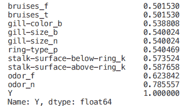

我们现在可以通过创建一个相关矩阵来更仔细地研究不同相关特征之间的关系。

```
figure(num=None, figsize=(12, 10), dpi=80, facecolor='w', edgecolor='k')
corr2 = Numeric_df[['bruises_f' , 'bruises_t' , 'gill-color_b' , 'gill-size_b' ,  'gill-size_n' , 'ring-type_p' , 'stalk-surface-below-ring_k' ,  'stalk-surface-above-ring_k' , 'odor_f', 'odor_n']].corr()
sns.heatmap(corr2, annot=True, fmt=".2g")
```

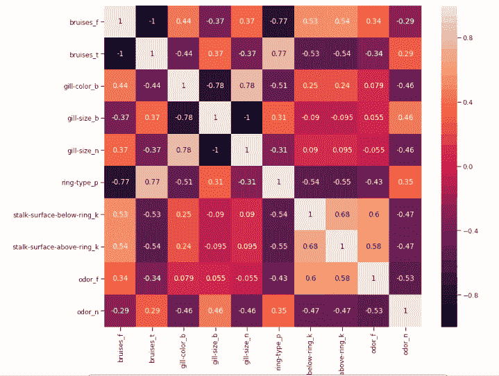

图 6：最高相关特征的相关矩阵

在这项分析中，另一个可能要控制的方面是检查所选变量是否彼此高度相关。如果是的话，我们就只需要保留其中一个相关的，去掉其他的。

最后，我们现在可以只选择与 y 相关度最高的特征，训练/测试一个支持向量机模型来评估该方法的结果。

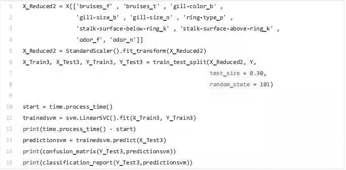

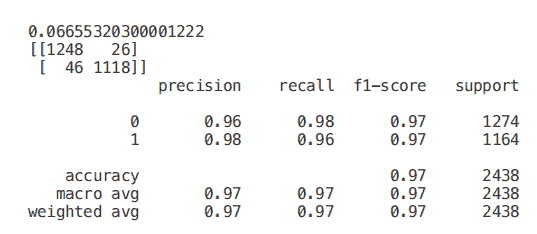

**单变量选择**

单变量特征选择是一种统计方法，用于选择与我们对应标签关系最密切的特征。使用 selectkbest 方法，我们可以决定使用哪些指标来评估我们的特征，以及我们希望保留的 k 个最佳特征的数量。根据我们的需要，提供不同类型的评分函数：

*   Classification = chi2, f_classif, mutual_info_classif

*   Regression = f_regression, mutual_info_regression

在本例中，我们将使用 chi2（图 7）。

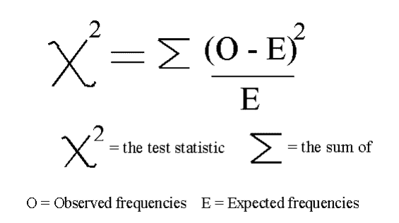

图 7：卡方公式 [4]

卡方（chi-squared，chi2）可以将非负值作为输入，因此，首先，我们在 0 到 1 之间的范围内缩放输入数据。

```
from sklearn.feature_selection import SelectKBestfrom sklearn.feature_selection import chi2
min_max_scaler = preprocessing.MinMaxScaler()Scaled_X = min_max_scaler.fit_transform(X2)
X_new = SelectKBest(chi2, k=2).fit_transform(Scaled_X, Y)X_Train3, X_Test3, Y_Train3, Y_Test3 = train_test_split(X_new, Y, test_size = 0.30,  random_state = 101)start = time.process_time()trainedforest = RandomForestClassifier(n_estimators=700).fit(X_Train3,Y_Train3)print(time.process_time() - start)predictionforest = trainedforest.predict(X_Test3)print(confusion_matrix(Y_Test3,predictionforest))print(classification_report(Y_Test3,predictionforest))
```

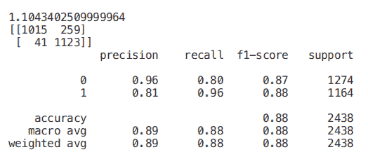

**套索回归**

当将正则化应用于机器学习模型时，我们在模型参数上加上一个惩罚，以避免我们的模型试图太接近我们的输入数据。通过这种方式，我们可以使我们的模型不那么复杂，并且我们可以避免过度拟合（使我们的模型不仅学习关键的数据特征，而且学习它的内在噪声）。

其中一种可能的正则化方法是套索回归。当使用套索回归时，如果输入特征的系数对我们的机器学习模型训练没有积极的贡献，则它们会缩小。这样，一些特征可能会被自动丢弃，即将它们的系数指定为零。

```
from sklearn.linear_model import LassoCV
regr = LassoCV(cv=5, random_state=101)regr.fit(X_Train,Y_Train)print("LassoCV Best Alpha Scored: ", regr.alpha_)print("LassoCV Model Accuracy: ", regr.score(X_Test, Y_Test))model_coef = pd.Series(regr.coef_, index = list(X.columns[:-1]))print("Variables Eliminated: ", str(sum(model_coef == 0)))print("Variables Kept: ", str(sum(model_coef != 0)))
```

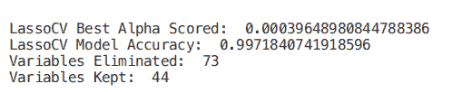

一旦训练了我们的模型，我们就可以再次创建一个特征重要性图来了解哪些特征被我们的模型认为是最重要的（图 8）。这是非常有用的，尤其是在试图理解我们的模型是如何决定做出预测的时候，因此使我们的模型更易于解释。

```
figure(num=None, figsize=(12, 10), dpi=80, facecolor='w', edgecolor='k')
top_coef = model_coef.sort_values()top_coef[top_coef != 0].plot(kind = "barh")plt.title("Most Important Features Identified using Lasso (!0)")
```

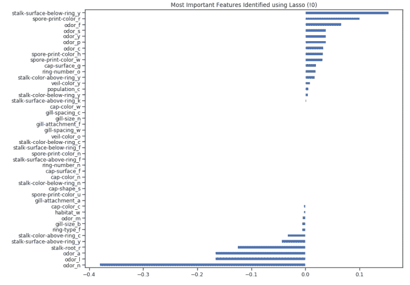

图 8：套索特征重要性图

via：https://towardsdatascience.com/feature-selection-techniques-1bfab5fe0784

