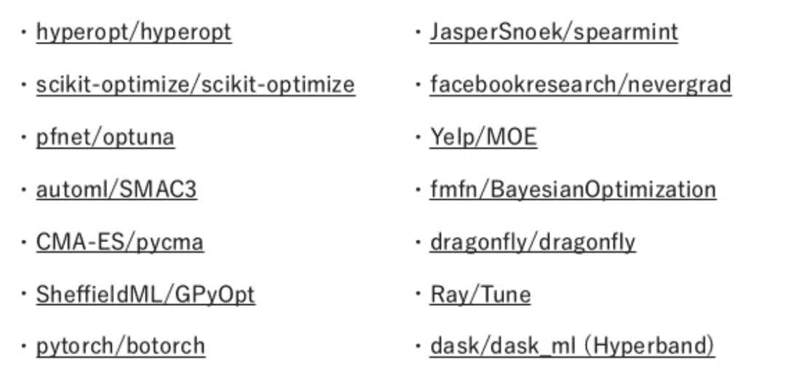
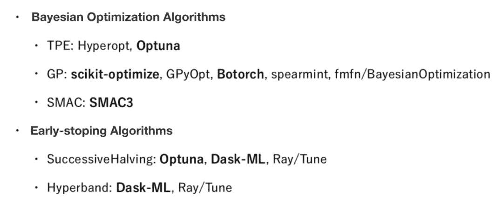

作者：Xu LIANG

翻译：王雨桐

校对：王威力

本文长度约为****1300字****，建议阅读**5******分钟****

# **自动化程度**

Jeff Dean在ICML 2019上进行了有关AutoML的演讲，并将自动化分为4个级别：

1.  **手动构造预测变量，不引入学习的步骤；**

2.  **手工选择特征，学习预测。**引入自动化超参数调优（HPO）工具，例如Hyperopt，Optuna，SMAC3，scikit-optimize等；

3.  **手工构造算法，端到端学习特征和预测。**除了HPO外，还有其他一些工具，例如featuretools，tsfresh，boruta等；

4.  **完全自动化。**端到端学习算法，特征和预测。自动化算法（模型）选择工具，例如Auto-sklearn，TPOT，H2O，auto_ml，MLBox等。

# **参数自动优化的两种方法**

广泛使用的优化方法有两种，一种是**贝叶斯优化方法**，它基于过去的结果搜索未知参数范围。典型的算法有TPE，SMAC，GP-EL等。

另一种方法是在**训练时终止学习，从而高效地搜索参数，**例如逐层减半（Successive Halving），超带宽（Hyperband）等。

蓝色点表示训练将继续，红色点表示训练将停止。

# **AutoML库**

我们可以将这些库分为贝叶斯优化算法和早停法算法。

综合考虑到质量和速度，我们推荐使用的两个库是**Optuna和scikit-optimize。**

# **自动化特征工程**

TPOT和Auto-sklear在使用上仍然有局限性。因此，我们将特征工程分为两类，特征生成和特征选择。

*   **特征生成**

*   Featuretools: Deep feature synthesis

*   tsfresh

*   **特征选择**

*   3种方法： 包装法（Wrapper），过滤法(Filter)，嵌入法（Embedded）

*   Scikit-lean 和Boruta

# **自动化算法（模型）选择**

# AutoML作为一个CASH问题（混合算法选择和超参优化），其中两个重要的问题是，没有一个适用于所有数据集的最优模型；一些模型对于超参数很敏感。我们需要同时解决模型选择和超参调优的问题。

Optuna也可以解决CASH问题，如下图。

自动算法选择的比较如下：

*   Auto-sklearn

*   TPOT

*   h2o-3

*   auto_ml

*   MLBox

图七表示的是不同框架算法下，在分类数据集问题上的F1值。图八表示的不同框架算法下，在回归数据集上的均方误差（MSE）。其中箱型图分别表示上限、下四分位、中位、下四分位、下限，灰色圆圈表示异常值。

针对不同的任务推荐使用不同方法。

*   **回归任务：**auto-sklearn（基于贝叶斯）

*   **分类任务：**TPOT（基于遗传算法）

# **自动化的神经体系结构搜索**

自动神经体系结构搜索在学术界也是一个非常热门的话题，但在工业界并未得到广泛使用。

# **Reference**

*   https://www.slideshare.net/c-bata/pythonautoml-at-pyconjp-2019

*   https://arxiv.org/pdf/1012.2599.pdf

*   https://arxiv.org/pdf/1810.05934.pdf

*   https://arxiv.org/pdf/1502.07943.pdf

*   https://arxiv.org/pdf/1808.06492.pdf

以下是日语幻灯片的链接：

https://www.slideshare.net/c-bata/pythonautoml-at-pyconjp-2019

原文链接：

https://towardsdatascience.com/overview-of-automl-from-pycon-jp-2019-c8996954692f

编辑：王菁

校对：林亦霖

**译者简介**

**王雨桐**，UIUC统计学在读硕士，本科统计专业，目前专注于Coding技能的提升。理论到应用的转换中，敬畏数据，持续进化。

