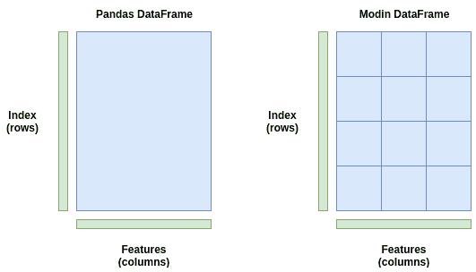

> 作者：George Seif
> 
> 编译：ronghuaiyang

**导读**

虽然Pandas的功能非常强大，但是对于大数据集来说，确实是很慢的。

虽然 panda 是 Python 中用于数据处理的库，但它并不是真正为了速度而构建的。了解一下新的库 Modin，Modin 是为了分布式 panda 的计算来加速你的数据准备而开发的。

Pandas是处理 Python 数据的首选库。它易于使用，并且在处理不同类型和大小的数据时非常灵活。它有大量的函数，使得操纵数据变得轻而易举。


随着时间的推移，各种Python包的流行程度

但是有一个缺点：对于较大的数据集来说，panda“慢”。

默认情况下，panda 使用单个 CPU 内核作为单个进程执行其函数。这对于较小的数据集工作得很好，因为你可能不会注意到速度上的差异。但是，随着数据集越来越大，计算量越来越大，如果只使用单个 cpu 核，速度会受到很大的影响。它在数据集上同一时间只能计算一次，但该数据集可以有数百万甚至数十亿行。

然而，大多数用于数据科学的现代机器都有至少 2 个 CPU 核。这意味着，以 2 个 CPU 核为例，在使用 pandas 时，50%或更多的计算机处理能力在默认情况下不会执行任何操作。当你使用 4 核(现代 Intel i5)或 6 核(现代 Intel i7)时，情况会变得更糟。pandas 的设计初衷并不是为了有效利用这种计算能力。

Modin是一个新的库，通过在**系统所有可用的 CPU 核上**自动分配计算来加速 pandas。有了它，对于任何尺寸的 pandas 数据数据集，Modin 声称能够以 CPU 内核的数量得到近乎线性的加速。

让我们看看它是如何工作的，并通过一些代码示例进行说明。

### Modin 如何用 Pandas 并行计算

给定 pandas 中的 DataFrame ，我们的目标是以尽可能快的方式对其执行某种计算或处理。可以用*.mean()*取每一列的平均值，用*groupby*对数据进行分组，用*drop_duplicates()*删除所有重复项，或者使用其他任何内置的 pandas 函数。

在前一节中，我们提到了 pandas 如何只使用一个 CPU 核进行处理。自然，这是一个很大的瓶颈，特别是对于较大的 DataFrames，计算时就会表现出资源的缺乏。

理论上，并行计算就像在每个可用的 CPU 核上的不同数据点上应用计算一样简单。对于一个 pandas 的 DataFrame，一个基本的想法是将 DataFrame 分成几个部分，每个部分的数量与你拥有的 CPU 内核的数量一样多，并让每个 CPU 核在一部分上运行计算。最后，我们可以聚合结果，这是一个计算上很 cheap 的操作。


多核系统如何更快地处理数据。对于单核进程(左)，所有10个任务都放在一个节点上。对于双核进程(右图)，每个节点承担5个任务，从而使处理速度加倍。

这正是 Modin 所做的。它将 DataFrame 分割成不同的部分，这样每个部分都可以发送到不同的 CPU 核。Modin 在行和列之间划分 DataFrame。这使得 Modin 的并行处理可扩展到任何形状的 DataFrame。

想象一下，如果给你一个列多行少的 DataFrame。有些库只执行跨行分区，在这种情况下效率很低，因为我们的列比行多。但是对于 Modin 来说，由于分区是跨两个维度进行的，所以并行处理对于所有形状的数据流都是有效的，不管它们是更宽的(很多列)、更长的(很多行)，还是两者都有。



panda的DataFrame(左)存储为一个块，只发送到一个CPU核。Modin的DataFrame(右)跨行和列进行分区，每个分区可以发送到不同的CPU核上，直到用光系统中的所有CPU核。

上面的图是一个简单的例子。Modin 实际上使用了一个“分区管理器”，它可以根据操作的类型改变分区的大小和形状。例如，可能有一个操作需要整个行或整个列。在这种情况下，“分区管理器”将以它能找到的最优方式执行分区和分配到 CPU 核上。它是非常灵活的。

为了在执行并行处理时完成大量繁重的工作，Modin 可以使用 Dask 或 Ray。它们都是使用 Python api 的并行计算库，你可以选择一个或另一个在运行时与 Modin 一起使用。Ray 目前是最安全的一个，因为它更稳定 —— Dask 后端是实验性的。

已经有足够的理论了。让我们来看看代码和速度基准测试！

### Modin 速度基准测试

安装 Modin 的最简单的方法是通过 pip。下面的命令安装 Modin、Ray 和所有相关的依赖项：

```
`pip install modin[ray]` 
```

对于我们下面的例子和 benchmarks，我们使用了 Kaggle 的 CS:GO Competitive Matchmaking Data。CSV 的每一行都包含了 CS:GO 比赛中的一轮数据。

现在，我们尝试使用最大的 CSV 文件(有几个)，*esea_master_dmg_demo .part1.csv*，它有 1.2GB。有了这样的体量，我们应该能够看到 pandas 有多慢，以及 Modin 是如何帮助我们加速的。对于测试，我使用一个 i7-8700k CPU，它有 6 个物理内核和 12 个线程。

我们要做的第一个测试是使用 read_csv()读取数据。Pandas 和 Modin 的代码是完全一样的。

```
`### Read in the data with Pandas
import pandas as pd

s = time.time()
df = pd.read_csv("esea_master_dmg_demos.part1.csv")
e = time.time()
print("Pandas Loading Time = {}".format(e-s))

### Read in the data with Modin
import modin.pandas as pd

s = time.time()
df = pd.read_csv("esea_master_dmg_demos.part1.csv")
e = time.time()
print("Modin Loading Time = {}".format(e-s))` 
```

为了测量速度，我导入了*time*模块，并在*read_csv()*之前和之后放置了一个*time()*。panda 将数据从 CSV 加载到内存需要 8.38 秒，而 Modin 需要 3.22 秒。这是 2.6 倍的加速。对于只修改 import 语句来说，这不算太寒酸！

让我们在 DataFrame 上做一些更复杂的处理。连接多个 DataFrames 是 panda 中的一个常见操作 — 我们可能有几个或多个包含数据的 CSV 文件，然后必须一次读取一个并连接它们。我们可以使用 panda 和 Modin 中的*pd.concat()*函数轻松做到这一点。

我们希望 Modin 能够很好地处理这种操作，因为它要处理大量的数据。代码如下所示。

```
`import pandas as pd
df = pd.read_csv("esea_master_dmg_demos.part1.csv")

s = time.time()
df = pd.concat([df for _ in range(5)])
e = time.time()
print("Pandas Concat Time = {}".format(e-s))

import modin.pandas as pd
df = pd.read_csv("esea_master_dmg_demos.part1.csv")

s = time.time()
df = pd.concat([df for _ in range(5)])
e = time.time()
print("Modin Concat Time = {}".format(e-s))` 
```

在上面的代码中，我们将 DataFrame 与自身连接了 5 次。pandas 在 3.56 秒内完成了连接操作，而 Modin 在 0.041 秒内完成，速度提高了 86.83 倍！看起来，即使我们只有 6 个 CPU 核心，DataFrame 的分区也有助于提高速度。

用于 DataFrame 清洗的 panda 函数是*.fillna()*函数。此函数查找 DataFrame 中的所有 NaN 值，并将它们替换为你选择的值。panda 必须遍历每一行和每一列来查找 NaN 值并替换它们。这是一个应用 Modin 的绝佳机会，因为我们要多次重复一个非常简单的操作。

```
`import pandas as pd
df = pd.read_csv("esea_master_dmg_demos.part1.csv")

s = time.time()
df = df.fillna(value=0)
e = time.time()
print("Pandas Concat Time = {}".format(e-s))

import modin.pandas as pd
df = pd.read_csv("esea_master_dmg_demos.part1.csv")

s = time.time()
df = df.fillna(value=0)
e = time.time()
print("Modin Concat Time = {}".format(e-s))` 
```

这次，Pandas 运行*.fillna()*用了 1.8 秒，而 Modin 用了 0.21 秒，8.57 倍的加速！

### 警告！

Modin 总是这么快吗？

并不是这样。

在有些情况下，panda 实际上比 Modin 更快，即使在这个有 5,992,097(近 600 万)行的大数据集上也是如此。下表显示了我进行的一些实验中 panda 与 Modin 的运行时间。

正如你所看到的，在某些操作中，Modin 要快得多，通常是读取数据并查找值。其他操作，如执行统计计算，在 pandas 中要快得多。

| Operation | Pandas Time | Modin Time | Speedup |
| --- | --- | --- | --- |
| pd.read_csv('esea_master_dmg_demos.part1.csv') | 8.38 | 3.22 | 2.6 |
| pd.concat([df for _ in range(5)]) | 3.56 | 0.041 | 86.83 |
| df.groupby(by='wp_type') | 0.00029 | 0.059 | 0.0049 |
| df.fillna(value=0) | 1.8 | 0.21 | 8.57 |
| df.dropna() | 1.24 | 1.71 | 0.73 |
| df.count() | 1.09 | 0.046 | 23.70 |
| df.drop_duplicates() | 7.68 | 13.38 | 0.57 |
| df.describe() | 1.30 | 4.69 | 0.28 |
| df['seconds'].max() | 0.015 | 0.26 | 0.058 |
| df.isnull() | 0.998 | 0.012 | 83.17 |

### 使用 Modin 的实用技巧

Modin 仍然是一个相当新的库，并在不断地发展和扩大。因此，并不是所有的 pandas 功能都被完全加速了。如果你在 Modin 中尝试使用一个还没有被加速的函数，它将默认为 panda，因此不会有任何代码错误或错误。

默认情况下，Modin 将使用计算机上所有可用的 CPU 内核。在某些情况下，你可能希望限制 Modin 可以使用的 CPU 内核的数量，特别是如果你希望在其他地方使用这种计算能力。我们可以通过 Ray 中的初始化设置来限制 Modin 可以访问的 CPU 内核的数量，因为 Modin 在后端使用它。

```
`import ray
ray.init(num_cpus=4)
import modin.pandas as pd` 
```

在处理大数据时，数据集的大小超过系统上的内存(RAM)的情况并不少见。Modin 有一个特殊的标志，我们可以设置为“true”，这将使其进入“out of core”模式。这意味着 Modin 将使用你的磁盘作为你的内存溢出存储，允许你处理比你的 RAM 大得多的数据集。我们可以设置以下环境变量来启用此功能：

```
`export MODIN_OUT_OF_CORE=true` 
```

### 总结

这就是使用 Modin 加速 panda 函数的指南。只需修改 import 语句就可以很容易地做到这一点。希望你发现 Modin 至少在一些情况下对加速 panda有用。

