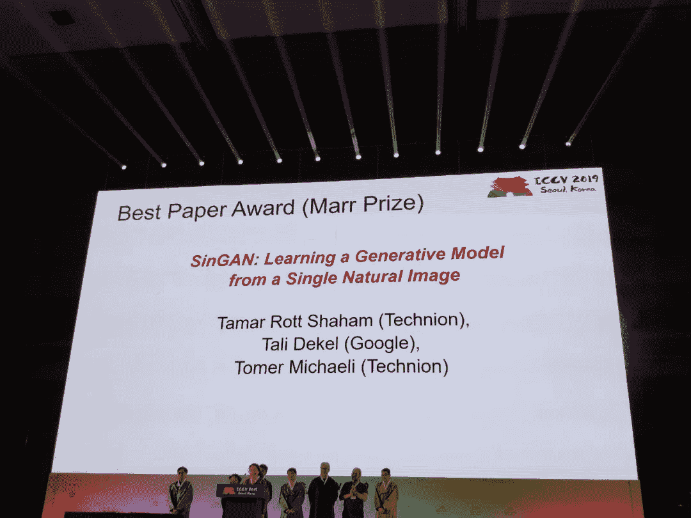
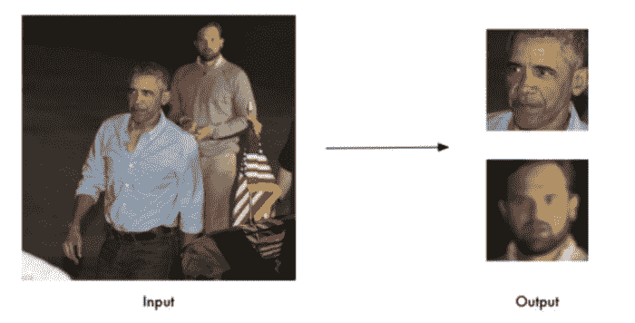
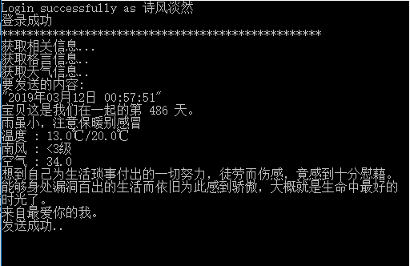

目前，国外计算机界评价学术水平主要是看在顶级学术会议上发表的论文，特别是在机器学习、计算机视觉和人工智能领域，顶级会议才是王道。本期我们盘点了2019年人工智能领域的顶会，如最核心的顶会**AAAI、IJCAI、ICCV**，以及“后起之秀”**EMNLP** 获奖的论文。此外，我们还盘点了Github上的高星项目，满满干货大合集，大家拿走不谢哦！

**AAAI 2019获奖论文**

**论文1:How to Combine Tree-Search Methods in Reinforcement Learning**

作者：Yonathan Efroni、Gal Dalal、Bruno Scherrer 和 Shie Mannor

论文地址：https://arxiv.org/abs/1809.01843

**推荐：**这篇论文获得了杰出论文奖。有限时长的前瞻策略方法在强化学习中有着广泛的应用，这类方法在实证研究中展现出了优秀的价值。通常，前瞻策略方法在应用的时候都会搭配一些具体的规划方法，比如蒙特卡洛树搜索（AlphaZero 中就是这样做的）。对于看作是树搜索的规划问题，算法实现中的一种合理做法是只在叶子节点上备份值，同时在根节点上获得的值只会用来更新策略。在这篇论文中，作者们质疑了这种方法的表现。具体来说，这种做法并不具备一般化的收缩性，也无法保证收敛。作者们提出的改进方法思路直接而且简单：用最优的树路径的返回值备份根节点的子节点的值。这会带来 γh的收缩过程，其中 γ 是折扣系数，h 是树的深度。为了表明这种方法的效果，作者们首次提出了一个名为"多步贪婪持续性"的想法。作者们编写了两个以上改进的算法实例，并在树搜索阶段和值估计阶段都注入噪声的状况下提供了收敛速率结果。

**论文2:Solving Imperfect-Information Games via Discounted Regret Minimization**

作者：Noam Brown、Tuomas Sandholm

论文地址：https://arxiv.org/abs/1809.04040

**推荐：**这篇论文获得了杰出论文荣誉提名奖。反事实后悔最小化（CFR）是一类最为火热的迭代算法，而且在实际应用中也是可以最快逼近解决大规模非完全信息博弈的方法。这篇论文中作者们提出了一种新的 CFR 变体，它的特点是：

1.  通过多种不同的方式，给较早的迭代中的后悔值打上折扣（在某些情况下，正值和负值的折扣比例会有所不同）；

2.  迭代得到输出策略的过程中，通过多种不同的方式给不同的迭代赋予不同的权重；

3.  使用了一个非标准的后悔最小化优化器；

4.  使用了"乐观后悔匹配"。

在多种设定下，这些改进都可以让方法的表现得到大幅度提高。具体来说，作者们提出的某一种变体在所有测试了的博弈中都比此前的最佳表现算法 CFR+ 表现更好，包括在一些大规模的真实设定中。而此前，CFR+ 一直是一个令人敬畏的基准模型，没有任何别的模型表现比它更好。最后作者们也展示了，与 CFR+ 不同，根据作者们提出的改进点设计的新 CFR 变体与现有的许多非完全信息博弈中的剪枝策略都是兼容的，而且其中也有一种和博弈树中的采样兼容。

**论文3:Zero Shot Learning for Code Education: RubricSampling with Deep Learning Inference**

作者：Mike Wu、Milan Mosse、Noah Goodman 和 Chris Piech

论文链接：https://arxiv.org/abs/1809.01357

**推荐：**这篇论文获得了杰出学生论文奖。在现代计算机科学教育中，大规模开放在线课程（MOOCs）在提供在线教育的同时也会记录下数千小时的学习过程，其中包括了学生如何解决编程题目的过程。既然手握这么多数据，这些平台也就引起了机器学习领域的研究人员们的兴趣，他们开发了许多新的算法，尝试以提供自动化反馈的方式帮助未来的学生们更好地学习。不过，提供了最初的几十万小时的训练数据的学生们怎么办呢？在大多数教学场景下，想要为课后作业设计监督学习系统都会遇到历史数据不足的问题。

在这篇论文中，作者们提出了一种人参与其中的"提示采样"方法，专门用来处理早期的"无样本学习"问题。对于在入门难度的编程作业中提供自动反馈的任务，相比于以往的需要数据喂养的方法，作者们提出的新方法为第一批学生们提供的反馈有显著的质量提高，而且接近了人类级别的可信度。提示采样需要老师付出的精力最小，可以提供和学生的回答的具体部分相关的反馈，而且可以使用指导者的语言指出学生的误解之处。深度学习推理的使用，让指示采样在未来有更多基于不同的作业的学生数据可用时也能发挥出更好的表现。作者们从全世界最大的编程教育平台 Code.org 采集了一个新数据集并在上面展示了方法的表现。

**论文4:Learning to Teach in Cooperative Multiagent Reinforcement Learning**

作者：Shayegan Omidshafiei、Dong-Ki Kim、Miao Liu、Gerald Tesauro、Matthew Riemer、Christopher Amato、Murray Campbell 和 Jonathan P. How

论文链接：https://arxiv.org/abs/1805.07830

**推荐：**这篇论文获得了杰出学生论文荣誉提名奖。人类个体的创新行为可以通过沟通教会别的人，人类集体智慧的提升显然从这种做法中受益匪浅。与人类社会群体类似，分布式学习系统中的智能体也许也可以从沟通中获益，可以分享知识、教授技能。此前已经有工作研究过如何通过教学的方式帮助智能体学习，但是这些方法做出的假设让它们无法在一般的多智能体问题中进行教学，又或者先需要它们要解决的问题的领域知识。这种学习教学的问题本身就有很高的复杂度，而且还要测量教学的长期影响，这在标准的多智能体协调问题上又增加了许多难度。

与现有研究不同，这篇论文首次为多智能体环境中的智慧智能体学习教学问题提出了一个通用的框架和算法。作者们提出的算法，"学习协调与学习强化"（LeCTR），针对的是合作多智能体强化学习中的点对点（peer2peer）教学。方法中的每个智能体都要学习如何指导、指导什么内容，然后使用接收到的建议改进自己的学习。重要的是，这些角色并不是固定的；智能体们会学习在不同的时间决定别的智能体是学生还是老师的角色，对应地提供指导或者接受指导，以便提高整个团体范围内的表现和学习能力。与当前最好的方法之间的比较表明，作者们提出的教学智能体不仅显著地学习更快，而且也可以在现有方法无法解决的问题中学会协调。

**论文5:Content-Boosted Collaboratie Filtering for Improed Recommendations**

作者：Prem Melville、Raymond J. Mooney 和 Ramadass Nagarajan

论文链接：

https://www.cs.utexas.edu/~ml/papers/cbcf-aaai-02.pdf

**推荐：**这篇论文获得了经典论文奖。大多数推荐系统使用协作过滤或基于内容的方法来预测用户感兴趣的新项目。虽然这两种方法各有优势，但若单独使用它们，在大多数情况下都无法提供好的建议。若将两种方法结合起来构成一个混合推荐系统，则可以克服这些缺点。在本文中，作者提出了一个漂亮且有效的框架，用于结合内容和协作。作者使用了基于内容的预测器来增强现有用户的数据，然后通过协作过滤提供个性化建议。我们的实验结果显示这种方法（内容增强的协作过滤）比纯内容预测器、纯协作过滤器或简单混合方法的性能都要更好。

**ICCV 2019获奖论文**

**论文1:SinGAN：Learning a Generative Model From a Single Natural Image**

作者：Tamar Rott Shaham， Tali Dekel， Tomer Michaeli

论文地址：https：//arxiv.org/abs/1905.01164

源码地址：

https：//github.com/tamarott/SinGAN

**推荐：**这篇论文获得了最佳论文奖。该文将GAN带入了一个新领域--从单幅自然图像中学习非条件生成模型。对单幅自然图像中的图像内部分布进行建模已被公认为是许多计算机视觉任务的有用先验，单幅自然图像通常具有足够的内部统计信息，可以使网络学习到一个强大的生成模型。作者提出了一种具有简单统一架构的模型SinGAN，能够处理包含复杂结构和纹理的普通自然图像，而不必依赖于具有同一类别图像的数据集。这是通过金字塔结构的全卷积GAN实现的，每个GAN负责捕捉不同尺度的图像分布。经过训练后，SinGAN可以以任意尺寸生成各种高质量的图像样本，这些样本在语义上类似于训练图像，但包含新的目标和结构，如下图所示。并且多种图像处理任务都可以应用SinGAN，如图像绘制、编辑、融合，超分辨率重建和动画化。

**论文2:PLMP - Point-Line Minimal Problems in Complete Multi-View Visibility**

作者：Timothy Du、 Kathlen Kohn、Anton Leykin and Tomas Pajdla

论文链接：https：//arxiv.org/abs/1903.10008

**推荐：**这篇论文获得了最佳学生论文奖。通过校准透视相机完全观察到的点和线的一般排列，作者对所有极小问题进行了完整分类。作者证明总共只有30个极小问题，对于6个以上的相机、5个以上的点以及6条以上的线，则不存在这样的问题。作者提出了一系列检测极小值的测试，这些测试从对自由度进行计数开始，到对代表性样本进行完整的符号化和数字化验证而结束。对于发现的所有极小问题，作者介绍它们的代数度，即度量其内在困难的解的数量。它显示了问题的难度如何随着视图数量的增多而增加。重要的是，几个新的具有很小代数度的极小问题可能在图像匹配和3D重建中是实用的。

**IJCAI 2019 获奖论文**

**论文1:Clause Elimination for SAT and QSAT**

作者：Marijn Heule，Matti Jrvisalo，Florian Lonsing，Martina Seidl，Armin Biere论文链接：https://www.jair.org/index.php/jair/article/view/10942

**推荐：**这篇论文获得了IJCAI-JAIR 最佳论文。这篇论文介绍了在 SAT（Boolean satisfiability，布尔可满足性）和 QBF（quantified Boolean formulas，量化布尔方程）解算器中可以作为预处理和简化方法的许多种不同的条款消除（clause elimination）过程，介绍了它们的基础结果和实际应用中的结果。自从这篇论文发表之后，论文中描述的方法对于最先进的 SAT&QBF 解算器的效率有长远、显著的影响。

**论文2:Boosting for Comparison-Based Learning**

作者：Michal Perrot, Ulrike von Luxburg

论文链接：https://arxiv.org/pdf/1810.13333.pdf

**推荐：**这篇论文获得了IJCAI 2019杰出论文(Distinguished Paper)，该论文作者来自德国马普研究所和图宾根大学。在论文中作者们提出了 TripletBoost，这是可以仅仅使用三元组比较就可以学习到一个分类器的方法。方法的关键思路是把三元组信息集聚成为较弱的分类器，然后可以把它逐步提升为一个比较强的分类器。通过实验，这种方法能够更好的抵抗噪声。

**论文3:Between MDPs and semi-MDPs: A framework for temporal abstraction in reinforcement learning**

作者：Richard S. Sutton， Doina Precup， Satinder Singh

论文地址：

https://www.researchgate.net/publication/2413902_Between_MDPs_and_Semi-MDPs_A_Framework_for_Temporal_Abstraction_in_Reinforcement_Learning?ev=auth_pub

**推荐：**这篇论文获得了AIJ 经典论文奖（The AIJ Classic Paper Award），这篇论文的第一作者 Richard Sutton 正是强化学习领域的开山人物之一。这是关于 Options（选项）的一篇精华论文，Options 是强化学习中广泛使用的一个框架，用来在不同的时间尺度、不同的抽象级别上表征动作。Options 框架影响了这个领域内后续的研究的走向，而且如今仍然定义了强化学习领域内层级式的动作、知识的表征学习是如何公式化、如何进行研究的。

**论文4:The dropout learning algorithm**

作者：Pierre Baldi，Peter Sadowski

论文链接：

https://www.sciencedirect.com/science/article/pii/S0004370214000216

**推荐：**这篇论文获得了AIJ 突出论文奖（The AIJ Priminent Paper Award）。dropout 已经成为了大规模神经网络训练时使用的一个避免过拟合的关键技巧。这篇论文中的数学分析揭露出的本质属性已经让 dropout 成为了深度学习的一个重要基石。这篇论文也和统计学领域的其它方面、和集成学习和脉冲神经元的理论建立了一些联系。

**EMNLP 2019 最佳论文**

**论文 1：Specializing Word Embeddings（for Parsing）by Information Bottleneck**

作者：Xiang Lisa Li、Jason Eisner

论文链接：

http://cs.jhu.edu/~jason/papers/li+eisner.emnlp19.pdf

**推荐：**这篇论文的两位作者都来自约翰·霍普金斯大学，其中一位是华人学者。在 11 月 7 日在香港落幕的 EMNLP-IJCNLP 2019 大会上，这篇论文荣获了本届大会最佳论文奖。

**论文 2：Loss Landscape Sightseeing with Multi-Point Optimization**

作者：Ivan Skorokhodov、Mikhail Burtsev

论文链接：https://arxiv.org/abs/1910.03867

项目地址：https://github.com/universome/loss-patterns

**推荐：**这篇出自莫斯科物理技术学院（Moscow Institute of Physics and Technology）神经网络与深度学习实验室的论文向读者介绍了多点优化在模型训练中的诸多优势。

**论文 3：Unsupervised Cross-lingual Representation Learning at Scale**

作者：Alexis Conneau、Kartikay Khandelwal、Naman Goyal、Vishrav Chaudhary、Guillaume Wenzek 等

论文链接：https://arxiv.org/abs/1911.02116

**推荐：**Facebook 这篇论文提出的 XLM-R 模型是基于 Transformer 的掩模语言模型，其在多个跨语言理解基准测试中的结果都显著优于 BERT（mBERT）。

**论文 4：Understanding the Role of Momentum in Stochastic Gradient Methods**

作者：Igor Gitman、Hunter Lang、Pengchuan Zhang、Lin Xiao

论文链接：https://arxiv.org/abs/1910.13962v1

**推荐：**这篇出自微软研究院人工智能中心（Microsoft Research AI）的论文详细探讨了随机梯度中动量参数对收敛以及不同算法中性能衡量指标的影响。

**论文 5：The Visual Task Adaptation Benchmark**

作者：Xiaohua Zhai、Joan Puigcerver、Alexander Kolesnikov、Pierre Ruyssen 等

论文链接：https://arxiv.org/abs/1910.04867

**推荐：**众所周知，图像分类领域有 ImageNet 数据集，自然语言处理领域有 GLUE 基准，这些基准在对应领域的进展中发挥了重要作用。终于，谷歌推出了视觉任务适应性领域的基准 VTAB（Visual Task Adaptation Benchmark），该基准有助于用户更好地理解哪些哪些视觉表征可以泛化到更多其他的新任务上，从而减少所有视觉任务上的数据需求。

**论文 6：The Eighty Five Percent Rule for optimal learning**

作者：Robert C. Wilson、Amitai Shenhav、Mark Straccia、Jonathan D. Cohen

论文链接：

https://www.nature.com/articles/s41467-019-12552-4

项目地址：

https://github.com/bobUA/EightyFivePercentRule

**推荐：**这是一篇发表在 Nature Communications 上的论文，详细介绍了最优学习的 85% 规则。

**论文 7：Confident Learning: Estimating Uncertainty in Dataset Labels**

作者：Curtis G. Northcutt、Lu Jiang、Isaac L. Chuang

论文链接：https://arxiv.org/abs/1911.00068

项目地址：https://pypi.org/project/cleanlab/

**推荐：**这篇出自麻省理工学院和谷歌的论文通过对分类噪声的假设对置信学习（CL）进行泛化，实现了对噪声标签和纯净标签之间联合分布的直接估计。

**Github高星项目**

**机器学习领域项目推荐**

**1、Face Recognition**

项目地址：

https://github.com/ageitgey/face_recognition

**推荐：**这是世界上最简洁的人脸识别工具。它提供对 Python 和命令行的应用程序接口（API），其用途是识别以及操作图像中的人脸。它使用 Dlib 最先进的人脸识别算法构建，该深度学习模型在 LFW（Labeled Faces in the Wild）数据集上达到了 99.38% 的准确率。它还提供了 face_recognition 命令行工具，它可以让你在包含图像的文件夹中使用命令行来进行人脸识别！

**2、fastText**

项目地址：

https://github.com/facebookresearch/fastText

**推荐：**fastText 是由 Facebook 团队开发的免费开源库，用于高效词表征学习。它是轻量级的，允许用户学习文本表征和句子分类器。它可以在标准通用硬件上运行，模型甚至可以被压缩到适应移动设备的大小。文本分类是很多应用的核心问题，例如垃圾邮件检测、情感分析或智能回复。文本分类的目标是给文档（例如电子邮件、博客、短信、产品评论等）分配多个类别。对自然语言处理（NLP）爱好者而言，这是一款非常有用的工具。

**3、Awesome TensorFlow**

项目地址：https://github.com/jtoy/awesome-tensorflow

**推荐：**这是一个帮你理解和使用 TensorFlow 的资源集合。该 repo 涵盖一系列资源列表，如很棒的 TensorFlow 实验、库和项目。TensorFlow 是 Google 开发的端到端开源机器学习平台。它有全面的生态系统，包括工具、库和社区资源，允许研究者创建最先进的机器学习算法。使用 TensorFlow，开发者可以很容易地构建并部署由机器学习驱动的应用。

**4、Apache predictionio**

项目地址：

https://github.com/apache/predictionio

**推荐：**Apache PredictionIO 是供开发者、数据科学家和终端用户使用的开源机器学习框架。用户可使用该框架构建真实的机器学习应用，并进行部署和测试。它甚至支持事件收集、评估，以及查询预测结果。它基于可扩展的开源服务，如 Hadoop、HBase 等。就机器学习而言，该工具减轻了开发人员的思维负担。

**Python 开源项目推荐**

**1、Manim - Mathematical Animation Engine**

项目地址：https://github.com/3b1b/manim

**推荐：**Manim 是解释性数学视频的动画引擎，用于以编程方式创建精确的动画。

**2、XSStrike**

项目地址：https://github.com/s0md3v/XSStrike

**推荐：**XSStrike 是一个 Cross Site Scripting 检测套件，配备四个手写解析器，一个智能有效负载生成器，一个强大的模糊引擎和一个非常快速的爬虫。

**3、如何在抖音上找到漂亮小姐姐（抖音机器人）**

项目地址：

https://github.com/wangshub/Douyin-Bot

**推荐：**使用 Python+ADB 做的 Python 抖音机器人。可以实现自动翻页、颜值检测、人脸识别、自动点赞、自动关注、随机防 Ban、自动评论等功能

**4、PythonRobotics**

项目地址：

https://github.com/AtsushiSakai/PythonRobotics

**推荐：**这是机器人算法的 Python 代码集合，尤其适用于自主导航。易于阅读并能快速理解每个算法的基本思想、选择被广泛使用和实用的算法、最低依赖性。

**5、Google Images Download**

项目地址：

https://github.com/hardikvasa/google-images-download

**推荐：**这是一个命令行 python 程序，用于搜索 Google Images 上的关键字 / 关键短语，并可选择将图像下载到本地计算机；还可以从另一个 python 文件调用此脚本。另外，这还是一个小型可立即运行的程序。如果只想为每个关键字下载最多 100 个图像，则无需安装依赖。如果你想要每个关键字超过 100 个图像，那么你需要安装 Selenium 库和 chromedriver。

**6、Python暖心微信问候**

项目地址：

https://github.com/sfyc23/EverydayWechat

**推荐：**这个项目作者使用Python做了一套自动抓取天气预报、暖心图片，鸡汤文等信息，然后定时发送微信消息给女朋友的小程序，非常适合因为加班太多而冷落了女朋友的程序员小哥哥们。

**AI黑客教程推荐**

**骇入神经网络指南**

项目地址：

https://github.com/Kayzaks/HackingNeuralNetworks

教程文章地址：

https://github.com/Kayzaks/HackingNeuralNetworks/blob/master/Article.pdf

**推荐：**在项目中，作者主要介绍了几种利用神经网络弱点对其发动攻击的方法，包括从使用神经网络的应用中找到漏洞，进行信息窃取、恶意程序注入和后门入侵等。此外还有利用深度学习训练中的内存加速，从 GPU 攻入系统的方法。项目具体分为多个章节，每个章节都提供了对应的代码和练习教程。除此以外，作者还提供了一篇文章，详细介绍了攻击原理和思路。

**深度学习项目推荐**

**一本开源的深度学习中文教程**

项目地址：

https://github.com/dragen1860/Deep-Learning-with-TensorFlow-book

**推荐：**这个中文开源项目基于 TensorFlow2.0 框架，并提供了电子版的《TensorFlow 2.0 深度学习开源书》，同时按照章节在每个文件夹中提供了源代码。你只需要下载书籍，并根据内容和源代码进行学习即可，非常适合希望了解 tf2.0 的开发者学习参考。

**算法项目推荐**

**Algorithm Visualizer**

项目地址：

https://github.com/algorithm-visualizer/algorithm-visualizer

**推荐：**这是一个名为 Algorithm Visualizer 的直观的算法可视化工具，在里面你可以自由选择自己想学习的算法，每个算法它都清晰描绘了其原理和运作过程。这款工具通过动画与代码相结合的学习方式，确实降低了开发者的理解成本，使知识更加容易吸收。目前支持的算法非常多，其中包括回溯法、加密算法、动态规划、图搜索、贪婪算法、搜索算法、排序算法等常用算法。

以上便是今日分享，觉得不错，还请点个在看，谢谢～

