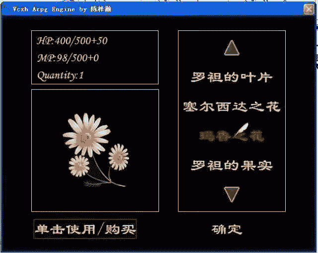
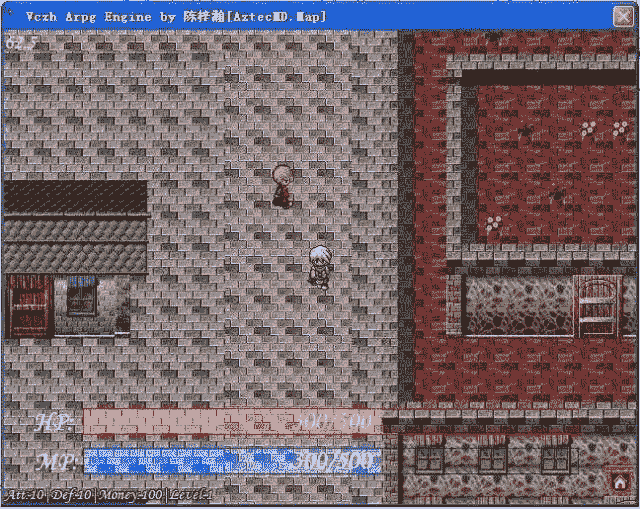
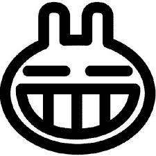
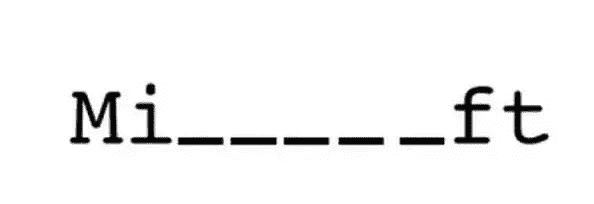
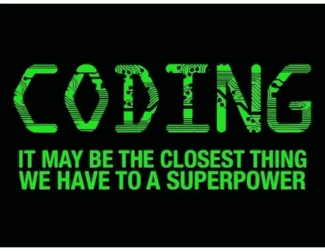
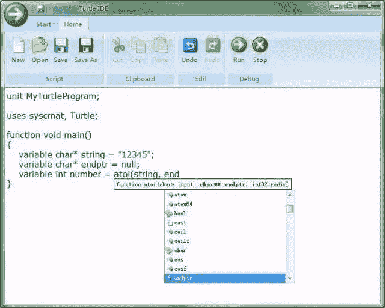

点击上方“**Datawhal****e**”，选择“星标”公众号

第一时间获取价值内容

> 作者：vczh
> 
> 来源：https://dwz.cn/sWwZoQEl

vczh，本名陈梓瀚，因知乎的个人信息介绍上写有“专业造轮子”，所以江湖人称“轮子哥”。vczh 大学时代就在微软实习，毕业后即加入微软。开始时是在微软上海，后来进入北京的微软亚洲研究院。现已移居美国西雅图，在 Office 组做工程师。

以下为轮子哥个人博客分享，关于毕业那会儿找工作的一些事情。

这篇分享我在看的时候就一直保持下颌微张目瞪口呆的状态，看了25分钟，现在嘴巴有点干，我先去喝口水，你们随意。

* * *

前些日子被华南理工大学软件学院邀请回去参加一些活动，其中包括跟一些师弟师妹们进行座谈。期间就有一个人问，要怎么样才可以去微软。其实我从来没有想过这个问题，所以那个时候的答案自然就是微软的广告（编程好，数学好，态度好）了。

09 年大四那会儿，刚好碰上了美帝的次贷危机，令我们这些想去美帝的公司被剥削的这帮人倍感艰辛。所幸后来还是过五关斩六将，最后在实习结束之后成功留了下来。这其中的因果，显然不是面试的那几天所能够决定的，因此还得从 hello world 讲起。

* * *

### **中学**

我有幸从初二开始就学习编程。那个时候世界已经处于一个现代化的程度了，操作系统都有虚拟内存，有图形界面，有因特网，开发软件还有集成开发环境可用，跟一些老前辈所描述的编译一个程序还要换几次磁盘的日子已经完全不一样了。

那个时候正值购买电脑半年，处于看见什么东西都感到十分好奇的时候，再加上**父亲那个时候不太同意我玩游戏，所以我就在想什么时候也自己做几个游戏，就可以光明正大地玩了。**

所以在听到汕头华侨中学开 Visual Basic 5.0 的课的时候，感到比较兴奋。但是其兴奋程度比起初一为了上第一节电脑课兴奋过度，骑自行车超速以至于流了一大堆血没了几颗牙的那一天，已经可以忽略了。

那个时候还是 21 世纪的第一年，正处于上网费用巨贵无比、Google 还刚起来没多久基本没人知道的时候，学习编程要比现在困难很多。**当时想寻找什么知识，因特网基本上是没什么指望的，所以我就有了一个没事去书店的爱好。**

没过多久我就找到了一本《Visual Studio 高级图形程序设计教程》。这本书我很喜欢，插图十分漂亮，而且还是使用 Visual Basic 编程绘制的，更是爱不释手。可惜内容过于高深，所以后来就有了初三的时候自学学会初步的立体解析几何，以及高三上课不听讲仅凭自己看数学分析后来还被我看明白了的故事。

中间因为试图使用编程绘制很多复杂的图形和对图像进行各种复杂的变换，于是每当写程序之前都要在纸上推导长长的公式。如果程序的运行结果不对了，根本无从调试，只好重新推导，借以希望可以发现公式的几个 bug 以解释为什么会出现错误。

从此以后我对符号运算就十分拿手。而且做数学物理作业也好，为了编程推导公式也好，需要计算的东西太多懒得到处寻找废纸，从而便获得了心算复杂过程的本领（可惜现在已经丧失了）。这顺带还给我带来了一个好处，就是高考数学选择题在发卷后不许动笔的 10 分钟内就被我全部心算出答案，而且全对了。

图形编程做久了，就想起了当初的理想，于是就搞游戏去了。那会儿看到了成都金点工作组开发的《圣剑英雄传》，点燃了我开发 RPG 的热情。在经历了几次失败之后，我终于在高二的正月初一那一天完成了《天地传》的所有编码工作，没过多久就上传到了 GameRes 的网站上。

这是我第一个行数过万的程序。为了顺利完成它，我悟到了很多道理，包括为什么要面向对象，为什么要划分模块减少互相依赖。这也成为我后来开发自绘图形界面和脚本引擎的契机。后来我试图用 OpenGL 做 3D 游戏，但是由于很难找到有共同爱好的美工跟我一起做，便作罢了。但是这却让我获得了很多时间，可以投入到图形界面和脚本引擎之中去。

后来我就萌发了解释高级语言的想法。这是我整个编程历史上的第一个转折点。那个时候我数据结构只会用链表，而且编译原理也好，设计模式也好，都还没听过。那个时候去解释高级语言自然是比较困难的。因此我经过很多天的苦思冥想自己想出了一个如今称之为一遍编译（也就是很烂）的方法来把一个简单的高级语言重新处理成一个简单的指令集语言，就跟汇编长得差不多。

那个时候已经高三了，所以其实也没多少时间可以投入在编程上面，因此做出来的第一个原型是一个简化后的 Pascal 的解释器，用 Delphi 开发的。现在想起来，里面肯定有巨多内存泄露和性能问题，不过当时根本不知道这些东西是什么。在高中毕业之后的三个月无所事事的日子里，我就重新把这个东西设计了一遍，得到了一个几十页的计划。由于后来没来得及做完，就打印出来带去了华南理工大学。

* * *

### **大学**

刚进了大学没几天，就听一个大四的师姐说我们的班主任陈健老师是教编译原理的，于是我就把这一叠纸拿给了她看。她什么也没说（现在回想起来，只能是那一份设计实在是不堪入目……），就给了我一本编译原理的课本。我很快就看完了，然后用了里面的知识做了第一个真正意义上的脚本引擎，语法山寨了 Java 语言的一些简单的部分，还添加了一个编译的时候自动把模板参数都改成 Object 类型的语法，起了个名字叫 Jove。后来上了 Java 的课，发现 Java 竟然真的这么干了，让我觉得好生奇怪。

后来我陆陆续续写了很多脚本引擎。大一的时候做的 Jove 是第一个我觉得还能见人的脚本引擎。第二个就是大二失败了一整年吸取了很多教训之后，于大三开发出的动态语言，名字叫 Free（可以在我的博客 http://www.cppblog.com/vczh 上找到）。最近正在打算将其更新到 3.0 来配合一个正在开发中的显卡加速的 GUI 类库 GacUI。接下来就是在去微软上海的 WCFTools 组实习的那一段时间里面，利用每天晚上的时间完成的一门纯函数式语言叫 KernelFP，这后来成为了我的毕业设计。

提交了毕业设计之后，我又在毕业前的几个月时间里面完成了 CMinus。这不是编译原理课程设计上的那个简单到没法再简单的 CMinus，而是一个完整的 C 语言编译器（其中函数指针的语法被我改掉了，但是仍然支持）。其编译结果是保存到内存中的一段 X86 二进制代码，可以将函数的起始地址强制转换成函数指针直接在 C++ 程序中使用，这是因为我在生成指令的时候遵守了 Visual C++ 中的一些在 MSDN 里描述得很清楚的约定。

毕业后我又雄心勃勃地做了 NativeX，是一个带泛型以及 concept mapping 的 C 语言。前几个月我又试图山寨 C#，但是无奈 C# 实在是太复杂，所以转而去做 GacUI。图形界面（GUI）类库我也写了不少。继高中的时候为 RPG 而开发的两个控件类库之后，在上大学的过程中使用 OpenGL 开发的两次 GUI 类库均告失败。后来还封装了一次 Windows 的 API（Vczh GUI），试图让其易用性接近 VCL 或 WinForm。

毕业后我又尝试发了若干次基于渲染的 GUI，换了几次架构，一直到现在正在开发的 GacUI 才感觉走上了正轨。我在这个过程中得到的一个结论就是：Windows Presentation Foundation 的设计实在是太完美了……在做这些东西之余，我还开发了三次三维物体的软件渲染程序，前两个是在毕业前做的，最后一个是一年前因为一下子不知道要如何利用业余时间来充实生活而开发出来的，目的是用于打发时间。

在这里我想可以回答一个月前不能很好地回答师弟师妹们的一个问题了。如何能够在微软找到工作？因为我把我上面做的这些东西都写进了简历。同时如果你们到了大四才来问这个，就已经太迟了……

值得一提的是，我从大三开始指导一名基础几乎是零的、比我低两个年级的软件学院的一位学生学习编程。为了让对方在接受我为期 3 年的训练之后有扎实的 C++ 基础、熟练的单元测试编写水平以及能够靠直觉给出一些不算太差的设计，我回顾了许多关于 C++ 的内容，特别是给指针的几节课备课了好几天，并且每一天都要出一个作业。在这个过程中我深刻的感觉到，如果要快速提高自己的编程水平的话，你必须总是去做一些你做得出来，但是难度大到只要再难一点点你就做不出来的事情。再这么坚持好些年之后，肯定会进入高手的行列。

因此我在安排作业的过程中，有意推迟了关于指针的内容。首先让对方接受变量和分支循环，然后要养成一个好的风格（譬如说不能老是用一个字母给变量命名之类），然后学会操作数组，接下来才是关于没有强制类型转换的指针的一些操作，并且在一个月之内做出一个带单元测试的字符串类。指针的重点是要对方深刻的理解，“指针本身就是一个指向位置的数字”这么一个概念。为此我特别设计（但没有实现）了一门只带有一个全局无限长数组的汇编语言来讲述指针背后一些复杂的概念。之后就是一些关于面向对象的知识、设计模式的知识、还有跟脚本引擎有关的一些东西。

该学生的毕业设计是一个简单的动态语言的脚本引擎，并且该脚本引擎的实现正确地运行了我在上面模仿 Linq 的一个列表处理函数库。这个实现闭包一层套一层，到处都在给一个物体添加删除函数，创建各种延迟执行的迭代器，很是能够考验一个脚本引擎的实现。对方毕业后被网易招去了，并且在待遇上给予了一些人文关怀。

自己的编程历程不仅包括自己在业余时间内做的这些程序，而且也包括在微软实习和工作的过程。高中的时候就听说了华南理工大学有微软俱乐部的事情，再加上自己对微软也持有一定的向往，因此在入学之后，除了学院的学生会以外，我就一直在密切关注着微软俱乐部的招新，并且忽略其它所有社团。不过说实话在学生会和微软俱乐部的工作也纯属打酱油，没干过什么正事儿。

大二的时候微软搜索技术中心（STC）来微软俱乐部收简历的时候，我在路上碰到了陈健老师，也就是之前提到的班主任，就跟她说了这个事情。后来由于对方说我年龄太小而作罢，因为其它人全部都是研究生。到了大三的时候，陈健老师就跟我提到她可以找老同学帮我投微软的实习简历，因此我于 2008 年 3 月份接到了微软上海的电话面试。电话面试有两次，第一次对方是一位 HR，第二次则是一位软件工程师。在第二次电话面试的过程中，我们聊了上面提到的 Free，还针对一些数据结构和框架设计的问题进行了热情洋溢的讨论。没过几天，我就收到了面试通知，前往上海闵行区的紫竹数码信息港面试。那是我人生中的第一次面试。

* * *

### **实习**

微软的面试安排精确到秒，这跟某些公司比起来要人性化许多，不会动辄浪费别人数个小时的时间。实习的面试一共有三轮，对话全部使用英语，尽管里面只有一个是外国人。我还依稀记得被那个年轻的老外面试的时候由于过于紧张，而导致一道简单的问题没有给出最优解的事情。不过他们最终还是让我进入微软位于上海的一个 WCF Tools 小组实习。

这个小组有一位让我十分尊敬的软件开发主管葛子昂先生。葛先生是一位热爱敏捷并且经常投身于实践中的人。他在我长达 4.5 个月的实习过程中，教给了我很多软件工程上的东西，而其中最重要的、让我受益匪浅的则是关于单元测试的内容。

除此之外，我也体验了快速迭代、Scrum 会议、结对编程以及基于源代码版本管理系统（我们使用的是 TFS）进行多人协作开发的流程。在经历了为 TechEd 大会修改 PetShop 制作 WCF的Demo、为 Visual Studio 2010 的 WCF 开发工具修 bug 和开发一个具有高度可扩展性的配置文件编辑器之后，我于 2008 年 12 月份结束了在微软的实习。经过了这次实习，我对源代码的掌控能力也得到了提高，并且直接体现在我利用业余时间开发的项目的代码质量上。

* * *

### **转正**

在实习结束之前，我获得了一次面试全职员工（FTE）的机会。当时形势十分严峻。2008 年美国的次贷危机于 10 月份正式影响微软上海，公司在那一段时间决定减少全职员工的招聘数量。而我是 11 月份进行转正的面试，结果这件事情令我十分紧张。后来葛先生表示他的个人建议是希望我毕业后留下来继续工作，让我吃了一颗定心丸。

实习生转全职员工的面试一共有五轮。其中令我印象非常深刻的是有一轮的面试官问了我很多非常复杂的问题，最后还考了我一道关于线索二叉树在线更新的问题，不过我已经记不清楚具体是什么内容了。我只记得我花了很长时间终于想到了一个正确的算法之后，时间就结束了，根本来不及在白板上写代码。后来我终于通过了面试，少数的几个名额里面终于被我拿走了一个。不过听说几个月后限制开始放宽，没有我面试的时候那么困难了。

在实习和面试的过程中，我觉得华南理工大学软件学院开设的很多课程其实都是十分有用的，特别是关于数据结构、设计模式和软件测试的内容。这些都是在工作中十分有用的知识，并且也需要在今后的工作中继续积累这些东西的经验。只不过因为学院学生人数众多，而一个新的学院总是免不了缺乏一些师资力量，所以我有很多同学都表示很难体会到课本中所提到内容的作用。想必如今应该比我们那几年要改善许多了。

* * *

### **Microsoft SQL Server**

面试结束到获得 offer 中间隔了几十天，最后HR的通知在除夕的那一天终于到来了。之后的半年时间我就在学校里面继续做自己的事情，偶尔参加几个活动介绍经验等等，还有就是跟一些人出去游玩。毕业后动身前往上海微软。中间发生了一些事情，因为名额变动的问题，我虽然拿的是WCF Tools的offer，但是最后却被安排到SQL Server组，在此之前我并没有收到通知。由于我比较不喜欢数据库，对SQL Server了解很浅，所以我做了一年半的SQL Server Management Studio（也就是传说中的“界面”）的开发。在这期间我跟同事们传播了一些关于单元测试、界面开发、设计模式、Linq和语法分析器的知识。

这一年半的经历让我成长了许多，主要是比起实习，正式工作的时候总是免不了经常要跟别的团队、公司、民族、国家和物种进行热情洋溢的广泛交流，而且还占用了不少的时间。有些时候还要坐飞机前往美帝，感受一下社会主义的优越性。正式软件的界面部分十分复杂，不仅要在操作系统的 DPI 变动以及本地化（大部分内容是把界面上的文字翻译成别的语言）的过程中界面的布局需要自动调整，以便不让一些文字或者按钮只显示一半，还要照顾各式各样的残疾人（特别是失去视力的人群），并且对于某些自绘的复杂内容还要提供一些运行时的接口，使得自动测试团队可以完成他们的工作。

这个经历让我感受到了开发一个严谨的界面是多么地不容易。另一个感受是关于需求变更的。设计模式的存在就是为了抵御需求变更，这个真理我直到工作之后才能明白。你必须把一个软件的架构设计得如此之好，才能在需求大规模变更之后，还能在整体上让你的代码是漂亮的、易于修改的、高性能的、并且是安全的。每一次改动都不能是打补丁，你总是需要重构来使得你的代码在任何一刻都在整体上是好的。为了达到这个目标，就需要熟练掌握并使用设计模式来开发项目。

微软的跟别的公司比起来罕有一个好处就是他会给你很多时间，让你慢慢把软件做好。而这个好的定义，当然是以功能和可维护性为重点。倘若一段代码以非常精妙的方法来高速完成一个任务，但是却复杂到哪怕写遍了注释也不能让后续维护的人看懂的话，那这段代码是没有实用价值的。一段好的代码，不在于它的设计有多么巧妙，不在于它的算法有多么高深，而在于它可以被几千个人同时开发 10 年，并且在持续添加功能的过程中，不会因为过于混乱而导致出现了重写的需要。

* * *

### **跳槽**

后来我因为一些原因申请了到微软亚洲研究院（MSRA）的人事调动。2011年1月份我在获得了经理的批准之后，从上海前往北京参加研究院的面试。这一次面试仍然有五轮。这次面试很难，其中一个面试官因为在我的简历上发现了很多跟编译器有关的东西之后，决定让我实现一个 strncpy 函数，要求是 CPU 对内存的访问次数要最少。这包含了很多诸如带宽、对齐和二进制字节位移操作等各种问题。方法本身就已经很繁琐，再加上纸上写代码总是免不了要犯错误，所以我依然没有时间把整个程序写完。另一个面试官老外在年轻的时候也做过一些编译器的事情，让我出乎意料的是他在面试的过程中没有跟我出题目，反而就编译器的各种算法和问题聊了整整一个小时，基本上我会的知识全部都因为要回答问题而说了出来。之后我跟这个人产生了深厚的友谊。

不久之后我就获得了调动的批准。在做了一些包括给上海的SQL Server团队建立单元测试标准之类的收尾工作之后，我于2011年的4月份前往北京，正式成为微软亚洲研究院的一员，做一些跟分布式系统相关的研究。

* * *

### **Microsoft Research Asia**

研究院的工作比较特殊，主要是由于我没有加入什么长期的项目，都是跟着几个 Researcher 干活。第一个项目做的主要是一个动态分析的项目，判断一个C/S架构的程序会不会死锁，以及给出一些报告，帮助程序员弄明白问题的根源，进一步修改调试自己的程序。后来就跟着他们做了一下图像搜索引擎、分布式图数据库，临走前帮他们做了几个爬虫来充实微软自己的 knowledge graph 项目的数据等等。

在研究院的这几年，其实除了增长了一些技术上的见识，和学会了如何成为一个老油条以外，技术上主要的成长仍然来源于自己开发的 项目。研究院的结构是非常适合我这种喜欢把玩复杂（但不一定是新）技术程序员的。而且我在研究院的直属老板还是邹欣，让我深刻的明白了一位好的领导是多么的重要。

已经写了四年半了。写 GacUI 的初衷是，想给自己的语言做 IDE，但是只有 C++ 写parser才写的爽，之前又试验过 C# 写 UI，C++ 写智能提示算法的项目。

后来我干脆就想，要是整个都能用 C++ 来写多好啊。但是 C++ 的 GUI 库对 MVVM 的支持都是垃圾，于是就有了 GacUI。但是做一个 GUI 库工作量实在是有点大，我又追求要有良好的开发体验，因此就做了这么久。今年应该可以出 1.0 了……

通过开发 GacUI，不仅理顺了之前那么多年做的 7 个天国的 GUI 库的经验教训，还学会了如何最小代价开发跨平台的客户端程序。其实写一个跨平台的程序一点都不难，不知道为什么网上有那么多人搞的鸡飞狗跳。GacUI 给我带来的另一个好处是，基本全部复习了一遍设计模式的内容，而且由于体积庞大，我还弄了一个专门在不同 git repo 之间实现偏序依赖的小工具——用来把一整个 repo 下的 C++ 代码打包成两个文件，以便于其它repo直接使用。本来想试试 submodule 的，无奈 submodule 只能实现树形依赖，实在太烂。

GacUI 最后还复习了之前学过的编译原理的内容。因为 GacUI 在编译 XML 的过程中，实际上是把所有的东西都翻译成了一个脚本引擎的字节码，最后要么直接运行这个脚本，要么把脚本翻译成 C++（正在开发）。因此为了实现这一点，写一个编译器在所难免，而且编译出来的东西还要能跟 C++ 那边的类相互沟通，从而又复习了一遍 COM 的内容（尽管我并没有使用它，我只是尝试做了一个一样的东西）。

等 C++ 生成搞定之后，我就要继续写去年就开始的 GacJS了，把 GacUI 搬上浏览器，全方位运行我的 IDE。适合使用 C++ 的那些领域真是博大精深啊。

* * *

### **出国**

不得不说，当初由于不喜欢数据库所以跳槽到了研究院，结果研究院看我是从 SQL Server来的，弄了很多数据库的东西给我做。后来我找了老板说能不能弄点别的啊？老板问我那你想做什么，我说弄点编译器的东西试试？于是老板后来安排我给另一帮研究院，替他们做一个分布式图数据库的 query language。不过这种东西本来就是超级简单的，很快弄完之后，我又变成做数据库的了。于是这让我明白了一个道理，多半研究院是没有我喜欢的东西的了。

于是又过了一些年，由于我对北京（主要）和研究院（次要）的不慢逐渐增加，于是我赶紧弄了个老婆之后，就触过了。

其实跟普通的面试是一样的：

*   找到你想要去的组

*   联系他的老板，把简历给他

*   看他是否因为经济危机或者收购案件什么的，正在裁员或者无法招人

*   然后面试

*   拿 offer（这是肯定的）

*   办签证

这个过程让我不由得感叹，美帝的面试官就是没有见过世面啊。竞争压力太小了，搞出来的题目都超级容易，得让他们来中国呆一呆，面一面，不然美帝迟早药丸。不过我觉得另一个方面是，我给 Office 做跨平台 GUI 的那个组看了一下我做的 GacUI，估计他们觉得还不错吧，就随便面了一下我，这也是有可能的。

在这里不得不提到微软照顾员工真是无微不至，不仅帮我提供优质的搬家服务，在我到了美帝之后还给我安排了一位大妈，负责帮我融入现代社会。还说如果我觉得自己牛逼不需要这些东西，就给我两万刀。这些就算在谷歌，也只有被公司强行安排到美帝（而不是员工自己想出国）的那些人才有。最重要的是，微软员工买 BMW 还能打折，真开心。

虽然牛逼的人在中国和美帝拿的工资并没有太大差距，但是撇去美帝的IT地区跟北上广相似的房价以外，美帝除了汽车和电器的其他东西贵得一逼啊，总体来讲幸福感还是下降了。不过幸好中国IT发达地区空气污染太严重，不仅抵消了这个缺点，反而让我觉得穷一点过得更爽了。于是自从翻了墙，每天就过着再也没空把玩电子产品的日子，有空就开车，没空就上班，爽的不行。

果然站在风口猪都会飞啊。明明其它行业的工资中国比美帝低那么多，但是程序员居然只有1-3 倍的差距。果然中国还是需要大量的、专门训练来添补社会主义发展过程中的缺口的、专业的程序员的。

* * *

### **Microsoft Office**

这次跳槽刚好遇到了微软要开除诺基亚的人，搞到大部分的组都冻结名额了，只有财大气粗的Office能招人，因此我也就只能来Office了。本来我的目标是想给Edge弄JS引擎，或者去VS组搞搞编译器什么的，无奈他们都太穷了，只好作罢。

在Office的工作让我大开眼界，算是体验了一把一万个人写了三十年的、一个repo的snapshot就有几百G代码的软件是怎么弄出来的。由于机器实在太贵，所以平时修改代码的时候，只能在本机编译，因此我们基于msbuild弄出来的这套CI，还包含了如果需要链接的lib/dll的代码在硬盘里面没有的话，就去服务器找当前checkpoint的编译好的缓存，下载下来编译的功能。因此偶尔build farm挂掉的那几天，由于网络连接断了，本机编译也没办法弄。

* * *

### **尾声**

回顾一下自己的编程之路，学生时期大概就是从一开始写游戏，到写游戏引擎，到专门搞游戏引擎需要的图形、GUI 库和脚本引擎，最终由于精力的关系生下了 GUI 库和编译器。我从一开始设计脚本引擎的时候就很注意脚本如何暂停的问题——其实基本就是源自于游戏的需要——于是人肉做了 coroutine 的各种奇怪的实现方式。到了最后终于学习到了正统的方法，于是本来可以很简单的完成的问题，由于后来需求就是复杂了那么一丁点（说白了就是要让脚本也可以 customize（或者说 hack）coroutine 相关的类型系统的一部分内容），导致了需要用无限复杂的方法来实现 coroutine。人类为什么要互相伤害？

到了工作，基本就是

*   本来冲着去弄 Visual Studio 的，而且学生时期还不喜欢 SQL，结果工作的时候由于经济危机的关系给我弄到 SQL 去了，工作的内容包含了学习专业的数据库知识和拖控件。

*   但是我做了几年还是觉得不喜欢 SQL，就跳槽到了 MSRA，结果 MSRA 拼命让我搞数据库的东西。也不想想本来我就是不喜欢弄这个才走的……

*   后来我想好吧，反正编译器没得搞了，那我还是拖控件吧。于是我就告诉Office的人说，你看我做 GacUI 多屌不屌！Office 的人说，屌！于是把我招了进来，专门负责组里面不是 GUI 的那部分。

*   过了半年老板开始安排工作了，我想了个办法表达了一下我还是喜欢弄别的东西。于是终于干起了老本行——给Office的程序员开发内部的编译器了。

总算最后还是做了喜欢的工作。

* * *

看完轮子哥的分享你有什么样的想法呢，欢迎在评论区留言讨论～

