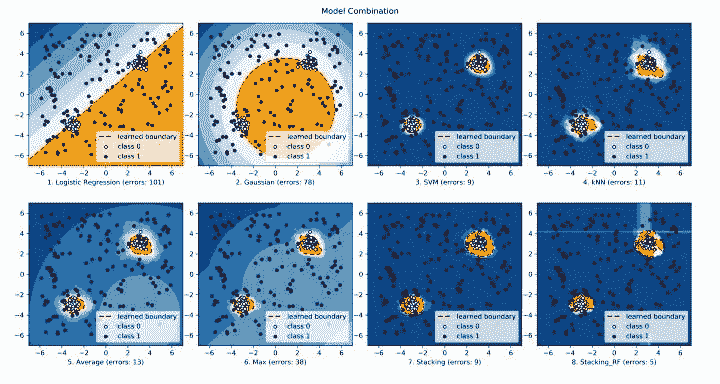

点击上方“**Datawhal****e**”，选择“星标”公众号

第一时间获取价值内容


机器学习中的模型合并（model combination）可以通过**合并多个模型达到提升性能与稳定性的目的**。模型合并往往被认为是集成学习（ensemble learning）的一个子领域，但其实也可以被单独拿出来讨论，作为一项实用的性能提升的手段。**在绝大部分的机器学习/数据挖掘竞赛中（比如Kaggle），最终获胜的方案都是多个模型的合成体。**除此之外，模型合并也常被用于减少数据和模型中的随机性，提高模型的稳定性，详情可以参考：「大部分机器学习算法具有随机性，只需多次实验求平均值即可吗？」

为了方便大家对机器学习模型进行合并，我最近开发了一个新的Python工具库「combo」，起这个名字是因为combo代表“点套餐” ，与我们的目的不谋而合 :) combo有以下特点：

*   **包括多种合并方法**，从最简单的平均到在Kaggle中常见的Stacking，再到更复杂的Dynamic Classifier Selection（动态分类器选择）。

*   **支持多种不同的场景**，包括分类器合并，原始结果（raw score）合并，聚类合并（对聚类结果进行合并），异常检测器（outlier detector）合并。未来或许会支持更多不同的场景。

*   **简单易用且一致的API，只需要几行代码就可以完成模型融合**，方便评估大量算法。

*   全面的文档，详细的示例。每个模型都搭配相对应的支持文件，方便学习与使用。

*   **使用JIT和并行化（parallelization）进行优化**，加速算法运行及扩展性（scalability），可以处理大量数据。

*   **支持Python 3.5+及主流操作系统**：WIN，macOS和Linux，使用CI工具保证代码稳定性。

combo工具库的论文已经被AAAI 2020 demo track paper接收，欢迎来poster session来与我们互动。

## **1\. 工具库概览**

combo正处于开发期正处于开发期，现阶段提供了约十余种各类模型/分数合并方法（详见下图），算法介绍可以参考文档中附带的参考文献。同时该工具库也包含了一系列辅助功能，包括数据可视化及对结果进行评估等。


工具库相关的重要信息汇总如下：

*   **Github地址：**
    https://github.com/yzhao062/combo

*   **PyPI下载地址：**
    https://pypi.org/project/combo/

*   **文档与API介绍（英文）：**
    https://pycombo.readthedocs.io/en/latest/

*   **AAAI论文： **
    http://www.andrew.cmu.edu/user/yuezhao2/papers/20-aaai-combo.pdf

combo提供两种非常简单的安装方法。我个人推荐使用pip进行安装：

> pip install combo

## **2\. API介绍与实例（API References & Examples）**

combo的使用方法和Sklearn很像，绝大部分模型有统一的API。完整的API使用参考可以查阅：

https://pycombo.readthedocs.io/en/latest/api.html#all-models

核心的API只有三个：

*   **fit(X)**: 用数据X来“训练/拟合”模型clf。即在初始化clf后，用X来“训练”它。

*   **predict(X)**: 在模型clf被fit后，可以通过该函数来预测未知数据的标签。

*   **predict_proba(X)**: 在模型clf被fit后，预测未知数据属于不同类的概率。

使用其中的算法也很简单，可以参考每个算法对应的例子，所以示例（example）都可以在「示例文件夹」中找到并直接运行，比如Stacking算法的对应例子就叫做classifier_lscp_example.py，非常容易找到。也可以直接从帮助文档中参考示例。

以Stacking模型为例（Stacking可以参考知乎上的文章[1][2]以及Kaggle文章[3]），使用combo，API示例如下：

```
`from combo.models.stacking import Stacking``# 初始化基学习器，包括决策树，K近邻等``classifiers = [DecisionTreeClassifier(), LogisticRegression(),` `KNeighborsClassifier(), RandomForestClassifier(),` `GradientBoostingClassifier()]``clf = Stacking(base_estimators=classifiers)  # 初始化Stacking模型``clf.fit(X_train, y_train) # 拟合训练数据``# 对未知数据进行训练``y_test_labels = clf.predict(X_test)  # 标签预测``y_test_proba = clf.predict_proba(X_test)  # 概率预测`
```

不难看出，**combo的API和scikit-learn非常相似，只需要几行就可以训练并在新数据上进行预测。**

## **3\. 一点关于模型集成的观察**

模型集成到底有多大用，我给大家提供了两个小案例。使用compare_selected_classifiers.py里面的代码，我们先初始化了4个分类器（逻辑回归、高斯朴素贝叶斯、SVM和k近邻），并对比单独使用分类器和合并模型后的结果。下图中上四幅图为单独分类器，下面四幅图为四种模型合并后的结果。

 combo示例

不难看出，合并后的模型的decision boundary有了显著不同，且模型表现得到了显著提高。因此模型合并是一项非常有效且易行的处理方法，值得大家尝试！

## **4\. 未来计划**

现阶段combo正处于火热的开发过程中，除了添加更多的模型外。很多后续功能会被逐步添加，比如：

*   支持GPU运算

*   支持conda安装

*   增加中文文档

和以前开发过的PyOD工具库一样，我们也会在合适的时候把相关论文发到Journal of Machine Learning Research (JMLR)上，以吸引更多的用户关注 :)

总结来看，combo或许会成为一款流行的机器学习模型合并工具库。建议大家尝试、关注并参与到combo的开发当中。有鉴于功能可能会不断更新，请以GitHub版本为准。

引用PyOD非常方便，可参考如下：

```
 ```
Zhao, Y., Wang, X., Cheng, C. and Ding, X., 2020\. Combining Machine Learning Models and Scores using combo library. Thirty-Fourth AAAI Conference on Artificial Intelligence.
``` 
```

或者

```
 ```
@inproceedings{zhao2020combo, title={Combining Machine Learning Models and Scores using combo library}, author={Zhao, Yue and Wang, Xuejian and Cheng, Cheng and Ding, Xueying}, booktitle={Thirty-Fourth AAAI Conference on Artificial Intelligence}, month = {Feb}, year={2020}, address = {New York, USA}}
```

[1] https://zhuanlan.zhihu.com/p/27493821

[2] https://zhuanlan.zhihu.com/p/26890738

[3] http://blog.kaggle.com/2016/12/27/a-kagglers-guide-to-model-stacking-in-practice/-in-practice/

 
```