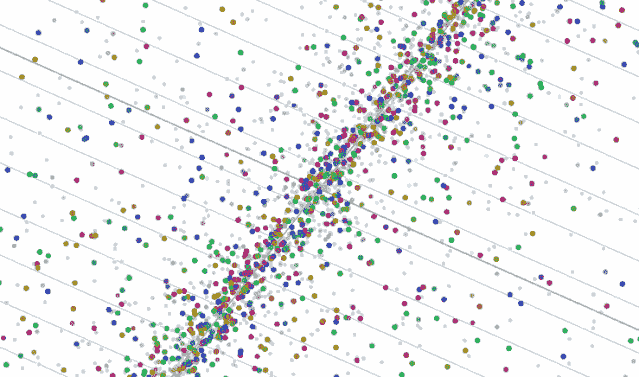
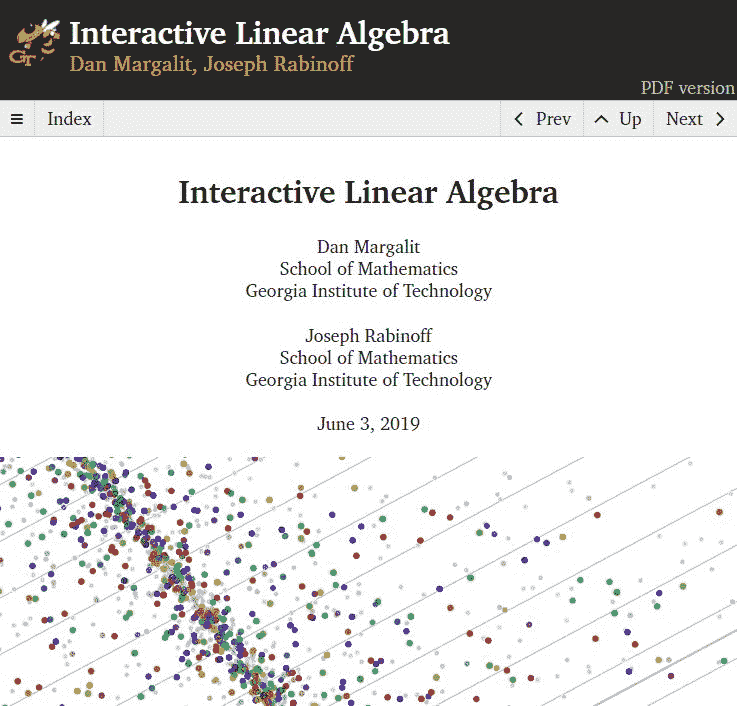
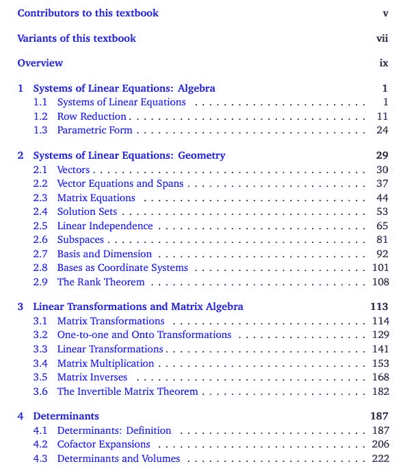
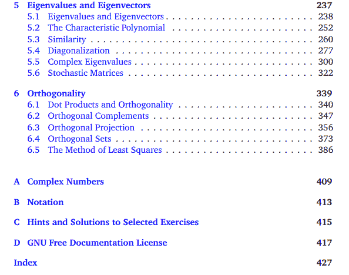
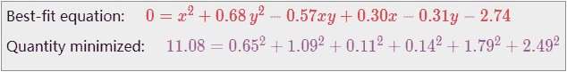
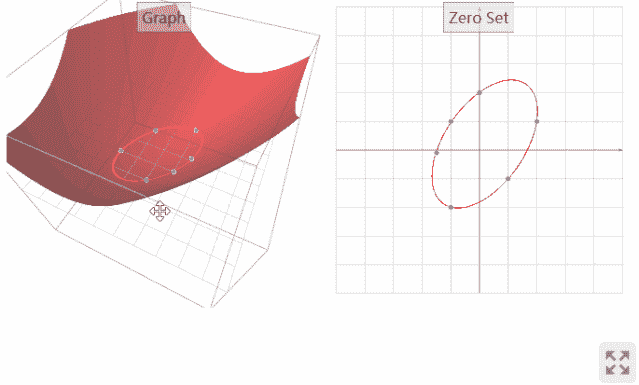
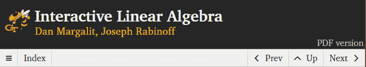
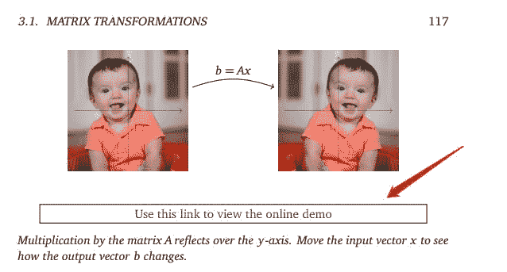
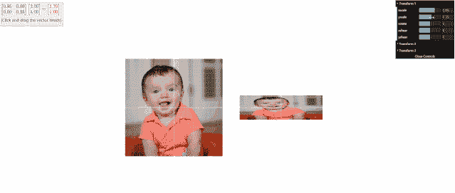

线性代数是机器学习的基础，也是重难点。而一般线性代数教程大多是是枯燥乏味的。今天给大家带来一份《交互式线性代数》教程。它的最大特点就是“交互式”。

这份线性代数教程有在线版，网址为：

http://textbooks.math.gatech.edu/ila/index.html

## 教程概述

《交互式线性代数》的作者有两位：Dan Margalit 和 Joseph Rabinoff，均来自乔治亚理工学院的数学学院。教程完结于 2019 年 6 月 3 日，可以说是比较新的了。

《交互式线性代数》总共包含了 6 章内容，涵盖了线性代数的核心知识。详细目录如下：

## **交互式体验**

这份教程最大的特点就是交互式体验。主要目的是为了丰富读者对每个线性代数主题的理解。整个教程包含 140 多个交互式演示，这些演示是为了演示主题的几何结构而创建的。可以直接点击“在新窗口中查看”链接，一起互动演示！

下面是第 6.5 节的演示：

如上面的动态图所示，左图可以切换不同视角，查看三维图形；右图可以改变坐标点的位置，从而改变曲面形状。

## **离线 PDF 教程**

《交互式线性代数》除了可以在线阅读之外，作者还提供了离线 PDF 版，在主页右上角即可点击查看并下载。

PDF 版本虽然不能像在线阅读一样查看动态显示。但是对应在线教程的相应部分的知识点也是可以进行交互式体验的。在 PDF 对应位置都配备了相应的按钮，点击即可跳转到网页进行交互式的操作。

例如 3-1 节：

这部分是一个简单的矩阵变换的操作，目的是将上图左边的图像经过矩阵变换成右边的图像。下面，点击“Use this link to view the online demo”，可以在线手动调试矩阵。

展示效果：

查看上面的动态图可以发现，通过手动调整右上角的 xscale、yscale、rotate、xshear、yshear 等参数，可以随时调整变换后的图片。同事，左上角的变换矩阵也改变了。

离线 PDF 电子版下载地址：

http://textbooks.math.gatech.edu/ila/ila.pdf

## **源码**

这份《交互式线性代数》在线网页，作者开源了所有代码，并发布在 GitHub 上。你可以修改程序中的源代码，实现更加个性化的体验。不过一般可能用不到。

GitHub 源码地址：

https://github.com/QBobWatson/gt-linalg

**Dtawhale高校****群和在职群已成立**

扫描下方二维码，添加**负责人微信**，可申请加入AI学习交流群（一定要备注：**入群+学校/公司+方向****，**例如：**入群+浙大+机器学习**）

▲长按加群

