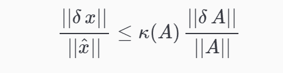

多重共线性是使用线性回归算法时经常要面对的一个问题。在其他算法中，例如决策树和贝叶斯，前者的建模过程是逐步递进，每次拆分只有一个变量参与，这种建模机制含有抗多重共线性干扰的功能；后者干脆假定变量之间是相互独立的，因此从表面上看，也没有多重共线性的问题。但是对于回归算法，不论是一般回归，逻辑回归，或存活分析，都要同时考虑多个预测因子，因此多重共线性是不可避免需要面对的，在很多时候，多重共线性是一个普遍的现象。在构造预测模型时如何处理多重共线性是一个比较微妙的议题。既不能不加控制，又不能一刀切，认为凡是多重共线性就应该消除。

## 1、共线性的原理

假设有k个自变量的多元线性回归模型：


其中误差项是一个期望值为0且服从正态分布的随机变量：


则利用最小二乘法可得参数的估计值为：


该求解公式唯一的条件是矩阵X是列满秩的，不然会有无穷多解：


当各变量之间存在共线性问题，即各变量之间存在部分线性相关时，例如：


易知此时X近乎是不满秩的（实际情况很难完全共线性），X^TX近乎是奇异的，X的最小奇异值会非常小，那它的影响到底有多大呢？我们先从**矩阵计算**的角度来看。

### 1.1 扰动分析

对于一个方程或者系统而言，当输入有一个非常微小的扰动时，我们希望方程或系统的输出变化也非常微小，如果输出的变化非常大，且不能被控制，那这个系统的预测就无效了，蝴蝶效应讲的就是这个。在矩阵计算中，这叫做**扰动分析**。

* * *

【**扰动分析定理**】设非奇异方阵A满足方程


它的精确解为x* ，当A存在一个小扰动时，假设 $\hat{x}$ 是新方程的解：


可以证明x*  的扰动满足：



可以看到矩阵的条件数越大，扰动就越大，即x的求解值会变得非常不准确。回到上面讲的线性回归问题，容易证明最小二乘法的解满足下面的正定方程：


此时


当方程有共线性问题时，X的最小特征值非常小，相应的，上述的条件数会非常大。也就是说机器学习中的共线性问题实际上就是矩阵计算中的条件数问题。

*从实际应用的角度，一般若K<100，则认为多重共线性的程度很小，若是100<=K<=1000，则认为存在一般程度上的多重共线性，若是K>1000，则就认为存在严重的多重共线性。*

### 1.2 方差分析

再从统计学的角度来看共线性。可以证明参数的协方差矩阵为


又对任意的常数矩阵A和随机变量x有


代入上式即可得


具体到每个参数，有：


其中是将第i个变量作为因变量，其他k-1个变量作为自变量进行线性回归获得的，且令


为**方差膨胀因子**(variance inflation factor，VIF)。当


时，即当第i个变量和其他变量之间存在线性关系时，VIF趋于无穷大。所以 VIF 的大小反应了变量的共线性程度。一般地，当VIF大于5或10时，认为模型存在严重的共线性问题。

同时考虑参数显著性检验的 **t 统计量**：


当存在共线性时，参数的标准差偏大，相应的 **t 统计量** 会偏小，这样容易淘汰一些不应淘汰的解释变量，使统计检验的结果失去可靠性。

另外考虑线性回归的残差


其中M是一个投影矩阵，且满足


易证明


而矩阵M的范数与X的条件数毫无关系，于是可以得出**共线性并不影响模型的训练精度**。但是对于泛化精度，由于参数的估计已经不准确啦，所以泛化误差肯定要差些，具体差多少，我还很难用公式表示出来。

总结一下，共线性问题对线性回归模型有如下影响：

*   参数的方差增大；

*   难以区分每个解释变量的单独影响；

*   变量的显著性检验失去意义；

*   回归模型缺乏稳定性。样本的微小扰动都可能带来参数很大的变化；

*   影响模型的泛化误差。

* * *

## 2、共线性问题的解决方法

根据上一节的描述，共线性问题有如下几种检验方法：

*   **相关性分析**。检验变量之间的相关系数；

*   **方差膨胀因子VIF**。当VIF大于5或10时，代表模型存在严重的共线性问题；

*   **条件数检验**。当条件数大于100、1000时，代表模型存在严重的共线性问题。

当变量数不多，样本数不是很大时，上述的方法是没问题的，检验某个变量有共线性问题时，可以结合实际业务考虑直接剔除该变量。但是有的时候变量数大到有上千个，VIF的计算需要建立上千个回归模型（条件数仅能判定是否存在共线性，但不能找到对应的变量），这将耗费很长时间。

事实上我们可以从模型角度来直接规避共线性问题。

### 2.1 PCA等降维法

主成分分析法作为多元统计分析的一种常用方法在处理多变量问题时具有其一定的优越性，其降维的优势是明显的，主成分回归方法对于一般的多重共线性问题还是适用的，尤其是对共线性较强的变量之间。当采取主成分提取了新的变量后，往往这些变量间的组内差异小而组间差异大，起到了消除共线性的问题。

### 2.2 逐步回归法

逐步回归（Stepwise Regression）是一种常用的消除多重共线性、选取“最优”回归方程的方法。其做法是将逐个引入自变量，引入的条件是该自变量经F检验是显著的，每引入一个自变量后，对已选入的变量进行逐个检验，如果原来引入的变量由于后面变量的引入而变得不再显著，那么就将其剔除。引入一个变量或从回归方程中剔除一个变量，为逐步回归的一步，每一步都要进行F 检验，以确保每次引入新变量之前回归方程中只包含显著的变量。这个过程反复进行，直到既没有不显著的自变量选入回归方程，也没有显著自变量从回归方程中剔除为止。

*   **第一**：建立全部变量的回归方程

*   **第二**：分别建立单独的回归方程，依照t检验和拟合度依次加入各变量来构建回归方程

*   **第三**：判断新引入的变量，对于之前的系数影响是否显著，是否符合实际以及对于拟合度的变量，来选择是否将变量引入模型中。

### 2.3 岭回归、L2正则化(ridge regression)

岭回归是一种可用于共线性数据分析的有偏估计回归方法，它是一种改良的最小二乘估计法，通过放弃最小二乘法的无偏性，以损失部分信息、降低精度为代价获得回归系数更为符合实际、更可靠的回归方法，对条件数很大（病态数据）的拟合要强于最小二乘法。

在线性回归问题中，最小二乘法实际上是最小化问题：


而岭回归则是加入了L2惩罚项：


这样参数的方差不会过大，且随着惩罚项系数C的增大，共线性的影响将越来也小。在这个过程中，可以记录  (岭迹)的变化情况，通过对岭迹的波动来判断我们是否要剔除该变量。

那为什么说岭回归能解决共线性问题呢？从矩阵计算的角度来看，L2正则化下方程的解为：


在上一节我们讲到共线性代表正定矩阵X^T^X的条件数很大:


而当条件数很大时，矩阵的逆的数值计算也是非常不准确的，但是当我们给矩阵加上一个单位矩阵时，奇异性（不可逆）问题就完全没有啦。

进一步考虑对惩罚项对奇异值的影响，假设X的奇异值（SVD）分解为：


则容易证明


其中D是对角矩阵，且满足


其反应了惩罚项是如何影响到条件数的。

### 2.4 LASSO回归

LASSO回归和岭回归类似，只不过将惩罚项由L2范数改为了L1范数


L1范数没有L2范数那么圆润，毕竟存在不可导点，而且在L1范数下LASSO回归也给不出解析解啦，但是相对于岭回归，LASSO估计的参数能更容易收敛到0

### 2.5 ElasticNet回归等

ElasticNet回归同时兼顾了L1和L2惩罚项：


当许多变量是相关的时候，Elastic-net是有用的。Lasso一般会随机选择其中一个，而Elastic-net则会选在两个。

除此之外，还有L0范数（非零元的个数）、L1/2范数等。

## 3、Python实践

首先捏造一份好的数据，样本量为100，特征数为8，且满足方程：


其中误差项是期望为0，标准差为1.5的正态分布随机变量。

```
`import numpy as npfrom sklearn.linear_model import LinearRegressionfrom sklearn import cross_validation

coef0=np.array([5,6,7,8,9,10,11,12])
X1=np.random.rand(100,8)
y=np.dot(X1,coef0)+np.random.normal(0,1.5,size=100)
training=np.random.choice([True,False],p=[0.8,0.2],size=100)
lr1=LinearRegression()
lr1.fit(X1[training],y[training])# 系数的均方误差MSEprint(((lr1.coef_-coef0)**2).sum()/8)# 测试集准确率（R2）print(lr1.score(X1[~training],y[~training]))# 平均测试集准确率print(cross_validation.cross_val_score(lr1,X1,y,cv=5).mean())`
```

此时平均准确率为0.934955，拟合的系数MSE为0.203657

然后我们基于这份数据另外构造出两份数据，第二份数据增加两个随机的特征用作对比，第一份数据则增加两个共线性特征：


```
`X2=np.column_stack([X1,np.dot(X1[:,[0,1]],np.array([1,1]))+np.random.normal(0,0.05,size=100)])
X2=np.column_stack([X2,np.dot(X2[:,[1,2,3]],np.array([1,1,1]))+np.random.normal(0,0.05,size=100)])
X3=np.column_stack([X1,np.random.rand(100,2)])`
```

先来看下它们的条件数

```
`>>>print(np.linalg.cond(X1))
>>>print(np.linalg.cond(X2))
>>>print(np.linalg.cond(X3))6.29077685383110.9306124087.25066276479`
```

可以看到X2的条件数很搭，最小奇异值为0.213，此时还不至于完全共线性。

拿这两份数据重新用线性回归拟合模型。

```
`lr2=LinearRegression()
lr2.fit(X2[training],y[training])# 系数的均方误差MSEprint(((lr2.coef_[:8]-coef0)**2).sum()/8)# 测试集准确率（R2）print(lr2.score(X2[~training],y[~training]))# 平均测试集准确率print(cross_validation.cross_val_score(lr2,X2,y,cv=5).mean())

lr3=LinearRegression()
lr3.fit(X3[training],y[training])# 系数的均方误差MSEprint(((lr3.coef_[:8]-coef0)**2).sum()/8)# 测试集准确率（R2）print(lr3.score(X3[~training],y[~training]))# 平均测试集准确率print(cross_validation.cross_val_score(lr3,X3,y,cv=5).mean())`
```

对于第二份共线性构造数据X2，有平均测试集准确率为0.932070，拟合的参数MSE为7.697837。可以看到MSE增加了很多，准确率也下降了0.2%，测试拟合的系数为：

```
`>>>print(lr2.coef_)
[ 10.506618    11.467777     6.35562175   7.56698262   9.44509206
   9.81032939  11.66187822  12.29728702  -5.07439399   0.02649089]`
```

在来看对比用的数据X3，其平均测试集准确率为0.934952，参数MSE为0.171651，与X1无异。

以上是直接的结果，我们再来看VIF

```
`import matplotlib.pyplot as plt
vif2=np.zeros((10,1))for i in range(10):
    tmp=[k for k in range(10) if k!=i]
    clf.fit(X2[:,tmp],X2[:,i])
    vifi=1/(1-clf.score(X2[:,tmp],X2[:,i]))
    vif2[i]=vifi

vif3=np.zeros((10,1))for i in range(10):
    tmp=[k for k in range(10) if k!=i]
    clf.fit(X3[:,tmp],X3[:,i])
    vifi=1/(1-clf.score(X3[:,tmp],X3[:,i]))
    vif3[i]=vifi  
plt.figure()
ax = plt.gca()
ax.plot(vif2)
ax.plot(vif3)
plt.xlabel('feature')
plt.ylabel('VIF')
plt.title('VIF coefficients of the features')
plt.axis('tight')
plt.show()`
```

可以看到第0、1、2、3、8、9个特征的VIF都过高。且可以看出第1个特征相对第0、2、3个特征的VIF较高。

最后我们试着用模型的方法来检测共线性问题

```
`from sklearn.linear_model import Ridge
plt.figure()
n_alphas = 20alphas = np.logspace(-1,4,num=n_alphas)
coefs = []for a in alphas:
    ridge = Ridge(alpha=a, fit_intercept=False)
    ridge.fit(X2, y)
    coefs.append(ridge.coef_)
ax = plt.gca()
ax.plot(alphas, coefs)
ax.set_xscale('log')
handles, labels = ax.get_legend_handles_labels()
plt.legend(labels=[0,1,2,3,4,5,6,7,8,9])
plt.xlabel('alpha')
plt.ylabel('weights')
plt.title('Ridge coefficients as a function of the regularization')
plt.axis('tight')
plt.show()`
```

其中当alpha取0.1时，岭回归估计的系数分别为

```
`>>>print(coefs[0])
[  2.70748655   0.95748918   3.53687372   5.2073456    8.70186695
   9.84484102  10.67351759  11.74614246   2.46502016   3.19919212]`
```

可以看到第0、1、2、3、8、9个变量都出现了波动，代表它们之间存在一定的共线性。观察岭迹，我们可以考虑剔除其中波动比较大的第1、8、9个变量。

另外Lasso回归类似，可以用sklearn中的linear_model.Lasso来学习，这里就不展示了。最后对于逻辑回归任务，sklearn函数内部提供了L1或L2正则化方案，通过它们也可以去检测共线性问题。

## 参考文献

[1]. variance inflation factor  https://en.wikipedia.org/wiki/Variance_inflation_factor

[2]. 多重共线性的解决方法之——岭回归与LASSO  http://blog.csdn.net/liunian920305/article/details/73456741

[3]. ridge regression https://en.wikipedia.org/wiki/Tikhonov_regularization

