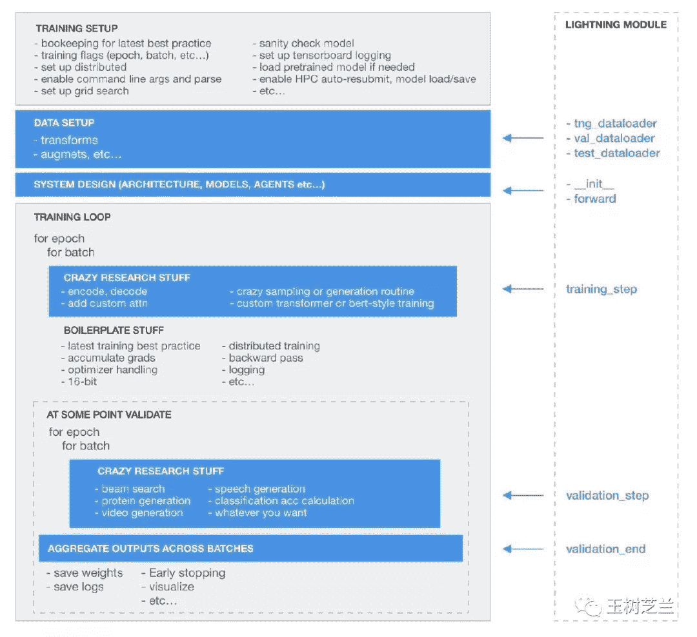
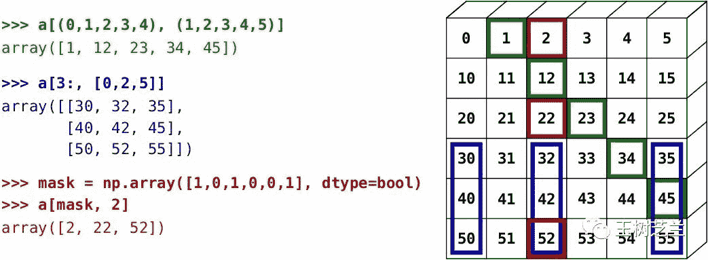

王树义

读完需要

15

分钟

速读仅需5分钟

PyTorch 入门，坑着实不少。咱们来谈谈，如何选个合适的教程，避开它们。

***1***

**选择**

好几位读者，都留言问我：

王老师，我想学深度学习，到底是该学 Tensorflow ，还是 PyTorch？

没有水晶球，我也不知道谁会最终胜出。

从现状来看，PyTorch 的发展势头非常迅猛。在深度学习的顶会上，相关论文增速大幅超越 Tensorflow 。

Javaid Nabi 总结了一张最近两年 arxiv 机器学习论文中提及 PyTorch 的折线图，增长趋势一目了然。

在机器学习顶会 NeurIPS 2019 上，PyTorch 更是被单独拿出来讨论。

底下的听众，是这样的。

而另一边，Google 的 Tensorflow 2.X 版本，在 Reddit 上正被吐槽和围观。

如果你是个应用机器学习前沿技术的研究者，却还对 PyTorch 的存在熟视无睹，恐怕不是一个明智的选择。

你该依赖的，是深度学习研发领域的生态系统。具体的原理，我在《[学 Python ，能提升你的竞争力吗？](http://mp.weixin.qq.com/s?__biz=MzIyODI1MzYyNA%3D%3D&chksm=f389ba76c4fe3360f1a2f41f09bea4940f69c66f731e7eab1eddaa8a23d8e4364e558d3c86ac&idx=1&mid=2653540513&scene=21&sn=7899cd59014c87a5179685f8f11cba61#wechat_redirect)》和《[数据科学入门后，该做什么？](http://mp.weixin.qq.com/s?__biz=MzIyODI1MzYyNA%3D%3D&chksm=f389ba35c4fe33231349b4b648e8bea52171a530f5f812a3433ae504cbed79a83f9c82a751d6&idx=1&mid=2653540578&scene=21&sn=b8cf80e51cdafa9147e487747506547c#wechat_redirect)》两篇文章里，已经给你详细阐释过了。

简单来说，别人都用来沟通和协作的东西，你一窍不通，那就没法愉快参与协作了。深度嵌入到系统的协作能力，才是你赢得竞争的秘密武器。

例如，有人把 Google 的 BERT 从 Tensorflow 迁移到 PyTorch 后，就迅速开拓了一个评价高达 18.4K 颗星的项目。该项目受到学术界、工业界，乃至整个儿开发圈子的热情追捧。

为什么？

因为在 PyTorch 模型的基础上进行修改，非常方便，一切都是那么自然和透明。这吸引了许多研究者参与进来，一步一个脚印，利用别人做出来的东西，更进一步攀爬。

如果你做研究用到机器学习，需要站在前人的肩膀上，那 PyTorch 已经成为了你爬上别人肩膀的重要阶梯。

可当你信心满满，开始认真学习 PyTorch 时，多半会……

掉在前方的陷坑里。

想想看，为什么网上为初学者展示深度学习“多么简单”的文章，举的例子除了 Keras 就是 fast.ai ，而不是 PyTorch ？

因为 PyTorch 学起来，确实没有它们那样简便。

***2***

**障碍**

你要学习 PyTorch ，会遇到哪些问题？

太多了。

篇幅所限，咱们只讲其中最大的两个坑。

首先是面向对象（Object-Oriented Programming, OOP）。

PyTorch 的代码，当然也可以写成 Keras 那种序列化形式。

然而对于大部分的 PyTorch 用户的应用场景来说，写成那样，是没有什么意义的。

因为他们中的主体，是研究者。研究者不会满足于现有结果或者重复已知模型。他们要搭建自己的模型结构，尝试做自己的实验。

如果你要深度定制自己的模型架构，甚至对于一些细节作出精妙的修改（例如对不同模型层次，使用不同学习速率），那 PyTorch 写出来，就会像是这个样子。

看到 `class` 这样的陌生关键词，你可能会觉得有些发懵——用 Python 有段时间了，没见过这玩意儿啊。

Python 说简单很简单，因为它可以被当成脚本语言来使用。也就是用顺序、循环和判断组织起来，类似英文的操作说明。

然而，说复杂，它也可以变得非常复杂。因为它完全可以被当成面向对象语言来用。

许多标题里带着“入门”字样的 PyTorch 教材或者课程，往往会直接假设你已经掌握了面向对象编程的基础知识，一带而过。或者干脆告诉你，先去学习一下 OOP ，然后再回来继续学。

于是，你打开一本讲授面向对象编程的书，旋即被其中的“抽象”、“继承”、“封装”、“多态”等术语绕晕，轻松完成“从入门到放弃”。

其实，你根本用不着完全掌握 面向对象程序设计的各种要素，就可以学 PyTorch 。早有 William Falcon 等人把 PyTorch 的程序写法大卸八块，给了你模板。真正用的时候，你只需对着模板填空就好。

可是，一些必要的面向对象知识，还是得学。不然填空你都不知道该填的位置，容易张冠李戴。

说完了“面向对象”，咱们再说第二个坑，也就是“张量”（Tensor）。

PyTorch 让许多研究者用户大呼过瘾的奥秘，其实就在于“张量”。

因为高阶 API，例如 Keras, 甚至是 fast.ai ，都对张量进行了重度包裹。

用户不需要理解什么是张量，也可以做图片分类，也可以分析文本的情感。

但是，PyTorch 不想惯你这种毛病。

想用它来搭建神经网络？你就必须直面张量。

你必须能够说清楚每一层输入和输出张量的样子。你必须知道怎么把你的原始数据，转换成这种样子。

这种负担，看似会惹恼或者吓走用户。然而我们看问题不能只看一面。它的好处在于，代码书写规则，一下子变得简洁和一致。

因为你早已一杆子到底，知道在 PyTorch 深度学习模型构建中，最本质的操作究竟是什么。你不需要别人每次都为你提供高层 API 包裹的拐棍。

你可以随时知道怎么完成各种操作。例如怎样修改设置细节。遇到意想不到的问题，也能了解如何高效查错。

可是要理解张量，并不像 Pandas 数据框那么简单而直观。

你会看到不少 PyTorch 的书籍和教程，都干脆指引你去学会 numpy 。然后告诉你，PyTorch 可以近似看成 numpy 的一个轻量包裹。作者其实，是在寄希望于你能自学好一大块知识结构，并且还可以触类旁通。

你怎么通？

从头学 numpy ？还是更进一步，把线性代数也学一遍？

这样做，听起来没有问题。打牢基础是好事儿嘛。但是，你可能真的等不及。

你可能是想要复现一篇论文里的结果，并且进行调整改进。

等你耐下性子，东一榔头西一棒子，学完了刚才说过的好几门基础课，别人的论文早就发出来了。

大多数时候，科学界只奖励先到者。第二名不会有任何的功劳（credit）。

况且，如果能这样学完，你至少还掌握了一项技能。

更大的可能，是你在自学相关知识体系的途中跌倒了，再也没有爬起来。

***3***

**痛点**

为什么 PyTorch 初学者，会遭遇这些困境？

因为现有的教程，大多与你不匹配。

甚至就连 PyTorch 的预期用户，也和你不匹配。

PyTorch 的设计，显然不是为了完全不懂编程的普通用户。按照作者原先的预想，只有学过了线性代数、科学计算、数据结构和面向对象程序设计的专业人士，才是它的核心用户群体。

然而，深度学习的突破进展，像一个黑洞，吸引力异常强大。它把许多从来没有学过编程的人，都裹挟了进来。

在机器学习日新月异的进展下，太多领域存在着低垂的果实。只要你学会了应用现有深度学习工具，稍加改进就可以采摘到它们。

这种诱惑，你能抵挡吗？

对这个突然冒出来的人群，现有的教材和教程，很难做出足够快速和必要的调整。所以你学起来，会很吃力。

那么，作为一个非计算机类专业出身的研究者，你需要什么样的教程呢？

它应该至少有以下两个特点：

> *   一站式
>     
>     
> *   样例导向

所谓一站式，就是别只顾给出链接和线索，让读者东奔西走，甚至还得自己寻找相关的学习资源。遇到某个知识点，例如面向对象，或者张量，试图从头到尾完整学习体系知识，显然效率不高。做深度学习需要用到的，就该认真掰开揉碎讲清楚；暂时用不到的，就根本先不要提，免得让学习者被一下子涌来的信息淹没掉。

所谓样例导向，就是能有实际的例子，让学习者跟着作者讲解的进程，轻松上手操作实践。有些知识点，只要上手了，练过，犯过错，你立即就能明白其中的关窍。你从而迅速掌握，并且建立宝贵的成就感。反之，如果只是给你凭空灌输一系列的概念，或许能让你听着好像懂得了。可真正要用的时候，你立即就会感受到什么叫“书到用时方恨少”。

满足上述两个必要条件的合适教程，有吗？

***4***

**教程**

不好找。

要满足上述两点，教程的编写者就需要长期的技能培养和打磨。技能不仅包括对于 PyTorch 本身的深入理解和掌握，还得充分理解初学者的需求，知道如何把握讲授的进度和节奏。

这还不够。作者还得寻找合适的样例，用形象化的方式表述抽象概念，甚至是用动态的效果展示张量操作与权重变化……这些，都需要耗费大量宝贵的时间。

大部分机器学习领域的教材和教程，在编写的时候，都有严格的时间进度限制。这个领域，一直是高强度竞争性。大家生怕自己的东西发布晚了，别人抢占先机，所以很难有足够的耐心。东西做到60分，能有一定合适的阅读学习群体，那还不赶紧发布？等什么？

另外，拥有这种技能的作者，往往机会成本非常高。能够全心全意投入教学，而不选择拿着自己高超的深度学习应用技能出去赚快钱，也非易事。

我最开始学 PyTorch 时，尝试了若干主流 MOOC 平台，还见识了不少网红教师的教程。可惜，不仅学得效率低，过程也很痛苦。

后来，我终于找到一套视频课程，真的可以满足上述两点要求。

譬如说，它将张量和面向对象知识的介绍，包含在了课程里面。作者用浅明易懂的例子，让你了解必要概念和技能后，迅速上手。

为了让你能够做一个图像分类深度学习模型，作者真的精心设计，帮你把它拆分成若干前后联系紧密的模块，一一娓娓道来。

视频中使用了不少特效和动画。例如帮助你理解一张图片如何转化成张量，如何经由你自行构造的模型加以转化，最终支持机器判断类别，以及如何计算损失，迭代改进，让你的分类模型越变越聪明。

甚至，对于为什么 GPU 可以加速深度学习，都有专门的章节，给你娓娓道来。

每一个视频，大约都是10分钟-20分钟的长度。足够慢慢谈透一个知识点，也不会让你觉得疲倦。

大部分视频，都结合代码来介绍。你可以打开 Google Colab 或者 Kaggle Notebook ，利用免费的 GPU ，尝试自己建构和运行。

视频末尾，还总是有一些有趣的彩蛋。为了不剥夺你的乐趣，就不剧透了，你自己看。

为了保证视频的品质，这套教程精细打磨。从2018年秋天开始发布第一个视频起，一直持续更新了一年多的时间，才算全部制作完毕。

我学的时候，看教程是很愉快的。但是等候更新如同追剧，总是让人觉得时间过得太慢，很难熬。

好消息是，你现在不用等了。因为该教程所有的篇章都已齐备。你只需学就好了。

羡慕你。

在我的公众号“玉树芝兰”后台，回复“pytorch”，我会发给你全套视频教程的链接。

***5***

**小结**

这篇文章里，咱们谈到了以下知识点，我帮你梳理一下。

> *   PyTorch 在科研领域作用日益重要，你如果做深度学习科研，恐怕是不得不学习它；
>     
>     
> *   PyTorch 包含了一些面向对象、张量操作等前导知识要求，初学者会有不小的学习障碍。所以选择好的教程很重要；
>     
>     
> *   在良莠不齐的 PyTorch 教程中，我把自己已发现的最精良一个视频教程推荐给你。希望它也能帮你快速上手 PyTorch，助你早日做出自己的优秀研究成果。论文发表了，别忘请我喝杯咖啡。

祝深度学习愉快！

感觉有用的话，请点“在看”，并且把它转发给你身边有需要的朋友。

