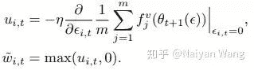

现有大部分机器学习或者深度学习的研究工作大多着眼于模型或应用，而忽略对数据本身的研究。今天给大家介绍的几个文章就关注于在机器学习中如何通过对训练集的选择和加权取得更好的测试性能。

在开始之前，先和大家简单回顾一下我个人觉得相关的几方面工作。其实远在深度学习时代之前，**根据loss对样本加权的工作就已经有很多**。神奇的是，其实在一条线上有着截然相反的想法的研究：第一类工作的想法是如果一个样本训练得不够好，也就是loss高的话，那么说明现在的模型没有很好fit到这样的数据，所以应该对这样的样本给予更高的权重。这一类工作就对应到经典的Hard Negative (Example) Mining，近期的工作如Focal Loss也是这个思想。另一类工作的想法是学习需要循序渐进，应该先学习简单的样本，逐渐加大难度，最终如果仍然后Loss很大的样本，那么认为这些样本可能是Outlier，强行fit这些样本反而可能会使泛化性能下降。这一类中对应的是Curriculum Learning或者Self-Paced Learning类型的工作。**本质上，这两个极端对应的是对训练数据本身分布的不同假设。**第一类方法认为那些fit不好的样本恰恰是模型应当着重去学习的，第二类方法认为那些fit不上的样本则很可能是训练的label有误。

所以，一个很有趣的问题是：**我们应该何时在这两种极端之间选择？在这两个极端之间是不是会有更好的权衡？**这个问题乍看上去没什么简单的办法，今天要介绍的文章就是引入了一个新的信息源——一个无偏的验证集来解决这个问题。有了这样额外的信息源之后，这个问题就变成了如何对每个样本加权，使得验证集上的loss下降。一个naive的办法自然是用leave one out，去掉每个样本训练一个model，但是这个cost会非常地大，实际上是不可行的。所以核心就在于如何对model进行近似，用尽量低的代价尽量准确地获得这样的信息。

在[1]中，作者使用了一个统计学中经典工具Influence Function。作者首先从一个twice-differentiable的trictly convex函数出发一步步拓展结论。基本思路是考虑如果我们增加eps某一个样本的weight，会对model的参数有怎样的影响：

其中H在这里是二阶Hessian矩阵。如果有熟悉优化的朋友可以看出来这个形式其实和Newton法很像。实际推导也没有用到很深奥的数学知识，有兴趣的读者可以参照下文章中的附录。我们更进一步可以使用链式法则得出对z加大eps的weight后对于某个测试样本\z_test的loss变化：

这个结论其实很有指导意义，告诉了我们在一个训练好的model上，如何不重新训练就能评估一个样本对某个测试样本的重要性。然而想直接使用这个办法还有最后一个障碍就是Hessian矩阵的计算，对于CNN这样参数量巨大的模型来说，想要完全准确计算代价依旧很高。所以作者又提出了两种近似Hessian矩阵的方法，分别是使用Conjugate Gradient和Stochastic Approximation。由于这不是文章的重点，所以不在这里展开。

作者在文中还将这样一个结论推广，一方面分别给出了在非凸函数、非收敛的情形以及不可微分的loss下的分析，此方法或此方法的变种都能很有效地预测在验证集上测试性能的变化。另一方面还类似地推导了对某一个训练样本本身扰动带来的变化，这个结论自然地和adverserial sample这个问题联系了起来。为了验证这样近似的有效性，作者还去和leave one out的exact influence做了比较，可以看到，在线性模型下这个模型近似的效果基本和GT一致，在CNN这种非凸情形下，虽然肯定不如线性模型下的效果，但是和GT仍然保持了高度相关性。

有了上面的结论，一个自然的想法便是，找出那些对于降低验证集loss没有帮助的样本，把他们从训练集中排除，从而提升model的性能。[2]正就是做了这样的工作，作者们也给这个工作起了一个很有意思的名字——Data Dropout。具体做法是首先使用全部数据得到一个初始模型，然后在这样的初始模型上计算每个样本的influence，去掉那些对降低验证集loss的样本后，使用新的训练集再次训练得到最终的模型。作者也分别在不同规模(CIFAR, ImageNet)和不同应用(Classification, Denoising)中证明了这样做的有效性。

此方法筛掉的样本数其实也并不多，作者在下表中也报告去除掉的“不好”样本的个数，这几个数据集看来基本是在1%到3%左右，但是带来的性能提升却是显著的。

另一个相关的工作[3]也是同样的出发点，但是更好地利用了Deep Learning中已有操作，使用meta-learning的办法去学习样本的weight。首先这个问题可以写成一个two-level交替优化的目标函数：

其中f_i为原始的training loss，f_i^v为validation loss。但是很显然，直接优化这样一个目标需要在两步之间不停交替迭代，代价颇高。所以作者提出了对于第一个目标函数使用一步gradient descent的近似，同时和上文一样对样本加入eps的weight，上面的优化目标即可变为：

更进一步，对于eps的优化同样可以进行一步gradient descent的近似，如果在eps=0附近展开的话，可以得到：

为了保证训练时每个batch的effective learning rate一致，作者还对每个batch下的weight做了normalize：

使用这样的sample weight，对于model的参数theta再次进行一次gradient计算即可完成对于此batch的更新。

文中使用MLP为例，给出了一个导出的weight示例：

其中z_{i, l}代表的是第i个样本第l层的feature，上标v代表的是validation set。同样，g_{i, l}代表是的第i个样本在第l层收到的gradient。这个结果有着十分直观的含义：**当一个样本和validation set中的样本feature接近，且gradient方向接近的时候，那么我们会增加这个样本的weight。**换句话说，如果一个样本和validation set中的样本接近，且训练的目标一致，那么我们就应该更好地fit这个样本，因为它能直接帮助validation set降低loss。

作者基于这样的方法，还证明了reweighted training在mild condition下的收敛性和传统的SGD算法一致，且可以收敛到validation loss的一个critical point。

在实验部分，作者分别在class imbalanced和noisy label的情况下测试了这个算法。都分别证明了其有效性，但是比较遗憾的是没有和前面提到的[1]进行比较，实验使用的数据集规模也都比较小。

其实还有一些没有覆盖到的paper[4]，我个人觉得没有这两篇有代表性所有就不展开了。总结一下，我觉得这是一个和模型与应用同等重要的问题，其实自己也曾经思索过一段时间但是没有很好的想法。这几个工作提供了一个很不错的思路，即引入一个新的无偏验证集来提供更多的信息。然而这个验证集在实际应用中是否会引入一些overfitting的风险其实还有待更多应用的验证。希望这个方向后续有更多exciting的工作出现。

[1] Koh, Pang Wei, and Percy Liang. "Understanding black-box predictions via influence functions." ICML (2017).

[2] Wang, Tianyang, Jun Huan, and Bo Li. "Data dropout: Optimizing training data for convolutional neural networks." 2018 IEEE 30th International Conference on Tools with Artificial Intelligence (ICTAI). IEEE, 2018.

[3] Ren, Mengye, et al. "Learning to reweight examples for robust deep learning." ICML (2018).

[4] Fan, Yang, et al. "Learning What Data to Learn." arXiv preprint arXiv:1702.08635 (2017).

