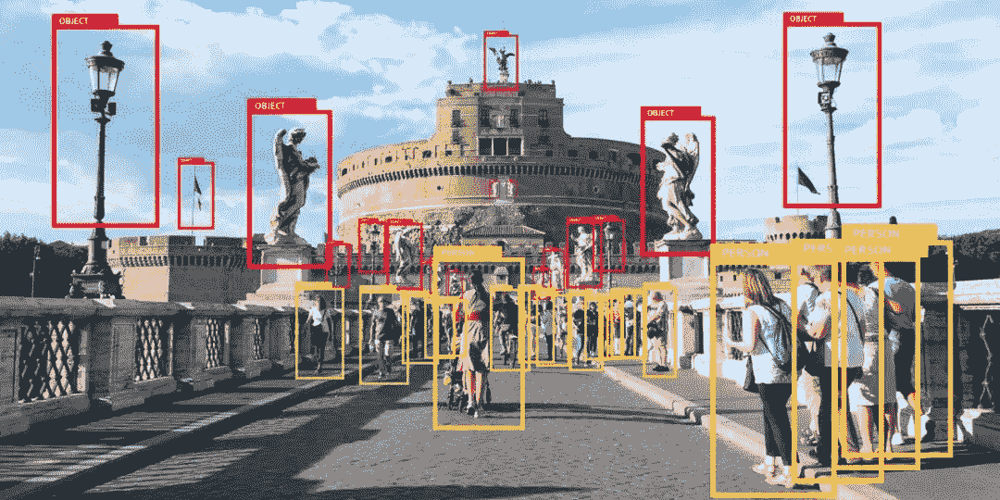
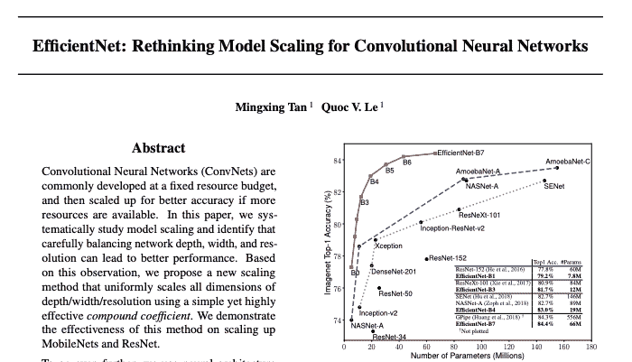
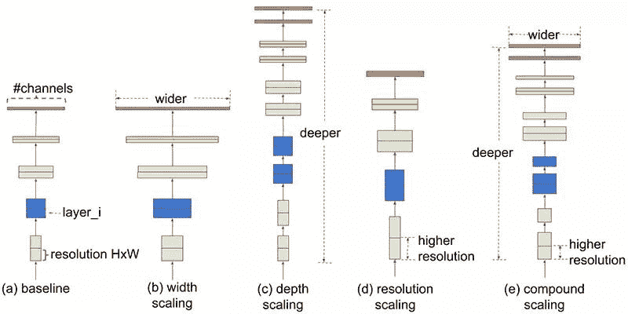
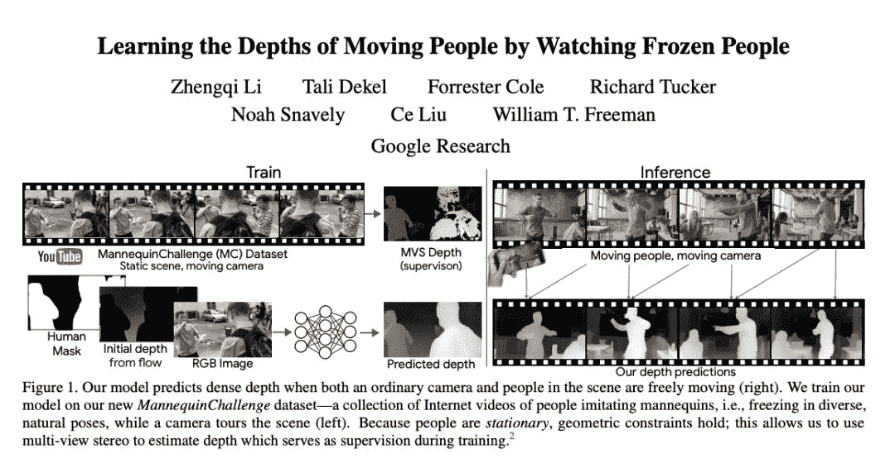
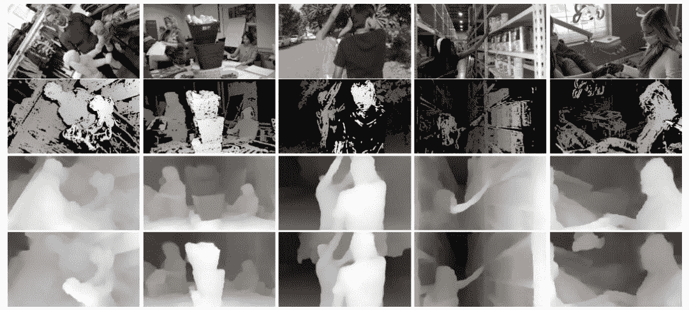
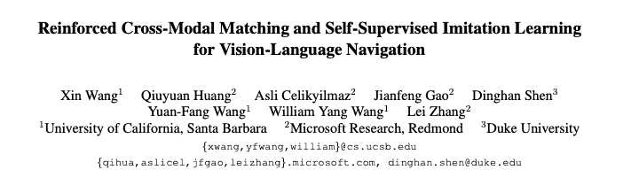
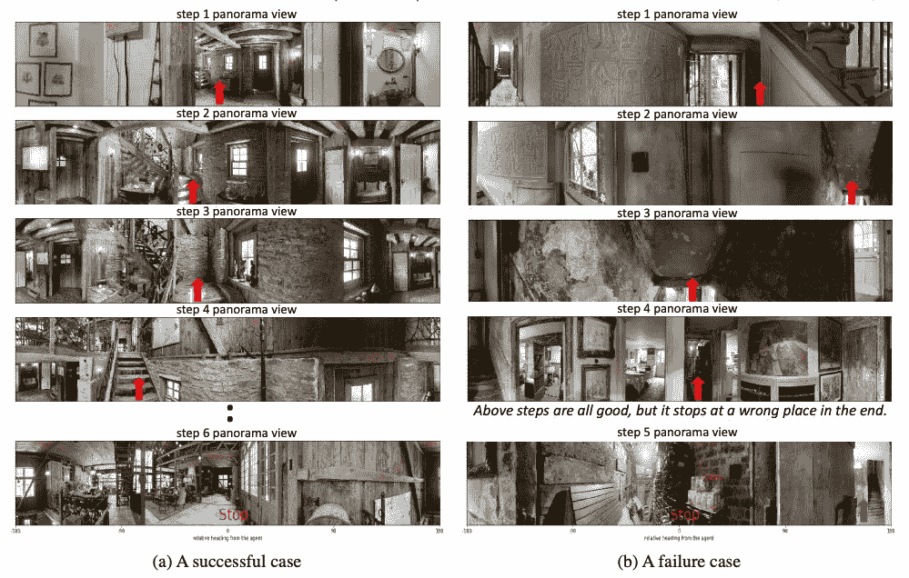

**By 超神经**

**内容一览：**2019 年转眼已经接近尾声，我们看到，这一年计算机视觉（CV）领域又诞生了大量出色的论文，提出了许多新颖的架构和方法，进一步提高了视觉系统的感知和生成能力。因此，我们精选了 2019 年十大 CV 研究论文，帮你了解该领域的最新趋势。

**关键词：**计算机视觉 精选论文

我们看到，近年来，**计算机****视觉**（CV）系统已经逐渐成功地应用在医疗保健，安防，运输，零售，银行，农业等领域，也正在逐渐改变整个行业的面貌。

而今年，CV 领域依然硕果累累，诞生了多篇**优秀论文**。我们选择了其中**十篇**论文，以供大家参考、学习，了解该领域的最新趋势与前沿技术。

这十篇论文涵盖了卷积网络的优化，计算机视觉中的无监督学习，图像生成和机器生成图像的评估，视觉语言导航，使用自然语言为两个图像标注变化等。

以下是我们精选的 10 篇论文目录，先一睹为快：

1.EfficientNet: Rethinking Model Scaling for Convolutional Neural Networks

**EfficientNet：****卷积神经网络模型缩放的反思**

2.Learning the Depths of Moving People by Watching Frozen People

**通过观看静止的人来学习移动的人的深度**

3.Reinforced Cross-Modal Matching and Self-Supervised Imitation Learning for Vision-Language Navigation

**增强的跨模态匹配和自我监督的模仿学习，用于视觉语言导航**

4.A Theory of Fermat Paths for Non-Line-of-Sight Shape Reconstruction

**非视线形状重构的费马路径理论**

5.Reasoning-RCNN: Unifying Adaptive Global Reasoning into Large-scale Object Detection

**Reasoning-RCNN：****将自适应全局推理统一到大规模目标检测中**

6.Fixing the Train-Test Resolution Discrepancy

**修复训练测试分辨率差异**

7.SinGAN: Learning a Generative Model from a Single Natural Image

**SinGAN：****从单个自然图像中学习生成模型**

8.Local Aggregation for Unsupervised Learning of Visual Embeddings

**视觉聚合的无监督学习的局部聚合**

9.Robust Change Captioning

**强大的更改字幕**

10.HYPE: A Benchmark for Human eYe Perceptual Evaluation of Generative Models

**HYPE：****人类对生成模型的 eYe 感知评估的基准**

接下来，我们将从**核心思想**、**关键成就**、**未来技术应用**等方面，详细介绍这 10 篇论文。限于篇幅，我们将解读分为上、中、下三个篇章，欢迎大家持续关注后续内容推送。

1

**《EfficientNet：****卷积神经网络模型缩放的反思》**

**论文地址：****https://arxiv.o****rg/pdf/1905.11946.pdf**

** 摘****要 **

卷积神经网络（ConvNets）通常是在固定资源预算下开发的，如果有更多资源可用，则会进行扩展以获得更高的精度。在本文中，我们系统地研究了**模型缩放**，并发现仔细平衡网络的深度，宽度和分辨率，可以带来更好的性能。基于此观察结果，我们提出了一种新的缩放方法，该方法使用简单而高效的复合系数来均匀缩放深度/宽度/分辨率的所有维度。我们证明了此方法在扩展 MobileNets 和 ResNet 方面的有效性。

更进一步，我们使用神经体系结构搜索来设计一个新的基准网络，并对其进行扩展以获得称为 EfficientNets 的模型系列，**该模型系列比以前的 ConvNets 具有更高的准确性和效率**。特别是，我们的 EfficientNet-B7 在 ImageNet 上达到了最先进的 **84.4％top-1 / 97.1％top-5 精度**，同时比现有最佳 ConvNet 缩小了 8.4 倍，推理速度提高了 6.1 倍。我们的 EfficientNets 还可以很好地传输并在 CIFAR-100（91.7％），Flowers（98.8％）和其他 3 个传输学习数据集上达到最先进的精度，而参数要少几个数量级。源代码链接：https://github.com/tensorflow/tpu/tree/master/models/official/efficientnet.。

** 本文核心思想 **

•CNN 的深度（层数），宽度和输入分辨率应以特定的比例放大，而不是任意放大。

•此外，由于模型缩放的有效性在很大程度上取决于基线网络，因此研究人员利用神经体系结构搜索来开发新的基线模型，并将其按比例缩放以获得一个称为 EfficientNets 的模型系列。

•您可以根据可用资源，选择 EfficientNets 中的一种模型。

** 关键成就 **

•EfficientNets 在 8 个数据集中的 5 个上，获得了最优的精度，平均参数减少了 9.6 倍。

•特别是，具有 66M 参数的 EfficientNet 在 ImageNet 上达到了 top-1 准确率 84.4%，top-5 准确率 97-1%，**比之前最先进****的 CNN - GPipe(参数557M )小了 8 倍，快了 6 倍**。

** 此论文在人工智能界的荣誉 **

•该论文在机器学习领域的顶尖会议 **ICML 201****9** 上被**重点介绍**。

** 未来的研究领域 **

作者在 Google AI 博客上表示，他们希望 EfficientNets「充当未来计算机视觉任务的新基础」。

** 有哪些可能的业务应用程序？**

这项研究的结果对于商业环境中的计算机视觉应用非常重要，因为提出的方法可以更快，更便宜地从 CNN 获得更准确的结果。

** 在哪里可以获得实现代码？**

•作者已发布了其 TensorFlow EfficientNet 实现的源代码：

https://github.com/tensorflow/tpu/tree/master/models/official/efficientnet 。

•还可用 PyTorch 实现：

https://github.com/lukemelas/EfficientNet-PyTorch

2

**通过观看静止的人来学习移动的人的深度**

**论文地址：https://arxiv.org/pdf/1904.11111.pdf**

** 摘要 **

我们提出了一种在单目摄像机和人都可以自由移动的情况下，预测密集深度的方法。现有的用于从单目视频恢复动态非刚性物体的深度的方法，对物体的运动施加了强烈假设，并且可能仅恢复稀疏的深度。在本文中，我们采用**数据驱动的方法**，从新的数据来源中学习人物深度先验：成千上万的人们模仿人体模型的互联网视频，即以各种自然姿势冻结，而手持摄像机则在现场浏览。因为人是静止的，所以可以使用多视图立体重建来生成训练数据。在推理时，我们的方法使用来自场景的静态区域的**运动视差线索**来指导深度预测。我们通过移动手持摄像机捕获的复杂人物动作的真实世界序列展示了我们的方法，显示了对前沿的单目深度预测方法的改进，并显示了使用我们预测的深度产生的各种 3D 效果。

** 本文的核心思想 **

•这项研究解决了在一个有人类主体的自然场景中，当主体和单个摄像机同时移动时，映射深度的挑战。

•作者使用 YouTube 上模仿人体模型的人的视频数据库 Mannequin Challenge（人体模型挑战数据集）训练了一个深度神经网络，该深度可以通过现有的**立体声技术**进行映射。

•该网络以 RGB 图像、人类区域掩码和环境初始深度作为输入，然后输出包括环境和人类在内的整个图像的稠密深度图。

•假设人类在移动而场景的其余部分是静止的，则通过视频中两个帧之间的运动视差来估计初始深度。

**关键成就 **

•提出的模型与现有方法相比，能够为人类及其周围环境以明显更高的精度，重新创建移动场景的深度图。

•引入了 ****Mannequin Challenge 数据集****，这是 ****2,000 个 YouTube 视频****的集合，在这些视频中，当摄像机绕着场景转圈时，人们在其中姿势不动。

** 此论文在人工智能界的荣誉 **

•该论文在计算机视觉和模式识别的领先会议 **CVPR 2019** 上获得了**最佳论文奖**（荣誉奖）。

** 未来的研究领域是什么？**

•扩展模型以适用于移动非人类物体，例如汽车和阴影。

•一次将两个以上的视图合并到模型中，以消除暂时的不一致。

** 有哪些可能的业务应用程序？**

•产生精确的 3D 视频效果，包括合成景深，可感知深度的修补以及将虚拟对象插入 3D 场景。

•使用多个框架扩展视野，同时保持准确的场景深度。

** 在哪里可以获得实现代码？**

•代码和模型在 GitHub 上地址为：

https://github.com/google/mannequinchallenge。

3

**用于视觉语言导航的，**增强跨模态匹配和自我监督模仿学习****

**论文地址：****https://arxiv.org/pdf/1811.10092.pdf**

** 摘要 **

**视觉-语言导航（Vision-language navigation，VLN）任务**是指在真实的三维环境中让具有实体的智能体进行导航并完成自然语言指令。在这篇论文中，我们研究了如何解决这个任务中的三个重点挑战：**跨模态参照**，**不适定反馈**，以及**泛化问题**。我们首先提出了一种新的**强化跨模态匹配**（RCM）方法，它可以通过强化学习的方式同时促进局部和全局的跨模态参照。具体来说，我们使用了一个匹配指标，它成为了鼓励模型增强外部指令和运动轨迹之间匹配的固有反馈；模型也使用了一个推理导航器，它用来在局部视觉场景中执行跨模态参照。在一个 VLN benchmark 数据集上进行的评估结果表明，我们提出的 RCM 模型大幅超越已有模型，SPL 分数提高了 10%，成为了新的 SOTA。为了提高学习到的策略的泛化性，我们还进一步提出了一个**自监督模仿学习**（SIL）方法，通过模仿自己以往的良好决策的方式探索未曾见过的环境。我们证明了 SIL 可以逼近出更好、更高效的策略，这极大程度减小了智能体在见过和未见过的环境中的成功率表现的差别（从 30.7% 降低到 11.7%）。

** 本文的核心思想 **

• 视觉语言导航需要一台机器来解析语言指令，将这些指令与视觉环境匹配，然后根据语言指令中的子短语来导航该环境。

• 为了解决这一艰巨的任务，研究人员介绍了一种新颖的跨模态匹配方法，该方法利用**外部奖励和内在奖励**来进行强化学习：

*   它包括一个推理导航器，该导航器从自然语言指令和本地视觉场景中学习，以推断出要重点关注的短语以及查找的位置。

*   该 agent 配备有一个匹配的注释程序，该注释程序根据从中重构原始指令的可能性来评估执行路径。

*   另外，细粒度的内在奖励信号会鼓励代理更好地理解文本输入，并对选择不符合指令的轨迹进行惩罚。

• 本文还介绍了一种自我监督的模仿学习（SIL）方法，用于探索以前看不见的环境：

*   导航器执行多次滚动，然后由匹配的注释器确定良好的轨迹，随后将其用于导航器模仿。

** 关键成就 **

•RCM 框架在以下方面优于 R2R 数据集上的最新视觉语言导航方法：

**将 SPL 分数从 28％ 提高到 35％；****成功率提高了 8.1％。**

•此外，使用 SIL 模仿 RCM agent 先前在训练集上的最佳体验，会导致平均路径长度从 15.22m 下降到 11.97m，并且对 SPL 度量的结果甚至更好（38％）。

** 此论文在人工智能界的荣誉 **

•该论文获得了三项**「强烈接受」（Strong** **Accept）**同行评审，并在计算机视觉和模式识别的顶尖会议 **СVPR 2019** 上被**重****点介绍**。

** 未来的研究领域是什么？**

•使用 SIL 方法探索其他看不见的环境。

** 有哪些可能的业务应用程序？**

•引入的框架可以在许多实际应用中使用，包括：

按照指示在家庭或办公室中移动的家用机器人；

私人助理接受口头指示并在复杂的环境中导航以执行某些任务。

