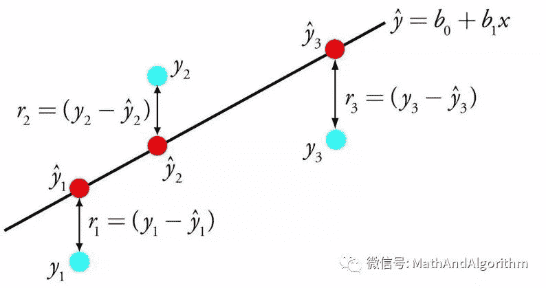
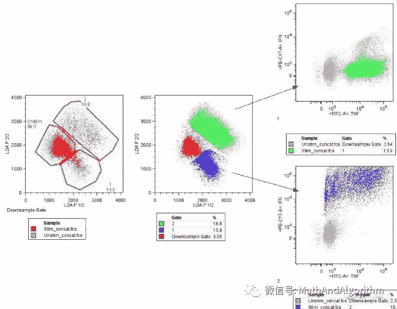
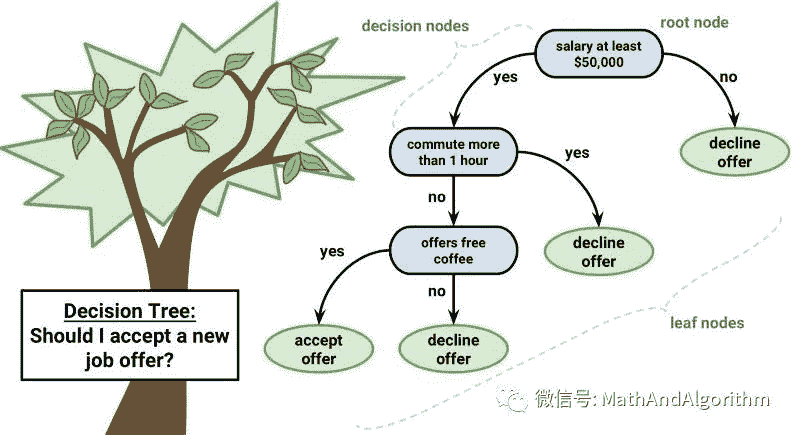
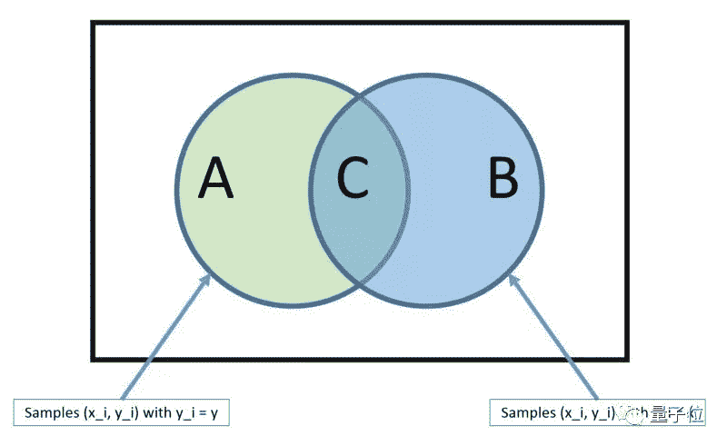
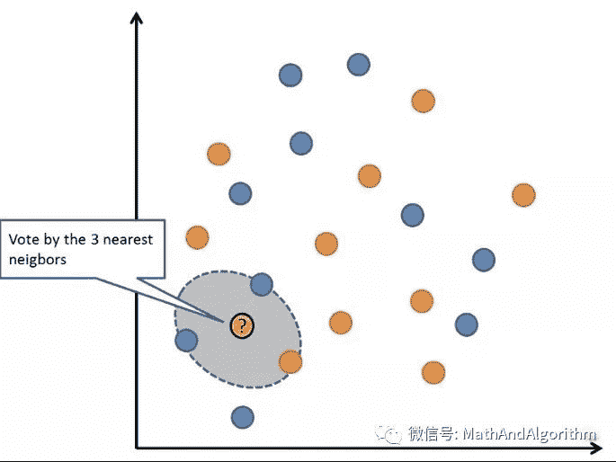
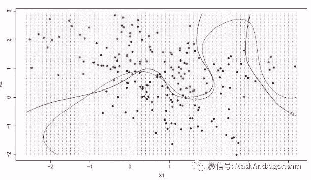
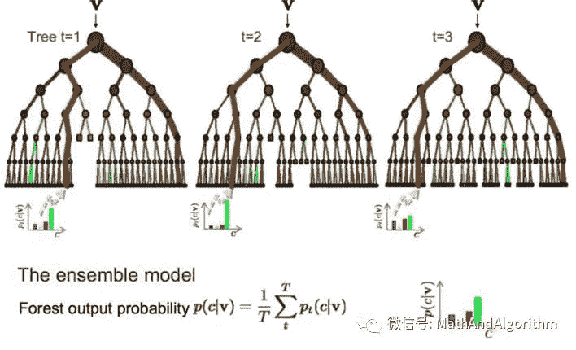
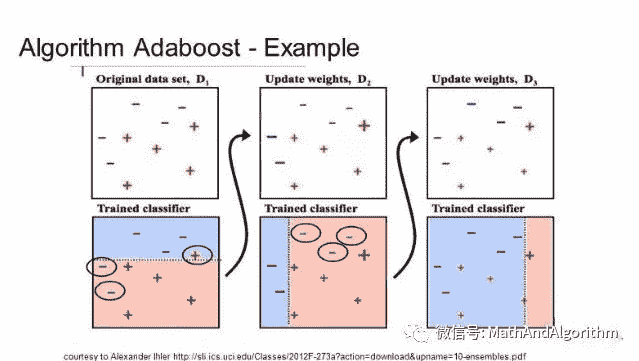

点击上方“**Datawhale**”，选择“星标”公众号

价值内容第一时间获取

来源： 量子位

在机器学习领域里，不存在一种万能的算法可以完美解决所有问题，尤其是像预测建模的监督学习里。

比方说，神经网络不见得比决策树好，同样反过来也不成立。

最后的结果是有很多因素在起作用的，比方说数据集的大小以及组成。

所以，针对你要解决的问题，最好是尝试多种不同的算法。并借一个测试集来评估不同算法之间的表现，最后选出一个结果最好的。

当然，你要选适合解决你问题的算法来尝试。

比方说，要打扫房子，你会用真空吸尘器，扫把，拖把；你绝对不会翻出一把铲子来开始挖坑，对吧。

# **大的原则**

不过呢，对于所有预测建模的监督学习算法来说，还是有一些通用的底层原则的。

> 机器学习算法，指的是要学习一个目标函数，能够尽可能地还原输入和输出之间的关系。

然后根据新的输入值X，来预测出输出值Y。精准地预测结果是机器学习建模的任务。

So，Top10机器学习算法，了解一下。

# **1  线性回归 **

统计学与机器学习领域里研究最多的算法。

做预测建模，最重要的是准确性（尽可能减小预测值和实际值的误差）。哪怕牺牲可解释性，也要尽可能提高准确性。

为了达到这个目的，我们会从不同领域（包括统计学）参考或照搬算法。

线性回归可用一条线表示输入值X和输出值Y之间的关系，这条线的斜率的值，也叫系数。

比方说，y = B0 + B1*x

我们就可以根据X值来预测Y值。机器学习的任务就是找出系数B0和B1。

从数据中建立线性回归的模型有不同的方法，比方说线性代数的最小二乘法、梯度下降优化。

线性回归已经存在了200多年，相关研究已经很多了。用这个算法关键在于要尽可能地移除相似的变量以及清洗数据。

对算法萌新来说，是最简单的算法了。

# **2   逻辑回归**

这方法来自统计学领域，是一种可以用在二元分类问题上的方法。

逻辑回归，和线性回归相似，都是要找出输入值的系数权重。不同的地方在于，对输出值的预测改成了逻辑函数。

逻辑函数看起来像字母S，输出值的范围是0到1。

把逻辑函数的输出值加一个处理规则，就能得到分类结果，非0即1。
比方说，可以规定输入值小于0.5，那么输出值就是1。

###### **△** 逻辑回归

这个算法还可以用来预测数据分布的概率，适用于需要更多数据论证支撑的预测。

和线性回归相似，如果把和输出不相干的因子或者相近的因子剔除掉的话，逻辑回归算法的表现会更好。

对于二元分类问题，逻辑回归是个可快速上手又有效的算法。

# **3  线性判别分析**

逻辑回归算法，只能用于二分问题。

当输出的结果类别超过两类的时候，就要用线性判别分析算法了。

这种算法的可视化结果还比较一目了然，能看出数据在统计学上的特征。这上面的结果都是分别计算得到的，单一的输入值可以是每一类的中位数，也可以是每一类值的跨度。

###### **△** 线性判别分析

基于对每种类别计算之后所得到的判别值，取最大值做出预测。

这种方法是假定数据符合高斯分布。所以，最好在预测之前把异常值先踢掉。

对于分类预测问题来说，这种算法既简单又给力。

# **4  分类与回归树**

预测模型里，决策树也是非常重要的一种算法。

可以用分两叉的树来表示决策树的模型。每一个节点代表一个输入，每个分支代表一个变量（默认变量是数字类型）

###### **△** 决策树

决策树的叶节点指的是输出变量。预测的过程会经过决策树的分岔口，直到最后停在了一个叶节点上，对应的就是输出值的分类结果。

决策树很好学，也能很快地得到预测结果。对于大部分问题来说，得到的结果还挺准确，也不要求对数据进行预处理。

# **5  朴素贝叶斯分类器**

这种预测建模的算法强大到超乎想象。
这种模型，可以直接从你的训练集中计算出来两种输出类别的概率。

一个是每种输出种类的概率；另外一个，是根据给定的x值，得到的是有条件的种类概率。

一旦计算之后，概率的模型可以用贝叶斯定理预测新的数据。

当你的数据是实数值，那么按理说应该是符合高斯分布的，也就很容易估算出这个概率。

###### **△** 贝叶斯定理

朴素贝叶斯定理之所以名字里有个“朴素”，是因为这种算法假定每个输入的变量都是独立的。

不过，真实的数据不可能满足这个隐藏前提。尽管如此，这个方法对很多复杂的问题还是很管用的。

# **6  K近邻算法**

最近K近邻的模型表示，就是整个训练集。很直截了当，对吧？

对新数据的预测，是搜索整个训练集的值，找到K个最近的例子（literally的邻居）。然后总结K个输出的变量。

这种算法难就难在，怎么定义两个数据的相似度（相距多近算相似）。

如果你的特征(attributes)属于同一个尺度的话，那最简单的方法是用欧几里得距离。这个数值，你可以基于每个输入变量之间的距离来计算得出。

###### **△** 最近邻法

最近邻法，需要占用大量的内存空间来放数据，这样在需要预测的时候就可以进行即时运算（或学习）。也可以不断更新训练集，使得预测更加准确。

距离或亲密度这个思路遇到更高维度（大量的输入变量）就行不通了，会影响算法的表现。

这叫做维度的诅咒。

当（数学）空间维度增加时，分析和组织高维空间（通常有成百上千维），因体积指数增加而遇到各种问题场景。

所以最好只保留那些和输出值有关的输入变量。

# **7  学习矢量量化**

最近邻法的缺点是，你需要整个训练集。

而学习矢量量化（后简称LVQ）这个神经网络算法，是自行选择训练样例。

LVQ，是一组矢量，也叫码本。一开始，矢量是随机选的，经过几次学习算法迭代之后，慢慢选出最能代表训练集的矢量。

学习完成后，码本就可以用来预测了，就像最近邻法那样。计算新输入样例和码本的距离，可以找出最相近的邻居，也就是最匹配的码本。

如果你重新调整数据尺度，把数据归到同一个范围里，比如说0到1之间，那就可以获得最好的结果。

如果用最近邻法就获得了不错的结果，那么可以再用LVQ优化一下，减轻训练集储存压力。

# **8  支持向量机（简称SVM）**

这可能是机器学习里最受欢迎的算法了。

超平面是一条可以分割输入变量的空间的“线”。

支持向量机的超平面，是能把输入变量空间尽可能理想地按种类切割，要么是0，要么是1。

在二维空间里，你可以把超平面可以分割变量空间的那条“线”。这条线能把所有的输入值完美一分为二。

SVM的学习目标就是要找出这个超平面。

###### **△** 支持矢量机

超平面和挨得最近的数据点之间的距离，叫做边缘。

最理想的超平面，是可以无误差地划分训练数据。也就是说，每一类数据里距离超平面最近的向量与超平面之间的距离达到最大值。

这些点就叫做支持向量，他们定义了超平面。

从实际操作上，最理想的算法是能找到这些把最近矢量与超平面值距离最大化的点。

支持向量可能是最强的拿来就用的分类器了。值得用数据集试试。

# **9  随机森林**

随机森林，属于一种重复抽样算法，是最受欢迎也最强大的算法之一。

在统计学里，bootstrap是个估算值大小很有效的方法。比方说估算平均值。

从数据库中取一些样本，计算平均值，重复几次这样的操作，获得多个平均值。然后平均这几个平均值，希望能得到最接近真实的平均值。

而bagging算法，是每次取多个样本，然后基于这些样本建模。当要预测新数据的时候，之前建的这些模型都做次预测，最后取这些预测值的平均数，尽力接近真实的输出值。

随机森林在这个基础上稍微有点变化。

它包含多个决策树的分类器， 并且其输出的类别是由个别树输出的类别的众数而定。

如果你的高方差算法取得了不错的结果（比方说决策树），那么用随机森林的话会进一步拿到更好的结果。

# **10 提升(Boosting)算法和自适应增强(Adaboost)算法**

Boosting的核心是，对同一个训练集训练不同的分类器（弱分类器），然后把这些弱分类器集合起来，构成一个更强的最终分类器（强分类器）。

所得到的第二个弱分类器会纠正第一个弱分类器的误差。弱分类器的不断叠加，直到预测结果完美为止。

Adaboost算法是首个成功用于二元分类问题的提升算法。

现在有很多提升方法都是基于Adaboost。

AdaBoost适用于短的决策树。

在第一个树建立出来之后，不同的样本训练之后的表现可以作参考，用不同的样本训练弱分类器，然后根据错误率给样本一个权重。

很难预测的训练数据应该给更多的权重，反过来，好预测的就少一点权重。

模型按顺序一个一个建，每个训练数据的权重都会受到上一个决策树表现的影响。

当所有的决策树都建好之后，看新数据的预测表现，结果准不准。

因为训练数据对于矫正算法非常重要，所以要确保数据清洗干净了，不要有奇奇怪怪的偏离值。

# **最后的最后**

面对海量的机器学习算法，萌新最爱问的是，“我该选什么算法？”

在回答这个问题之前，要先想清楚：

1）数据的数量、质量、本质；
2）可供计算的时间；
3）这个任务的紧急程度；
4）你用这个数据想做什么。

要知道，即使是老司机，也无法闭着眼睛说哪个算法能拿到最好的结果。还是得动手试。

其实机器学习的算法很多的，以上只是介绍用得比较多的类型，比较适合萌新试试手找找感觉。

最后，附编译来源，
https://www.kdnuggets.com/2018/02/tour-top-10-algorithms-machine-learning-newbies.html

