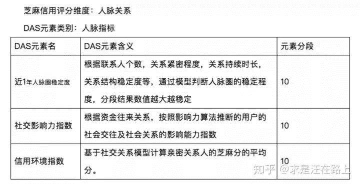
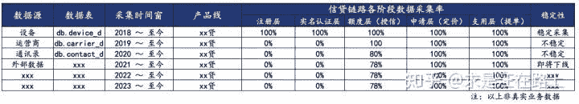
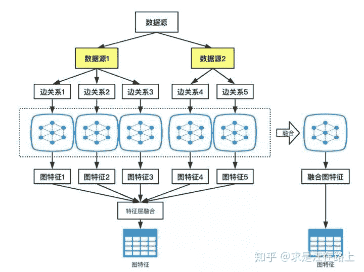
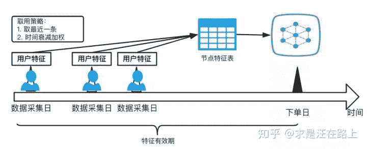
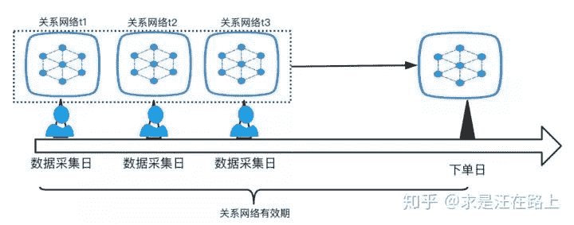

**“** 本文业务角度分享了风控业务中构建关系特征的一些实践经验，包括数据源分析，关系网络和特征的构建，特征性能的评估以及线上方案的落实。**”**

作者：求是汪在路上

来源：知乎专栏 风控模型算法。

编辑：happyGirl

## **风控业务背景**

常规RFM时间切片统计特征侧重于纵向维度量化用户风险，而关系网络特征则从横向维度来评估。纵向是指同一用户在不同时间段上的行为异常风险；横向是指在同一个时间段里聚集的不同用户放在一起评估风险。因此，关系网络特征可作为常规RFM特征的一个有力补充，为风控模型带来可预见的增量效果。

芝麻信用分中的人脉关系维度可以给我们带来很多启发，其又细分为人脉圈稳定性、社交影响力指数和信用环境指数三个子指标。其中信用环境指数是本文主要参考学习的方向。

<figcaption>图1 - 芝麻信用评分维度之人脉关系</figcaption>

本文不围绕各种复杂的社区发现算法展开，只从业务角度分享下构建关系特征的一些实践经验。关系网络中最重要的两部分无非就是——边（edge）和节点（node）。围绕这两点，我们可以考虑几个问题：如何分析可用数据？如何根据已有数据源来构建关系网络？如何构建关系特征？如何评估关系特征的性能？如何落实上线方案？

> **目录**
> Part 1\. 如何分析可用数据？
> Part 2\. 如何构建边关系？
> Part 3\. 如何使用节点特征？
> Part 4\. 如何使用存量数据和增量数据？
> Part 5\. 如何实时上线？
> Part 6\. 如何验证关系特征的效果？
> Part 7\. 如何去优化关系特征？
> 致谢
> 版权声明

## Part 1\. 如何分析可用数据？

1.  **考虑数据源的稳定性。**

在风控中， **稳定性压倒一切**。数据源是构建特征的前提，如果数据源采集上就不稳定，必然导致特征波动。那么为了调研数据源采集情况，我们该咨询哪些人员，以及关注哪些问题呢？以下是笔者的一些实践建议：

*   **信贷产品设计人员** ：了解产品页面跳转流程，包括：在哪个页面将会要求用户导入资料？需要用户授权同意哪些数据采集协议？新用户相对于老用户会少哪些数据？

*   **外部数据对接开发人员** ：外部数据是其他数据公司所提供的，从而可能存在一些不确定性。例如，由于输出变量不稳定而被使用方下线，或者由于协议到期而被提供商下线。需要明确：外部数据在哪个环节（额度、定价、支用）调用？覆盖哪些产品和客群？外部数据接口调用的稳定性？

*   **风控策略人员** ：了解风控流程和未来业务调整计划。风控流程图帮助你理解在整个风控链路上数据采集和风控策略之间的映射关系；业务调整计划帮助你排除一些未来不可用数据。例如，为提高用户转化率或合规性要求，未来计划把某些用户数据 **由必导项改为自选项** ，那么可预见这块数据未来的采集率将会逐渐下降。如果对这块数据依赖性高，就会导致模型不稳定。此时，我们就不得不放弃实时数据的使用，或者考虑分箱等方式来平滑影响，或者考虑如何利用存量历史数据。

???? **建议** ：可分产品线、时间粒度（天/月）等维度统计数据的缺失率，以此分析数据的稳定性。

**2\. 考虑数据源的厚薄度** 。

由于各个数据源在不同时间点开始采集，因此数据的厚薄程度存在差异。在构建时间切片特征时也需注意这一点—— **明确观察期窗口是否有效**。例如，数据采集时间是从2018-01-01开始的，如果要统计最近30天内的RFM特征，那么有效的观察期窗口就是30天，有效的观察点（样本）就只能从2018-02-01开始，2018年1月份的样本由于观察期不满30天就无法统计到有效的特征。在样本特征回溯中，笔者经常看到某些同学犯这个错误。

因此，如果某块数据在最近才开始采集，那也不得不舍弃。

**3\. 考虑模型的应用场景。**

特征是为模型服务的。因此，在构建关系特征前，我们需要明确模型的应用场景，为模型“量身定制”。如果计划用在风险定价（A卡模型）环节，那么某些在A卡之后的环节才能获取的数据就无法使用。很多建模经验不足的同学，不管三七二十一，直接把所有可能使用的数据拿来测算，根本没考虑过线上如何使用的问题。最后，要么离线测算结果就不佳，要么最后根本无法上线使用。

???? **建议** ：罗列一份数据源质量分析清单，笔者在整理中的结果表示例：

<figcaption>图2 - 数据源质量分析清单</figcaption>

## Part 2\. 如何构建边关系？

我们可以从 **关系强弱（边权重）** 和 **覆盖率（边数量）**两个维度来衡量数据源对定义边的重要性。由于各家公司对数据源获取情况各异，在此就只对目前市场上的数据源分析关系强弱。

1.  **运营商数据** ：关系⭐️⭐️⭐️⭐️⭐️。可根据最近N天内通话记录次数等指标来衡量两个人之间的亲密程度。

2.  **设备数据** ：关系⭐️⭐️⭐️⭐️。可根据最近N天内是否共同使用过一台设备、是否共同使用过同一个Wi-Fi等指标衡量。

3.  **通讯录数据** ：关系⭐️⭐️⭐️⭐️⭐️。通讯录中所存号码的备注信息可判断亲密度。

4.  **紧急联系人数据** ：关系⭐️⭐️⭐️⭐️⭐️。通常情况下，用户所填的紧急联系人会是自己的家人、同事、亲友等。

5.  **电商地址数据** ：关系⭐️⭐️⭐️。根据地址相似度比对来判断用户之间存在的关系。由于地址数据需要提前规整，处理难度大。

6.  **运营老客拉新数据** ：关系⭐️⭐️⭐️。产品运营活动中常会推出各种老客拉新活动以实现用户增长。链接传播渠道一般是微信。因此被拉的新客与老客之间通常是微信朋友关系。

7.  **银行卡转账记录数据** ：关系⭐️⭐️⭐️。通常情况下，覆盖率较低。

8.  **LBS地址位置数据** ：关系⭐️。由于设备经纬度数据采集误差和位置时效性强的问题，这块数据对于衡量用户关系较弱。

9.  **其他数据** 。

在罗列出所有可用于构建边关系的数据后，我们又会面临一个问题：每个数据源就可以提取出多个边关系，那么就可以构造多个子网络，我们该如何处理这些边？

可以有以下2种做法：

*   **特征层融合** ：对每个子网络独立构建图特征，在特征层中融合。该方案在实践中的优点在于方便直观，可并行；缺点在于工作量大，如果有a个数据源，每个数据源可提取b种关系的边，又有c个节点特征，此时就会衍生出 a ✖ b ✖ c个特征。在建模中，也不可能对这所有的特征入模，需要开展大量的特征筛选工作。

*   **网络层融合** ：该方案在实践中的优点在于将各类强边弱边融合在一起（w1 * e1 + w2 * e2 + w3 * e3 + ...），使边的内在含义更为丰富，边的覆盖率得到提升；缺点在于无法很好对融合权重赋值，前期可考虑专家经验拍定，后期优化可以考虑结合具体的target来训练估计。

<figcaption>图3 - 特征层融合 VS 网络层融合</figcaption>

## Part 3\. 如何使用节点特征？

一般情况下，节点特指用户（当然也可以是手机号、设备等）。我们可以通过RFM模型批量生产出大量时间切片特征，或者根据业务理解构造出强业务特征。

而关系网络的一个价值在于：利用节点所在群体（可以是一度、二度，或者社区发现算法挖掘出的簇）中的邻居节点特征，通过关系网络传播到某个节点上。

如果节点特征表对邻居节点的覆盖率低（通常情况下，邻居节点数 >> 特征表中节点数），那么网络传播过程将会大打折扣。试想，一个下单用户好不容易找出100个一度邻居，然而只有3个邻居节点特征变量有值，其余邻居节点特征都为null，那么通过传播（对邻居节点求mean、max、min、sum聚合操作）后，该下单用户仅仅利用了3个邻居的信息。

????因此， **节点特征表中的用户量决定了特征传播的上限。**

接下来，我们就会考虑如何去扩充节点特征表中的用户量？最直接的做法——我们把历史全量用户的特征都拿过来用不就行了？但需要注意的是，**用户特征具有时效性。** 所谓 **时效性，是指用户特征是否能有效反映用户最近的风险。** 因此，贪多反而会引起特征质量下降，两者需要做权衡。

如果该特征的稳定性比较好（反映用户稳定属性的特征，如性格、信用等），那么就可以尽可能使用历史存量数据。也就是说，设定节点特征表的有效期为1年（或更长），在有效期内的历史全量节点特征，我们都可以拿来传播。例如信用卡额度，通常认为一个用户在1年内的额度不会发生太大变化。

反之，对于时效性强的特征，我们宁可牺牲覆盖率，也要缩短有效期，目的是为了保证特征的时效性。例如同盾这类的多头借贷数据，随着接入和退出机构的动态变化，半年前的同盾数据可能已经无法反映用户当前的借贷风险，若直接使用反而会引入噪声。

对于某个节点（用户）特征表在不同时间点存在多条记录的，可以考虑以下策略：

1.  取最近一条，保证特征的时效性最强。

2.  参考遗忘曲线，对不同时间点的特征进行加权融合。

<figcaption>图4 - 特征有效期和取用策略</figcaption>

## Part 4\. **如何使用存量数据和增量数据？**

1.  增量数据：一般指实时数据，可直接计算一度关系的边权重。例如，如果用户申贷下单时必须导运营商数据，那么就可以根据实时导入的通话记录来构建图关系网络。这是最新的数据，自然更能反映用户此时的风险。

2.  存量数据：在一些场景下，我们不得不依赖于使用存量数据。

*   场景1: 前期业务流程中要求用户强制导运营商数据，后期变成用户可选提额项。

*   场景2: 某块数据之前都是在定价环节才调用，而此次建模希望用在额度环节（在定价之前）。

此时，我们该如何使用呢？考虑到对于某些新用户，虽然其自己没有导入运营商这类的关系数据，但是可能其身边的人在历史申贷时就已经导入过资料。那么，在历史关系网络中，该新用户就被囊括在其中。因此，存量数据也有其使用价值。

同样的道理，我们需要考虑关系网络也具有时效性。某些历史关系网络比较稳定，比如家人关系，那么就可以使用较久版本的，否则就只能用最近的，甚至不使用。

<figcaption>图 5 - 关系网络有效期</figcaption>

## Part 5\. **如何实时上线？**

据笔者所知，目前线上计算二度关系的技术门槛仍然很高，因此我们在实时计算时考虑一度关系（应该也能达到80%的baseline效果，剩下的20%可能就需要靠高阶关系了），二度关系甚至更为复杂的社区发现算法则放在离线计算。因此，在实时构建一度关系和离线提供一度和多度关系的相互补充下，将会得到相对于只用实时一度关系更好的效果。

节点特征表则可通过离线提前计算，并将有效期范围的不同观察点的节点特征汇总成一张表，导入到线上数据库。

对于实时订单，可实时构建出关系网络，取出一度联系人和相应的边权重。并从节点特征表中取出邻居用户的特征，进而传播扩散，生成实时图特征。

**Part 6\. 如何验证关系特征的效果？**

在风控建模中，评估特征性能最为关注稳定性和区分度。稳定性可用PSI（群体稳定性）来计算，而区分度可用IV（信息量）来衡量。再次强调稳定性在风控中的重要性。

因此，可按照以下步骤来快速评估：

1.  考虑先回溯足够多的样本，通常是要求几个月以能评估稳定性

2.  先评估特征的区分度。对于IV很高的特征，再次确认取数逻辑中是否用到未来信息。

3.  筛选出区分度较强的特征，进一步评估稳定性。

## Part 7\. 如何去优化关系特征？

1.  引入边权重，而不仅仅是有关联的一度用户。

2.  离线增加更多关系较强但覆盖率较低的边，以起到补充更多一度联系人的作用。

3.  节点特征增加更多维度。本质还是在于特征传播，因此加有效的节点特征是最重要的。

4.  利用样本和target变量对关系网络融合权重参数估计，以期达到更合理的网络融合。

## **关于作者** ：

在某互联网金融公司从事风控建模、反欺诈、数据挖掘等方面工作，目前致力于将实践经验固化分享，量化成长轨迹。

**喜欢的话点个在看吧****????**