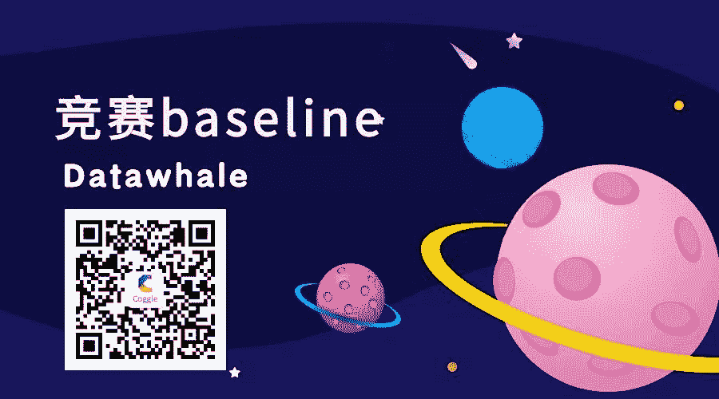

数据竞赛中baseline是最入门的分享，

它不仅有思路、方法还有内容；

或许你与Top选手的差距就是一个baseline！

01

**项目介绍**

如果你是数据竞赛的初学者、爱好者，比赛的baseline不仅是比赛思路分享，同时也是一类数据问题的方法总结。我们想做的就是收集并整理并分享各种比赛的baseline方案。

你可能会问为什么是baseline，而不是获胜者的代码分享？**相比于获胜者的代码baseline代码都比较简单，容易整理和学习；****其次baseline代码更加实用和简洁，适合入门学习。**

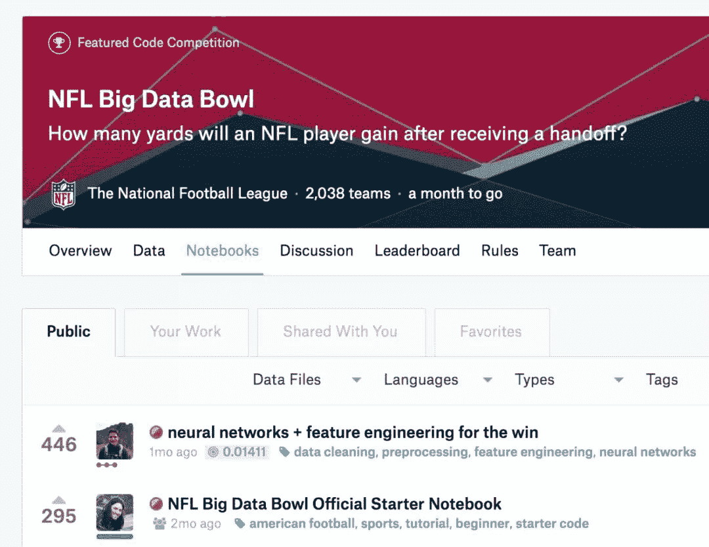

https://www.kaggle.com/c/nfl-big-data-bowl-2020/

在每个Kaggle比赛中baseline分享一般都是最受大家欢迎的，也是点赞最多的kernel。比赛的baseline不仅能降低参赛的门槛，同时也能极大程度刺激选手的参赛热情。

鉴于国内比赛平台没有类似的分享机制，**于是我们（阿水和鱼佬）在Datawhale计划做一个国内的竞赛baseline分享计划，我们目标是做成国内最完整的竞赛baseline和比赛案例分享项目。**

我们的baseline开源项目初步构建完成：

https://github.com/datawhalechina/competition-baseline

02

**项目内容**

我们对国内外常见的数据竞赛平台进行整理：

国外竞赛平台：

*   *   Kaggle

    *   DrivenData

    *   Colalab

    *   CrowdAI

    *   Kelvins

    *   Signate

    *   analyticsvidhya

国内竞赛平台：

*   *   天池

    *   点石

    *   JData

    *   DataCastle

    *   DataFountain

    *   Biendata

    *   科赛

    *   AI研习社

    *   图灵联邦

    *   AI Studio

    *   FlyAI

我们还对国内比赛的baseline进行了全面的整理。为了帮助大家更好的学习，我们根据赛题的数据类型分为三类典型比赛：

*   结构化数据比赛：表格形式的赛题；

*   计算机视觉(CV)比赛：图像类型的赛题；

*   自然语言处理(NLP)比赛：文本类型的赛题；

* * *

**结构化数据比赛：**

*   白葡萄酒品质预测

*   肌肉活动电信号推测手势

*   肌肉活动电信号推测手势

*   Retention Rate of Baidu Hao Kan APP Users

*   kaggle-two-sigma-connect-rental-listing-inquiries

*   kaggle-allstate-claims-severity

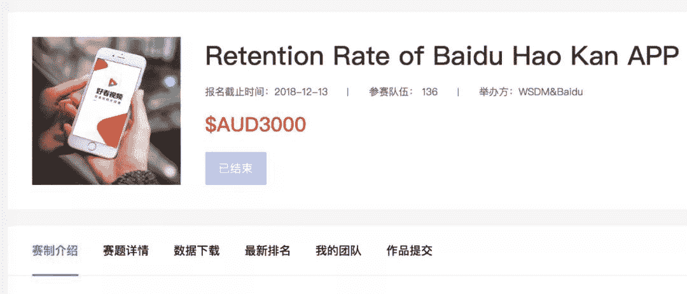

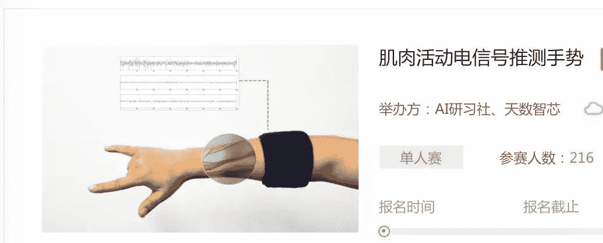

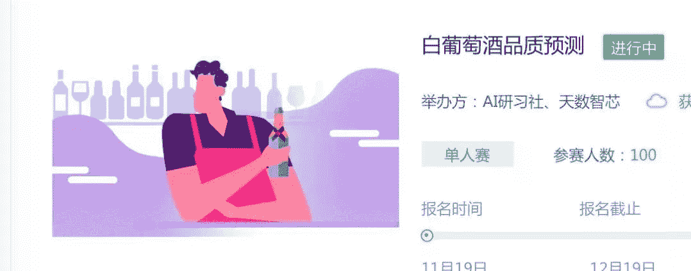

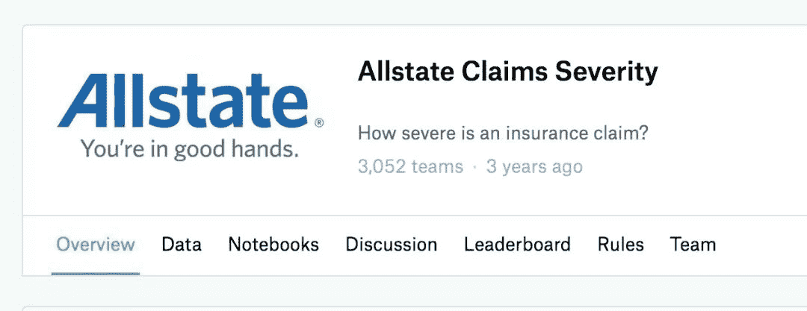

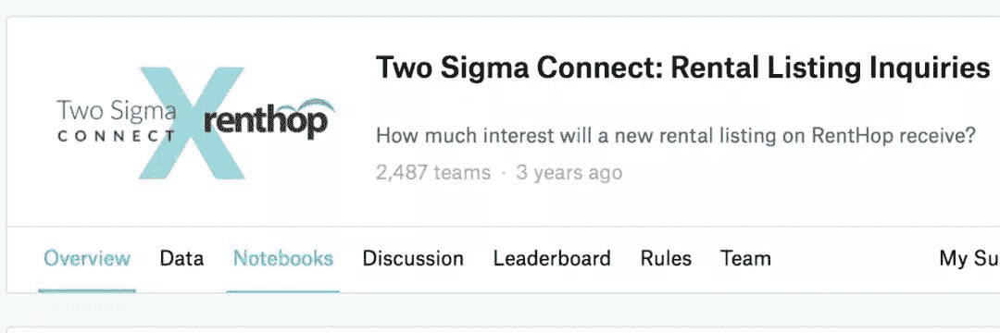

* * *

**计算机视觉CV比赛：**

*   胸腔X光肺炎检测

*   CCF2019-视频版权检测算法

*   kaggle-quickdraw-doodle-recognition

*   TinyMind人民币面值&冠字号编码识别挑战赛

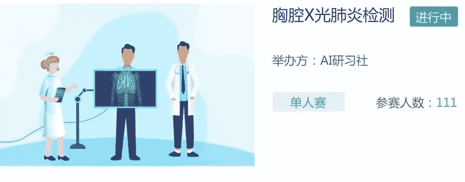

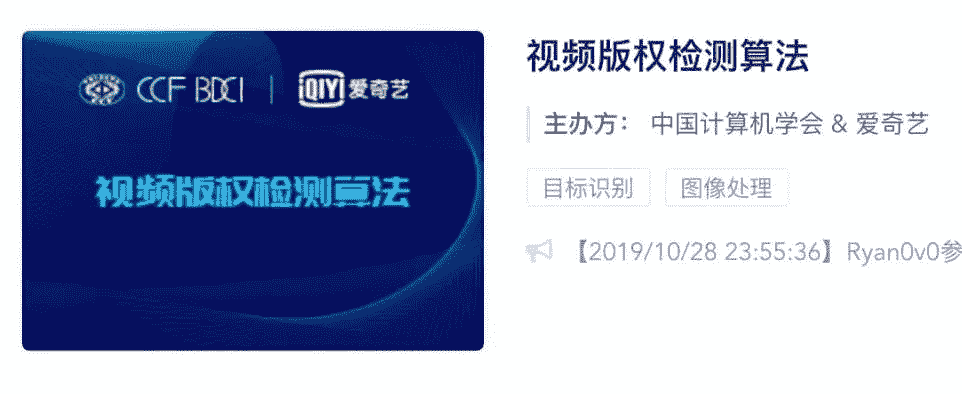

* * *

**自然语言处理NLP比赛：**

*   智源&计算所-互联网虚假新闻检测挑战赛

*   互联网金融新实体发现

*   技术需求与技术成果项目之间关联度计算模型

*   互联网新闻情感分析

*   第三届阿里云安全算法挑战赛

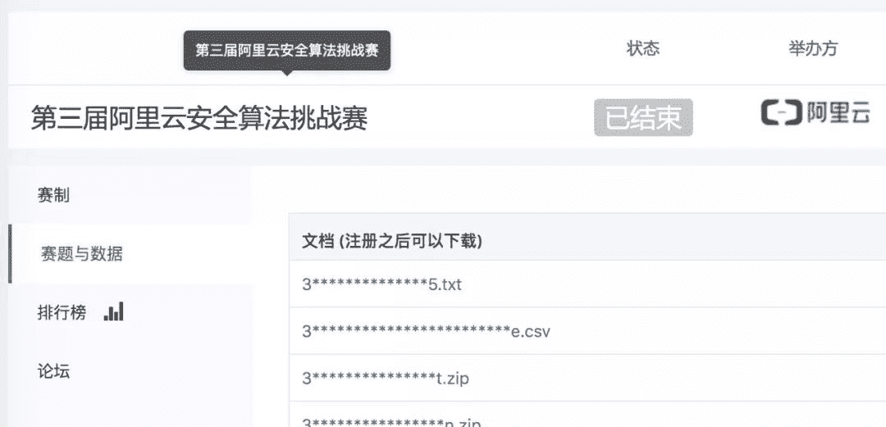

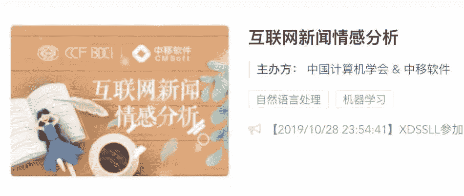

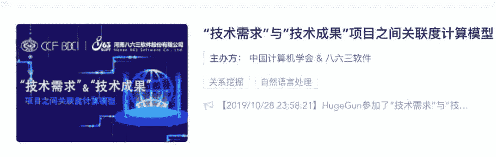

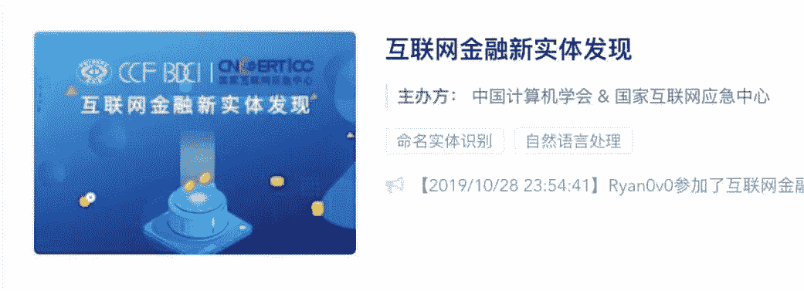

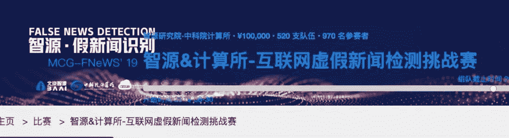

03

**项目协作**

一个优秀的开源项目少不了大家的协作，我们也希望大家踊跃参与到项目的分享过程中，让baseline帮助更多的人学习和成长。

为了让大家更加合理有序的贡献，我们初步制定了以下的协作机制：

1.  代码按照比赛的形式整理，写明比赛网址、数据类型和解题赛题；

2.  代码注明运行的环境，机器最低配置，如：

*   操作系统：Linux，内存16G，

*   Python环境：Python2/3

*   Pytorch版本：0.4.0

*   baseline代码只能提供可运行的代码和思路，请不要提供直接可以提交的结果文件；

*   代码提供者应对代码版权和共享权负责；

*   **Datawhale竞赛****群已成立**

    扫描下方二维码，添加**负责人微信**，可申请加入竞赛学习交流群，一起组队参赛（一定要备注：**入群+学校/公司+方向****，**例如：**入群+浙大+机器学习**）

    

    ▲长按加群

    **项目地址，欢迎STAR**