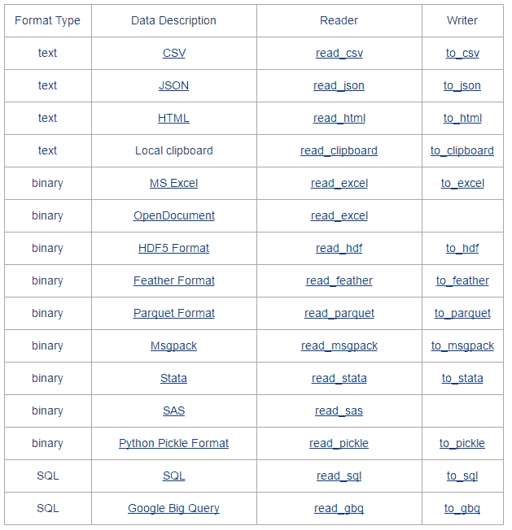

点击上方“**Datawhal****e**”，选择“星标”公众号

第一时间获取价值内容


## 阅读目录

1 引言

2 文本文件（txt、csv）

2.1 读取数据

2.2 写入数据

3 excel文件

3.1 读取数据

3.2 写入数据

4 mysql数据库

5 mongodb数据库

## 1 引言

数据分析、数据挖掘、可视化是Python的众多强项之一，但无论是这几项中的哪一项都必须以数据作为基础，数据通常都存储在外部文件中，例如txt、csv、excel、数据库。本篇中，我们来捋一捋Python中那些外部数据文件读取、写入的常用方法。

下表是Pandas官方手册上给出的一张表格，表格描述的是Pandas中对各种数据文件类型的读、写函数，你可以直接在官方手册中找到：



通过阅读表格，可以发现，Pandas中提供了非常丰富的数据读写方法。不过本文只讲述文本文件（txt、csv）、excel文件、关系型数据库（mysql）、非关系型数据库（mongodb）的读写方式。

## 2 文本文件（txt、csv）

无论是txt文件还是csv文件，在Pandas中都使用read_csv()方法读取，当然也使用同一个方法写入到文件，那就是to_csv()方法。

我们先来说说怎么读取数据。所要读取的文件名为“data.csv"，文件内容用记事本打开后如下所示：


### 2.1 读取数据

为了提供更加多样化、可定制的功能，read_csv()方法定义了参数数十个参数，还好的是大部分参数并不常用，而且绝大多数情况使用默认值就可以，所以只需要记住以下的几个比较常用的参数就可以了：

（1）filepath_or_buffer：文件所在路径，可以是一个描述路径的字符串、pathlib.Path对象、http或ftp的连接，也可以是任何可调用read()方法的对象。这个参数是唯一一个必传的参数。

```
>>> import pandas as pd
>>> df = pd.read_csv('data.csv', encoding='gbk')
>>> df
姓名 语文 数学 英语
0 陈一 89 90 67
1 赵二 70 78 90
2 张三 87 86 79
3 李四 90 69 84
4 王五 78 80 69 
```

（2）encoding ：编码，字符型，通常为'utf-8'，如果中文读取不正常，可以将encoding设为’gbk‘。

在上面打开data.csv文件的例子中，如果不指定encoding='gbk'则会出现下面的异常。当然，你也可以在记事本中通过另存为的方式将编码修改为utf-8，这样就可以使用默认的utf-8编码。

UnicodeDecodeError: 'utf-8' codec can't decode byte 0xd0 in position 0: invalid continuation byte

（3）sep：分隔符，默认为一个英文逗号，即','。

（4）delimiter ：备选分隔符，如果指定了delimiter则sep失效。

（5）header ：整数或者由整数组成的列表，以用来指定由哪一列或者哪几列作为列名，默认为header=0，表示第一列作为列名。

```
>>> pd.read_csv('data.csv', encoding='gbk', header=1) # 指定第二列作为列名
陈一 89 90 67
0 赵二 70 78 90
1 张三 87 86 79
2 李四 90 69 84
3 王五 78 80 69 
```

可以看到，当指定第一行之后的数据作为列名时，前面的所有行都会被略过。

也可以传递一个包含多个整数的列表给header，这样每一列就会有多个列名。如果中间某一行没有指定，那么改行会被略过，例如下面的第三行：

```
>>> df = pd.read_csv('data.csv', encoding='gbk', header=[0,1,3])
>>> df
姓名 语文 数学 英语
陈一 89 90 67
张三 87 86 79
0 李四 90 69 84
1 王五 78 80 69 
```

当文件中没有列名一行数据时，可以传递header=None，表示不从文件数据中指定行作为列名，这是Pandas会自动生成从零开始的序列作为列名：

```
>>> df = pd.read_csv('data.csv', encoding='gbk', header=None)
>>> df
0 1 2 3
0 姓名 语文 数学 英语
1 陈一 89 90 67
2 赵二 70 78 90
3 张三 87 86 79
4 李四 90 69 84
5 王五 78 80 69 
```

（6）names：一个列表，为数据额外指定列名。

```
>>> df = pd.read_csv('data.csv', encoding='gbk', names=['第一列', '第二列', '第三列', '第四列'])
>>> df
第一列 第二列 第三列 第四列
0 姓名 语文 数学 英语
1 陈一 89 90 67
2 赵二 70 78 90
3 张三 87 86 79
4 李四 90 69 84
5 王五 78 80 69 
```

### 2.2 写入数据

to_csv()方法可以将Pandas数据写入到文本文件中，常用参数如下：

（1）path_or_buf：表示路径的字符串或者文件句柄。例如，将上面读取出来的数据写入到名为data_1.txt文件中：

df.to_csv('data_1.txt')

如果data_1.txt文件不存在，则会新建data_1.txt文件后再写入，如果本来已存在该文件，则会清空后再写入，写入后data_1.txt文件内容如下：

,第一列,第二列,第三列,第四列

0,姓名,语文,数学,英语

1,陈一,89,90,67

2,赵二,70,78,90

3,张三,87,86,79

4,李四,90,69,84

5,王五,78,80,69

可以看到，无论是行索引还是列名和真实数据都写入到了文件中。

（2）sep：分隔符，默认为因为逗号’,‘。例如指定分隔符为’-‘将之前读取的数据写入文件中：

```
 >>> df.to_csv('data_1.txt', sep='*') 
```

写入后data_1.txt文件内容如下：

```
*第一列*第二列*第三列*第四列
0*姓名*语文*数学*英语
1*陈一*89*90*67
2*赵二*70*78*90
3*张三*87*86*79
4*李四*90*69*84
5*王五*78*80*69 
```

（3）header：元素为字符串的列表，或布尔型数据。当为列表时表示重新指定列名，当为布尔型时，表示是否写入列名：

```
df.to_csv('data_1.txt', header=['第1列', '第2列', '第3列', '第4列']) 
```

写入数据后文件内容：

```
,第1列,第2列,第3列,第4列
0,姓名,语文,数学,英语
1,陈一,89,90,67
2,赵二,70,78,90
3,张三,87,86,79
4,李四,90,69,84
5,王五,78,80,69 
```

（4）columns：一个列表，重新指定写入文件中列的顺序。

```
df.to_csv('data_1.txt', columns=['第四列', '第二列', '第三列', '第一列']) 
```

写入后文件内容:

```
,第四列,第二列,第三列,第一列
0,英语,语文,数学,姓名
1,67,89,90,陈一
2,90,70,78,赵二
3,79,87,86,张三
4,84,90,69,李四
5,69,78,80,王五 
```

（5）index_label ：字符串或布尔型变量，设置索引列列名：

```
>>> df.to_csv('data_1.txt', index_label='index') 
```

写入后文件内容：

index,第一列,第二列,第三列,第四列

0,姓名,语文,数学,英语

1,陈一,89,90,67

2,赵二,70,78,90

3,张三,87,86,79

4,李四,90,69,84

5,王五,78,80,69

```
>>> df.to_csv('data_1.txt', index_label=False) 
```

第一列,第二列,第三列,第四列

0,姓名,语文,数学,英语

1,陈一,89,90,67

2,赵二,70,78,90

3,张三,87,86,79

4,李四,90,69,84

5,王五,78,80,69

（6）index：布尔型，是否写入索引列，默认为True

```
>>> df.to_csv('data_1.txt', index=False, index_label=False) 
```

第一列,第二列,第三列,第四列

姓名,语文,数学,英语

陈一,89,90,67

赵二,70,78,90

张三,87,86,79

李四,90,69,84

王五,78,80,69

（7）encoding：写入的编码，默认是utf-8。

```
>>> df.to_csv('data_1.csv', encoding='gbk') 
```

写入后文件内容：

,第一列,第二列,第三列,第四列

0,姓名,语文,数学,英语

1,陈一,89,90,67

2,赵二,70,78,90

3,张三,87,86,79

4,李四,90,69,84

5,王五,78,80,69

## 3 excel文件

在使用pandas读取excel文件之前，需要先安装Python读取excel的依赖包：xlrd，可以使用pip命令从豆瓣源上下载：

```
pip install -i https://pypi.douban.com/simple xlrd 
```

示例文件名为data.xlsl，里面有两张sheet，sheet1内容如下：


Sheet2内容如下：


### 3.1 读取数据

pandas读取excel数据通过reade_excel方法，下面通过实例来感受一下read_excel方法的几个常用参数：

（1）io：需要读取的文件，可以是文件路径、文件网址、file-like对象、xlrd workbook对象。这是唯一一个必填的参数。

```
>>> pd.read_excel('data.xlsx')
姓名 语文 数学 英语
0 陈一 89 90 67
1 赵二 70 78 90
2 张三 87 86 79
3 李四 90 69 84
4 王五 78 80 69 
```

（2）sheet_name ：指定需要读取的Sheet。有一下几种情况：

整型：通过数字索引读取Sheet，索引从0开始，sheet_name默认参数就是0，表示读取第一张Sheet。

```
>>> pd.read_excel('data.xlsx', sheet_name=1)
姓名 语文 数学 英语
0 李白 70 80 90
1 杜浦 70 80 90
2 王安石 70 80 90
3 苏东坡 70 80 90
4 李清照 70 80 90 
```

字符型：通过名称来读取Sheet。

```
>>> pd.read_excel('data.xlsx', sheet_name='Sheet2')
姓名 语文 数学 英语
0 李白 70 80 90
1 杜浦 70 80 90
2 王安石 70 80 90
3 苏东坡 70 80 90
4 李清照 70 80 90 
```

列表：指定多个需要读取的Sheet，列表的元素可以使索引，也可以是字符串，例如[0, 1, 'Sheet3']表示读取第一张、第二张和名为Sheet3的3张Sheet，返回的数据是以列表元素为键包含数据的DataFrame对象为值的字典。

```
>>> data = pd.read_excel('data.xlsx', sheet_name=[0, 'Sheet2'])
>>> data[0]
姓名 语文 数学 英语
0 陈一 89 90 67
1 赵二 70 78 90
2 张三 87 86 79
3 李四 90 69 84
4 王五 78 80 69
>>> data['Sheet2']
姓名 语文 数学 英语
0 李白 70 80 90
1 杜浦 70 80 90
2 王安石 70 80 90
3 苏东坡 70 80 90
4 李清照 70 80 90 
```

None：表示读取所有Sheet，返回的是以Sheet名为键，包含数据的DataFrame对象为值的字典。

```
>>> data = pd.read_excel('data.xlsx', sheet_name=None)
>>> data['Sheet1']
姓名 语文 数学 英语
0 陈一 89 90 67
1 赵二 70 78 90
2 张三 87 86 79
3 李四 90 69 84
4 王五 78 80 69
>>> data['Sheet2']
姓名 语文 数学 英语
0 李白 70 80 90
1 杜浦 70 80 90
2 王安石 70 80 90
3 苏东坡 70 80 90
4 李清照 70 80 90 
```

（3）header：指定Sheet的表头，参数可以表示行索引是整型，表示指定哪一行作为表头，默认值是0，表示以第一行作为表头。也可以是元素为整型的列表，表示选用多行作为表头。

```
>>> pd.read_excel('data.xlsx', sheet_name='Sheet2', header=1) # 整型指定一行作为表头
李白 70 80 90
0 杜浦 70 80 90
1 王安石 70 80 90
2 苏东坡 70 80 90
3 李清照 70 80 90
>>> pd.read_excel('data.xlsx', sheet_name='Sheet2', header=[0,2]) # 列表指定多行作为表头
姓名 语文 数学 英语
杜浦 70 80 90
0 王安石 70 80 90
1 苏东坡 70 80 90
2 李清照 70 80 90 
```

（4）index_col ：指定行标签，或者说行名。当时一个整数时，表示指定某一行行作为行标签，当是一个列表（元素都为整型）时，表示指定多列作为行标签。默认值为None，表示自动生成以0开始的整数作为行标签。

```
>>> pd.read_excel('data.xlsx', sheet_name=0, index_col=0) # 指定第一行作为行标签
语文 数学 英语
姓名
陈一 89 90 67
赵二 70 78 90
张三 87 86 79
李四 90 69 84
王五 78 80 69
>>> pd.read_excel('data.xlsx', sheet_name=0, index_col=[0, 1]) # 指定第一行第二行作为行标签
数学 英语
姓名 语文
陈一 89 90 67
赵二 70 78 90
张三 87 86 79
李四 90 69 84
王五 78 80 69 
```

（5）usecols：指定需要加载的列，参数有以下几种情况：

默认值None：表示加载所有列

单个整数：加载指定一列，但这种方式未来会被取消，加载单行也最好放在列表里。

```
>>> pd.read_excel('data.xlsx', sheet_name=0, usecols=1)
姓名 语文
0 陈一 89
1 赵二 70
2 张三 87
3 李四 90
4 王五 78 
```

元素为整数的列表：加载指定多列。

```
>>> pd.read_excel('data.xlsx', sheet_name=0, usecols=[0,2,3])
姓名 数学 英语
0 陈一 90 67
1 赵二 78 90
2 张三 86 79
3 李四 69 84
4 王五 80 69 
```

### 3.2 写入数据

将数据写入excel得通过DataFrame对象内定义的to_excel()方法。在使用to_excel()方法前，也有一个第三方库需要装，那就是openpyxl：

pip install -i https://pypi.douban.com/simple openpyxl

to_excel()方法常用参数如下：

（1）excel_writer：必传参数，指定需要写入的excel文件，可以使表示路径的字符串或者ExcelWriter类对象。

（2）sheet_name：指定需要将数据写入到哪一张工作表，默认值是Sheet1

（3）float_format：指定浮点型数的格式，例如当指定float_format="%%.2f"时，0.1234将会转为0.12。

（4）na_rep：字符型，写入数据时用什么代替空值。

```
>>> import pandas as pd
>>> pd.read_excel('data.xlsx')
姓名 语文 数学 英语
0 陈一 89.0 90.0 67.0
1 赵二 NaN 78.0 90.0
2 张三 87.0 NaN 79.0
3 李四 90.0 69.0 NaN
4 王五 78.0 80.0 69.0
>>> df = pd.read_excel('data.xlsx')
>>> df.to_excel('data_1.xlsx', na_rep='--') 
```

写入后文件内容如下所图示：


（5）header：是否写入表头，值可以使布尔型或者元素为字符串的列表，默认为True表示写入表头。

```
>>> df.to_excel('data_1.xlsx', header=['第一列', '第二列', '第三列', '第四列']) 
```

写入文件内容如下：


（6）index：是否写入行号，值为布尔型，默认为True，当为False时上面图中第一列的行号就不会写入了。

（7）columns：指定需要写入文件的列，值是元素为整型或字符串的列表。

## 4 mysql数据库

在名为test的数据库中有一张student的表，表结构和数据如下所示：


现在通过pandas来读取student表数据。在读取数据之前，先要安装Python读取mysql的第三方库：

pip install -i https://pypi.douban.com/simple pymysql

pandas读取mysql数据库时通过pandas中的read_mysql()方法，主要参数如下：

（1）sql：要执行的查询SQL语句，必传参数。

（2）conn：数据库连接，可以使用pymysql创建，必传参数。

```
import pandas as pd
import pymysql

conn = pymysql.connect(host="localhost",user='chb', password='123456', db="test",charset="utf8")
sql = 'select * from student'
df = pd.read_sql(sql, conn)
print(df)
conn.close() 
```

输出结果如下：

id name Chinese Math English

0 1 陈一 67 60 56

1 2 李红 89 87 67

2 3 张大 76 56 98

3 4 杜军 95 90 72

## 5 mongodb数据库

pandas中并没有直接读取mongodb数据库的方法提供，这是让我很疑惑的地方，毕竟mongodb也是主流的非关系型数据库。在开始之前，请安装好pymongo第三方：

pip install -i https://pypi.douban.com/simple pymongo

既然pandas中没有直接读取mongodb数据库的方法，我们就需要用将数据用pymongo读取出来：

```
import pandas as pd
import pymongo
client = pymongo.MongoClient(host='localhost', port=27017)
db = client['eleme']
db.authenticate('chb', '123456', 'admin')
collection = db['test']
data = collection.find()
for item in data:
print(item) 
```

输出结果如下：

{'_id': 1, 'name': '张三', 'Chinese': 67, 'Math': 89, 'English': 97}

{'_id': 2, 'name': '李四', 'Chinese': 65, 'Math': 49, 'English': 78}

{'_id': 3, 'name': '王五', 'Chinese': 81, 'Math': 63, 'English': 84}

{'_id': 4, 'name': '黄六', 'Chinese': 70, 'Math': 69, 'English': 73}

将上面的数据传递给pandas，实例化DataFrame对象即可：

```
import pandas as pd
import pymongo
client = pymongo.MongoClient(host='94.191.85.11', port=27017)
db = client['eleme']
db.authenticate('chb', 'psd.mo.1123', 'admin')
collection = db['test']
data = collection.find()
df = pd.DataFrame(list(data)) # 用读取出来的数据实例化DataFrame
print(df) 
```

输出结果如下：

_id name Chinese Math English

0 1 张三 67 89 97

1 2 李四 65 49 78

2 3 王五 81 63 84

3 4 黄六 70 69 73

## 作者：奥辰

https://www.cnblogs.com/chenhuabin/p/11477076.html

**Datawhale高校****群和在职群已成立**

扫描下方二维码，添加**负责人微信**，可申请加入AI学习交流群（一定要备注：**入群+学校/公司+方向****，**例如：**入群+浙大+机器学习**）


▲长按加群

