专栏《NLP》第一阶段正式完结了。在本专栏中，我们从NLP中常用的机器学习算法开始，介绍了NLP中常用的算法和模型；从朴素贝叶斯讲到XLnet，特征抽取器从RNN讲到transformerXL。这篇文章我们就一起回顾一下这些文章。

作者&编辑 | 小Dream哥

**1 朴素贝叶斯**

贝叶斯分类器在早期的自然语言处理任务中有着较多实际的应用，例如大部分的垃圾邮件处理都是用的贝叶斯分类器。

贝叶斯决策论是在统计概率框架下进行分类决策的基本方法。对于分类任务来说，在所有相关概率都已知的情况下，贝叶斯决策论考虑如何基于这些概率和误判损失来预测分类。

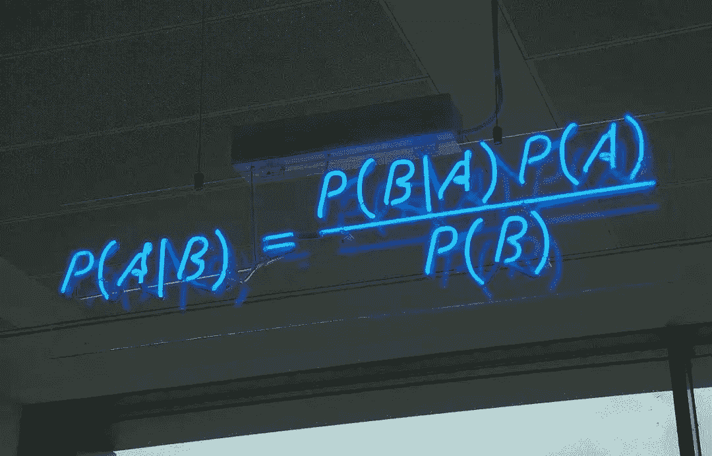

[【NLP】经典分类模型朴素贝叶斯解读](https://mp.weixin.qq.com/s?__biz=MzA3NDIyMjM1NA%3D%3D&chksm=8712b3cdb0653adba7b75bea1f862e557117edbbf97a4bdac78b8c8d9e1e87b05109d60130a4&idx=2&mid=2649034160&scene=21&sn=fc7efd1b6de893fe78e09c53b4112590#wechat_redirect)

**2 隐马尔科夫模型(HMM)**

HMM早期在语音识别、分词等序列标注问题中有着广泛的应用。

HMM是非常适合用于序列标注问题的。HMM模型引入了马尔科夫假设，即T时刻的状态仅仅与前一时刻的状态相关。

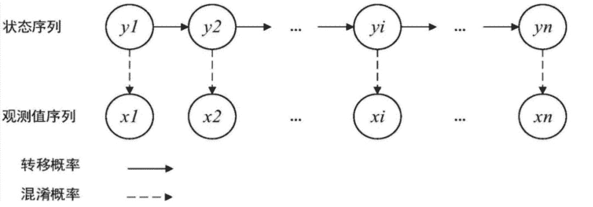

[【NLP】用于语音识别、分词的隐马尔科夫模型HMM](https://mp.weixin.qq.com/s?__biz=MzA3NDIyMjM1NA%3D%3D&chksm=8712b231b0653b27f94018743d6f4f64582a2a29d3caa01d61e71cfaf89a8d32dbcb877e105e&idx=2&mid=2649033804&scene=21&sn=faf79533669416849e807a0aeb2c7eee#wechat_redirect)

**3 条件随机场(CRF)**

隐马尔科夫模型引入了马尔科夫假设，即当前时刻的状态只与其前一时刻的状态有关。但是，在序列标注任务中，当前时刻的状态，应该同该时刻的前后的状态均相关。于是，在很多序列标注任务中，引入了条件随机场。

这里详细了介绍条件随机场的理论和及其在实体识别中的应用和Tensorflow中的实现。

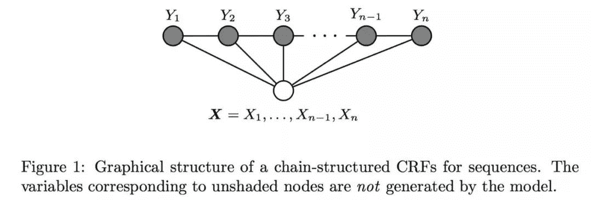

[【NLP】用于序列标注问题的条件随机场（Conditional Random Field, CRF）](https://mp.weixin.qq.com/s?__biz=MzA3NDIyMjM1NA%3D%3D&chksm=8712b2b7b0653ba1f27f9288e8642d120ab850bf9cfae5293af7b027d108c1901c3e2d123629&idx=2&mid=2649033930&scene=21&sn=19041a898ee193d215d2353a6ab3eb6e#wechat_redirect)

**4 循环神经网络(RNN)**

对于一些序列输入的信息，例如语音、语言等，不同时刻之间的输入存在相互的影响，需要一种模型能够“记忆”历史输入的信息，进而对整个序列进行完整的特征提取和表征。

循环神经网络(RNN)就是面对这样的需求提出来的，它能够“记忆”序列输入的历史信息，从而能够较好的对整个序列进行语义建模。

RNN虽然理论上可以很漂亮的解决序列数据的训练，但是它也像DNN一样有梯度消失的问题，当序列很长的时候问题尤其严重。虽然同选择合适的激活函数等方法能够一定程度的减轻该问题。但人们往往更青睐于使用RNN的变种。

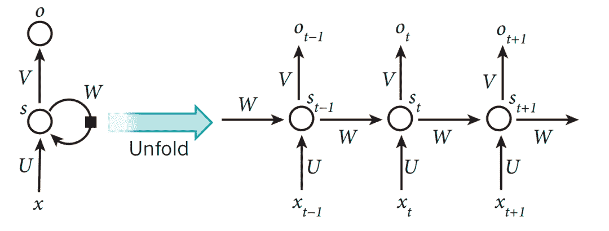

[【NLP】 深度学习NLP开篇-循环神经网络(RNN)](https://mp.weixin.qq.com/s?__biz=MzA3NDIyMjM1NA%3D%3D&chksm=8712b0f3b06539e5afe386786b291e12296843ee5b0ba0300d79807efb1e14ce9f66cb544400&idx=2&mid=2649034382&scene=21&sn=6d2b2efc32eeb861fc58a1c8a612eb9d#wechat_redirect)

**5 ****LSTM**

LSTM在原本RNN的基础上增加了CEC的内容，CEC保证了误差以常数的形式在网络中流动，这部分通过引入细胞状态C来体现。

并且，为了解决输入和输出在参数更新时的矛盾，在CEC的基础上添加3个门使得模型变成非线性的，就可以调整不同时序的输出对模型后续动作的影响。

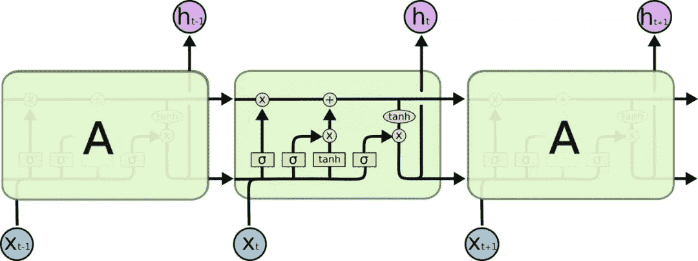

[【NLP】 NLP中应用最广泛的特征抽取模型-LSTM](https://mp.weixin.qq.com/s?__biz=MzA3NDIyMjM1NA%3D%3D&chksm=8712b156b06538400202aebeddd2424f6af163894b12c657bc8ff6029876f0e8a03e6b72df14&idx=1&mid=2649034539&scene=21&sn=4135bb25d44552cff816fb43bf6e9eb0#wechat_redirect)

**6 ****NLP中Attention机制**

人类在对信息进行处理的过程中，注意力不是平均分散的，而是有重点的分布。受此启发，做计算机视觉的朋友，开始在视觉处理过程中加入注意力机制(Attention)。随后，做自然语言处理的朋友们，也开始引入这个机制。在NLP的很多任务中，加入注意力机制后，都取得了非常好的效果。

在NLP中，Attention机制是什么呢？从直觉上来说，与人类的注意力分配过程类似，就是**在信息处理过程中，对不同的内容分配不同的注意力权重**。

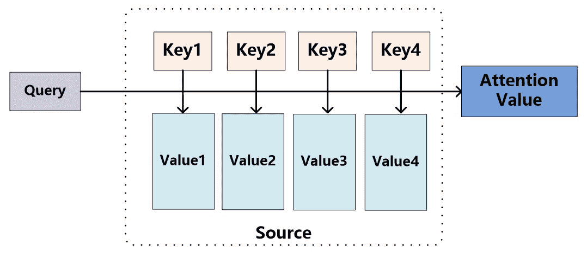

[【NLP】 聊聊NLP中的attention机制](https://mp.weixin.qq.com/s?__biz=MzA3NDIyMjM1NA%3D%3D&chksm=8712b193b0653885b808090c5c8e96ba4c7dac75fa013b1e4f72ef0027b6035155baae41c397&idx=1&mid=2649034734&scene=21&sn=78b209c04b3f69387240efa1a904278e#wechat_redirect)

**7 ****特征抽取器Tranformer**

Transformer中最重要的特点就是引入了Attention，特别是Multi-Head Attention。作为一个序列输入的特征抽取器，其编码能力强大，没有明显的缺点。短期内难以看到可以匹敌的竞争对手。

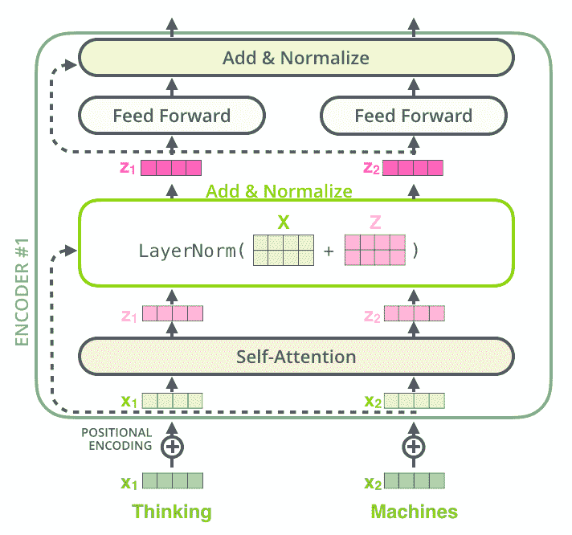

[【NLP】 理解NLP中网红特征抽取器Tranformer](https://mp.weixin.qq.com/s?__biz=MzA3NDIyMjM1NA%3D%3D&chksm=8712aee8b06527fee9a62c070313c47067e2bc00cb1a39b19401b4bf8d0e364eb88e28826667&idx=2&mid=2649034901&scene=21&sn=5a12aff786df3f305a5a05595fb6b8b8#wechat_redirect)

**8 ****BERT**

BERT，全称是Pre-training of Deep Bidirectional Transformers for Language Understanding。注意其中的每一个词都说明了BERT的一个特征。

Pre-training说明BERT是一个预训练模型，通过前期的大量语料的无监督训练，为下游任务学习大量的先验的语言、句法、词义等信息。

Bidirectional 说明BERT采用的是双向语言模型的方式，能够更好的融合前后文的知识。

Transformers说明BERT采用Transformers作为特征抽取器。

Deep说明模型很深，base版本有12层，large版本有24层。

总的来说，**BERT是一个用Transformers作为特征抽取器的深度双向预训练语言理解模型**。

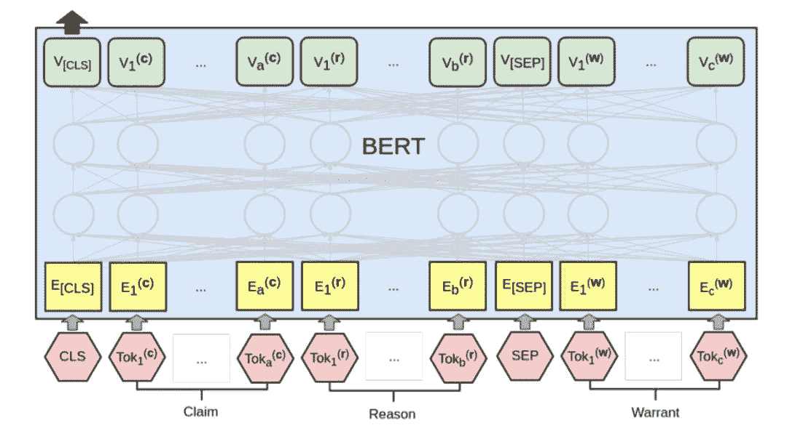

[【NLP】 深入浅出解析BERT原理及其表征的内容](https://mp.weixin.qq.com/s?__biz=MzA3NDIyMjM1NA%3D%3D&chksm=8712af52b06526443ed01d2ec3bb9d8621ec4ef714b132dfa88020bbda268fdc22ab2e598f78&idx=1&mid=2649035055&scene=21&sn=c49f6919ec8d0fef269f751680819edf#wechat_redirect)

**9 transformerXL**

TransformerXL是Transformer一种非常重要的改进，通过映入Recurrence机制和相对位置编码，增强了Transformer在长文本输入上的特征抽取能力。

TransformerXL学习的依赖关系比RNN长80%，比传统Transformer长450%，在短序列和长序列上都获得了更好的性能，并且在评估阶段比传统Transformer快1800+倍。

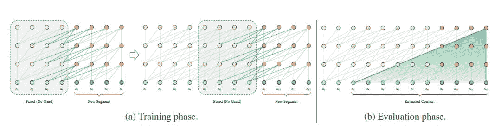

[【NLP】TransformerXL：](https://mp.weixin.qq.com/s?__biz=MzA3NDIyMjM1NA%3D%3D&chksm=8712af83b065269520cbb7ce9a8a5f70305a2e8e6f867c4ce94189742b403864a3e96d05fdc4&idx=1&mid=2649035262&scene=21&sn=b5441fcedd57690b9ed7f839900d7555#wechat_redirect)[因为XL，所以更牛](https://mp.weixin.qq.com/s?__biz=MzA3NDIyMjM1NA%3D%3D&chksm=8712af83b065269520cbb7ce9a8a5f70305a2e8e6f867c4ce94189742b403864a3e96d05fdc4&idx=1&mid=2649035262&scene=21&sn=b5441fcedd57690b9ed7f839900d7555#wechat_redirect)

**10 GPT及GPT2.0**

GPT，特别是GPT2.0是一个大型无监督语言模型，能够生产连贯的文本段落，在许多语言建模基准上取得了 SOTA 表现。而且该模型在没有任务特定训练的情况下，能够做到初步的阅读理解、机器翻译、问答和自动摘要。

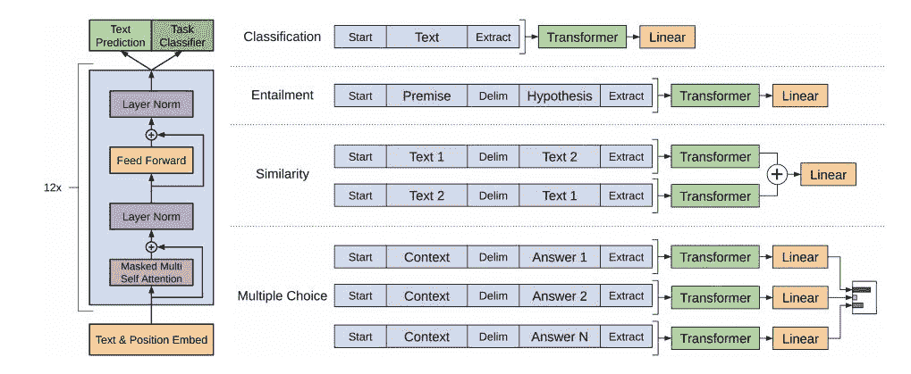

[【NLP】GPT：](https://mp.weixin.qq.com/s?__biz=MzA3NDIyMjM1NA%3D%3D&chksm=8712ad5fb06524495d663310836fd222c9e89c002ff778cba7996c90c27ca4f41b85a050cd6b&idx=2&lang=zh_CN&mid=2649035554&scene=21&sn=61cbd0046aa055b16dd2e74f6a625a4d&token=375719229#wechat_redirect)[第一个引入Transformer的预训练模型](https://mp.weixin.qq.com/s?__biz=MzA3NDIyMjM1NA%3D%3D&chksm=8712ad5fb06524495d663310836fd222c9e89c002ff778cba7996c90c27ca4f41b85a050cd6b&idx=2&lang=zh_CN&mid=2649035554&scene=21&sn=61cbd0046aa055b16dd2e74f6a625a4d&token=375719229#wechat_redirect)

**11 XLnet**

XLnet集合了目前两大预训练模型的优点，在结构上，XLnet采用改进后的transofmerXL作为特征抽取器。在训练模式上，XLnet实现了BERT的双向语言模型，引入了PLM和双流自注意力模型，避免了BERT MLM的缺点。

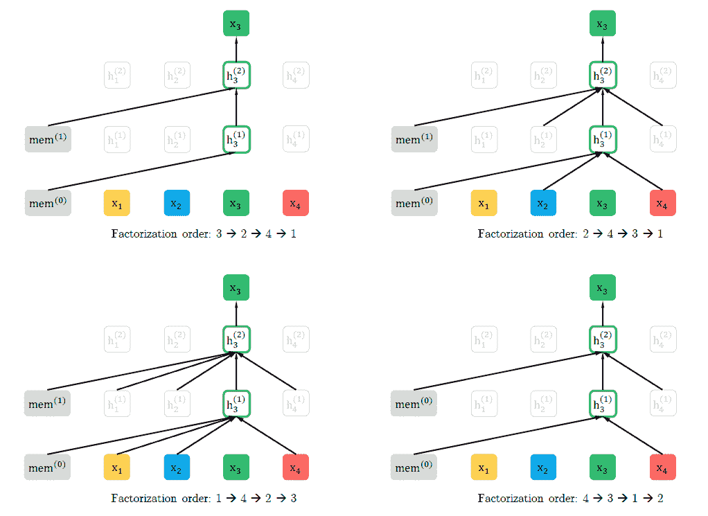

[【NLP】XLnet：](http://mp.weixin.qq.com/s?__biz=MzA3NDIyMjM1NA%3D%3D&chksm=8712acf2b06525e41d82fbc5a9b60efeca91a0eec1a1f4c96f44800b30d2fe08fb0bf5f67917&idx=2&mid=2649035407&scene=21&sn=e84f0f9f2c7458658514bf9a4e934324#wechat_redirect)[GPT和BERT的合体，博采众长，所以更强](http://mp.weixin.qq.com/s?__biz=MzA3NDIyMjM1NA%3D%3D&chksm=8712acf2b06525e41d82fbc5a9b60efeca91a0eec1a1f4c96f44800b30d2fe08fb0bf5f67917&idx=2&mid=2649035407&scene=21&sn=e84f0f9f2c7458658514bf9a4e934324#wechat_redirect)

**12 NLP综述**

从词向量开始，到最新最强大的BERT等预训练模型，梗概性的介绍了深度学习近20年在NLP中的一些重大的进展。

[【技术综述】深度学习在自然语言处理中的应用](https://mp.weixin.qq.com/s?__biz=MzA3NDIyMjM1NA%3D%3D&chksm=8712b3cdb0653adbab730d323c1e8356e0d55bd64f98fcdc2911b9f1d11dc99dbc51b24fb9ae&idx=1&mid=2649034160&scene=21&sn=038c41e1bbbda7877027afe524d78971#wechat_redirect)

