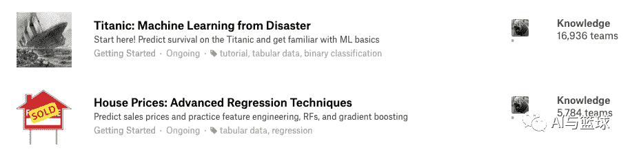
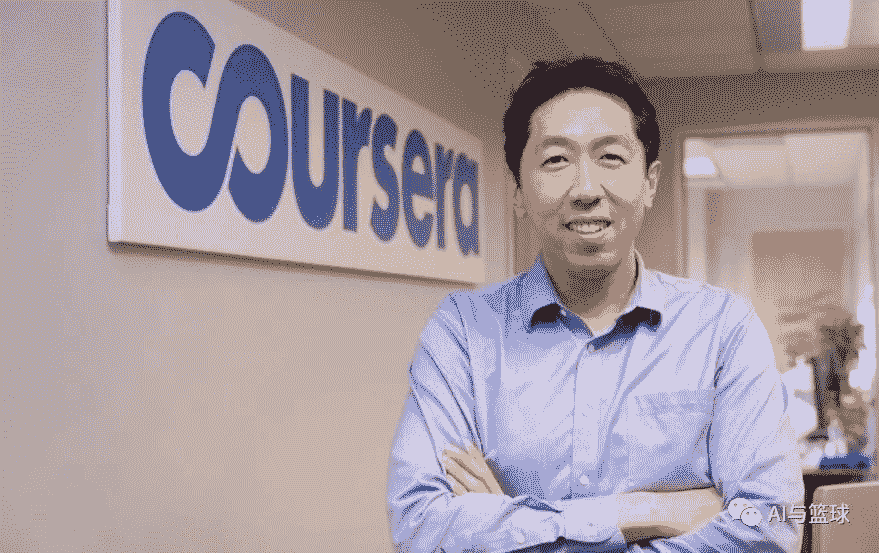
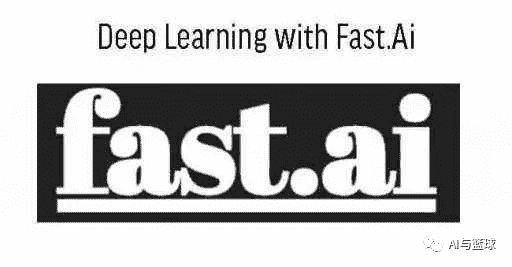

【导语】网上已经有很多在互联网公司工作的算法工程师的日常了，那么小编便来说说在咨询公司，身为算法工程师，工作是一种什么样子的体验，同时也为对咨询感兴趣的小伙伴指明点方向。

具体内容：

*   工作内容详解

*   对工作内容的感悟

*   对求职者的建议

*   相关的学习资料

01

工作内容

1.  数据的统计分析。比方说根据产品品类的不同做一个销量的汇总，或者根据地区的不同做一个销售额的汇总等等。

2.  数据的预处理。首先要从数据库中取数，但是往往取出来的数据是“不干净”的，普遍存在缺失值，数据类型不正确，日期格式错误和异常值等问题，所以在真正建模之前，你可能会花大量的时间来修正错误数据，处理异常值和缺失值等。

3.  建模。主要是用深度学习算法和机器学习算法来进行时间序列的预测，比如在未来的某一个时间点，某某变量发生了多少的变化，变到多少等。

4.  爬虫。主要是去爬取社交媒体上面网友的ID和评论，以便做人群画像和舆论分析。

02

对工作的感悟

01

语言表达和口头交流能力更加重要

和互联网公司的算法工程师不同的是，咨询公司里面的算法工程师，最重要的技能倒并不是coding能力或建模能力有多强，而是沟通能力和语言表达能力需要非常的棒，到最后的最后，你需要用通俗易懂的语言将模型(包括其中的原理，过程以及产生的结果)解释给客户听，并且需要让客户信服最后的结果，所以对在咨询公司的算法工程师来说，将技术层面上的内容翻译成通俗的例子，也是一项必备的技能。

02

清理数据和特征工程占了很大一部分时间

首先，数据的来源可能并不唯一，在日常工作当中，可能会需要用SQL查询数据库取数，数据也有可能从第三方系统得到，会需要从web端抓取，以及从API和合作伙伴处获取。当涉及到不同数据的来源，数据校验和统计口径的统一就变得至关重要。同理，特征工程和特征筛选也是建模当中必不可少的一步，你需要在对业务知识的理解基础之上去构造有效的特征并进行筛选，所以这两部分通常是非常耗时的。

03

对找应届生以及求职者的建议

1**实习真的很重要**

对应届生来说，实习真的非常的重要，实习首选去大公司实习。小编之前在美国读研，所做的实习都是当地名气不高的初创公司，所以对回国找工作并没有起到很大的帮助。很多的工作机会都是从实习开始的，在实习当中好好表现，然后拿到return offer，顺利留下来工作。

2**选择好属于自己的方向**

现在国内的算法岗主要分为是NLP，计算机视觉，推荐和数据挖掘，建议应届生或者求职者选择其中的一个方向，然后深耕。现在的算法岗已经没有16，17年那时的火爆，公司比较注重的是落地和应用，而且算法岗人多坑少，竞争相当的激烈，所以建议算法的从业者在开始之前应该要想清楚，是不是自己真的热爱这份职业。

3**对业务的掌握很关键**

对业务的熟悉程度很重要，算法作为一种技术，最后还是会回归到业务，通过算法去驱动业务，创造好的业绩，也才是公司最看重候选人的地方，所以coding能力要加强，不能只是调调参，调用一下API。

04

相关的学习资料

1

python

小编当年主要是看DataCamp和DataQuest的，里面有丰富的教学材料和练习题目可以来帮助初学者巩固知识点和锻炼编程技能，当然现在市面上python的学习资料有很多，像是慕课网呀，廖雪峰的网课等。

2

练兵场所

Kaggle对于机器学习入门的新手是一个很好的练兵场，可以先从泰坦尼克号和房价预测两个项目入手，非常适合机器学习新手开启竞赛之旅。

3

网络公开课

*   Coursera

上面有很多关于机器学习和深度学习的公开课，比方说吴恩达的机器学习和deeplearning.ai。

*   fast.ai

fast.ai也是学习深度学习很好的一个平台，成立初衷就是为了让deep learning学习起来更加的轻松和有趣，要是在学习过程当中遇到了各种困难，也可以上fast.ai的博客和社区上面去寻找答案。

4

博客和文章

除了网上的公开课，还有很多公开的博客和技术性的文章可以供大家阅读。

*   csdn是国内最接地气的博客聚集地，里面汇集了众多AI相关的文章，常常用来搜索细节知识或者代码报错时，寻求解决的途径。

*   Medium，创办人是Twitter的创始人，推崇优质内容，里面的每个作者都有自己独特的见解，值得学习和开拓眼界，不过需要科学上网哦。

**Datawhale高校****群和在职群已成立**

扫描下方二维码，添加**负责人微信**，可申请加入AI学习交流群（一定要备注：**入群+学校/公司+方向****，**例如：**入群+浙大+机器学习**）

▲长按加群

更多关于AI的学习资料，在后台回复"**AI**"获取

