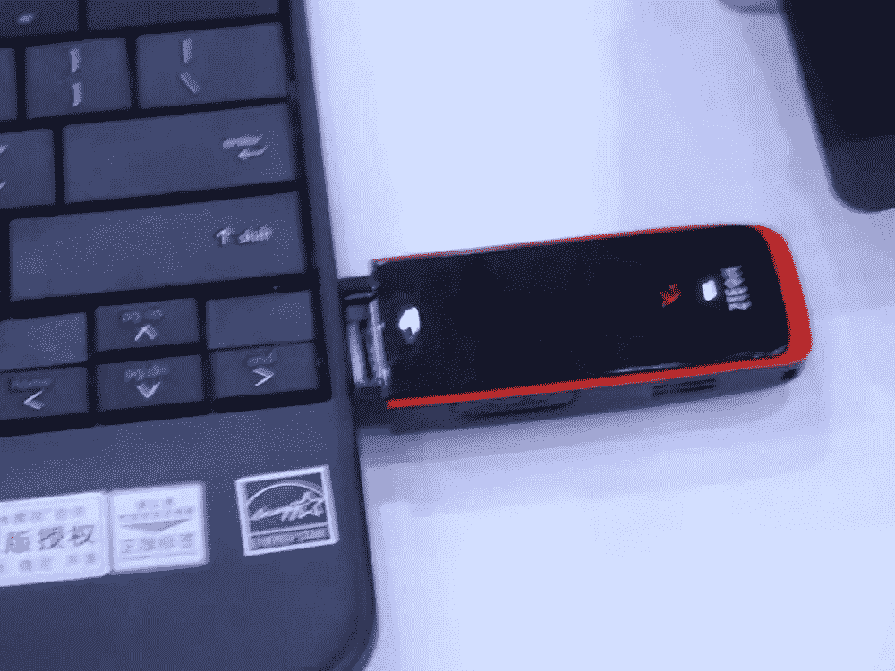
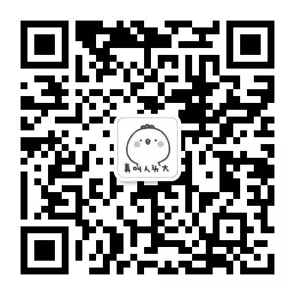

1

**写在前面**

我将用系列文章，回顾十年程序生涯，一方面是对职场生涯的阶段性总结，另一方面希望这些经历，对大家往后职场生涯有所启发。

我很庆幸一路走来皆是自己的选择，虽然也走了不少弯路，但那是我选择的生活。

一只站在树上的鸟儿，从来不会害怕树枝断裂，因为它相信的不是树枝，而是它自己的翅膀。

2

**我的选择**

上篇文章[《第 1 份工作，我只干了 2 周就被辞退了！](http://mp.weixin.qq.com/s?__biz=MzI4NDY5Mjc1Mg%3D%3D&chksm=ebf6c177dc8148610be5cdbfd2416ff05b97011a5b48653444de95ae4fd366377ceabc66bf9a&idx=1&mid=2247489800&scene=21&sn=43ff71777b5b0f5b3e80b48348c48b36#wechat_redirect)[》](http://mp.weixin.qq.com/s?__biz=MzI4NDY5Mjc1Mg%3D%3D&chksm=ebf6c177dc8148610be5cdbfd2416ff05b97011a5b48653444de95ae4fd366377ceabc66bf9a&idx=1&mid=2247489800&scene=21&sn=43ff71777b5b0f5b3e80b48348c48b36#wechat_redirect)提到，我上班两周就被辞退了，被开除后我紧急的找了一周工作，收到了 3 份 Offer ，于是我选了一个工资最高的。

这个工资最高的工作就是去华为做外包，当时面试的时候就很不友好，整个面试过程在当时西安软件园的食堂里进行的，只面了一次，大概问了几个问题，就说可以了来吧。

我对外包并没有太多了解，只是听说网上有人说外包不太好，但究竟有多不好，我并不清楚。但当时我的选择并不是很多，不管怎么样毕业了就不能再往家里要钱了，总得先挣钱吧。

于是我就做好准备去华为做外包，去上班才发现管理有多严格，入职的时候会给一个临时卡，办完手续后会有一个正式的工牌。

上班的时候，我需要刷两道门才可以进入办公室，并且进最里面的时候还需要安检，手机都必须放在办公室外面，搞得很机密，其实干的工作很普通。

3

**小巴组的工作**

当时在2010年的时候，非常流行无线上网卡，使用无线卡往电脑上面一插，电脑就可以利用无线上网卡工作了，当时 WIFI 还没有大规模流行，无线上网卡的市场还是很大的。

华为在无线上网卡产品的市场很大，不止是给中国区供货，给全球的各个运营商都发货，什么阿拉伯、中东、欧洲诸多国家的客户也非常多。

这个无线上网卡硬件上运行的软件是印度阿三做的，我们的工作就是根据各个运营商不同的需求，在整个软件系统上进行二次开发。

根据开发工作量的多少，会把不同的工作分给不同的工作组，我们当时分了三个组：大巴组，小巴组和定制组。

①定制组：不用写代码的那种，华为开发了一些工具，通过工具可以改变客户端软件的 logo，模块功能等。华为的软件真是遍布全球到处，什么的客户都有。阿拉伯、非洲各种语言大部分的需求都是基本可以用工具搞定；

②小巴组：需要改一些代码，但是工作量又不是特别多的那种；

③大巴组：改动量超过1个月以上的需求。

我当时分在了小巴组，大概有十几个人，其中也有很多硕士毕业的也被忽悠进来了。

4

**开始工作**

每个人进来都会给分配一个师傅来带，刚进去的时候把我分给了一个胖胖的小伙子，我刚坐到他旁边，他就对我讲，我在这里只剩下最后三天了，已经提离职了。

刚从大学毕业，也不知道工作是干啥，一脸蒙逼。这个胖小伙带着我熟悉环境，他说整个系统特别的庞大，想要熟悉项目全靠自己摸索。

在和我讲话的同时，他给我看了项目中的一个类，代码有4万多行，我惊呆了。但是代码确实写得非常规整，代码中的注释也很到位。

整个项目是  Swing 项目，运行起来就是一个无线上网卡的界面管理端。没有什么架构/设计文档给我们，但改动点基本都是外层的皮肤了或者小按钮之类的。

三天后他走了，领导又给我分配了一个新的师傅，比我大一岁看着挺成熟的，后来他特别照顾我，同时他的性格、态度，以及他工作的方式其实最后也都影响了我。

于是跟着当时的师傅，我开始接一些小活，慢慢的一两个月过后我上手了。接一些小巴的定制项目，也就是跟着换个 Logo 、界面加一些小功能之类的工作。

其实搞代码不是最重要的，最重要的是要把代码打包到硬件中去测试，整个流程挺复杂的，需要不同的环境中进行打包，Window\Mac 等，华为有一整套打包工具，打包出来后才能测试。

5

**出现转变**

我刚进去的时候，客户端有两种：一种是 Java 写的，一种是QT（C++的封装），慢慢的 Java 版本的都淘汰了，全部上线了 QT。

当时和我一起做 Java 版本的人也都慢慢离职了，在公司呆了 5 个月后就发现我成了“老人”，也开始慢慢带徒弟了。

期间华为终端部曾经组织过一个 Java 专项培训，5个工作日培训不用上班，我这边的领导的领导给我报名了，他也是华为的一个主管，可能觉得我工作还不错吧。

去了之后发现全都是华为员工，只有我一个带着黄色的牌子，华为的工牌是白色的。培训完毕之后还会有一个考试，记得那次培训还是挺干货的，培训完我的考试成绩很一般（毕竟当时底子很差）。

我从小巴慢慢开发了大巴需求（改动量很大的需求），但到最后没有 Java 版本的需求了，全部用QT。也就是半年之后，没有 Java 开发这个岗位了。

Java 组的同事都各种转型，有的去了另外一个 Js 控制的项目组，我选择了留下来搞 QT，开始学习C++，因为有 C 语言的底子，倒也不难，慢慢的可以开始搞 QT 版本的小巴需求。

但是最后我就纠结了，我以后到底是往 Java 方向发展呢，还是 C++ 呢？

6

**做出决定**

期间我们换了三次办公室，因为终端发展得太快，本来我们是坐在一个地下室办公，后来搬到西安软件园二期，软件园二期工作了 2 个月又搬了回来，来到了软件园的三期四楼。

随着时间的推移我成为了一个老人，各种开会主持带徒弟一一上手，后面也基本混成了老油条，工作也变得比较轻松了。

但是我也很迷茫了，**我花了 1 万元的培训去学了 Java ，工作半年后又转了 C++，那么未来的发展到底该走哪个方向呢**？

后来终于想通了，我花了那么多钱培训 Java ，这样太亏了 ，于是选择了离职。那时候华为方的领导其实对我也特别好，JS 项目组的老大也过来挽留，但我还是决定要离开了。

我偷偷跑出去面试了几次后，发现工作 1 年后明显比以前更好找工作了。工资至少可以要到 3k+ 以上，面了几家公司后我信心大涨。

面试的时候有一家公司比较变态，复试的时候需要展示 PPT ，当时也是这家工资要得高，想着准备就准备，没想到最后也给 Offer 了。

当时还有一家公司不错，从北京来西安开拓市场，正在组建研发团队，我和他们的老大聊得也不错，做的是地图这个方向，最后放弃了，感觉方向不是很好。

7

**华为外包工作**

华为外包有一个变态的特点：为了保密，不允许带U盘、手机等各种存储、通讯设备，上班后基本就和外界失联了，我在华为上了9个月的班，同学朋友丢了一大推。

加班非常多，但比较开心的是加班有工资，而且是按照国家标准来的，平时加班1.5倍，周六天2倍，假期3倍。这是我工作到现在最正规的加班制度了，工资只有2100，但通过加班可以拿到3000左右。

平时加班到晚上2点是很正常的事情，特别喜欢假期加班可以拿3倍工资，华为在西安包了N多大楼，当时在软件园三期，班车上百辆开出去还是挺壮观的。

华为的中午休息文化确实好，中午吃完饭熄灯大家都睡觉，中午趟在那里睡一个小时，下午工作质量明显提高 N 倍。

我在华为公司做了 9 个月后出来时，感觉特别虚， Java 的相关知识都忘完了，但是因为有了 1 年工作经验，找工作反而更容易了，**生活就是这么讽刺**。

8

**外包公司现状**

在整个互联网行业中一提到外包，大家的印象就是：比别人低一等、没有技术含量、加班很频繁、工资比较低、频繁找人裁员等等。

这里面有些是真的，有些有点夸张，刚好我也在外包公司工作过，所以先给大家简单介绍一下。

目前市场上的外包主要分为两类，一种是人力外包，就是你需要入驻到甲方，你平时的主管领导、人物分配基本上都是甲方的人来安排，以大公司外包为主，比如华为、中兴、阿里巴巴等；

另外一种是项目外包，就是公司不愿意做一个项目，把整个项目外包给了另外一个公司，这类公司以中小公司为主，公司的业务就是不断的接各种外包项目。

以上这两种外包在市场最常见，第一种可以去大公司工作，感受到大公司的工作氛围等，但总会让你感觉低人一等，虽然在一起工作，但福利待遇什么的都不一样。

第二种外包因为公司是以项目为主，当项目来的时候就猛招聘，同时不断的加班赶项目，当项目交付之后没有事情做又开始裁员，所以员工的流动性非常强。

两种情况的共同点就是：**同样加班频繁，同样同事更换频繁，同样技术含量都不会太高**。

9

**外包完全一无是处吗？**

虽然我们上面说了外包的种种不是，但是外包真的一无是处吗？

我们要知道，凡是存在的必然有它的合理之处，很多刚毕业的学生找不到工作，这个时候外包其实可以是一个选择，因为并不是谁一开始都是技术大拿。

它的招聘门槛相对比较低，不能说学不到东西，至少不会让你的技术倒退，只会进步（关键看你的团队和勤奋，完全无用论是偏激了），但是你要了解大部分的 IT 人都是抵触外包的，原因无须多说，一堆且也是事实。

在里面你至少能**学会和团队打交道**（测试人员，上司，甲方、人事、财务等），**技能知识的实际应用**（大学自己做的作品和实际产品不是一回事的）等等。

**外包公司不建议作为你的首选**，但是对于技能一般又苦于没得到实际锻炼且长时间没找到工作的应届生来说未尝不是一个很好的选择，同时也请记住，外包公司里面也是有很多大牛的。

另外还有很多专业性很强的小外包公司，做的项目很多使用的技术也很新，也能锻炼到一些实战技术，但是我们要明白，真正的技术不是使用，也不是交付给甲方后就完事。

**真正的技术绝对是在那些自己拥有产品的公司，通过用户反馈日复一日打磨产品，遇到过各种各样的极端场景，在不断解决各种各样的问题中锻炼出来的。**

所以如果有得选，我还是强烈建议大家去互联网公司，最起码是拥有自己产品的公司。

10

**居安思危**

我从那家公司离职后，仍然有好多老同事留在了那里，有的一呆就是很多年，并且呆得越久越没有办法出来换工作。

一方面在里面呆得久了技术都忘完了，另一方面人都喜欢在安逸的环境中（哪怕这个环境其实并不安逸，但当事人感觉安逸），久而久之呆得越久人就越出不来了。

所以我之前一直都喜欢对大家说一句话，**如果自己不能改变现状，那就让环境来改变自己**，去不同的公司不同的团队，带给你的压力是不一样的，这些压力也会推着你去成长。

在职场中工作，我一直认为**选择永远比努力重要**，选择不对努力白费。如果你在职场或者生活中遇到重大的选择比较迷茫时，欢迎在星球中来提问，我会很乐意给一些我的建议。

**Datawhale高校****群和在职群已成立**

扫描下方二维码，添加**负责人微信**，可申请加入AI学习交流群（一定要备注：**入群+学校/公司+方向****，**例如：**入群+浙大+机器学习**）

▲长按加群

更多关于AI的学习资料，在后台回复"**AI**"获取

