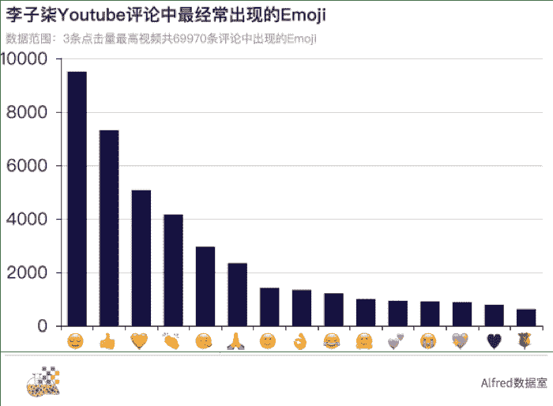

李子柒又火了。

分享古风田园生活的短视频频道**“李子柒 Liziqi”**在YouTube上获得了763万的订阅者，其短视频中传递出静谧、自给自足、远离都市的田园生活理念，赢得了无数外国人的赞赏，同时也引来了国内网友的一阵阵质疑和讨论：有人说李子柒视频里表现的生活根本就不是真正的农村生活，有人纠结于李子柒是不是我国的文化输出，有人认为这样的视频会加深外国人对中国的刻板印象……

那么究竟李子柒在YouTube火到了什么程度？吸引了哪些国家的粉丝？外国人对于李子柒的短视频普遍看法是什么？李子柒是不是文化输出呢？

为了回答这个问题，**我们获取到了“李子柒 Liziqi”YouTube频道上播放量最高的三个视频下面的69970条评论数据以及63768条评论者信息数据，来还原一个外国人眼中的李子柒。**

**一、李子柒何许人也？**

李子柒，一位来自四川绵阳的90后女生，自2016年来由于拍摄田园牧歌式的古风乡村生活而走红于网络，目前在微博已有2154万粉丝，成为名副其实的大V。

另一边，自2017年8月24日开始李子柒在YouTube上更新短视频以来，**截至目前（2019年12月16日）YouTube“李子柒 Liziqi”频道的所有视频已积累了约9.8亿的播放量，收获了763万个订阅者**，获得了众多外国粉丝的肯定，导致最近大家都在讨论李子柒，那她是近期才在YouTube上火起来的吗？

我们获取了YouTube“李子柒 Liziqi”频道上的所有101条短视频的播放量数据，并把这些数据根据短视频发布的时间绘制成图。

自从第一支短视频以来，几乎每一支YouTube“李子柒 Liziqi”频道发布的视频都可以收获到不错的播放量，**平均每支短视频的播放量达967万次，是其在Bilibili平均每支短视频的播放量的10.5倍（据我们统计，李子柒在Bilibili平均每支短视频的播放量为92万），**其视频在YouTube上的受欢迎程度和影响力可见一斑。

另外可以看到， “李子柒 Liziqi”最受欢迎的视频播放量竟然达到了4000万以上，**播放量最高的两支视频发布时间分别为2018年10月9日和2019年1月31日**，虽然说播放量数据是随着时间不断积累的，但是也可以看出，李子柒早就在YouTube上为人熟知了，并不是最近才火的。

**二、李子柒的视频在YouTube上反响如何？**

同样在国内也很火的李子柒，大家对她却提出了很多负面的质疑。那么李子柒的视频在YouTube上反响又如何呢？外国人是喜欢她的视频还是在吐槽她呢？我们统计了李子柒 Liziqi”频道在YouTube上发布的所有101支短视频收获的????(喜欢)数量和????(不喜欢)数量。

**李子柒凭借101条视频收获了16557252个人点赞喜欢，而不喜欢的数量只有369971个，喜欢和不喜欢的比例为45:1。****这说明绝大部份的外国人对于李子柒的视频都是喜欢的，不喜欢的人只占了极少数。**

其实视频评论中大家使用的Emoji可以更加准确地传达外国网友对于李子柒短视频的各种态度。为此，我们对69970条视频评论数据中出现的Emoji进行了一番统计。

可见69970条视频评论数据中最经常出现的10个Emoji几乎都是正向的Emoji，其中有点赞、有比心、有鼓掌、有献玫瑰。**这也间接说明绝大部份外国人对于李子柒的短视频的反响都是正面和肯定的，并没有出现像国内一样的对李子柒的各种质疑。**

**三、喜欢李子柒的都是哪些国家的人？**

喜欢李子柒视频的763万个订阅者中，是在国外的中国人/华人居多呢？还是外国人居多呢？是来自日本、韩国、越南等受中国文化影响国家的粉丝更多呢？还是来自西方国家的粉丝更多？

### 我们获取了63768位评论者的个人频道数据，**其中有4301人标记了自己所在的国家/地区**。我们把每个国家/地区的评论者数量投射在了地图上（颜色越深，代表来自该国家的粉丝数越多）。

### 

### 评论者数量排名前十的国家分别是**美国(843)、印度(383)、越南(356)、印尼(314)、俄罗斯(256)**、巴西(204)、英国(110)、韩国(107)、菲律宾(104)、加拿大(99)，4301名评论者分别来源于136个不同的国家/地区。也就是说，**李子柒的短视频成功地冲出了儒家文化圈，得到了世界各个国家人的接受、关注和喜爱。**

### 从李子柒YouTube视频评论区可以看到，评论是由各种不同的语言文字组成的。**从评论的语言这个侧面也可以推测李子柒的粉丝来源。**为此，我们统计了69970条评论文本所属的语言，其中使用人数前10的语言是：

### 

### **英语排名第一，占了总数的一半以上。**中文、越南语、俄语、西班牙语分别位列二到五名，另外还有日语、葡萄牙语、阿拉伯语等总共90多种语言。从中可以看出，**李子柒YouTube粉丝当中，外国人是占绝大部分的，而且她视频中传达的东西突破了各种语言障碍，受到了不同文化的粉丝们的喜爱。**

是什么让外国人那么喜欢她的视频呢？

**四、外国人为什么喜欢看李子柒的视频？**

### 我们把69970条评论中的37475条英文评论挑了出来，对评论中各单词出现的频次进行了统计，并把他们做成了一个词云图（字体越大，说明该单词在评论中出现的频次越高）。

### 

### 结合视频的热门评论，我们可以总结外国人喜欢李子柒视频的原因有：

### 1\. 李子柒同时展现出了女性的阴柔和强韧之美；

### 2\. 李子柒很勤劳，动手能力很强，可以从无到有制作各种东西，非常酷；

### 3\. 李子柒视频里展现出来的亲近自然、简单、静谧、美学是非常美好的，看了之后让人心情非常平静；

### 4\. 李子柒视频里展现的生活是大家内心里真正想要的生活，看了视频之后会重新审视自己的生活，受到鼓舞。即使面对的是完全不一样的生活，也可以通过看视频获得片刻精神上的逃离。

### 总结起来大致有三点：**一是李子柒在视频中展现的个人魅力；****二是从无到有的动手能力让人印象深刻；三是被工业化深深地改变了生活方式的现代人，接触到古老的田园牧歌式的简单、安静的生活时，心生向往。**

**五、李子柒是我国的文化输出吗？**

### 既然展现古风田园生活、里面包含了很多中国文化元素的李子柒的视频收到了那么多外国人的喜爱，那这算是我国的一种文化输出吗？

### 我们把69970条评论中跟中国(China)相关的1672条评论提取了出来，并随机抽取了一些，看看外国人在谈到中国或中国文化时在说些什么。

### 

### 

### 可以看到，**很多网友都是因为李子柒的视频开始对中国文化有了兴趣和喜爱，再进而对中国有了好感。**所以从这个层面上来看，**这确实是我国的一种文化输出**。但这种文化输出跟以往我们了解的我国文化输出的不同是：**这种文化输出并不是主观刻意的，而是作为视频中展现古风生活的一些介质附加地让外国人了解到的。**

### 我们由外国网友喜欢李子柒的原因中也可以看到，**他们并不是因为先喜欢中国文化才看的李子柒的视频，而是因为想要逃离现代工业化的生活方式、寻求心理宁静才看了李子柒的视频，之后开始对中国文化有了解。**很多人也根本不在意李子柒视频中展现的是什么文化（他们需要的，只是视频让人心神安宁的作用），甚至有部分外国网友还傻乎乎地以为李子柒是日本人、展现的是日本文化。

### 

### 

### **所以说，我们也不必把它拔高到文化输出的高度。**

### 但是为什么那么多人在意李子柒是不是文化输出这件事呢？在Alfred看来，是因为相较于我国的经济体量来说，**我国的文化输出真的是太乏善可陈了**。日本有动漫、日剧、和服、茶道等，韩国有男团、女团、偶像剧，我国的文化输出最成功的就只有功夫片了。这导致大家短时间内都把目光和希望都投在了一个短视频博主的身上，希望她代表中国文化，又怕她只展示其中一面而加深了外国人对中国的刻板印象。

### 然而，在以上1672条跟中国相关的评论中，就可以隐隐约约看到一些对于中国的刻板印象：

### 

### 正是因为这样，所以我们才**需要经营好出产“李子柒”的土壤**，让更多的各行各业的“李子柒”在认真做自己的事情的同时，可以附加地传播中国文化的方方面面。只有这样，才能破除外国人的刻板印象，才能让外国人看到一个完整的、富有活力的中国文化。

<article>

**Datawhale高校****群和在职群已成立**

扫描下方二维码，添加**负责人微信**，可申请加入AI学习交流群（一定要备注：**入群+学校/公司+方向****，**例如：**入群+浙大+机器学习**）

▲长按加群

获取本文爬虫及数据分析代码，在后台回复"**李**"

</article>