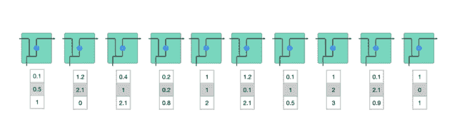

##### 作者 Michael Nguyen
王小新 编译自 Towards Data Science
量子位 出品 | 公众号 QbitAI

AI识别你的语音、回答你的问题、帮你翻译外语，都离不开一种特殊的循环神经网络（RNN）：长短期记忆网络（Long short-term memory，LSTM）。

最近，国外有一份关于**LSTM**及其变种**GRU**（Gated Recurrent Unit）的图解教程非常火。教程先介绍了这两种网络的基础知识，然后解释了让LSTM和GRU具有良好性能的内在机制。当然，通过这篇文章，还可以了解这两种网络的一些背景。

图解教程的作者Michael Nguyen是一名AI语音助理方面的机器学习工程师。

下面，跟着量子位一起来**学习一下~**

# 短期记忆问题

RNN受限于短期记忆问题。如果一个序列足够长，那它们很难把信息从较早的时间步传输到后面的时间步。因此，如果你尝试处理一段文本来进行预测，RNN可能在开始时就会遗漏重要信息。

在反向传播过程中，RNN中存在梯度消失问题。梯度是用于更新神经网络权重的值，梯度消失问题是指随着时间推移，梯度在传播时会下降，如果梯度值变得非常小，则不会继续学习。

###### **△** 梯度更新规则

因此，在RNN中，梯度小幅更新的网络层会停止学习，这些通常是较早的层。由于这些层不学习，RNN无法记住它在较长序列中学习到的内容，因此**它的记忆是短期的。**

关于RNN的更多介绍，可访问：
https://towardsdatascience.com/illustrated-guide-to-recurrent-neural-networks-79e5eb8049c9

# 解决方案：LSTM和GRU

LSTM和GRU是克服短期记忆问题提出的解决方案，它们引入称作**“门”**的内部机制，可以调节信息流。

这些门结构可以学习序列中**哪些数据是要保留的重要信息，哪些是要删除的**。通过这样做，它可以沿着长链序列传递相关信息来执行预测。几乎所有基于RNN的先进结果都是通过这两个网络实现的。LSTM和GRU经常用在语音识别、语音合成和文本生成等领域，还可用来为视频生成字幕。

当你看完这篇文章时，我相信你会对LSTM和GRU在处理长序列的突出能力有充分了解。下面我将通过直观解释和插图来进行介绍，并尽可能绕开数学运算。

# 直观认识

我们从一个思考实验开始。当你在网络上购买生活用品时，一般会先阅读商品评论来判断商品好坏，以确定是否要购买这个商品。

当你查看评论时，你的大脑下意识地只会记住重要的关键词。你会选择“amazing”和“perfectly balanced breakfast”这样的词汇，而不太关心“this”，“give”，“all”，“should”等字样。如果有人第二天问你评论内容，你可能不会一字不漏地记住它，而是记住了主要观点，比如“下次一定还来买”，一些**次要内容自然会从记忆中逐渐消失。**

在这种情况下，你记住的这些词能判定了这个餐厅的好坏。这基本上就是LSTM或GRU的作用，它可以学习**只保留相关信息来进行预测**，并忘记不相关的数据。

# RNN回顾

为了理解LSTM或GRU如何实现这一点，接下来**回顾下RNN**。RNN的工作原理如下：首先单词被转换成机器可读的向量，然后RNN逐个处理向量序列。

###### **△** 逐个处理向量序列

在处理时，它把先前的隐藏状态传递给序列的下一步，其中隐藏状态作为神经网络记忆，它包含相关网络已处理数据的信息。

###### **△** 把隐藏状态传递给下个时间步

下面来介绍**RNN中每个cell单元是如何计算隐藏状态的。**

首先，将输入和先前隐藏状态组合成一个向量，向量中含有当前输入和先前输入的信息。这个向量再经过激活函数Tanh后，输出新的隐藏状态，或网络记忆。

###### **△** RNN单元

# 激活函数Tanh

激活函数Tanh用于帮助调节流经网络的值，且Tanh函数的输出值始终在区间(-1, 1)内。

当向量流经神经网络时，由于存在各种数学运算，它经历了许多变换。因此，想象下让一个值不断乘以3，它会逐渐变大并变成天文数字，这会让其他值看起来微不足道。

###### **△** 无Tanh函数的向量变换

**Tanh函数能让输出位于区间(-1, 1)内，从而调节神经网络输出。**你可以看到这些值是如何保持在Tanh函数的允许范围内。

###### **△** 有Tanh函数的向量变换

这就是RNN，它的内部操作很少，但在适当情况下（如短序列分析）效果很好。RNN使用的计算资源比它的演化变体LSTM和GRU少得多。

# LSTM

LSTM的控制流程与RNN类似，它们都是在前向传播过程中处理传递信息的数据，区别在于LSTM单元的结构和运算有所变化。

###### **△** LSTM单元及其运算

**这些运算能让LSTM具备选择性保留或遗忘某些信息的能力**，下面我们将逐步介绍这些看起来有点复杂的运算。

## 核心概念

LSTM的核心概念为其**单元状态**和各种**门**结构。

**单元状态相当于能传输相关信息的通路**，让信息在序列链中传递下去，这部分可看作是网络的“记忆”。理论上，在序列处理过程中，单元状态能一直携带着相关信息。因此，在较早时间步中获得的信息也能传输到较后时间步的单元中，这样能减弱短期记忆的影响。

在网络训练过程中，可通过门结构来添加或移除信息，不同神经网络都可**通过单元状态上的门结构来决定去记住或遗忘哪些相关信息**。

## Sigmoid

门结构中包含Sigmoid函数，这个激活函数与Tanh函数类似。但它的**输出区间**不是(-1, 1)，而是**(0, 1)**，这有助于更新或忘记数据，因为任何数字乘以0都为0，这部分信息会被遗忘。同样，任何数字乘以1都为相同值，这部分信息会完全保留。通过这样，网络能了解哪些数据不重要需要遗忘，哪些数字很重要需要保留。

###### **△** Sigmoid输出区间为(0, 1)

下面会深入介绍下不同门结构的功能。LSTM单元中有**三种调节信息流的门结构**：遗忘门、输入门和输出门。

## 遗忘门

遗忘门能决定应丢弃或保留哪些信息。来自先前隐藏状态的信息和当前输入的信息同时输入到Sigmoid函数，输出值处于0和1之间，越接近0意味着越应该忘记，越接近1意味着越应该保留。

###### **△** 遗忘门操作

## 输入门

输入门用来更新单元状态。先将先前隐藏状态的信息和当前输入的信息输入到Sigmoid函数，在0和1之间调整输出值来决定更新哪些信息，0表示不重要，1表示重要。你也可将隐藏状态和当前输入传输给Tanh函数，并在-1和1之间压缩数值以调节网络，然后把Tanh输出和Sigmoid输出相乘，Sigmoid输出将决定在Tanh输出中哪些信息是重要的且需要进行保留。

###### **△** 输入门操作

## 单元状态

这里已经具备足够信息来计算单元状态。首先把先前的单元状态和遗忘向量逐点相乘，如果它乘以接近0的值，则意味在新的单元状态中可能要丢弃这些值；然后把它和输入门的输出值逐点相加，把神经网络发现的新信息更新到单元状态中，这样就得到了新的单元状态。

###### **△** 计算单元状态

## 输出门

输出门能决定下个隐藏状态的值，隐藏状态中包含了先前输入的相关信息。当然，隐藏状态也可用于预测。首先把先前的隐藏状态和当前输入传递给Sigmoid函数；接着把新得到的单元状态传递给Tanh函数；然后把Tanh输出和Sigmoid输出相乘，以确定隐藏状态应携带的信息；最后把隐藏状态作为当前单元输出，把新的单元状态和新的隐藏状态传输给下个时间步。

###### **△** 输出门操作

这里**总结下**，遗忘门能决定需要保留先前步长中哪些相关信息，输入门决定在当前输入中哪些重要信息需要被添加，输出门决定了下一个隐藏状态。

## 代码示例

这里还提供了一个用Python写的示例代码，来让大家能更好地理解这个结构。

1.  首先，我们连接了先前的隐藏状态和当前输入，这里定义为变量combine；

2.  把combine变量传递到遗忘层中，以删除不相关数据；

3.  再用combine变量创建一个候选层，用来保留可能要添加到单元状态中的值；

4.  变量combine也要传递给输出层，来决定应把候选层中的哪些数据添加到新的单元状态中；

5.  新的单元状态可根据遗忘层、候选层和输入层和先前的单元状态来计算得到；

6.  再计算当前单元输出；

7.  最后把输出和新的单元状态逐点相乘可得到新的隐藏状态。

从上面看出，LSTM网络的控制流程实际上只是**几个张量操作和一个for循环**。你还可以用隐藏状态进行预测。结合这些机制，LSTM能在序列处理过程中有选择性地保留或遗忘某些信息。

# GRU

介绍完LSTM的工作原理后，下面来看下门控循环单元GRU。GRU是RNN的另一类演化变种，与LSTM非常相似。GRU结构中**去除了单元状态，而使用隐藏状态来传输信息。**它只有两个门结构，分别是更新门和重置门。

###### **△** GRU单元结构

## 更新门

更新门的作用类似于LSTM中的遗忘门和输入门，它能决定要丢弃哪些信息和要添加哪些新信息。

## 重置门

重置门用于决定丢弃先前信息的程度。

这两部分组成了GRU，它的张量操作较少，因此**训练它比LSTM更快一点**。在选择网络时很难判断哪个更好，研究人员通常会两个都试下，通过性能比较来选出更适合当前任务的结构。

# 总结

总而言之，RNN适用于处理序列数据和预测任务，但会受到短期记忆的影响。LSTM和GRU是两种通过引入门结构来减弱短期记忆影响的演化变体，其中门结构可用来调节流经序列链的信息流。目前，LSTM和GRU经常被用于语音识别、语音合成和自然语言理解等多个深度学习应用中。

如果你对这方面很感兴趣，作者还列出一些干货链接，可以从更多角度来理解LSTM和GRU结构。

用python来实现GRU和LSTM网络

*http://www.wildml.com/2015/10/recurrent-neural-network-tutorial-part-4-implementing-a-grulstm-rnn-with-python-and-theano*

理解长短期记忆模型

*http://colah.github.io/posts/2015-08-Understanding-LSTMs/*

最后，附上这篇文章的原文链接和视频版：

<iframe id="k0725mgzmc6-1576948642" src="https://v.qq.com/txp/iframe/player.html?vid=k0725mgzmc6" allowfullscreen="true" data-mediaembed="tencent"></iframe>

原文：

https://towardsdatascience.com/illustrated-guide-to-lstms-and-gru-s-a-step-by-step-explanation-44e9eb85bf21

**Datawhale高校****群和在职群已成立**

扫描下方二维码，添加**负责人微信**，可申请加入AI学习交流群（一定要备注：**入群+学校/公司+方向****，**例如：**入群+浙大+机器学习**）

▲长按加群

更多关于AI的学习资料，在后台回复"**AI**"获取

