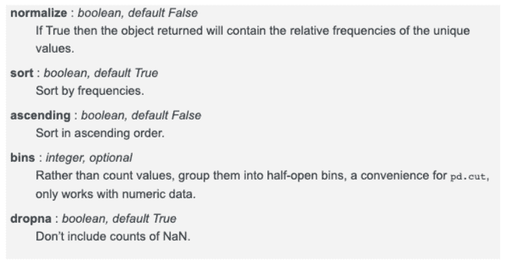
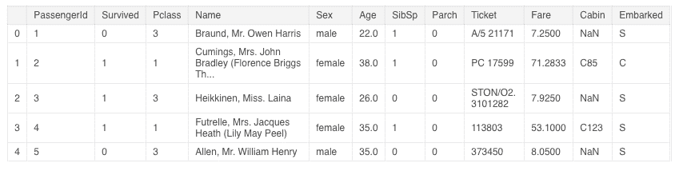
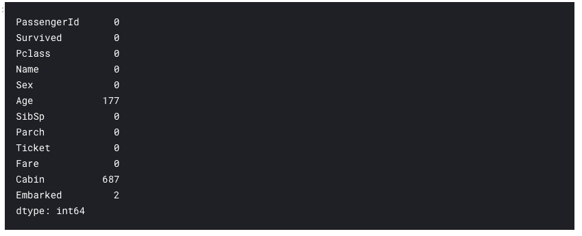
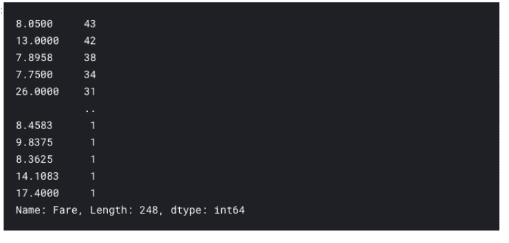

##### 作者 Parul Pandey
编译自 机器学习算法与Python学习

**value_counts()**

value_counts() 方法返回一个序列 Series，该序列包含每个值的数量。也就是说，对于数据框中的任何列，value-counts () 方法会返回该列每个项的计数。

**语法**

```
Series.value_counts() 
```

**参数**

****

*图源：https://pandas.pydata.org/pandas-docs/stable/reference/api/pandas.Series.value_counts.html*

**基本用法**

作者通过以下数据集来观察 value-count () 函数的基本用法，其中 Demo 中使用了 Titanic 数据集。她还在 Kaggle 上发布了一个配套的 notebook。

代码链接：https://www.kaggle.com/parulpandey/five-ways-to-use values -counts

 

**导入数据集**

首先导入必要的库和数据集，这是每个数据分析流程的基本步骤。

```
# Importing necessary librariesimport pandas as pdimport numpy as npimport matplotlib.pyplot as pltimport seaborn as sns%matplotlib inline# Reading in the datatrain = pd.read_csv( ../input/titanic/train.csv ) 
```

**了解数据集的前几行内容**

```
train.head() 
```



**统计无效值数量**

```
train.isnull().sum() 
```



由上图可见，Age、Cabin 和 Embarked 列都有无效值。通过这些分析，我们就对数据集有了初步的了解。现在就让我们来看一下 value_counts() 是如何对这个数据集进行进一步探索的，那 5 个高效方法又是什么呢？

**默认参数值下的 value_counts()**

首先在数据集的 Embarked 列上使用 value_counts ()，这样会对该列中出现的每个值进行计数。

```
train[ Embarked ].value_counts()-------------------------------------------------------------------S 644C 168Q 77 
```

这个函数会对给定列里面的每个值进行计数并进行降序排序，无效值也会被排除。我们很容易就能看出，Southampton 出发的人最多，其次是 Cherbourg 和 Queenstown。

**如何用 value_counts() 求各个值的相对频率**

有时候，百分比比单纯计数更能体现数量的相对关系。当 normalize = True 时，返回的对象将包含各个值的相对频率。默认情况下，normalize 参数被设为 False。

```
train[ Embarked ].value_counts(normalize=True)-------------------------------------------------------------------S 0.724409C 0.188976Q 0.086614 
```

因此，知道有 72% 的人从 Southampton 出发比单纯知道 644 个人从 Southampton 出发要直观得多。

**如何实现升序的 value_counts()**

默认情况下，value_counts () 返回的序列是降序的。我们只需要把参数 ascending 设置为 True，就可以把顺序变成升序。

```
train[ Embarked ].value_counts(ascending=True)-------------------------------------------------------------------Q 77C 168S 644 
```

**如何用 value_counts() 展示 NaN 值的计数**

默认情况下，无效值（NaN）是不会被包含在结果中的。但是跟之前一样的，只需要把 dropna 参数设置成 False，你也就可以对无效值进行计数。

```
train[ Embarked ].value_counts(dropna=False)-------------------------------------------------------------------S 644C 168Q 77NaN 2 
```

我们可以很直观地观察到该列内有两个无效值。

**如何用 value_counts() 将连续数据放进离散区间**

这是 value_counts() 所有功能中作者最喜欢的，也是利用最充分的。改变参数 bin 的值，value_counts 就可以将连续数据放进离散区间。这个选项只有当数据是数字型时才会有用。它跟 pd.cut 函数很像，让我们来看一下它是如何在 Fare 这一列大显身手的吧！

```
# applying value_counts on a numerical column without the bin parametertrain[ Fare ].value_counts() 
```



这个结果并不能告诉我们什么信息，因为类别太多了。所以让我们把它集合到 7 个区间里。

```
train[ Fare ].value_counts(bins=7) 
```

区间化（Binning）之后的结果更容易理解。我们可以很容易地看到，大多数人支付的票款低于 73.19。此外，我们还可以发现，有五个区间是我们需要的，并且没有乘客的最后两个区间是没用的。

因此，我们可以看到，value_counts() 函数是一个非常方便的工具，我们可以使用这一行代码进行一些有趣的分析。

*原文链接：*

*https://towardsdatascience.com/getting-more-value-from-the-pandas-value-counts-aa17230907a6*

**Datawhale高校****群和在职群已成立**

扫描下方二维码，添加**负责人微信**，可申请加入AI学习交流群（一定要备注：**入群+学校/公司+方向****，**例如：**入群+浙大+机器学习**）


▲长按加群

更多关于AI的学习资料，在后台回复"**AI**"获取

