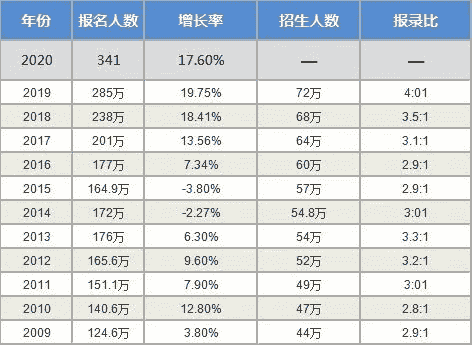

北京，2019 年 12 月 

摄影 | 公子龙

文章 | 公子龙

2020 年考研报名人数达到了 341 万人，比去年多了五十多万人。这两年，考研的报录比是 4 : 1，相较于前几年的 3 : 1，从数据上来看，考研人数上升很快，难度提升了一些。

经常，有不少学弟学妹问我，师兄，你觉得花费人生最宝贵的三年时光读研，到底值不值得？

**值不值，不能武断，因人而异。**

我有个朋友，他的本科很普通，后来他考研到了一所末流 985，对于他自身而言，已经算逆袭了。毕业后他考上了老家的公务员，有了研究生学历，当地的工资福利待遇都很不错，后来娶妻生子，生活十分安逸。对他来说，读研还不错。

另外一位，是本科时期的辅导员，他是本校的本硕学长，留校在教务处工作。读研对他来说，很重要的一点是研究生学历，以及读研期间在学校组织的履历。去年听见他的消息，已经去了一家国企。离开待了十年的熟悉之地，去了陌生的地方，或许是因为发展不顺。对他来说，读研、留校工作，是一条本以为稳妥的路，后来还是留下了些许惋惜。

还有一位，之前一起实习时候遇到的小伙伴，做事认真靠谱，研一结束时，就出来实习，后来转正，到现在已经两年多了。他是一个佛系的人，临近毕业的时候，因为公司的项目太多，耽误了毕业论文，到现在，还没有拿到学位证书。幸好的是，创业公司人情味很足，给他发的是正式 offer 和足额工资。对他来说，读研既是读书，也是工作，还是生活。

对我自己而言，我学的是计算机专业，在北京的一所 211 学校读的本科，学校其实还不错。但是本科毕业的时候，去互联网大厂，对我而言，只是一种奢望。

还记得，大三秋招的时候，参加了网易在北邮举办的宣讲会。当时，看着投影上炫彩斑斓的公司宣传片，比较受感染，心绪激动，投递了简历之后，等待了不短的时间，却杳无音讯。

当时华为校招宣讲组来校，我找机会接近了他们的面试官，弱弱的问了句要不要本科生，他委婉的告诉我，组内基本都是硕士学历及以上。

从那时起，脑海中就有些概念，大厂技术招人，学历基本都是从硕士卡起了，本科生连面试机会，都很难拿到。也是从那时候起，我开始认真的读研，打算日后再战。

等到我研究生秋招的时候，就比较容易能够进入各大厂的面试，也拿到了很多大厂的 offer。

如果需要我认真、谨慎的回答，读研三年，到底给我带来了什么，到底值不值，以下是我的回答。

当我们本科毕业的时候，一般是二十二岁左右的年纪，其实还只是个懵懂的少年少女，对这个世界，只有着浅显的认知。

读研虽会占用我们青春中，最为美好的两三载时光，但无疑的，它也为我们提供了一个最好的缓冲，这是一个从学习到进入社会的重大转变。

本科时，课程多，技术差，资历浅，导致秋招很难找到好工作，甚至难以找到工作。

读研了，就大不相同。三年时间，假若老师不是太严苛，总能找到数月时间，去外面偷偷实习一阵。留在学校，也能够和老师做一些项目或者研究，不再像本科的时候，如同高中生一般考试学习。而且，读研期间，我们可以开始进行时间管理，做一些喜欢的事情，对我而言，选择了闲暇之余，做一些计算机数据比赛，比较常见的有数据挖掘比赛，图像处理比赛，以及自然语言处理比赛。

所以，当我毕业时，能够得到为数不少的互联网大厂工作机会，与之前的比赛经历、实习经历以及项目经历，是密不可分的。本科毕业时，之所以找工作很受伤，还是因为资历过浅，履历过于单薄。这也是时间和努力所能够带来的改变，因而，对我而言，读研是不错的选择。

说到这里，可能大家比较明白，读研两三年，值不值，不是由过来人、师兄师姐或者哪个长辈说了算，而是由你自己说了算。你对自身的规划，你对时间的把控，你对未来的抉择，才能够说明，这段时光，到底值不值。

劝君莫惜金缕衣，劝君惜取少年时。

花开堪折直须折，莫待无花空折枝。

**Datawhale高校****群和在职群已成立**

扫描下方二维码，添加**负责人微信**，可申请加入AI学习交流群（一定要备注：**入群+学校/公司+方向****，**例如：**入群+浙大+机器学习**）

▲长按加群

更多关于AI的学习资料，在后台回复"**AI**"获取

