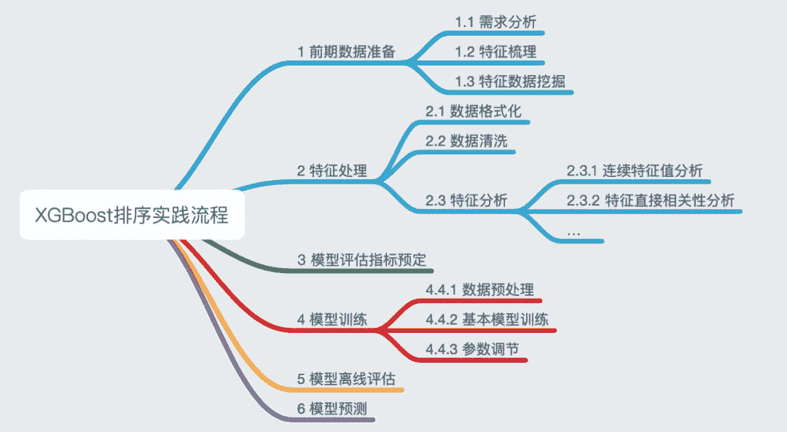
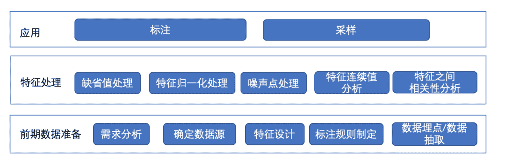
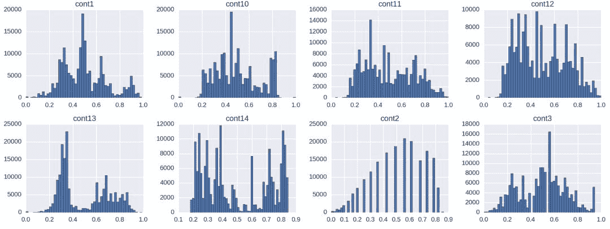
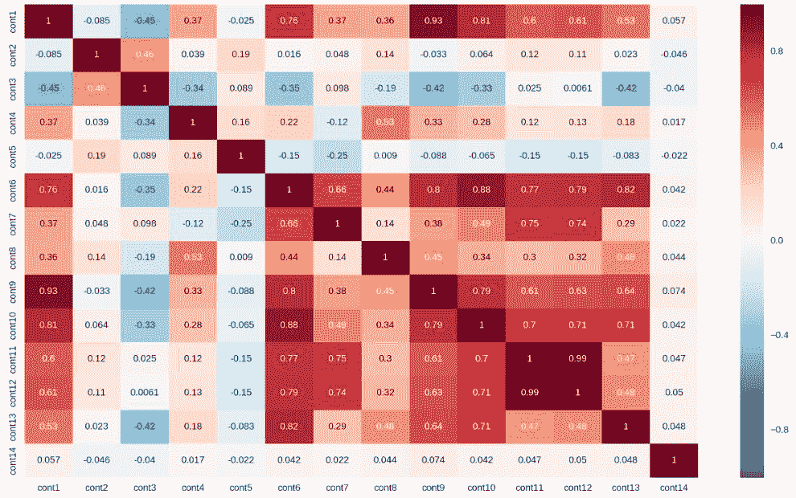
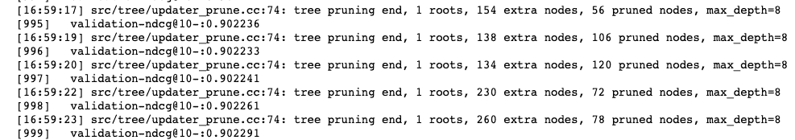
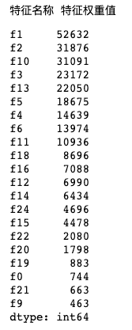
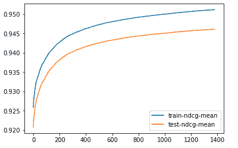
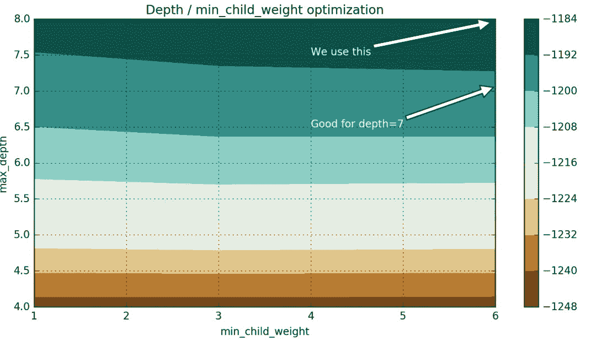

**作者简介**

曹城，携程搜索部门高级研发工程师，主要负责携程搜索的个性化推荐和搜索排序等工作。

**一、前言**

在互联网高速发展的今天，越来越复杂的特征被应用到搜索中，对于检索模型的排序，基本的业务规则排序或者人工调参的方式已经不能满足需求了，此时由于大数据的加持，机器学习、深度学习成为了一项可以选择的方式。

携程主站搜索作为主要的流量入口之一，是用户浏览信息的重要方式。用户搜索方式多样、对接业务多样给携程主站搜索（下文简称大搜）带来了许多挑战，如：

*   搜索方式多样化

*   场景多样化

*   业务多样化

*   意图多样化

*   用户多样化

为了更好满足搜索的多样化，大搜团队对传统机器学习和深度学习方向进行探索。

说起机器学习和深度学习，是个很大的话题，今天我们只来一起聊聊传统机器学习中XGBoost在大搜中的排序实践。

**二、XGBoost探索与实践**

聊起搜索排序，那肯定离不开L2R。Learning to Rank，简称（L2R），是一个监督学习的过程，需要提前做特征选取、训练数据的获取然后再做模型训练。

L2R可以分为：

*   PointWise

*   PairWise

*   ListWise

PointWise方法只考虑给定查询下单个文档的绝对相关度，不考虑其他文档和给定查询的相关度。

PairWise方法考虑给定查询下两个文档直接的相对相关度。比如给定查询query的一个真实文档序列，我们只需要考虑任意两个相关度不同的文档直接的相对相关度。相比PointWise，PairWise方法通过考虑任意两个文档直接的相关度进行排序，有一定的优势。

ListWise直接考虑给定查询下的文档集合的整体序列，直接优化模型输出的文档序列，使得尽可能接近真实文档序列。

下面先简单介绍XGBoost的应用流程：



XGBoost是一个优化的分布式梯度增强库，增强树模型，灵活便捷。但对高维度的稀疏矩阵支持不是很好，另外调参确实有点麻烦。

**三、特征工程实践**

在传统机器学习下，特征工程显的尤为重要，不论后续模型工程做的多好，如果前期的特征工程没有做好，那么训练的结果不会有多好。所以对特征处理的总体逻辑如下：



**3.1 前期数据准备**

首先，我们需要进行需求分析，就是在什么场景下排序。假设我们需要针对搜索召回的POI场景进行排序，那么需要确定几件事情：

*   数据来源：搜索的数据就是各种POI，然后需要确定我们有哪些数据可以用来排序，比如最近半年的搜索POI的曝光点击数据等；

*   特征梳理：需要梳理影响POI排序的因子，例如查询相关特征、POI相关特征、用户相关特征等；

*   标注规则制定：每次搜索召回的每个POI，会有曝光和点击数据，简单点，比如：我们可以将曝光位置作为默认标注分，当有点击，就将标注分在原来的基础上加一；

*   数据埋点/数据抽取：这是两种方式，可以根据实际需求进行选择；

*   *   数据埋点：可以在线上实时生成特征，然后进行日志埋点，离线分析的时候可以直接从日志中拉取即可，这种方式，需要提前进行埋点。

    *   数据抽取：可以通过大数据平台拉取历史数据，然后进行离线计算抽取所需特征，这种方式虽然慢点，但是可以拉取历史数据进行分析。

**3.2 特征处理**

前期的数据准备工作完成了，接下来可以开始看看数据质量了。

*   查看缺失值：绝大多数情况下，我们都需要对缺失值进行处理；

*   特征归一化处理：监督学习对特征的尺度非常敏感，因此，需要对特征归一化用来促进模型更好的收敛；

*   噪声点处理：异常的数据会影响模型预测的正确性；

*   特征连续值分析：分析特征的值分布范围是否均匀；

*   特征之间的相关性分析；



通过连续值特征可以分析每个特征值的大致分布范围，有利于对相关特征进行数据补充或者重新筛选。



通过特征相关性的分析，如上我们看到几个特征之间有很高的相关性，那么可以帮助我们做特征组合或者特征筛选等等方面决策。

**四、模型工程实践**

**4.1 评估指标制定**

在搜索业务中，考虑的有以下两种情况：

*   看重用户搜索的成功率，即有没有点击；

*   看重页面第一屏的曝光点击率；

在文章开头提到的L2R的三种分类中，我们在XGBoost参数objective配置“rank:pairwise”,同时使用搜索系统常用的评估指标NDCG (Normalized Discounted Cumulative Gain) 。

```
def _to_list(x):
if isinstance(x, list):
return x
return [x]

def ndcg(y_true, y_pred, k=20, rel_threshold=0):
if k <= 0:
return 0
    y_true = _to_list(np.squeeze(y_true).tolist())
    y_pred = _to_list(np.squeeze(y_pred).tolist())
    c = list(zip(y_true, y_pred))
    random.shuffle(c)
    c_g = sorted(c, key=lambda x: x[0], reverse=True)
    c_p = sorted(c, key=lambda x: x[1], reverse=True)
    idcg = 0
    ndcg = 0
for i, (g, p) in enumerate(c_g):
if i >= k:
break
if g > rel_threshold:
            idcg += (math.pow(2, g) - 1) / math.log(2 + i)
for i, (g, p) in enumerate(c_p):
if i >= k:
break
if g > rel_threshold:
            ndcg += (math.pow(2, g) - 1) / math.log(2 + i)
if idcg == 0:
return 0
else:
return ndcg / idcg 
```

**4.2 初始模型训练**

前期通过基础的模型训练，可以初步得出一些初始参数和相关特征的重要度等相关信息。

```
train_dmatrix = DMatrix(x_train, y_train)
valid_dmatrix = DMatrix(x_valid, y_valid)
test_dmatrix = DMatrix(x_test)

train_dmatrix.set_group(group_train)
valid_dmatrix.set_group(group_valid)
test_dmatrix.set_group(group_test)

params = {'objective': 'rank:pairwise', 'eta': 0.5, 'gamma': 1.0,
'min_child_weight': 0.5, 'max_depth': 8,'eval_metric':'ndcg@10-','nthread':16}
xgb_model = xgb.train(params, train_dmatrix, num_boost_round=1000,
                           evals=[(valid_dmatrix, 'validation')]) 
```



```
import pandas as pd

print('特征名称', '特征权重值')
feature_score = xgb_model.get_fscore()
pd.Series(feature_score).sort_values(ascending=False) 
```



**4.3 模型调优五部曲**

通过上述基础的模型训练，我们可以得出相关的初始参数，进入到五部曲环节，XGBoost参数调节基本为五个环节：

*   Step 1：选择一组初始参数；

*   Step 2：改变 max_depth 和 min_child_weight；

*   Step 3：调节 gamma 降低模型过拟合风险；

*   Step 4：调节 subsample 和 colsample_bytree 改变数据采样策略；

*   Step 5：调节学习率 eta；

例如我们在通过step1，可以观察弱分类数目的大致范围，看看模型是过拟合还是欠拟合。



通过step2调整树的深度和节点权重，这些参数对XGBoost性能影响最大，我们简要概述他们：

*   max_depth：树的最大深度。增加这个值会使模型更加复杂，也容易出现过拟合，深度3-10是合理的；

*   min_child_weight：正则化参数。如果树分区中的实例权重小于定义的总和，则停止树构建过程。

可以通过网格搜索发现最佳结果，当然也可以通过其他方式。



我们看到，从网格搜索的结果，分数的提高主要是基于max_depth增加。min_child_weight稍有影响的成绩，但是min_child_weight = 6会更好一些。

**4.4 模型离线评估**

通过调优五部曲，训练，生成最终的模型之后，就要进入离线评估阶段。离线拉取线上生产用户的请求，模拟生产，对模型预测的结果进行检验，根据在之前评估指标制定环节所提到的用户点击率和第一屏曝光点击率，比对线上用户点击产品的位置和模型预测的位置，同时对比两者之间的第一屏曝光点击率。

**4.5 模型预测**

通过AB实验，对模型进行线上预测，实时监测效果评估，方便之后的迭代和优化。

**五、总结与展望**

*   对于传统的机器学习，最重要的一步是要做好需求分析，评估这种算法是否能有效解决该问题，否则得不偿失；

*   前期的特征工程非常关键。通过多次的摸索发现，特征没有选取好，或者数据覆盖不全，标注没做好，导致后续模型不论怎么调优，都无法达到预定的效果；

*   选定目标后，可以先尝试一些优秀的开源工具、优秀的数据分析工具。直观的图表能帮助你做更好的决策，优秀的算法库，能避免重复造轮子；

*   单一的算法无法满足搜索排序应用场景，多模型融合以及深度学习方向需要做更深入的探索与实践；

关于AI学习路线和优质资源，在后台回复"**AI**"获取

