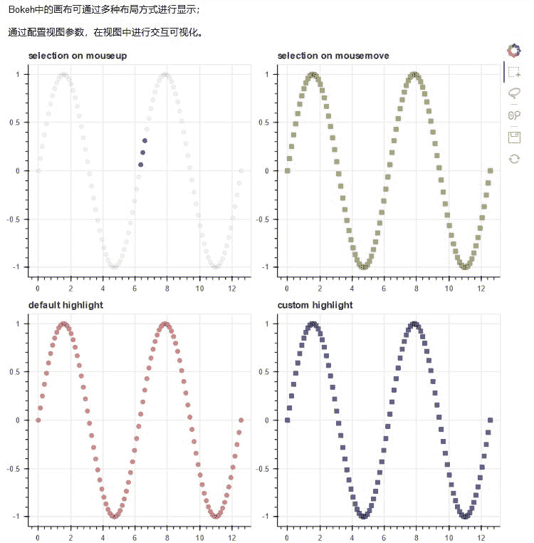
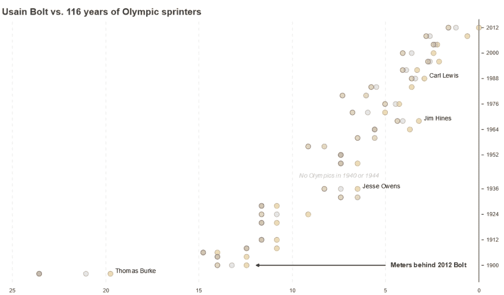

**导读：**什么是散点图？可以用来呈现哪些数据关系？在数据分析过程中可以解决哪些问题？怎样用Python绘制散点图？本文逐一为你解答。

作者：屈希峰

来源：大数据DT（ID：bigdatadt）


**01 概述**

散点图（Scatter）又称散点分布图，是以一个变量为横坐标，另一个变量为纵坐标，利用散点（坐标点）的分布形态反映变量统计关系的一种图形。

**特点是能直观表现出影响因素和预测对象之间的总体关系趋势。**优点是能通过直观醒目的图形方式反映变量间关系的变化形态，**以便决定用何种数学表达方式来模拟变量之间的关系。**散点图不仅可传递变量间关系类型的信息，还能反映变量间关系的明确程度。

通过观察散点图数据点的分布情况，我们可以推断出变量间的相关性。如果变量之间不存在相互关系，那么在散点图上就会表现为随机分布的离散的点，如果存在某种相关性，那么大部分的数据点就会相对密集并以某种趋势呈现。

数据的**相关关系**大体上可以分为：正相关（两个变量值同时增长）、负相关（一个变量值增加，另一个变量值下降）、不相关、线性相关、指数相关等，表现在散点图上的大致分布如图1所示。那些离点集群较远的点我们称之为离群点或者异常点。


▲图1 散点数据的相关性

在Python体系中，可使用Scipy、Statsmodels或Sklearn等对离散点进行回归分析，归纳现有数据并进行预测分析。**对于那些变量之间存在密切关系，但是这些关系又不像数学公式和物理公式那样能够精确表达的，散点图是一种很好的图形工具，可以进行直观展示**，如图2所示。


▲图2 散点数据拟合（线性）

但是在分析过程中需要注意，变量之间的相关性并不等同于确定的因果关系，仍需要考虑其他影响因素。

**02 实例**

散点图代码示例如下所示。

**代码示例①**

```
# 数据  
x = [1, 2, 3, 4, 5]  
y = [6, 7, 2, 4, 5]  
# 画布：尺寸  
p = figure(plot_width=400, plot_height=400)  
# 画图  
p.scatter(x, y,   
          size=20, # screen units  显示器像素单位  
#           radius=1,  # data-space units  坐标轴单位  
          marker="circle", color="navy", alpha=0.5)    
# p.circle(x, y, size=20, color="navy", alpha=0.5)  
# 显示  
show(p)  
```

运行结果如图3所示。


▲图3 代码示例①运行结果

代码示例①中第7行使用scatter方法进行散点图绘制；第11行采用circle方法进行散点图绘制（推荐）。关于这两个方法的参数说明如下。

**p.circle(x, y, **kwargs)参数说明。**

*   **x** (str or seq[float]) : 离散点的x坐标，列名或列表

*   **y** (str or seq[float]) : 离散点的y坐标

*   **size **(str or list[float]) : 离散点的大小，屏幕像素单位

*   **marker** (str, or list[str]) : 离散点标记类型名称或名称列表

*   **color **(color value, optional) : 填充及轮廓线的颜色

*   **source** (`~bokeh.models.sources.ColumnDataSource`) : Bokeh专属数据格式

*   ****kwargs: **其他自定义属性；其中标记点类型marker默认值为：“marker="circle"”，可以用“radius”定义圆的半径大小（单位为坐标轴单位）。这在Web数据化中非常有用，不同的方式，在不同的设备上的展示效果会有些许差异。

**p.scatter(x, y, **kwargs)参数说明。**

*   **x** (:class:`~bokeh.core.properties.NumberSpec` ) : x坐标

*   **y **(:class:`~bokeh.core.properties.NumberSpec` ) : y坐标

*   **angle** (:class:`~bokeh.core.properties.AngleSpec` ) : 旋转角度

*   **angle_units** (:class:`~bokeh.core.enums.AngleUnits`) : (default: 'rad') 默认：弧度，也可以采用度（'degree'）

*   **fill_alpha **(:class:`~bokeh.core.properties.NumberSpec` ) : (default: 1.0) 填充透明度，默认：不透明

*   **fill_color **(:class:`~bokeh.core.properties.ColorSpec` ) : (default: 'gray') 填充颜色，默认：灰色

*   **line_alpha **(:class:`~bokeh.core.properties.NumberSpec` ) : (default: 1.0) 轮廓线透明度，默认：不透明

*   **line_cap : **(:class:`~bokeh.core.enums.LineCap` ) : (default: 'butt') 线端（帽）

*   **line_color **(:class:`~bokeh.core.properties.ColorSpec` ) : (default: 'black') 轮廓线颜色，默认：黑色

*   **line_dash** (:class:`~bokeh.core.properties.DashPattern` ) : (default: []) 虚线

*   **line_dash_offset **(:class:`~bokeh.core.properties.Int` ) : (default: 0) 虚线偏移

*   **line_join** (:class:`~bokeh.core.enums.LineJoin`  ) : (default: 'bevel')

*   **line_width **(:class:`~bokeh.core.properties.NumberSpec` ) : (default: 1) 线宽，默认：1

另外，Bokeh中的一些属性，如`~bokeh.core.properties.NumberSpec `、`~bokeh.core.properties.ColorSpec`可以在Jupyter notebook中通过`import bokeh.core.properties.NumberSpec `导入该属性，然后再查看其详细的使用说明。

**代码示例②**

```
# 数据  
N = 4000  
x = np.random.random(size=N) * 100  # 随机点x坐标  
y = np.random.random(size=N) * 100  # 随机点y坐标  
radii = np.random.random(size=N) * 1.5  # 随机半径  
# 工具条  
TOOLS="hover,crosshair,pan,wheel_zoom,box_zoom,reset,tap,save,box_select,poly_select,lasso_select"  
# RGB颜色，画布1，绘图1  
colors2 = ["#%02x%02x%02x" % (int(r), int(g), 150) for r, g in zip(50+2*x, 30+2*y)]  
p1 = figure(width=300, height=300, tools=TOOLS)  
p1.scatter(x,y, radius=radii, fill_color=colors2, fill_alpha=0.6, line_color=None)  
# RGB颜色，画布2，绘图2  
colors2 = ["#%02x%02x%02x" % (150, int(g), int(b)) for g, b in zip(50+2*x, 30+2*y)]  
p2 = figure(width=300, height=300, tools=TOOLS)  
p2.scatter(x,y, radius=radii, fill_color=colors2, fill_alpha=0.6, line_color=None)  
# 直接显示  
# show(p1)  
# show(p2)  
# 网格显示  
from bokeh.layouts import gridplot  
grid = gridplot([[p1, p2]])   
show(grid) 
```

运行结果如图4所示。


▲图4 代码示例②运行结果

代码示例②中第11行和第15行使用scatter方法进行散点图绘制。第7行工具条中的不同工具定义，第9行数据点的不同颜色定义，第20行和第21行采用网格显示图形，可以提前了解这些技巧，具体使用方法在下文中会专门进行介绍。

**代码示例③**

```
from bokeh.sampledata.iris import flowers  
# 配色  
colormap = {'setosa': 'red', 'versicolor': 'green', 'virginica': 'blue'}  
colors = [colormap[x] for x in flowers['species']]  
# 画布  
p = figure(title = "Iris Morphology")  
# 绘图  
p.circle(flowers["petal_length"], flowers["petal_width"],  
         color=colors, fill_alpha=0.2, size=10)  
# 其他  
p.xaxis.axis_label = 'Petal Length'  
p.yaxis.axis_label = 'Petal Width'  
# 显示  
show(p)  
```

运行结果如图5所示。

代码示例③再次对前面提到的鸢尾花的数据集进行分析，图5中x轴为花瓣长度，y轴为花瓣宽度，据此可以将该散点数据聚类为3类。同时，该段代码展示了常规图形的绘制流程，含x、y轴的标签。


▲图5 代码示例③运行结果

**代码示例④**

```
from bokeh.layouts import column, gridplot  
from bokeh.models import BoxSelectTool, Div  
# 数据  
x = np.linspace(0, 4*np.pi, 100)  
y = np.sin(x)  
# 工具条  
TOOLS = "wheel_zoom,save,box_select,lasso_select,reset"  
# HTML代码  
div = Div(text=""" 
<p>Bokeh中的画布可通过多种布局方式进行显示；</p> 
<p>通过配置参数BoxSelectTool，在图中用鼠标选择数据，采用不同方式进行交互。</p>
""") # HTML代码直接作为一个图层显示，也可以作为整个HTML文档  
# 视图属性  
opts = dict(tools=TOOLS, plot_width=350, plot_height=350)  
# 绘图1  
p1 = figure(title="selection on mouseup", **opts)  
p1.circle(x, y, color="navy", size=6, alpha=0.6)  
# 绘图2  
p2 = figure(title="selection on mousemove", **opts)  
p2.square(x, y, color="olive", size=6, alpha=0.6)  
p2.select_one(BoxSelectTool).select_every_mousemove = True  
# 绘图3  
p3 = figure(title="default highlight", **opts)  
p3.circle(x, y, color="firebrick", alpha=0.5, size=6)  
# 绘图4  
p4 = figure(title="custom highlight", **opts)  
p4.square(x, y, color="navy", size=6, alpha=0.6,  
          nonselection_color="orange", nonselection_alpha=0.6)  
# 布局  
layout = column(div,  
                gridplot([[p1, p2], [p3, p4]], toolbar_location="right"),  
                sizing_mode="scale_width")  # sizing_mode 根据窗口宽度缩放图像  
# 绘图  
show(layout) 
```

Bokeh中的画布可通过多种布局方式进行显示：通过配置视图参数，在视图中进行交互可视化。运行结果如图6所示。



▲图6 代码示例④运行结果

代码示例④让读者感受一下Bokeh的交互效果，Div方法可以直接使用HTML标签，其作为一个独立的图层进行显示（第30行）。另外需要注意，可以通过`nonselection_`，`nonselection_alpha`或`nonselection_fill_alpha`设套索置选取数据时的散点的颜色、透明度等。

**代码示例⑤**

```
from bokeh.models import (  
       ColumnDataSource,  
       Range1d, DataRange1d,  
       LinearAxis, SingleIntervalTicker, FixedTicker,  
       Label, Arrow, NormalHead,  
       HoverTool, TapTool, CustomJS)  
from bokeh.sampledata.sprint import sprint  
abbrev_to_country = {  
      "USA": "United States",  
      "GBR": "Britain",  
      "JAM": "Jamaica",  
      "CAN": "Canada",  
      "TRI": "Trinidad and Tobago",  
      "AUS": "Australia",  
      "GER": "Germany",  
      "CUB": "Cuba",  
      "NAM": "Namibia",  
      "URS": "Soviet Union",  
      "BAR": "Barbados",  
      "BUL": "Bulgaria",  
      "HUN": "Hungary",  
      "NED": "Netherlands",  
      "NZL": "New Zealand",  
      "PAN": "Panama",  
      "POR": "Portugal",  
      "RSA": "South Africa",  
      "EUA": "United Team of Germany",  
}  
gold_fill   = "#efcf6d"  
gold_line   = "#c8a850"  
silver_fill = "#cccccc"  
silver_line = "#b0b0b1"  
bronze_fill = "#c59e8a"  
bronze_line = "#98715d"  
fill_color = { "gold": gold_fill, "silver": silver_fill, "bronze": bronze_fill }  
line_color = { "gold": gold_line, "silver": silver_line, "bronze": bronze_line }  
def selected_name(name, medal, year):  
    return name if medal == "gold" and year in [1988, 1968, 1936, 1896] else ""  
t0 = sprint.Time[0]  
sprint["Abbrev"]       = sprint.Country  
sprint["Country"]      = sprint.Abbrev.map(lambda abbr: abbrev_to_country[abbr])  
sprint["Medal"]        = sprint.Medal.map(lambda medal: medal.lower())  
sprint["Speed"]        = 100.0/sprint.Time  
sprint["MetersBack"]   = 100.0*(1.0 - t0/sprint.Time)  
sprint["MedalFill"]    = sprint.Medal.map(lambda medal: fill_color[medal])  
sprint["MedalLine"]    = sprint.Medal.map(lambda medal: line_color[medal])  
sprint["SelectedName"] = sprint[["Name", "Medal", "Year"]].apply(tuple, axis=1).map(lambda args: selected_name(*args))  
source = ColumnDataSource(sprint)  
xdr = Range1d(start=sprint.MetersBack.max()+2, end=0)               # XXX: +2 is poor-man's padding (otherwise misses last tick)  
ydr = DataRange1d(range_padding=4, range_padding_units="absolute")  
plot = figure(  
    x_range=xdr, y_range=ydr,  
    plot_width=1000, plot_height=600,  
    toolbar_location=None,  
    outline_line_color=None, y_axis_type=None)  
plot.title.text = "Usain Bolt vs. 116 years of Olympic sprinters"  
plot.title.text_font_size = "14pt"  
plot.xaxis.ticker = SingleIntervalTicker(interval=5, num_minor_ticks=0)  
plot.xaxis.axis_line_color = None  
plot.xaxis.major_tick_line_color = None  
plot.xgrid.grid_line_dash = "dashed"  
yticker = FixedTicker(ticks=[1900, 1912, 1924, 1936, 1952, 1964, 1976, 1988, 2000, 2012])  
yaxis = LinearAxis(ticker=yticker, major_tick_in=-5, major_tick_out=10)  
plot.add_layout(yaxis, "right")  
medal = plot.circle(x="MetersBack", y="Year", radius=dict(value=5, units="screen"),  
    fill_color="MedalFill", line_color="MedalLine", fill_alpha=0.5, source=source, level="overlay")  
plot.text(x="MetersBack", y="Year", x_offset=10, y_offset=-5, text="SelectedName",  
    text_align="left", text_baseline="middle", text_font_size="9pt", source=source)  
no_olympics_label = Label(  
    x=7.5, y=1942,  
    text="No Olympics in 1940 or 1944",  
    text_align="center", text_baseline="middle",  
    text_font_size="9pt", text_font_style="italic", text_color="silver")  
no_olympics = plot.add_layout(no_olympics_label)  
x = sprint[sprint.Year == 1900].MetersBack.min() - 0.5  
arrow = Arrow(x_start=x, x_end=5, y_start=1900, y_end=1900, start=NormalHead(fill_color="black", size=6), end=None, line_width=1.5)  
plot.add_layout(arrow)  
meters_back = Label(  
    x=5, x_offset=10, y=1900,  
    text="Meters behind 2012 Bolt",  
    text_align="left", text_baseline="middle",  
    text_font_size="10pt", text_font_style="bold")  
plot.add_layout(meters_back)  
disclaimer = Label(  
    x=0, y=0, x_units="screen", y_units="screen",  
    text="This chart includes medals for the United States and Australia in the \"Intermediary\" Games of 1906, which the I.O.C. does not formally recognize.",  
    text_font_size="8pt", text_color="silver")  
plot.add_layout(disclaimer, "below")  
tooltips = """ 
<div> 
    <span style="font-size: 15px;">@Name</span>  
    <span style="font-size: 10px; color: #666;">(@Abbrev)</span> 
</div> 
<div> 
    <span style="font-size: 17px; font-weight: bold;">@Time{0.00}</span>  
    <span style="font-size: 10px; color: #666;">@Year</span> 
</div> 
<div style="font-size: 11px; color: #666;">@{MetersBack}{0.00} meters behind</div> 
"""  
plot.add_tools(HoverTool(tooltips=tooltips, renderers=[medal]))  
open_url = CustomJS(args=dict(source=source), code=""" 
source.inspected._1d.indices.forEach(function(index) { 
    var name = source.data["Name"][index]; 
    var url = "http://en.wikipedia.org/wiki/" + encodeURIComponent(name); 
    window.open(url); 
}); 
""")  
plot.add_tools(TapTool(callback=open_url, renderers=[medal], behavior="inspect"))
show(plot) 
```

运行结果如图7所示。



▲图7 代码示例⑤运行结果

代码示例⑤展示了短跑选手博尔特与116年来奥运会其他短跑选手成绩的对比情况。上述代码包含数据预处理、自定义绘图属性、数据标记、交互式显示等较为复杂的操作，不作为本文重点；读者仅需要知道通过哪些代码可以实现哪些可视化的效果即可。

本文通过5个代码示例展示了散点图的绘制技巧，绘制难度也逐渐增大，与此同时，展现的效果也越来越好。读者在学习过程中可以多思考，在这个示例中哪些数据需要交互式展示，采用哪种展示方式更好。

**Datawhale高校****群和在职群已成立**

扫描下方二维码，添加**负责人微信**，可申请加入AI学习交流群（一定要备注：**入群+学校/公司+方向****，**例如：**入群+浙大+机器学习**）


▲长按加群

