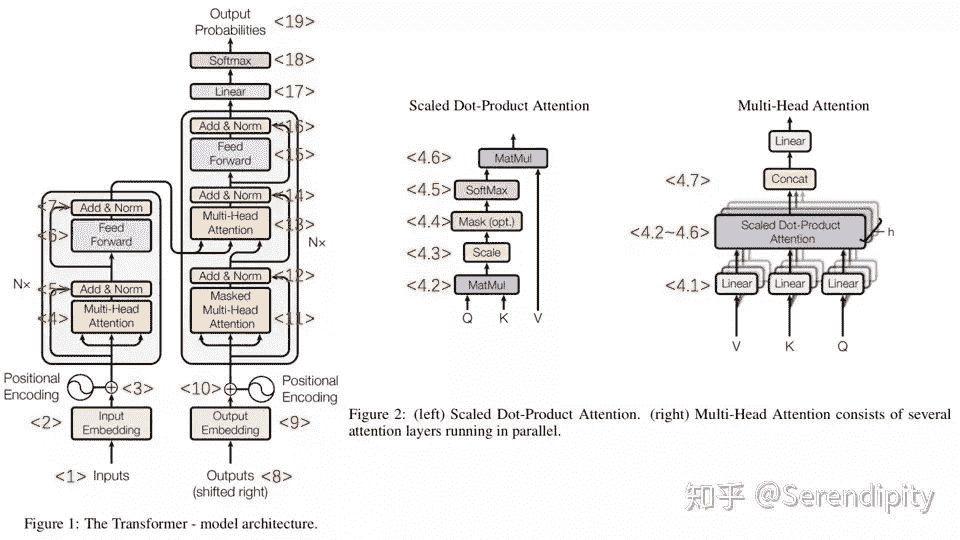
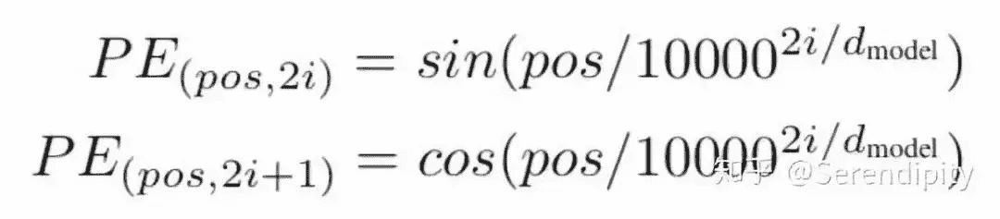
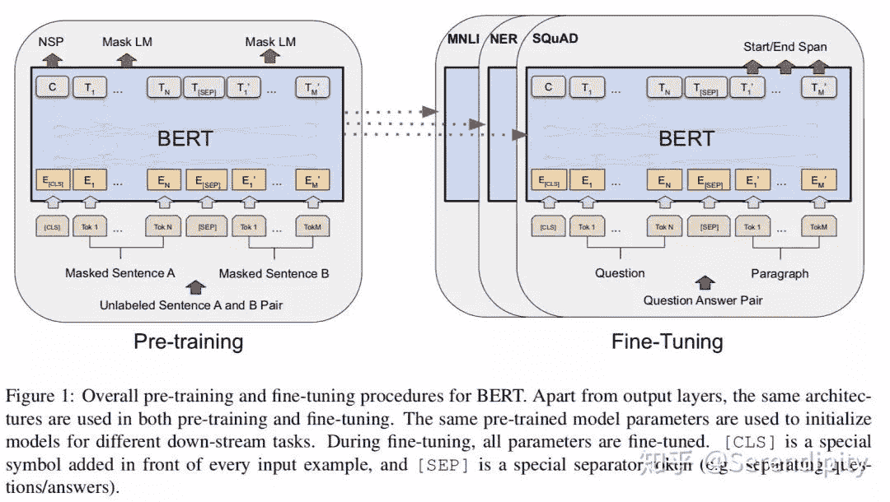
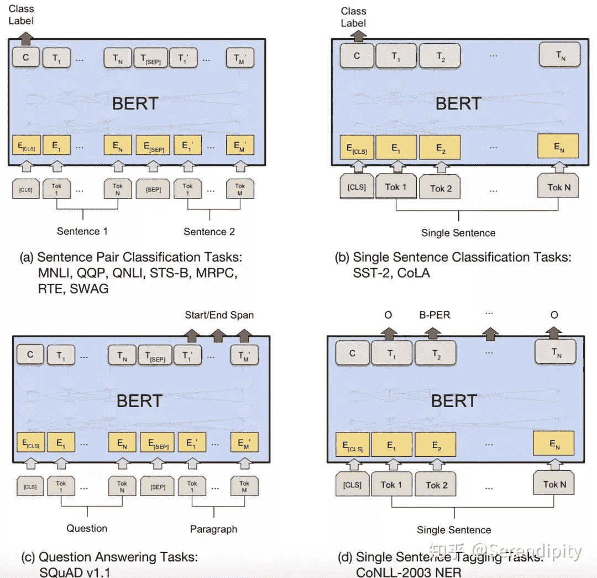
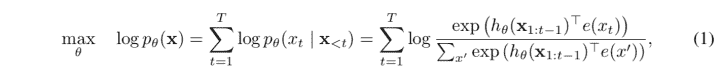
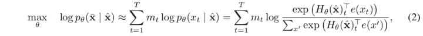
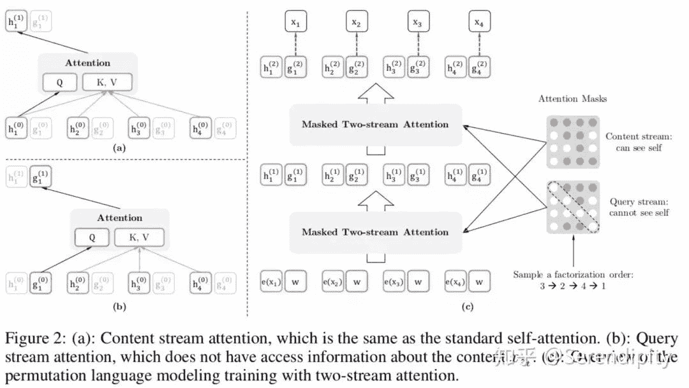
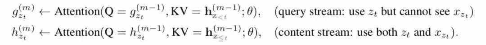

> 文章作者：Serendipity
> 
> 内容来源：Serendipity的知乎，已通过作者授权
> 
> 整理编辑：happyGirl，浅梦

## 背景

语言模型是机器理解人类语言的途径，17年的transformer是语言模型摆脱rnn，lstm建模的一次尝试，后续的bert则是大力出奇迹的代表，用更大的模型和更多的数据将nlp任务的benchmark提高了一大截。gpt在auto-regressive的路上一路走到黑，而xlnet将gpt和bert的优点结合在了一起，然后用更更大的数据吊打了bert。没过多久，bert的增强版roberta用更更更大的数据打败了xlnet。然而当bert的模型达到一定程度后，受到了硬件资源的限制，于是谷歌通过矩阵分解和参数共享压缩了bert的模型大小，因此当albert使用了和bert同样的参数量的时候，推理能力又上了一个台阶。正好最近这几个月也在研究语言模型，就把我对transformer等几个具有代表性的nlp模型的理解记录一下。

## 1\. transformer

### 1.1 transformer的背景

17年之前，语言模型都是通过rnn，lstm来建模，这样虽然可以学习上下文之间的关系，但是无法并行化，给模型的训练和推理带来了困难，因此论文提出了一种完全基于attention来对语言建模的模型，叫做transformer。transformer摆脱了nlp任务对于rnn，lstm的依赖，使用了self-attention的方式对上下文进行建模，提高了训练和推理的速度，transformer也是后续更强大的nlp预训练模型的基础，因此有必要花很大的篇幅详解一下这个模型。

### 1.2 transformer的流程

<figcaption>transformer的流程图</figcaption>

<1> Inputs是经过padding的输入数据，大小是[batch size, max seq length]。

<2> 初始化embedding matrix，通过embedding lookup将Inputs映射成token embedding，大小是[batch size, max seq length, embedding size]，然后乘以embedding size的开方。

<3> 通过sin和cos函数创建positional encoding，表示一个token的绝对位置信息，并加入到token embedding中，然后dropout。

<4> multi-head attention

<4.1> 输入token embedding，通过Dense生成Q，K，V，大小是[batch size, max seq length, embedding size]，然后按第2维split成num heads份并按第0维concat，生成新的Q，K，V，大小是[num heads*batch size, max seq length, embedding size/num heads]，完成multi-head的操作。

<4.2> 将K的第1维和第2维进行转置，然后Q和转置后的K的进行点积，结果的大小是[num heads*batch size, max seq length, max seq length]。

<4.3> 将<4.2>的结果除以hidden size的开方(在transformer中，hidden size=embedding size)，完成scale的操作。

<4.4> 将<4.3>中padding的点积结果置成一个很小的数(-2^32+1)，完成mask操作，后续softmax对padding的结果就可以忽略不计了。

<4.5> 将经过mask的结果进行softmax操作。

<4.6> 将softmax的结果和V进行点积，得到attention的结果，大小是[num heads*batch size, max seq length, hidden size/num heads]。

<4.7> 将attention的结果按第0维split成num heads份并按第2维concat，生成multi-head attention的结果，大小是[batch size, max seq length, hidden size]。Figure 2上concat之后还有一个linear的操作，但是代码里并没有。

<5> 将token embedding和multi-head attention的结果相加，并进行Layer Normalization。

<6> 将<5>的结果经过2层Dense，其中第1层的activation=relu，第2层activation=None。

<7> 功能和<5>一样。

<8> Outputs是经过padding的输出数据，与Inputs不同的是，Outputs的需要在序列前面加上一个起始符号”`<s>`”，用来表示序列生成的开始，而Inputs不需要。

<9> 功能和<2>一样。

<10> 功能和<3>一样。

<11> 功能和<4>类似，唯一不同的一点在于mask，<11>中的mask不仅将padding的点积结果置成一个很小的数，而且将当前token与之后的token的点积结果也置成一个很小的数。

<12> 功能和<5>一样。

<13> 功能和<4>类似，唯一不同的一点在于Q，K，V的输入，<13>的Q的输入来自于Outputs 的token embedding，<13>的K，V来自于<7>的结果。

<14> 功能和<5>一样。

<15> 功能和<6>一样。

<16> 功能和<7>一样，结果的大小是[batch size, max seq length, hidden size]。

<17> 将<16>的结果的后2维和embedding matrix的转置进行点积，生成的结果的大小是[batch size, max seq length, vocab size]。

<18> 将<17>的结果进行softmax操作，生成的结果就表示当前时刻预测的下一个token在vocab上的概率分布。

<19> 计算<18>得到的下一个token在vocab上的概率分布和真实的下一个token的one-hot形式的cross entropy，然后sum非padding的token的cross entropy当作loss，利用adam进行训练。

### 1.3 transformer的技术细节

transformer中的self-attention是从普通的点积attention中演化出来的，演化过程中可以看

[遍地开花的 Attention ，你真的懂吗？](http://mp.weixin.qq.com/s?__biz=MzIzOTU0NTQ0MA%3D%3D&chksm=e92920e7de5ea9f1d72335830055ac2ee1d4c71458008e534b57fa4acbdfb3220de0fdc364bc&idx=1&mid=2247491048&scene=21&sn=ceb1cd0fecad478a252b7681ed3231d4#wechat_redirect)

1.3.1 为什么<2>要乘以embedding size的开方？

论文并没有讲为什么这么做，我看了代码，猜测是因为embedding matrix的初始化方式是xavier init，这种方式的方差是1/embedding size，因此乘以embedding size的开方使得embedding matrix的方差是1，在这个scale下可能更有利于embedding matrix的收敛。

#### 1.3.2 为什么inputs embedding要加入positional encoding？

因为self-attention是位置无关的，无论句子的顺序是什么样的，通过self-attention计算的token的hidden embedding都是一样的，这显然不符合人类的思维。因此要有一个办法能够在模型中表达出一个token的位置信息，transformer使用了固定的positional encoding来表示token在句子中的绝对位置信息。positional encoding的公式如下：

<figcaption>positional encoding公式</figcaption>

至于positional encoding为什么能表示位置信息，可以看如何理解Transformer论文中的positional encoding，和三角函数有什么关系？

#### 1.3.3 为什么<4.2>的结果要scale？

以数组为例，2个长度是len，均值是0，方差是1的数组点积会生成长度是len，均值是0，方差是len的数组。而方差变大会导致softmax的输入推向正无穷或负无穷，这时的梯度会无限趋近于0，不利于训练的收敛。因此除以len的开方，可以是数组的方差重新回归到1，有利于训练的收敛。

#### 1.3.4 为什么<5>要将multi-head attention的输入和输出相加？

类似于resnet中的残差学习单元，有ensemble的思想在里面，解决网络退化问题。

#### 1.3.5 为什么attention需要multi-head，一个大head行不行？

multi-head相当于把一个大空间划分成多个互斥的小空间，然后在小空间内分别计算attention，虽然单个小空间的attention计算结果没有大空间计算得精确，但是多个小空间并行然后concat有助于网络捕捉到更丰富的信息，类比cnn网络中的channel。

#### 1.3.6 为什么multi-head attention后面要加一个ffn？

类比cnn网络中，cnn block和fc交替连接，效果更好。相比于单独的multi-head attention，在后面加一个ffn，可以提高整个block的非线性变换的能力。

#### 1.3.7 为什么<11>要mask当前时刻的token与后续token的点积结果？

自然语言生成(例如机器翻译，文本摘要)是auto-regressive的，在推理的时候只能依据之前的token生成当前时刻的token，正因为生成当前时刻的token的时候并不知道后续的token长什么样，所以为了保持训练和推理的一致性，训练的时候也不能利用后续的token来生成当前时刻的token。这种方式也符合人类在自然语言生成中的思维方式。

### 1.4 transformer的总结

transformer刚发表的时候，我刚好在百度nlp部实习，当时觉得transformer噱头更多一些，在小模型上self-attention并不比rnn，lstm好。直到大力出奇迹的bert出现，深深地打了我的脸，当模型变得越来越大，样本数越来越多的时候，self-attention无论是并行化带来的训练提速，还是在长距离上的建模，都是要比传统的rnn，lstm好很多。transformer现在已经各种具有代表性的nlp预训练模型的基础，bert系列使用了transformer的encoder，gpt系列transformer的decoder。在推荐领域，transformer的multi-head attention也应用得很广泛。

## 2\. bert

### 2.1 bert的背景

在bert之前，将预训练的embedding应用到下游任务的方式大致可以分为2种，一种是feature-based，例如ELMo这种将经过预训练的embedding作为特征引入到下游任务的网络中；一种是fine-tuning，例如GPT这种将下游任务接到预训练模型上，然后一起训练。然而这2种方式都会面临同一个问题，就是无法直接学习到上下文信息，像ELMo只是分别学习上文和下文信息，然后concat起来表示上下文信息，抑或是GPT只能学习上文信息。因此，作者提出一种基于transformer encoder的预训练模型，可以直接学习到上下文信息，叫做bert。bert使用了12个transformer encoder block，在13G的数据上进行了预训练，可谓是nlp领域大力出奇迹的代表。

### 2.2 bert的流程

bert是在transformer encoder的基础之上进行改进的，因此在整个流程上与transformer encoder没有大的差别，只是在embedding，multi-head attention，loss上有所差别。

#### 2.2.1 bert和transformer在embedding上的差异

 

<figcaption>bert pre-train and fine-tune</figcaption>

bert和transformer在embedding上的差异主要有3点：

<1> transformer的embedding由2部分构成，一个是token embedding，通过embedding matrix lookup到token_ids上生成表示token的向量；一个是position embedding，是通过sin和cos函数创建的定值向量。而bert的embedding由3部分构成，第一个同样是token embedding，通过embedding matrix lookup到token_ids上生成表示token的向量；第二个是segment embedding，用来表达当前token是来自于第一个segment，还是第二个segment，因此segment vocab size是2；第三个是position embedding，与transformer不同的是，bert创建了一个position embedding matrix，通过position embedding matrix lookup到token_ids的位置上生成表示token位置的位置向量。

<2> transformer在embedding之后跟了一个dropout，但是bert在embedding之后先跟了一个layer normalization，再跟了一个dropout。

<3> bert在token序列之前加了一个特定的token“[cls]”，这个token对应的向量后续会用在分类任务上；如果是句子对的任务，那么两个句子间使用特定的token“[seq]”来分割。

2.2.2 bert和transformer在multi-head attention上的差异

bert和transformer在multi-head attention上的差异主要有2点：

<1> transformer在<4.7>会concat<4.6>的attention的结果。而bert不仅会concat<4.6>的attention的结果，还会把前N-1个encoder block中attention的结果都concat进来。

<2> transformer在<4.7>之后没有linear的操作(也可能是因为我看的transformer代码不是官方transformer的缘故)，而bert在transformer的<4.7>之后有一个linear的操作。

2.2.3 bert和transformer在loss上的差异

<figcaption></figcaption>

bert和transformer在loss上的差异主要有2点：

<1> transformer的loss是在decoder阶段计算的，loss的计算方式是transformer的<19>。bert预训练的loss由2部分构成，一部分是NSP的loss，就是token“[cls]”经过1层Dense，然后接一个二分类的loss，其中0表示segment B是segment A的下一句，1表示segment A和segment B来自2篇不同的文本；另一部分是MLM的loss，segment中每个token都有15%的概率被mask，而被mask的token有80%的概率用“`<mask>`”表示，有10%的概率随机替换成某一个token，有10%的概率保留原来的token，被mask的token经过encoder后乘以embedding matrix的转置会生成在vocab上的分布，然后计算分布和真实的token的one-hot形式的cross entropy，最后sum起来当作loss。这两部分loss相加起来当作total loss，利用adam进行训练。bert fine-tune的loss会根据任务性质来设计，例如分类任务中就是token“[cls]”经过1层Dense，然后接了一个二分类的loss；例如问题回答任务中会在paragraph上的token中预测一个起始位置，一个终止位置，然后以起始位置和终止位置的预测分布和真实分布为基础设计loss；例如序列标注，预测每一个token的词性，然后以每一个token在词性的预测分布和真实分布为基础设计loss。

<2> bert在encoder之后，在计算NSP和MLM的loss之前，分别对NSP和MLM的输入加了一个Dense操作，这部分参数只对预训练有用，对fine-tune没用。而transformer在decoder之后就直接计算loss了，中间没有Dense操作。

### 2.3 bert的技术细节

#### 2.3.1 为什么bert需要额外的segment embedding?

因为bert预训练的其中一个任务是判断segment A和segment B之间的关系，这就需要embedding中能包含当前token属于哪个segment的信息，然而无论是token embedding，还是position embedding都无法表示出这种信息，因此额外创建一个segment embedding matrix用来表示当前token属于哪个segment的信息，segment vocab size就是2，其中index=0表示token属于segment A，index=1表示token属于segment B。

#### 2.3.2 为什么transformer的embedding后面接了一个dropout，而bert是先接了一个layer normalization，再接dropout?

LN是为了解决梯度消失的问题，dropout是为了解决过拟合的问题。在embedding后面加LN有利于embedding matrix的收敛。

#### 2.3.3 为什么在multi-head attention中，bert不仅会concat<4.6>的attention的结果，还会把前N-1个encoder block中attention的结果都concat进来？

有ensemble的思路在里面，比起单纯只用第N个encoder block中的attention结果，将前N个encoder block中的attention结果concat起来显然能够get到更多的信息，而下一步的linear操作又将结果的大小重新变回[batch size, max seq length, hidden size]。该问题和transformer的问题3.4的本质是一样的，通过ensemble可以得到更多的信息。

#### 2.3.4 为什么token被mask的概率是15%？为什么被mask后，还要分3种情况？

15%的概率是通过实验得到的最好的概率，xlnet也是在这个概率附近，说明在这个概率下，既能有充分的mask样本可以学习，又不至于让segment的信息损失太多，以至于影响mask样本上下文信息的表达。然而因为在下游任务中不会出现token“`<mask>`”，所以预训练和fine-tune出现了不一致，为了减弱不一致性给模型带来的影响，被mask的token有80%的概率用“`<mask>`”表示，有10%的概率随机替换成某一个token，有10%的概率保留原来的token，这3个百分比也是多次实验得到的最佳组合，在这3个百分比的情况下，下游任务的fine-tune可以达到最佳的实验结果。

### 2.4 bert的总结

相比于那些说自己很好，但是在实际场景中然并软的论文，bert是真正地影响了学术界和工业界。无论是GLUE，还是SQUAD，现在榜单上的高分方法都是在bert的基础之上进行了改进。在我的工作中，用bert落地的业务效果也比我预想的要好一些。bert在nlp领域的地位可以类比cv领域的inception或者resnet，cv领域的算法效果在几年前就已经超过了人类的标注准确率，而nlp领域直到bert的出现才做到这一点。不过bert也并不是万能的，bert的框架决定了这个模型适合解决自然语言理解的问题，因为没有解码的过程，所以bert不适合解决自然语言生成的问题。因此如何将bert改造成适用于解决机器翻译，文本摘要问题的框架，是今后值得研究的一个点。

## 3\. xlnet

### 3.1 xlnet的背景

目前语言预训练模型的模式主要有2种，第一种是像gpt这种的auto-regressive模型，每个时刻都依据之前所有时刻的token来预测下一个token，auto-regressive的loss的定义如下：

<figcaption>自回归的loss</figcaption>

第二种是像bert这种的auto-encoder模型，随机mask掉句子中若干个token，然后依据上下文预测被mask掉的token，auto-encoder的loss的定义如下：

<figcaption>自编码的loss</figcaption>

auto-regressive模型在训练的过程中只能用到上文的信息，但是不会出现训练和推理的gap；auto-encoder模型在训练的过程中能利用到上下文信息，但是会出现训练和推理的gap，训练过程中的在推理的时候并不会出现。因此，作者就提出一种基于transformer-xl的融合了auto-regressive模型和auto-encoder模型优势的auto-regressive模型。

### 3.2 xlnet的流程

#### 3.2.1 因子分解序

一个句子的因子分解序就是这个句子的token的一种随机排列。为了能融合auto-regressive模型和auto-encoder模型的优势，xlnet使用因子分解序将上下文信息引入auto-regressive的loss中。例如句子1->2->3->4->5，在auto-regressive的loss中，预测token 2可以利用token 1的信息，但是不能利用token 2/3/4/5的信息；在引入了因子分解序之后，假设使用了1->4->2->3->5的因子分解序，那么预测token 2可以利用token 1/4的信息，但是不能利用token 3/5的信息。在使用因子分解序之后，并不会影响句子的输入顺序，只是在transformer-xl的multi-head attention中计算每一个token的attention结果时会有所改变，原先的方式是mask掉当前token以及句子中的后续token，而现在是mask掉当前token以及因子分解序中的后续token。这种方式可以在计算当前token的attention结果时利用到当前token的上下文信息，例如上面这个因子分解序，计算token 2的attention结果时就是用到了token 1/4的信息，在原始句子中，token 1在token 2之前，token 4在token 2之后。

因子分解序的实现方式是在计算multi-head attention的时候进行了proper mask。例如1->4->2->3->5的因子分解序，在输入token 2时，由于在因子分解序中token 2排在token 1/3的后面，所以在计算token 2的attention结果时将token 2/4/5进行了mask，只计算token 2和token 1/3的点积结果，然后softmax以及加权求和当作attention的结果。

#### 3.2.2 双流自注意力机制

xlnet使用了transformer-xl的框架，并在transformer的基础之上使用了双流自注意力机制。

 

<figcaption>双流自注意力机制</figcaption>

相比于普通的transformer，xlnet多加了一个multi-head attention+ffn的计算。双流自注意力机制分为查询流g和内容流h 2个流。h就是和transformer一样的multi-head attention，计算第t个时刻的attention的结果时用到了因子分解序中前t个位置的位置信息和token信息，而g在transformer的multi-head attention的基础之上做了修改，计算第t个时刻的attention的结果时只用到了因子分解序中前t个位置的位置信息和前t-1个位置的token信息。在预训练的过程当中，为了降低优化的难度，xlnet只会计算因子分解序最后的1/6或者1/7的token的g，然后把g融合到auto-regressive的loss当中进行训练，顺带着训练h。在预训练结束之后，放弃g，使用h做下游任务的fine-tune，fine-tune的过程就和普通的transfomer的fine-tune一模一样了。

### 3.3 xlnet的技术细节

#### 3.3.1 因子分解序的优势

因子分解序创新地将上下文信息融入到auto-regressive的loss中，理论上，只要模型的预训练将一个句子的所有因子分解序都训练一遍，那么模型就能准确地get到句子中每一个token和上下文之间的联系。然而实际情况下，一个句子的因子分解序的数量是随着句子长度指数增长的，因此在实际训练中只是用到了句子的某个因子分解序或者某几个因子分解序而已。即便如此，相比于只能get到上文信息的auto-regressive，加了因子分解序之后可以同时get到上下文信息，能够提高模型的推理能力。

#### 3.3.2 为什么自注意力要用双流？

因为普通的transformer无法融合因子分解序和auto-regressive的loss，例如2个不同的因子分解序1->3->2->4->5和1->3->2->5->4，第1个句子的4和第2个句子的5在auto-regressive的loss下的attention结果是一样的，因此第1个句子的4和第2个句子的5在vocab上的预测概率分布也是一样的，这就不符合常理了。造成这种现象的原因在于，auto-regressive的loss是利用前t-1个token的token信息和位置信息预测第t个token，然而因子分解序的第t个token在原始句子中的位置是不确定的，因此需要额外的信息表示因子分解序中需要预测的token在原始句子中的位置。为了达到目的，xlnet使用双流的multi-head attention+ffn，查询流g利用因子分解序中前t个位置的位置信息和前t-1个位置的token信息计算第t个位置的输出信息，而内容流h利用因子分解序中前t个位置的位置信息和token信息计算第t个位置的输出信息。在预训练的过程中，使用g计算auto-regressive的loss，然后最小化的loss的值，顺带着训练h。预训练完成之后，放弃g，使用h无缝切换到普通transformer的fine-tune。

### 3.4 xlnet的总结

由于我也是只看过论文，并没有在实际工作中用过xlnet，因此我也只能讲讲xlnet的理论。在bert之后，有很多论文都对bert进行了改进，但是创新点都很有限，xlnet是在我看过的论文中唯一一篇在transformer的框架之下将上下文信息和auto-regressive的loss融合在一起的论文。但是xlnet是否真的比bert优秀，这还是一个疑问，xlnet使用了126G的数据进行预训练，相比于bert的13G数据大了一个数量级，在xlnet发布之后不久，bert的改进版roberta使用了160G的数据进行预训练，又打败了xlnet。

## 4\. albert

### 4.1 albert的背景

增大预训练模型的大小通常能够提高预训练模型的推理能力，但是当预训练模型增大到一定程度之后，会碰到GPU/TPU memory的限制。因此，作者在bert中加入了2项减少参数的技术，能够缩小bert的大小，并且修改了bert NSP的loss，在和bert有相同参数量的前提之下，有更强的推理能力。

### 4.2 albert的流程

#### 4.2.1 词向量矩阵的分解

在bert以及诸多bert的改进版中，embedding size都是等于hidden size的，这不一定是最优的。因为bert的token embedding是上下文无关的，而经过multi-head attention+ffn后的hidden embedding是上下文相关的，bert预训练的目的是提供更准确的hidden embedding，而不是token embedding，因此token embedding没有必要和hidden embedding一样大。albert将token embedding进行了分解，首先降低embedding size的大小，然后用一个Dense操作将低维的token embedding映射回hidden size的大小。bert的embedding size=hidden size，因此词向量的参数量是vocab size * hidden size，进行分解后的参数量是vocab size * embedding size + embedding size * hidden size，只要embedding size << hidden size，就能起到减少参数的效果。

#### 4.2.2 参数共享

bert的12层transformer encoder block是串行在一起的，每个block虽然长得一模一样，但是参数是不共享的。albert将transformer encoder block进行了参数共享，这样可以极大地减少整个模型的参数量。

#### 4.2.3 sentence order prediction(SOP)

在auto-encoder的loss之外，bert使用了NSP的loss，用来提高bert在句对关系推理任务上的推理能力。而albert放弃了NSP的loss，使用了SOP的loss。NSP的loss是判断segment A和segment B之间的关系，其中0表示segment B是segment A的下一句，1表示segment A和segment B来自2篇不同的文本。SOP的loss是判断segment A和segment B的的顺序关系，0表示segment B是segment A的下一句，1表示segment A是segment B的下一句。

### 4.3 albert的技术细节

#### 4.3.1 参数减少技术

albert使用了2项参数减少的技术，但是2项技术对于参数减少的贡献是不一样的，第1项是词向量矩阵的分解，当embedding size从768降到64时，可以节省21M的参数量，但是模型的推理能力也会随之下降。第2项是multi-head attention+ffn的参数共享，在embedding size=128时，可以节省77M的参数量，模型的推理能力同样会随之下降。虽然参数减少会导致了模型推理能力的下降，但是可以通过增大模型使得参数量变回和bert一个量级，这时模型的推理能力就超过了bert。

现在学术界发论文有2种常见的套路，第1种是往死里加参数加数据量，然后提高模型的推理能力；第2种是减参数，然后使模型的推理能力不怎么降。albert使用的参数减少技术看似是第2种，实则是第1种。当bert从large变到xlarge时，虽然模型变大到了1270M，但是模型出现了退化现象，推理能力下跌了一大截，说明在bert的框架下，large已经是模型推理能力的极限了。albert使用了参数减少技术，相比于bert的large是334M，albert的large只有18M，虽然推理能力比bert差，但是参数减少后的albert还有成长空间，将albert从large变到xlarge，甚至是xxlarge时，模型的推理能力又得到了提高，并且超过了bert最好的模型。

#### 4.3.2 loss

在albert之前，很多bert的改进版都对NSP的loss提出了质疑。structbert在NSP的loss上进行了修改，有1/3的概率是segment B是segment A的下一句，有1/3的概率是segment A是segment B的下一句，有1/3的概率是segment A和segment B来自2篇不同的文本。roberta则是直接放弃了NSP的loss，修改了样本的构造方式，将输入2个segment修改为从一个文本中连续sample句子直到塞满512的长度。当到达文本的末尾且未塞满512的长度时，先增加一个“[sep]”，再从另一个文本接着sample，直到塞满512的长度。

albert在structbert的基础之上又抛弃了segment A和segment B来自2篇不同的文本的做法，只剩下1/2的概率是segment B是segment A的下一句，1/2的概率是segment A是segment B的下一句。论文中给出了这么做的解释，NSP的loss包含了2部分功能：topic prediction和coherence prediction，其中topic prediction要比coherence prediction更容易学习，而MLM的loss也包含了topic prediction的功能，因此bert难以学到coherence prediction的能力。albert的SOP loss抛弃了segment A和segment B来自2篇不同的文本的做法，让loss更关注于coherence prediction，这样就能提高模型在句对关系推理上的能力。

### 4.4 albert的总结

albert虽然减少参数量，但是并不会减少推理时间，推理的过程只不过是从串行计算12个transformer encoder block变成了循环计算transformer encoder block 12次。albert最大的贡献在于使模型具备了比原始的bert更强的成长性，在模型变向更大的时候，推理能力还能够得到提高。

## 5\. 其他论文

### 5.1 gpt

gpt在bert之前就发表了，使用了transformer decoder作为预训练的框架。在看到了decoder只能get上文信息，不能get下文信息的缺点之后，bert改用了transformer encoder作为预训练的框架，能够同时get上下文信息，获得了巨大的成功。

### 5.2 structbert

structbert的创新点主要在loss上，除了MLM的loss外，还有一个重构token顺序的loss和一个判断2个segment关系的loss。重构token顺序的loss是以一定的概率挑选segment中的token三元组，然后随机打乱顺序，最后经过encoder之后能够纠正被打乱顺序的token三元组的顺序。判断2个segment关系的loss是1/3的概率是segment B是segment A的下一句，有1/3的概率是segment A是segment B的下一句，有1/3的概率是segment A和segment B来自2篇不同的文本，通过“[cls]”预测样本属于这3种的某一种。

### 5.3 roberta

在xlnet使用126G的数据登顶GLUE之后不久，roberta使用160G的数据又打败了xlnet。roberta的创新点主要有4点：第1点是动态mask，之前bert使用的是静态mask，就是数据预处理的时候完成mask操作，之后训练的时候同一个样本都是相同的mask结果，动态mask就是在训练的时候每输入一个样本都要重新mask，动态mask相比静态mask有更多不同mask结果的数据用于训练，效果很好。第2点是样本的构造方式，roberta放弃了NSP的loss，修改了样本的构造方式，将输入2个segment修改为从一个文本中连续sample句子直到塞满512的长度。当到达文本的末尾且未塞满512的长度时，先增加一个“[sep]”，再从另一个文本接着sample，直到塞满512的长度。第3点是增大了batch size，在训练相同数据量的前提之下，增大batch size能够提高模型的推理能力。第4点是使用了subword的分词方法，类比于中文的字，相比于full word的分词方法，subword的分词方法使得词表的大小从30k变成了50k，虽然实验效果上subword的分词方法比full word差，但是作者坚信subword具备了理论优越性，今后肯定会比full word好(手动黑脸)。

## 6\. 总结

nlp和cv的不同点在于nlp是认识学习，而cv是感知学习，nlp在cv的基础之上多了一个符号映射的过程，正因如此，nlp领域发展得比cv慢很多，cv领域有很多比较成功的创业公司，有很多能够达到商用程度的子领域，而nlp领域就比较少。不过nlp领域在17年的transformer发布之后开始进入快速迭代的时期，bert的发表使得nlp领域的benchmark提高了一大截，产生了不少可以达到商用程度的子领域。到了19年，nlp领域的发展可以说是越来越快了，我在国庆的时候开始执笔写这个技术分享，当时albert刚发表1个星期，等我写完这个技术分享已经到11月了，前几天谷歌又发表了一篇T5，又把albert打败了。T5的论文据说有50页，是nlp预训练模型的一个综述，值得花时间一看。

## 最后，水平有限，如有错误，请指正。

以上就是NLP领域预训练模型从transformer到albert的发展历程梳理，点击文末左下角**阅读原文**关注作者的知乎，了解更多关于NLP领域的算法干货！

**喜欢的话点个在看吧****????**