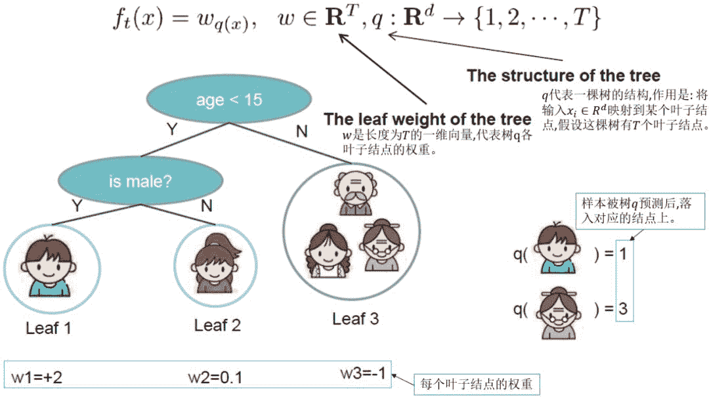
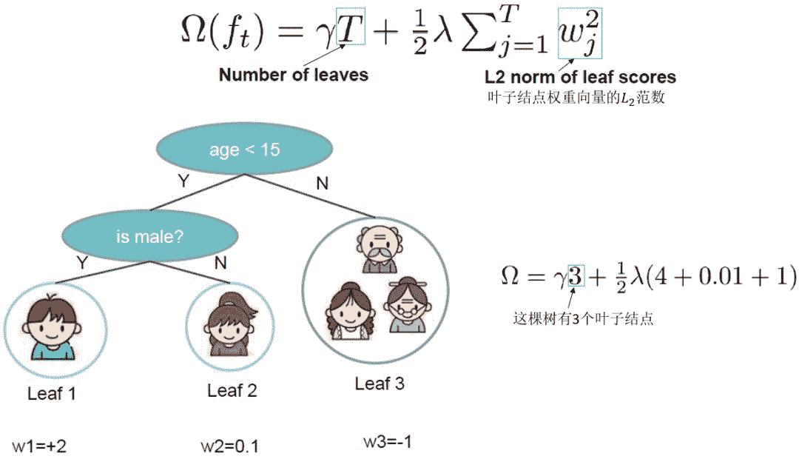
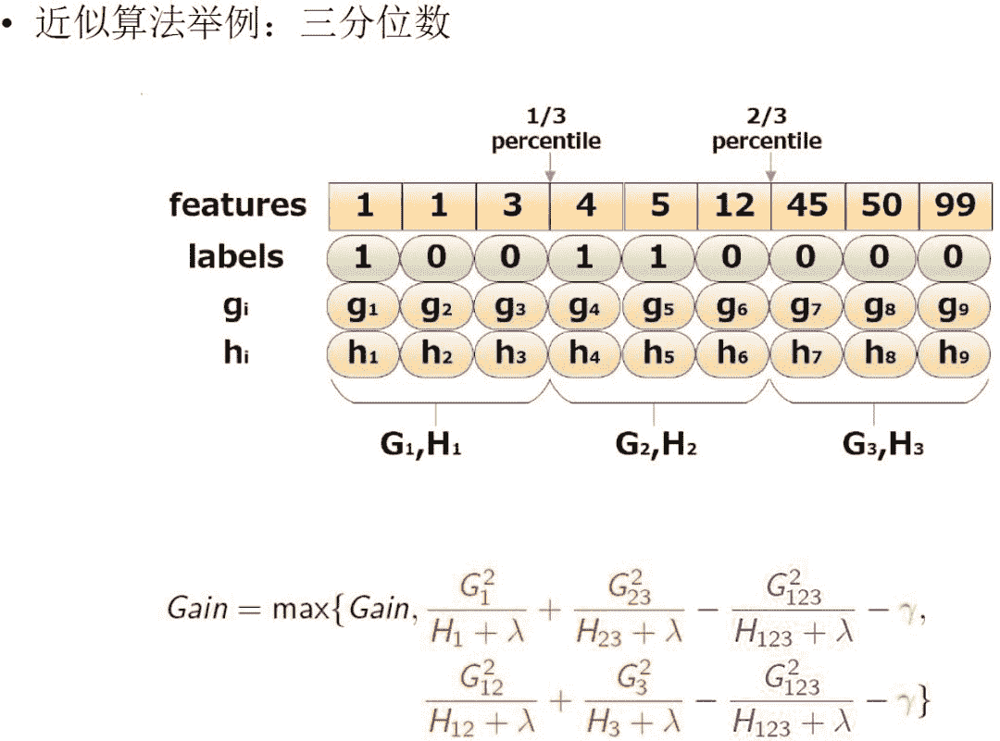

**本文的主要内容概览：**


# 1\. XGBoost简介

XGBoost的全称是eXtreme Gradient Boosting，它是经过优化的分布式梯度提升库，旨在高效、灵活且可移植。XGBoost是大规模并行boosting tree的工具，它是目前最快最好的开源 boosting tree工具包，比常见的工具包快10倍以上。在数据科学方面，有大量的Kaggle选手选用XGBoost进行数据挖掘比赛，是各大数据科学比赛的必杀武器；在工业界大规模数据方面，XGBoost的分布式版本有广泛的可移植性，支持在Kubernetes、Hadoop、SGE、MPI、 Dask等各个分布式环境上运行，使得它可以很好地解决工业界大规模数据的问题。本文将从XGBoost的数学原理和工程实现上进行介绍，然后介绍XGBoost的优缺点，并在最后给出面试中经常遇到的关于XGBoost的问题。

# 2\. XGBoost的原理推导

## 2.1 从目标函数开始，生成一棵树

XGBoost和GBDT两者都是boosting方法，除了工程实现、解决问题上的一些差异外，最大的不同就是目标函数的定义。因此，本文我们从目标函数开始探究XGBoost的基本原理。

### 2.1.1 学习第 t 棵树

XGBoost是由   个基模型组成的一个加法模型，假设我们第   次迭代要训练的树模型是   ，则有：


### 2.1.2 XGBoost的目标函数

损失函数可由预测值   与真实值   进行表示：

其中，   为样本的数量。

我们知道模型的预测精度由模型的偏差和方差共同决定，损失函数代表了模型的偏差，想要方差小则需要在目标函数中添加正则项，用于防止过拟合。所以目标函数由模型的损失函数   与抑制模型复杂度的正则项   组成，目标函数的定义如下：

其中，   是将全部   棵树的复杂度进行求和，添加到目标函数中作为正则化项，用于防止模型过度拟合。

由于XGBoost是boosting族中的算法，所以遵从前向分步加法，以第   步的模型为例，模型对第   个样本   的预测值为：

其中，   是由第     步的模型给出的预测值，是已知常数，     是这次需要加入的新模型的预测值。此时，目标函数就可以写成：

注意上式中，只有一个变量，那就是第   棵树  ，其余都是已知量或可通过已知量可以计算出来的。细心的同学可能会问，上式中的第二行到第三行是如何得到的呢？这里我们将正则化项进行拆分，由于前  棵树的结构已经确定，因此前    棵树的复杂度之和可以用一个常量表示，如下所示：

### 2.1.3 泰勒公式展开

泰勒公式是将一个在   处具有   阶导数的函数  利用关于  的   次多项式来逼近函数的方法。若函数  在包含   的某个闭区间   上具有   阶导数，且在开区间   上具有    阶导数，则对闭区间   上任意一点   有：

其中的多项式称为函数在   处的泰勒展开式，  是泰勒公式的余项且是   的高阶无穷小。

根据泰勒公式，把函数   在点   处进行泰勒的二阶展开，可得如下等式：

回到XGBoost的目标函数上来，   对应损失函数   ，   对应前    棵树的预测值   ，  对应于我们正在训练的第   棵树   ，则可以将损失函数写为：

其中，   为损失函数的一阶导，   为损失函数的二阶导，注意这里的求导是对   求导。

我们以平方损失函数为例：

则：

将上述的二阶展开式，带入到XGBoost的目标函数中，可以得到目标函数的近似值：

由于在第   步时   其实是一个已知的值，所以    是一个常数，其对函数的优化不会产生影响。因此，去掉全部的常数项，得到目标函数为：

所以我们只需要求出每一步损失函数的一阶导和二阶导的值（由于前一步的   是已知的，所以这两个值就是常数），然后最优化目标函数，就可以得到每一步的   ，最后根据加法模型得到一个整体模型。

### 2.1.4 定义一棵树

我们知道XGBoost的基模型不仅支持决策树，还支持线性模型，本文我们主要介绍基于决策树的目标函数。我们可以重新定义一棵决策树，其包括两个部分：

*   叶子结点的权重向量   ;

*   实例(样本)到叶子结点的映射关系   (本质是树的分支结构)；



### 2.1.5 定义树的复杂度

决策树的复杂度   可由叶子数     组成，叶子节点越少模型越简单，此外叶子节点也不应该含有过高的权重     （类比 LR 的每个变量的权重），所以目标函数的正则项由生成的所有决策树的叶子节点数量，和所有节点权重所组成的向量的   范式共同决定。



### 2.1.6 叶子结点归组

我们将属于第   个叶子结点的所有样本   划入到一个叶子结点的样本集合中，数学表示为：   ，那么XGBoost的目标函数可以写成：

上式中的第二行到第三行可能看的不是特别明白，这里做些解释：第二行是遍历所有的样本后求每个样本的损失函数，但样本最终会落在叶子节点上，所以我们也可以遍历叶子节点，然后获取叶子节点上的样本集合，最后再求损失函数。即我们之前是单个样本，现在都改写成叶子结点的集合，由于一个叶子结点有多个样本存在，因此才有了   和   这两项，   为第   个叶子节点取值。

为简化表达式，我们定义   ，   ，含义如下：

*   ：叶子结点     所包含样本的一阶偏导数累加之和，是一个常量；

*   ：叶子结点     所包含样本的二阶偏导数累加之和，是一个常量；

将   和   带入XGBoost的目标函数，则最终的目标函数为：

这里我们要注意   和   是前   步得到的结果，其值已知可视为常数，只有最后一棵树的叶子节点   不确定。

### 2.1.7 树结构打分

回忆一下初中数学知识，假设有一个一元二次函数，形式如下：

我们可以套用一元二次函数的最值公式轻易地求出最值点：

那么回到XGBoost的最终目标函数上   ，该如何求出它的最值呢？

我们先简单分析一下上面的式子：

*   对于每个叶子结点     ，可以将其从目标函数中拆解出来：

在2.1.5中我们提到，   和   相对于第   棵树来说是可以计算出来的。那么，这个式子就是一个只包含一个变量叶子结点权重   的一元二次函数，我们可以通过最值公式求出它的最值点。

*   再次分析一下目标函数   ，可以发现，各个叶子结点的目标子式是相互独立的，也就是说，当每个叶子结点的子式都达到最值点时，整个目标函数 才达到最值点。

那么，假设目前树的结构已经固定，套用一元二次函数的最值公式，将目标函数对   求一阶导，并令其等于   ，则可以求得叶子结点   对应的权值：

所以目标函数可以化简为：


上图给出目标函数计算的例子，求每个节点每个样本的一阶导数   和二阶导数   ，然后针对每个节点对所含样本求和得到   和   ，最后遍历决策树的节点即可得到目标函数。

## 2.2 一棵树的生成细节

### 2.2.1 最优切分点划分算法

在实际训练过程中，当建立第   棵树时，一个非常关键的问题是如何找到叶子节点的最优切分点，XGBoost支持两种分裂节点的方法——贪心算法和近似算法。

#### （1）贪心算法

从树的深度为0开始：

1.  对每个叶节点枚举所有的可用特征；

2.  针对每个特征，把属于该节点的训练样本根据该特征值进行升序排列，通过线性扫描的方式来决定该特征的最佳分裂点，并记录该特征的分裂收益；

3.  选择收益最大的特征作为分裂特征，用该特征的最佳分裂点作为分裂位置，在该节点上分裂出左右两个新的叶节点，并为每个新节点关联对应的样本集；

4.  回到第1步，递归执行直到满足特定条件为止；

**那么如何计算每个特征的分裂收益呢？**

假设我们在某一节点完成特征分裂，则分裂前的目标函数可以写为：

分裂后的目标函数为：

则对于目标函数来说，分裂后的收益为：

**注意：** 该特征收益也可作为特征重要性输出的重要依据。

**对于每次分裂，我们都需要枚举所有特征可能的分割方案，如何高效地枚举所有的分割呢？**
假设我们要枚举某个特征所有   这样条件的样本，对于某个特定的分割点   我们要计算   左边和右边的导数和。


我们可以发现对于所有的分裂点   ，只要做一遍从左到右的扫描就可以枚举出所有分割的梯度和   、   。然后用上面的公式计算每个分割方案的收益就可以了。

观察分裂后的收益，我们会发现节点划分不一定会使得结果变好，因为我们有一个引入新叶子的惩罚项，也就是说引入的分割带来的增益如果小于一个阀值的时候，我们可以剪掉这个分割。

#### （2）近似算法

贪心算法可以得到最优解，但当数据量太大时则无法读入内存进行计算，近似算法主要针对贪心算法这一缺点给出了近似最优解。

对于每个特征，只考察分位点可以减少计算复杂度。

该算法首先根据特征分布的分位数提出候选划分点，然后将连续型特征映射到由这些候选点划分的桶中，然后聚合统计信息找到所有区间的最佳分裂点。

在提出候选切分点时有两种策略：

*   Global：学习每棵树前就提出候选切分点，并在每次分裂时都采用这种分割；

*   Local：每次分裂前将重新提出候选切分点。直观上来看，Local策略需要更多的计算步骤，而Global策略因为节点已有划分所以需要更多的候选点。

下图给出不同种分裂策略的AUC变化曲线，横坐标为迭代次数，纵坐标为测试集AUC，`eps`为近似算法的精度，其倒数为桶的数量。


从上图我们可以看到， Global 策略在候选点数多时（`eps` 小）可以和 Local 策略在候选点少时（`eps` 大）具有相似的精度。此外我们还发现，在`eps`取值合理的情况下，分位数策略可以获得与贪心算法相同的精度。

近似算法简单来说，就是根据特征   的分布来确定   个候选切分点 <embed style="width: 21.749ex" src="https://mmbiz.qlogo.cn/mmbiz_svg/9UjCmequjU9o18w31df8y8qH8ia9bfOicx8t58riae0Y8fp9Zlupyxd7AWUrmEJzGp27zok4qesraMu2DLdfRic6zUByypwSP42U/0?wx_fmt=svg"> ，然后根据这些候选切分点把相应的样本放入对应的桶中，对每个桶的  ,  进行累加。最后在候选切分点集合上贪心查找。该算法描述如下：


**算法讲解：**

*   第一个for循环：对特征 根据该特征分布的分位数找到切割点的候选集合 <embed style="width: 21.749ex" src="https://mmbiz.qlogo.cn/mmbiz_svg/9UjCmequjU9o18w31df8y8qH8ia9bfOicxvGhUyB19zOUVAvtKEKicSUNuU2t68nOic2XB6QPjSGoiaN1kB7Roml8QmCl3IADKA9I/0?wx_fmt=svg"> 。这样做的目的是提取出部分的切分点不用遍历所有的切分点。其中获取某个特征 的候选切割点的方式叫proposal(策略)。XGBoost 支持 Global 策略和 Local 策略。

*   第二个for循环：将每个特征的取值映射到由该特征对应的候选点集划分的分桶区间，即   。对每个桶区间内的样本统计值  , 并进行累加，最后在这些累计的统计量上寻找最佳分裂点。这样做的目的是获取每个特征的候选分割点的  , 值。

下图给出近似算法的具体例子，以三分位为例：



根据样本特征进行排序，然后基于分位数进行划分，并统计三个桶内的  ,  值，最终求解节点划分的增益。

### 2.2.2 加权分位数缩略图

实际上，XGBoost不是简单地按照样本个数进行分位，而是以二阶导数值    作为样本的权重进行划分。为了处理带权重的候选切分点的选取，作者提出了`Weighted Quantile Sketch`算法。加权分位数略图算法提出了一种数据结构，这种数据结构支持merge和prune操作。作者在论文中给出了该算法的详细描述和证明链接，现在链接已经失效，但是在arXiv的最新版XGBoost论文中APPENDIX部分有该算法详细的描述，地址：https://arxiv.org/abs/1603.02754 。现在我们简单介绍加权分位数略图侯选点的选取方式，如下：


**那么为什么要用二阶梯度   进行样本加权？**

我们知道模型的目标函数为：

我们把目标函数配方整理成以下形式，便可以看出   有对 `loss` 加权的作用。

其中，加入  是因为   和   是上一轮的损失函数求导与 `constant` 皆为常数。我们可以看到   就是平方损失函数中样本的权重。

### 2.2.3 稀疏感知算法

实际工程中一般会出现输入值稀疏的情况。比如数据的缺失、one-hot编码都会造成输入数据稀疏。XGBoost在构建树的节点过程中只考虑非缺失值的数据遍历，而为每个节点增加了一个缺省方向，当样本相应的特征值缺失时，可以被归类到缺省方向上，最优的缺省方向可以从数据中学到。至于如何学到缺省值的分支，其实很简单，分别枚举特征缺省的样本归为左右分支后的增益，选择增益最大的枚举项即为最优缺省方向。

在构建树的过程中需要枚举特征缺失的样本，乍一看这个算法会多出相当于一倍的计算量，但其实不是的。因为在算法的迭代中只考虑了非缺失值数据的遍历，缺失值数据直接被分配到左右节点，所需要遍历的样本量大大减小。作者通过在`Allstate-10K`数据集上进行了实验，从结果可以看到稀疏算法比普通算法在处理数据上快了超过`50`倍。


# 3\. XGBoost的工程实现

## 3.1 列块并行学习

在树生成过程中，最耗时的一个步骤就是在每次寻找最佳分裂点时都需要对特征的值进行排序。而 XGBoost 在训练之前会根据特征对数据进行排序，然后保存到块结构中，并在每个块结构中都采用了稀疏矩阵存储格式（Compressed Sparse Columns Format，CSC）进行存储，后面的训练过程中会重复地使用块结构，可以大大减小计算量。

作者提出通过按特征进行分块并排序，在块里面保存排序后的特征值及对应样本的引用，以便于获取样本的一阶、二阶导数值。具体方式如图：


通过顺序访问排序后的块遍历样本特征的特征值，方便进行切分点的查找。此外分块存储后多个特征之间互不干涉，可以使用多线程同时对不同的特征进行切分点查找，即特征的并行化处理。在对节点进行分裂时需要选择增益最大的特征作为分裂，这时各个特征的增益计算可以同时进行，这也是 XGBoost 能够实现分布式或者多线程计算的原因。

## 3.2 缓存访问

列块并行学习的设计可以减少节点分裂时的计算量，在顺序访问特征值时，访问的是一块连续的内存空间，但通过特征值持有的索引（样本索引）访问样本获取一阶、二阶导数时，这个访问操作访问的内存空间并不连续，这样可能造成cpu缓存命中率低，影响算法效率。

为了解决缓存命中率低的问题，XGBoost 提出了缓存访问算法：为每个线程分配一个连续的缓存区，将需要的梯度信息存放在缓冲区中，这样就实现了非连续空间到连续空间的转换，提高了算法效率。此外适当调整块大小，也可以有助于缓存优化。

## 3.3 “核外”块计算

当数据量非常大时，我们不能把所有的数据都加载到内存中。那么就必须将一部分需要加载进内存的数据先存放在硬盘中，当需要时再加载进内存。这样操作具有很明显的瓶颈，即硬盘的IO操作速度远远低于内存的处理速度，肯定会存在大量等待硬盘IO操作的情况。针对这个问题作者提出了“核外”计算的优化方法。具体操作为，将数据集分成多个块存放在硬盘中，使用一个独立的线程专门从硬盘读取数据，加载到内存中，这样算法在内存中处理数据就可以和从硬盘读取数据同时进行。此外，XGBoost 还用了两种方法来降低硬盘读写的开销：

*   块压缩（Block Compression）。论文使用的是按列进行压缩，读取的时候用另外的线程解压。对于行索引，只保存第一个索引值，然后用16位的整数保存与该block第一个索引的差值。作者通过测试在block设置为   个样本大小时，压缩比率几乎达到  。

*   块分区（Block Sharding ）。块分区是将特征block分区存放在不同的硬盘上，以此来增加硬盘IO的吞吐量。

# 4\. XGBoost的优缺点

## 4.1 优点

*   **精度更高：** GBDT 只用到一阶泰勒展开，而 XGBoost 对损失函数进行了二阶泰勒展开。XGBoost 引入二阶导一方面是为了增加精度，另一方面也是为了能够自定义损失函数，二阶泰勒展开可以近似大量损失函数；

*   **灵活性更强：** GBDT 以 CART 作为基分类器，XGBoost 不仅支持 CART 还支持线性分类器，使用线性分类器的 XGBoost 相当于带   和   正则化项的逻辑斯蒂回归（分类问题）或者线性回归（回归问题）。此外，XGBoost 工具支持自定义损失函数，只需函数支持一阶和二阶求导；

*   **正则化：** XGBoost 在目标函数中加入了正则项，用于控制模型的复杂度。正则项里包含了树的叶子节点个数、叶子节点权重的   范式。正则项降低了模型的方差，使学习出来的模型更加简单，有助于防止过拟合，这也是XGBoost优于传统GBDT的一个特性。

*   **Shrinkage（缩减）：** 相当于学习速率。XGBoost 在进行完一次迭代后，会将叶子节点的权重乘上该系数，主要是为了削弱每棵树的影响，让后面有更大的学习空间。传统GBDT的实现也有学习速率；

*   **列抽样：** XGBoost 借鉴了随机森林的做法，支持列抽样，不仅能降低过拟合，还能减少计算。这也是XGBoost异于传统GBDT的一个特性；

*   **缺失值处理：** 对于特征的值有缺失的样本，XGBoost 采用的稀疏感知算法可以自动学习出它的分裂方向；

*   **XGBoost工具支持并行：** boosting不是一种串行的结构吗?怎么并行的？注意XGBoost的并行不是tree粒度的并行，XGBoost也是一次迭代完才能进行下一次迭代的（第 次迭代的代价函数里包含了前面 次迭代的预测值）。XGBoost的并行是在特征粒度上的。我们知道，决策树的学习最耗时的一个步骤就是对特征的值进行排序（因为要确定最佳分割点），XGBoost在训练之前，预先对数据进行了排序，然后保存为block结构，后面的迭代中重复地使用这个结构，大大减小计算量。这个block结构也使得并行成为了可能，在进行节点的分裂时，需要计算每个特征的增益，最终选增益最大的那个特征去做分裂，那么各个特征的增益计算就可以开多线程进行。

*   **可并行的近似算法：** 树节点在进行分裂时，我们需要计算每个特征的每个分割点对应的增益，即用贪心法枚举所有可能的分割点。当数据无法一次载入内存或者在分布式情况下，贪心算法效率就会变得很低，所以XGBoost还提出了一种可并行的近似算法，用于高效地生成候选的分割点。

## 4.2 缺点

*   虽然利用预排序和近似算法可以降低寻找最佳分裂点的计算量，但在节点分裂过程中仍需要遍历数据集；

*   预排序过程的空间复杂度过高，不仅需要存储特征值，还需要存储特征对应样本的梯度统计值的索引，相当于消耗了两倍的内存。

# 5\. XGBoost实例

本篇文章所有数据集和代码均在我的GitHub中，地址：https://github.com/Microstrong0305/WeChat-zhihu-csdnblog-code/tree/master/Ensemble%20Learning/XGBoost

## 5.1 安装XGBoost依赖包

```
pip install xgboost 
```

## 5.2 XGBoost分类和回归

XGBoost有两大类接口：XGBoost原生接口 和 scikit-learn接口 ，并且XGBoost能够实现分类和回归两种任务。

### （1）基于XGBoost原生接口的分类

```
from sklearn.datasets import load_iris
import xgboost as xgb
from xgboost import plot_importance
from matplotlib import pyplot as plt
from sklearn.model_selection import train_test_split

# read in the iris data
iris = load_iris()

X = iris.data
y = iris.target

# split train data and test data
X_train, X_test, y_train, y_test = train_test_split(X, y, test_size=0.2, random_state=1234565)

# set XGBoost's parameters
params = {
    'booster': 'gbtree',
    'objective': 'multi:softmax',   # 回归任务设置为：'objective': 'reg:gamma',
    'num_class': 3,      # 回归任务没有这个参数
    'gamma': 0.1,
    'max_depth': 6,
    'lambda': 2,
    'subsample': 0.7,
    'colsample_bytree': 0.7,
    'min_child_weight': 3,
    'silent': 1,
    'eta': 0.1,
    'seed': 1000,
    'nthread': 4,
}

plst = params.items()

dtrain = xgb.DMatrix(X_train, y_train)
num_rounds = 500
model = xgb.train(plst, dtrain, num_rounds)

# 对测试集进行预测
dtest = xgb.DMatrix(X_test)
ans = model.predict(dtest)

# 计算准确率
cnt1 = 0
cnt2 = 0
for i in range(len(y_test)):
    if ans[i] == y_test[i]:
        cnt1 += 1
    else:
        cnt2 += 1

print("Accuracy: %.2f %% " % (100 * cnt1 / (cnt1 + cnt2)))

# 显示重要特征
plot_importance(model)
plt.show() 
```

### （2）基于Scikit-learn接口的回归

这里，我们用Kaggle比赛中回归问题：House Prices: Advanced Regression Techniques，地址：https://www.kaggle.com/c/house-prices-advanced-regression-techniques 来进行实例讲解。

该房价预测的训练数据集中一共有81列，第一列是Id，最后一列是label，中间79列是特征。这79列特征中，有43列是分类型变量，33列是整数变量，3列是浮点型变量。训练数据集中存在缺失值。

```
import pandas as pd
from sklearn.model_selection import train_test_split
from sklearn.impute import SimpleImputer
import xgboost as xgb
from sklearn.metrics import mean_absolute_error

# 1.读文件
data = pd.read_csv('./dataset/train.csv')
data.dropna(axis=0, subset=['SalePrice'], inplace=True)

# 2.切分数据输入：特征 输出：预测目标变量
y = data.SalePrice
X = data.drop(['SalePrice'], axis=1).select_dtypes(exclude=['object'])

# 3.切分训练集、测试集,切分比例7.5 : 2.5
train_X, test_X, train_y, test_y = train_test_split(X.values, y.values, test_size=0.25)

# 4.空值处理，默认方法：使用特征列的平均值进行填充
my_imputer = SimpleImputer()
train_X = my_imputer.fit_transform(train_X)
test_X = my_imputer.transform(test_X)

# 5.调用XGBoost模型，使用训练集数据进行训练（拟合）
# Add verbosity=2 to print messages while running boosting
my_model = xgb.XGBRegressor(objective='reg:squarederror', verbosity=2)  # xgb.XGBClassifier() XGBoost分类模型
my_model.fit(train_X, train_y, verbose=False)

# 6.使用模型对测试集数据进行预测
predictions = my_model.predict(test_X)

# 7.对模型的预测结果进行评判（平均绝对误差）
print("Mean Absolute Error : " + str(mean_absolute_error(predictions, test_y))) 
```

## 5.3 XGBoost调参

在上一部分中，XGBoot模型的参数都使用了模型的默认参数，但默认参数并不是最好的。要想让XGBoost表现的更好，需要对XGBoost模型进行参数微调。下图展示的是分类模型需要调节的参数，回归模型需要调节的参数与此类似。


# 6\. 关于XGBoost若干问题的思考

## 6.1 XGBoost与GBDT的联系和区别有哪些？

（1）GBDT是机器学习算法，XGBoost是该算法的工程实现。
（2）**正则项：** 在使用CART作为基分类器时，XGBoost显式地加入了正则项来控制模型的复杂度，有利于防止过拟合，从而提高模型的泛化能力。
（3）**导数信息：** GBDT在模型训练时只使用了代价函数的一阶导数信息，XGBoost对代价函数进行二阶泰勒展开，可以同时使用一阶和二阶导数。
（4）**基分类器：** 传统的GBDT采用CART作为基分类器，XGBoost支持多种类型的基分类器，比如线性分类器。
（5）**子采样：** 传统的GBDT在每轮迭代时使用全部的数据，XGBoost则采用了与随机森林相似的策略，支持对数据进行采样。
（6）**缺失值处理：** 传统GBDT没有设计对缺失值进行处理，XGBoost能够自动学习出缺失值的处理策略。
（7）**并行化：** 传统GBDT没有进行并行化设计，注意不是tree维度的并行，而是特征维度的并行。XGBoost预先将每个特征按特征值排好序，存储为块结构，分裂结点时可以采用多线程并行查找每个特征的最佳分割点，极大提升训练速度。

## 6.2 为什么XGBoost泰勒二阶展开后效果就比较好呢？

（1）**从为什么会想到引入泰勒二阶的角度来说（可扩展性）：** XGBoost官网上有说，当目标函数是`MSE`时，展开是一阶项（残差）+二阶项的形式，而其它目标函数，如`logistic loss`的展开式就没有这样的形式。为了能有个统一的形式，所以采用泰勒展开来得到二阶项，这样就能把`MSE`推导的那套直接复用到其它自定义损失函数上。简短来说，就是为了统一损失函数求导的形式以支持自定义损失函数。至于为什么要在形式上与`MSE`统一？是因为`MSE`是最普遍且常用的损失函数，而且求导最容易，求导后的形式也十分简单。所以理论上只要损失函数形式与`MSE`统一了，那就只用推导`MSE`就好了。

（2）**从二阶导本身的性质，也就是从为什么要用泰勒二阶展开的角度来说（精准性）：** 二阶信息本身就能让梯度收敛更快更准确。这一点在优化算法里的牛顿法中已经证实。可以简单认为一阶导指引梯度方向，二阶导指引梯度方向如何变化。简单来说，相对于GBDT的一阶泰勒展开，XGBoost采用二阶泰勒展开，可以更为精准的逼近真实的损失函数。

## 6.3 XGBoost对缺失值是怎么处理的？

在普通的GBDT策略中，对于缺失值的方法是先手动对缺失值进行填充，然后当做有值的特征进行处理，但是这样人工填充不一定准确，而且没有什么理论依据。而XGBoost采取的策略是先不处理那些值缺失的样本，采用那些有值的样本搞出分裂点，在遍历每个有值特征的时候，尝试将缺失样本划入左子树和右子树，选择使损失最优的值作为分裂点。

## 6.4 XGBoost为什么可以并行训练？

（1）XGBoost的并行，并不是说每棵树可以并行训练，XGBoost本质上仍然采用boosting思想，每棵树训练前需要等前面的树训练完成才能开始训练。

（2）XGBoost的并行，指的是特征维度的并行：在训练之前，每个特征按特征值对样本进行预排序，并存储为Block结构，在后面查找特征分割点时可以重复使用，而且特征已经被存储为一个个block结构，那么在寻找每个特征的最佳分割点时，可以利用多线程对每个block并行计算。

# 7\. Reference

由于参考的文献较多，我把每一部分都重点参考了哪些文章详细标注一下。
**XGBoost论文解读：**
【1】Chen T , Guestrin C . XGBoost: A Scalable Tree Boosting System[J]. 2016.
【2】Tianqi Chen的XGBoost的Slides，地址：https://homes.cs.washington.edu/~tqchen/data/pdf/BoostedTree.pdf
【3】对xgboost的理解 - 金贵涛的文章 - 知乎 https://zhuanlan.zhihu.com/p/75217528
【4】CTR预估 论文精读(一)--XGBoost，地址：https://blog.csdn.net/Dby_freedom/article/details/84301725
【5】XGBoost论文阅读及其原理 - Salon sai的文章 - 知乎 https://zhuanlan.zhihu.com/p/36794802
【6】XGBoost 论文翻译+个人注释，地址：https://blog.csdn.net/qdbszsj/article/details/79615712
**XGBoost算法讲解：**
【7】XGBoost超详细推导，终于有人讲明白了！，地址：https://mp.weixin.qq.com/s/wLE9yb7MtE208IVLFlZNkw
【8】终于有人把XGBoost 和 LightGBM 讲明白了，项目中最主流的集成算法！，地址：https://mp.weixin.qq.com/s/LoX987dypDg8jbeTJMpEPQ
【9】机器学习算法中 GBDT 和 XGBOOST 的区别有哪些？- wepon的回答 - 知乎 https://www.zhihu.com/question/41354392/answer/98658997
【10】GBDT算法原理与系统设计简介，wepon，地址：http://wepon.me/files/gbdt.pdf
**XGBoost实例：**
【11】Kaggle 神器 xgboost，地址：https://www.jianshu.com/p/7e0e2d66b3d4
【12】干货 | XGBoost在携程搜索排序中的应用，地址：https://mp.weixin.qq.com/s/X4K6UFZPxL05v2uolId7Lw
【13】史上最详细的XGBoost实战 - 章华燕的文章 - 知乎 https://zhuanlan.zhihu.com/p/31182879
【14】XGBoost模型构建流程及模型参数微调（房价预测附代码讲解） - 人工智能学术前沿的文章 - 知乎 https://zhuanlan.zhihu.com/p/61150141
**XGBoost面试题：**
【15】珍藏版 | 20道XGBoost面试题，你会几个？(上篇)，地址：https://mp.weixin.qq.com/s/_QgnYoW827GDgVH9lexkNA
【16】珍藏版 | 20道XGBoost面试题，你会几个？(下篇)，地址：https://mp.weixin.qq.com/s/BbelOsYgsiOvwfwYs5QfpQ
【17】推荐收藏 | 10道XGBoost面试题送给你，地址：https://mp.weixin.qq.com/s/RSQWx4fH3uI_sjZzAKVyKQ
【18】面试题：xgboost怎么给特征评分？，地址：https://mp.weixin.qq.com/s/vjLPVhg_UavZIJrOzu_u1w
【19】[校招-基础算法]GBDT/XGBoost常见问题 - Jack Stark的文章 - 知乎 https://zhuanlan.zhihu.com/p/81368182
【20】《百面机器学习》诸葛越主编、葫芦娃著，P295-P297。
【21】灵魂拷问，你看过Xgboost原文吗？- 小雨姑娘的文章 - 知乎 https://zhuanlan.zhihu.com/p/86816771
【22】为什么xgboost泰勒二阶展开后效果就比较好了呢？- Zsank的回答 - 知乎 https://www.zhihu.com/question/277638585/answer/522272201

关于AI学习路线和优质资源，在后台回复"**AI**"获取

