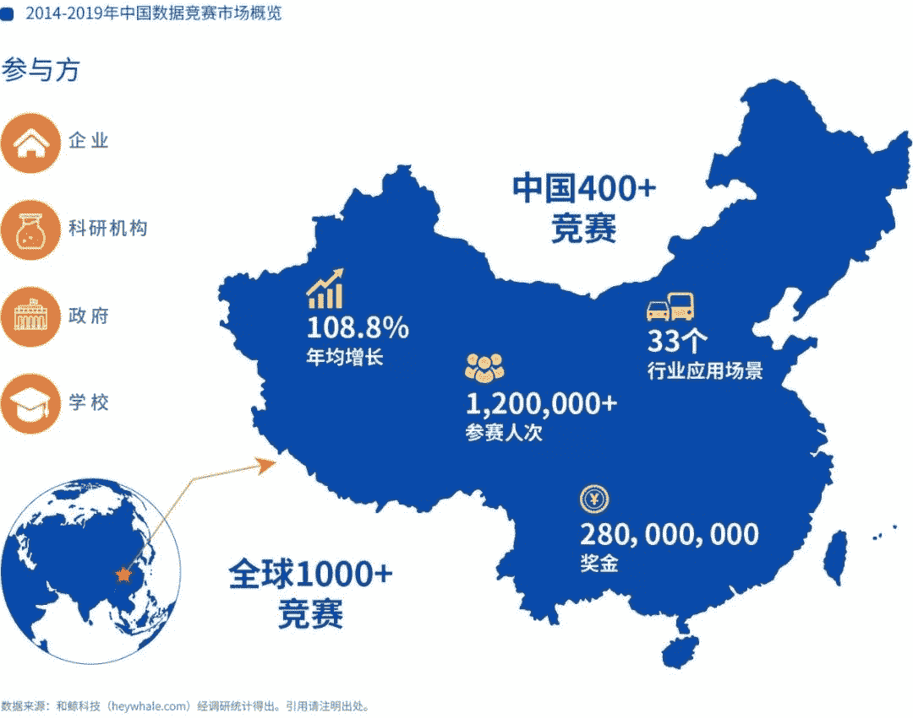
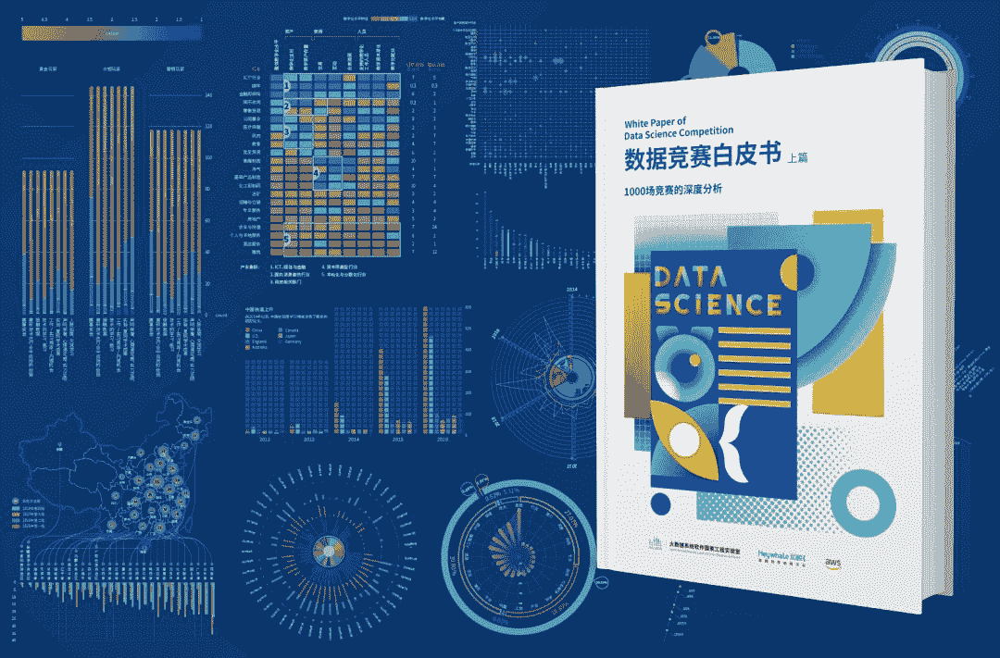
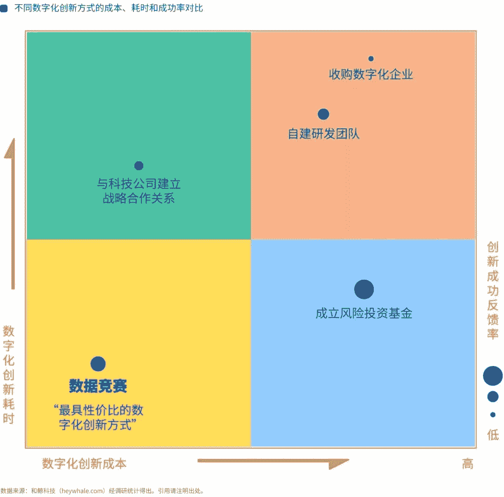
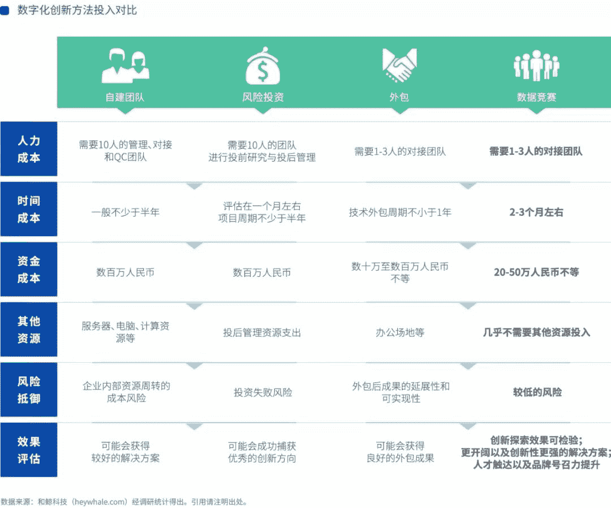
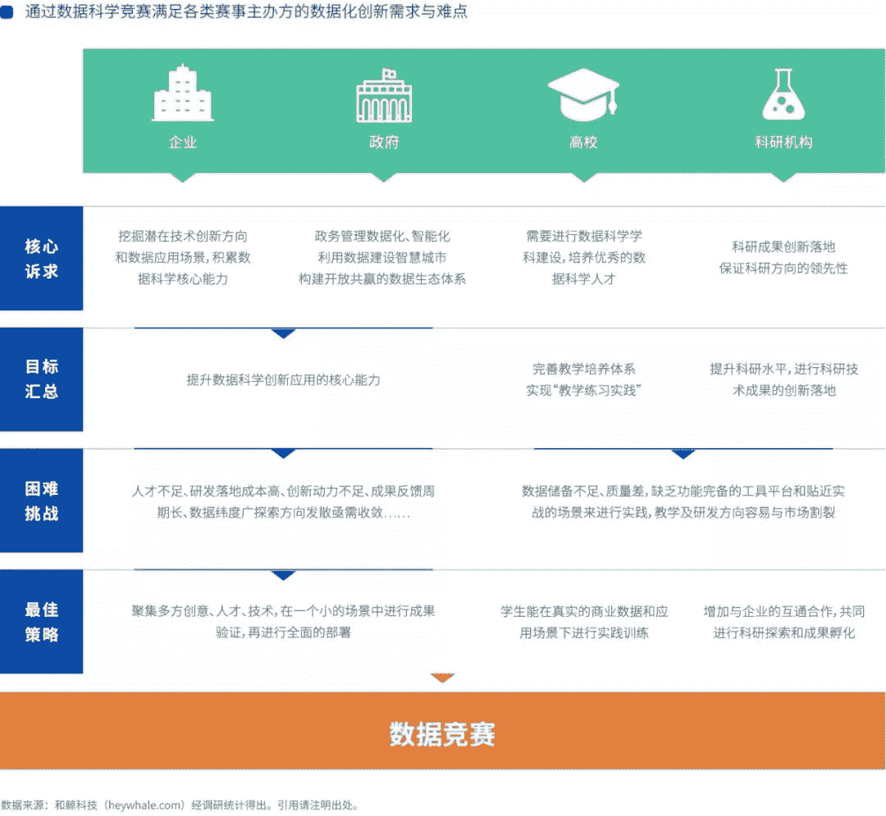
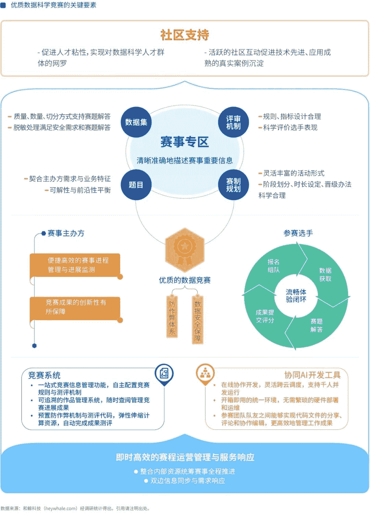

近年来，“数据竞赛”已经成为大数据与人工智能领域的热门话题。据不完全统计，2014年开始，全球赛事超1000场，仅中国的竞赛场次年均增长达**108.8%**，累计超**120万**人次参加，奖金累计达到**2.8**亿人民币。拥有这样的增长趋势，“数据竞赛”已经呈现出了独特的技术价值、业务价值和创新价值，等待着产业、学界、政府机构去进一步发现和运用。

什么是数据竞赛？为什么这么多企业和机构在办赛？

都有谁在办赛？参赛的都是哪些人？

为什么“数据竞赛”被视为数字化转型的敏捷形态？

办好数据竞赛需要哪些条件？

为了回答这些问题，在**大数据系统软件国家工程实验室**的指导下，**和鲸科技**携旗下第三方数据竞赛平台**和鲸社区**（Kesci.com），联合**AWS**，通过1000余份问卷调研、几十位行业专家及企业办赛负责人的访谈、超过1200小时的分析研究，共同打造并发布了《数据竞赛白皮书》（以下简称“白皮书”）。白皮书分为《数据竞赛白皮书·上篇·1000场竞赛的深度分析》和《数据竞赛白皮书·下篇·办好一场竞赛的实操手册》两部分。

接下来，小编就带大家先睹为快，为大家解读一下这份《白皮书》的主要看点：

*   领导企业布局数据竞赛的战略意图

*   如何用可控的成本开启数字化转型

*   如何找到产学研融合的切入点

*   总结数据化创新的方法论和工具箱

**竞赛模式，数字化转型的敏捷模式**

AI 引发全球热潮，但由于风险高、投入大、人才少，真正能成功落地的案例并不多。和小编一起打开白皮书，看看数据竞赛如何以可控的成本找到数字化创新的启动方法。

与常用的4种数字化转型方案相比，我们发现数据竞赛具有优势包括：

*   性价比：投入金钱、时间、人员少，创新成功率位居第二

*   敏捷性：赛马机制下，小体量运作投入，能快速获得反馈

*   持续性：多方的资源整合与联通，为可持续的技术探索提供了公共平台

**赋能数字化创新，数据竞赛受青睐**

**看点1**

**AI 巨头主导推动，**

**掀起全球数据竞赛热潮**

调研发现，数据竞赛的主要推动力量是科研、产业、政府领域头部机构。

**微软、谷歌、亚马逊等**跨国公司，**BAT、华为**、**三大电信运营商、大型银行**等企业与组织，常年保持多场比赛的频率。

作为领先 AI 技术聚集和产出地，ICCV、ISBI、Euro CSS、IEEE-CIS、CVPR、ECCV 等顶会，通过与世界各地企业、高校、政府机构合作举办数据竞赛，推动前沿技术与业务场景的融合。

**清华、北大、上交、MIT、Stanford **等高校，作为数据人才的培养源头也在数据竞赛融入学科建设和人才培养的体系，应对社会和产业的数据人才、AI 人才高度短缺的挑战。

**数据竞赛全球化，跨国跨界成常态。**近年国际顶会通过在不同国家与不同的企业/政府机构合作办赛，快速吸引了全球的数据人才参赛。在我国 AI 上升国家战略后，政府引导下的跨界融合更加广泛而深远。

**看点2**

**20余年探索检验，**

**模式效益有目共睹**

从1997年 KDD Cup 开始，数据竞赛在全球已有20余年的历史 。在我国也换发出了全新的活力，成为数字化浪潮下企业、政府部门、高校共同参与的创新模式。

****

**数据竞赛的价值是什么？**

[数据竞赛是指在以真实业务问题为导向，聚合广泛的、跨学科的数据人才的参与，利用数据研发算法模型、探索解决方案的新型研发模式。](https://mp.weixin.qq.com/s?__biz=MzU1Mjk3NTU0Mw%3D%3D&idx=1&mid=2247483875&scene=21&sn=b863e0aac4846f6e6c807bc2ada999df#wechat_redirect)

20年沉淀与变革，数据竞赛已形成完整的方法论和工具箱，并在新时期被赋予了新的意义，**成为四类主办方实现数字化转型的敏捷杠杆。**

*   帮助政府、企业搭建起从技术探索到落地应用的必经桥梁；

*   整合真实数据、案例、工具助力高校完成学科体系建设；

*   为科研机构提供场景和数据，实现技术的落地应用；

*   整合产业链的各类创新主体，实现价值在彼此之间的传递。

**看点3**

**上百场赛事的经验沉淀****，**

**开源数据竞赛的方法论与工具箱**

赛事运营包括赛前策划、赛题设计、赛事宣传、项目管理、技术运维、提交审核、成绩评审等环节，有着很高的技术壁垒与运营复杂度。第三方竞赛平台积累的协同开发工具、专业人才社区、数据项目管理方法等，成为了赛事主办方的有力支撑。

白皮书的下篇，《数据竞赛白皮书·办好一场竞赛的实操手册》中，和鲸科技全面开源了数据竞赛的方法论和工具箱，帮助科研、企业和政府机构用好数据竞赛的新型研发模式，提高数字化转型的成功率与性价比。

********

**100+赛事专业赛事服务经验，打磨高效管理流程。**

********

**协同工具支撑公正竞赛环境，保障选手体验及创新成果。**

经过多年探索，“**数据竞赛管理系统+协同开发工具+云计算平台**”一体化的云端竞赛环境已成为公认的最佳实践，已被谷歌、微软、阿里、华为等大型企业充分运用，也为传统行业的数字化创新进行了模式、流程、机制、效果上的探索和验证。

****

**“数据+算力+算法+人才”的一体化云端实验室，加速创意验证与创新落地。**

数据智能的普及已是战略必然，数字化转型也已成为战略共识，随着算力和数据的跨越式发展，从“可能性”到“可行性”的鸿沟却在不断加大。

数据竞赛已经成为了聚合“**数据+算力+算法+人才**”四大创新要素的枢纽，在数字化创新的生态中，扮演着越来越重要的角色。

数据竞赛这一新型研发模式，作为云端实验室的职能，正在帮助组织验证数字化创新的方向、路径与切入点，推动数字化转型度过启动期、进入加速期。

我们也有理由期待，数据竞赛模式将在未来，进一步发挥出催化剂、加速器、放大器的作用，成为企业、机构的创新杠杆与转型抓手，为产业的数字升级带来更多的真实效果与意外收获。

本公众号后台发送 “**数据竞赛白皮书**”

即可领取《数据竞赛白皮书》

-END-

策划 | 向伟 清远 大溪

编辑 | 宇杰 士瑶 Arvin 雷林

设计 | 帅帅 羿霖

AI学习路线和优质资源，在后台回复"**AI**"获取

