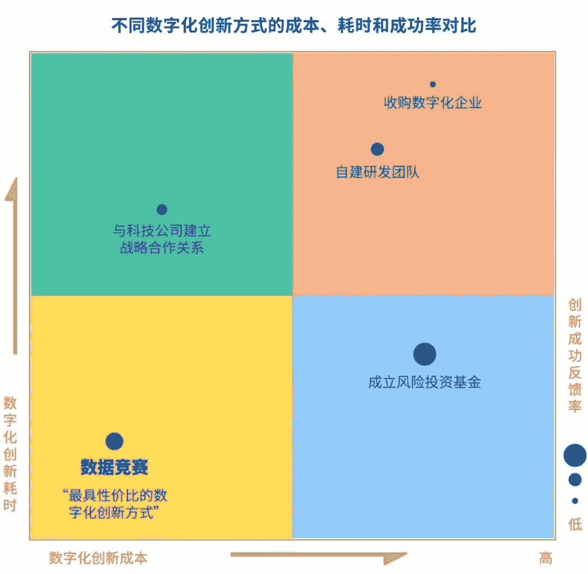
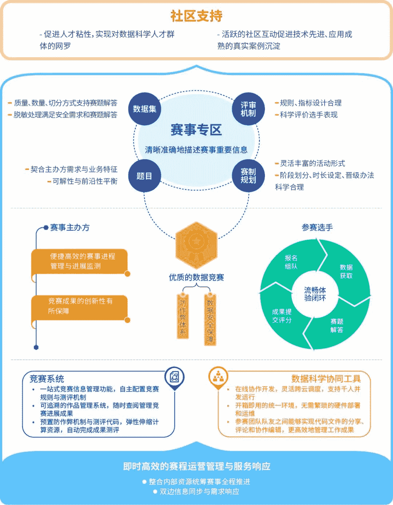

两周前，我们发布了《数据竞赛白皮书·上篇·1000场竞赛的深度分析》，通过28000字的研究分析、54个高品质图表，讲透了数据竞赛行业发展，带领大家看懂了竞赛高热度背后的逻辑。

上篇发布后，引发了广泛的讨论，涌进公众号后台领取白皮书的小伙伴们可把方小鲸累坏了。拿到上篇后，小伙伴们就开始灵魂拷问三连：

下篇在哪里？

什么时候发？

我要怎么领？

低调了半个月的方小鲸，今天终于可以正式宣布《数据竞赛白皮书·下篇·办好一场竞赛的实操手册》发布啦。

仅在中国，数据竞赛就以年均**108.8%**的增速、累计超**120万**人次参加体量、累计高达**2.8亿**人民币的奖金规模，成为了数据智能行业的创新杠杆。如此高的热度与参与度，此前尚无一份专业研究资料，《数据竞赛白皮书》无疑是填补了这一遗憾。

《数据竞赛白皮书》（以下简称“白皮书”）是在**大数据系统软件国家工程实验室**的指导下，**和鲸科技**携旗下第三方数据竞赛平台**和鲸社区（Kesci.com）**，联合AWS共同发布，分为《数据竞赛白皮书·上篇·1000场竞赛的深度分析》和《数据竞赛白皮书·下篇·办好一场竞赛的实操手册》两部分。

白皮书通过**1000余**份问卷调研、**1000余**场竞赛数据、**几十位**行业专家及企业办赛负责人的访谈、超过**1200小时**的分析研究、近**50000字**的内容输出、**80个**可视化精美图表，为我们全景展现了数据竞赛行业，揭示了为什么数据竞赛正在被越来越多的机构认可，一步步成为数字化创新的常用策略。

正因为数据竞赛已经成为科研、政府、产业的头部机构普遍采用的探索模式，可以快速验证数据驱动业务的方向与效果。作为数据竞赛行业的头部平台——和鲸科技频频收到合作伙伴的办赛需求，为了更好地回答有关数据竞赛方面的问题，也为了让更多企业与机构在尝试数据竞赛模式时能够收获更多，我们在《数据竞赛白皮书·下篇·办好一场竞赛的实操手册》**首度公开了和鲸的数据竞赛管理方法论与业界最佳实践。**

**组织数据竞赛的系统方法，**

**为数字化创新落地赋能增效**

**为什么要掌握数据竞赛的系统方法？**

虽然受到了各类机构的广泛欢迎，数据竞赛有着很高的组织成本与技术复杂性，要在数据竞赛中取得满意的成果，仍然是充满挑战的。经过检验的系统方法，能帮助主办方更好利用数据竞赛的工具，取得技术探索、组织发展、业务成长的复合型目标：

· **办比赛**：帮助更多企业或机构能自主办赛、进行数字化转型探索。

· **拿成果**：帮助企业和机构少走弯路、减少浪费，产出更高价值的算法成果。

· **可落地**：匹配业务的真实需求和组织的能力建设，促进算法成果的落地与沉淀。

**经过上百场数据赛事验证的系统方法**

《数据竞赛白皮书·下篇·办好一场竞赛的实操手册》——**和鲸首度开源策划与组织数据竞赛的系统方法**，帮助企业利用和鲸科技四年时间积累的上百场赛事经验，用更敏捷、可持续的方式推动数字化转型。

数据竞赛的系统方法主要构成模块

如何设计数据竞赛的赛题？

好的赛题能够贴合赛事主体的业务需求，有创新探索价值。一道好的赛题制定需考虑以下方面：

1、赛题的未来应用价值在紧凑的竞赛周期内能够基于现行技术实现；

2、赛题与现有数据条件充分契合；

3、赛题具有充分的可解性，又能够保有一定的难度和挑战；

4、赛题表述清晰、明确，选手易懂；

5、赛题配套的测评方法需要综合考量学术指标、生产指标与竞赛效果；

6、可引入行业专家共同参与赛题的打磨并对赛题质量提出意见。

如何用好云计算的基础设施？

云计算技术日趋成熟，上云也已是全球趋势，如何用好云计算的基础设施，实现数据竞赛的过程可控、体验提升和成果落地：

**· ****安全**：数据安全是赛事发起方的主要考虑之一，在云端环境直接调用数据，可以避免公开下载数据的潜在传播。

**· 公平**：云计算为选手提供了统一的赛事环境，帮助选手专注于算法创新和业务洞察，赛事的成绩不再依赖于选手拥有的计算资源。

**· 成果可复现**：成果管理是数据竞赛实现价值的“最后一公里”，云计算使得赛事成果可以被追踪、评价、复现、改进，从而实现在业务场景中的价值落地。

高水平的数据竞赛需要数据科学协同工具的支撑，能帮助选手和主办方更高效率、更加便利地使用云计算资源，如Kaggle Kernels、Google Colab，以及国内的K-Lab：

**· 体验高效**：通过预置丰富的数据分析工具包与机器学习框架，提升研发与创新的效率；数据的云端调用，不再需要数据下载；云端协同工作，选手可以高效进行团队协作与成果管理

**· 节约成本**：在云端进行每一位选手的算力管理、数据管理，弹性调度云计算资源，按需使用，最大化云计算的使用效率。

如何把握赛事运营的全流程？

赛事系统承载了一场比赛的全部流程，从信息展示、报名组队、成果提交到评测出分，支撑了数据竞赛的高效运营与互动体验。

**· 提升赛事管理便利性**：一站式赛事信息管理；多种可配置的功能，可适应不同的赛事场景需求，提高运营管理者的工作效率；

**· 自动测评的能力与效率**：支持多个AI领域、多种类型和大小的成果测评；弹性调度测评的云算力，帮助选手快速得到反馈结果。

数据竞赛的意义在于，用最敏捷的方式实现数据科学的价值闭环，同时实现技术方向验证、数据人才筛选、数据文化培养、业务效率优化的复合型目标。

复盘1000余场数据竞赛，这一模式已经成为了聚合“**数据+算力+算法+人才**”四大创新要素的枢纽，和鲸科技希望借助数据竞赛系统方法的开源，帮助更多的企业与机构在数字化、智能化、云端化的变革中找到抓手，加速数据创新的验证与落地。

本公众号后台发送 “**数据竞赛白皮书**”

即可领取《数据竞赛白皮书》

-END-

策划 | 向伟 清远 大溪

编辑 | 宇杰 Arvin 雷林

设计 | 帅帅 羿霖

AI学习路线和优质资源，在后台回复"**AI**"获取

