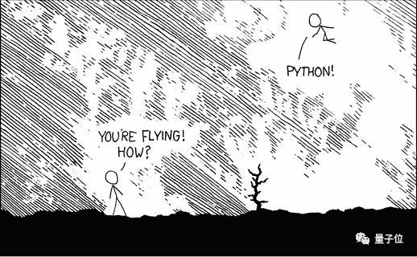
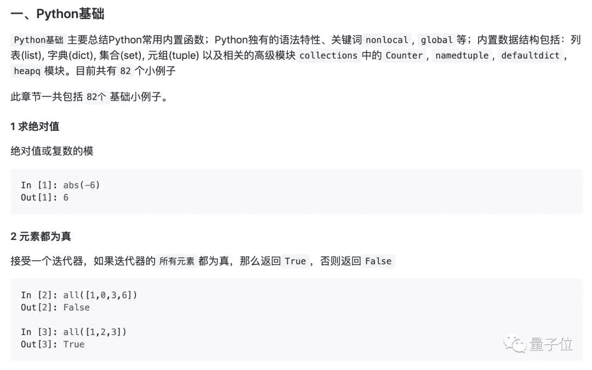
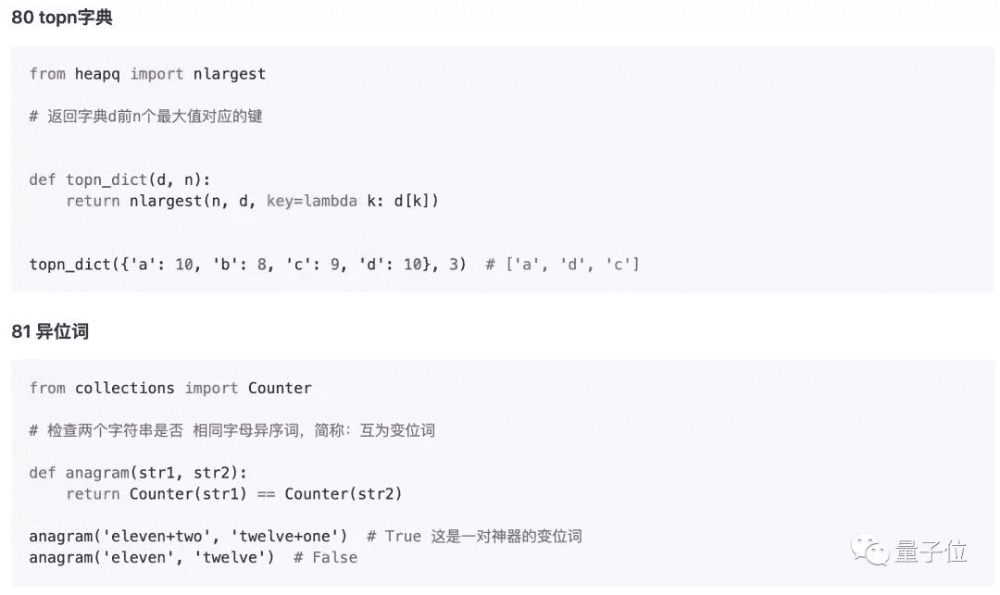
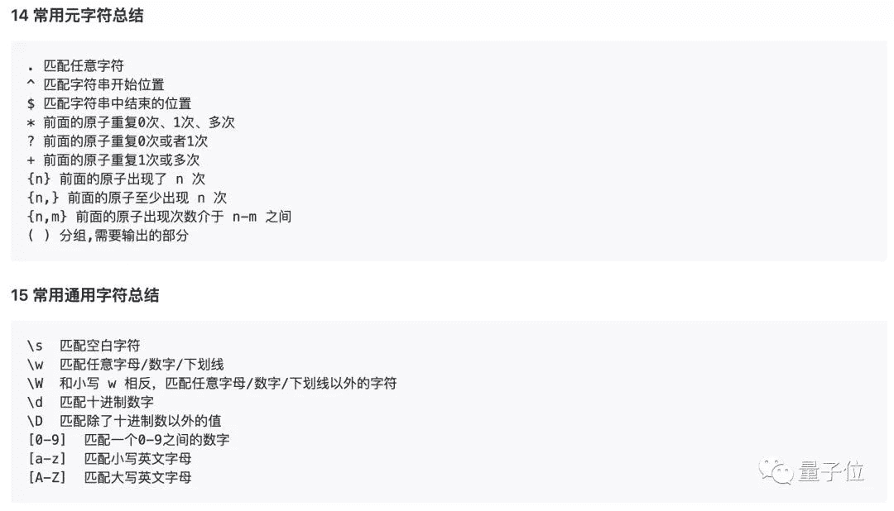
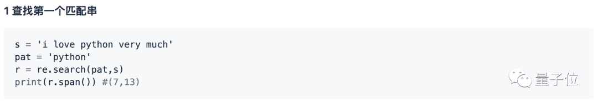
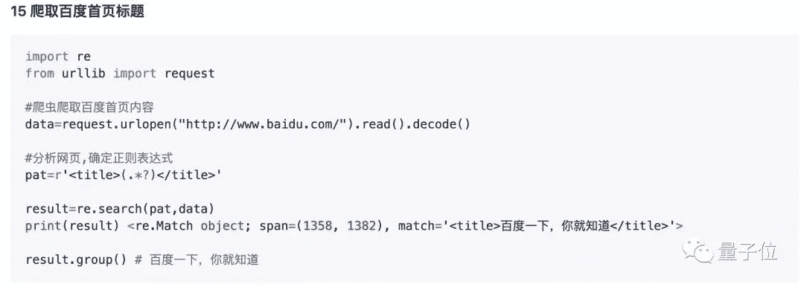
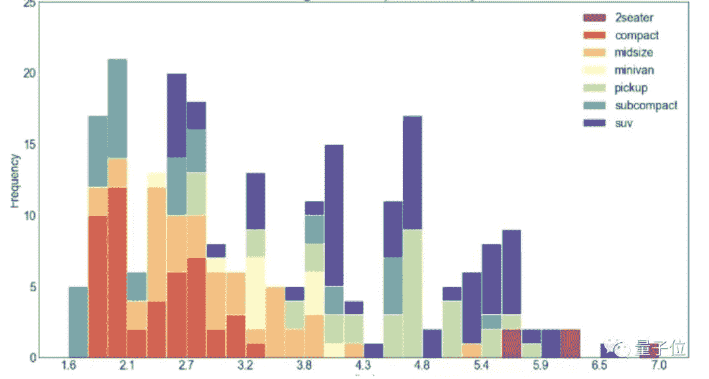
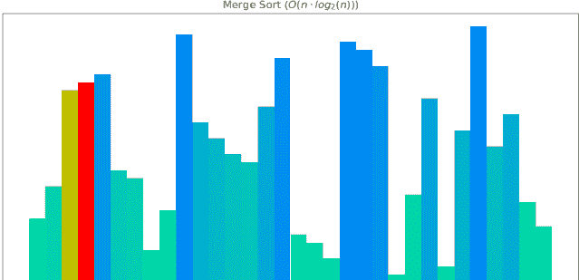
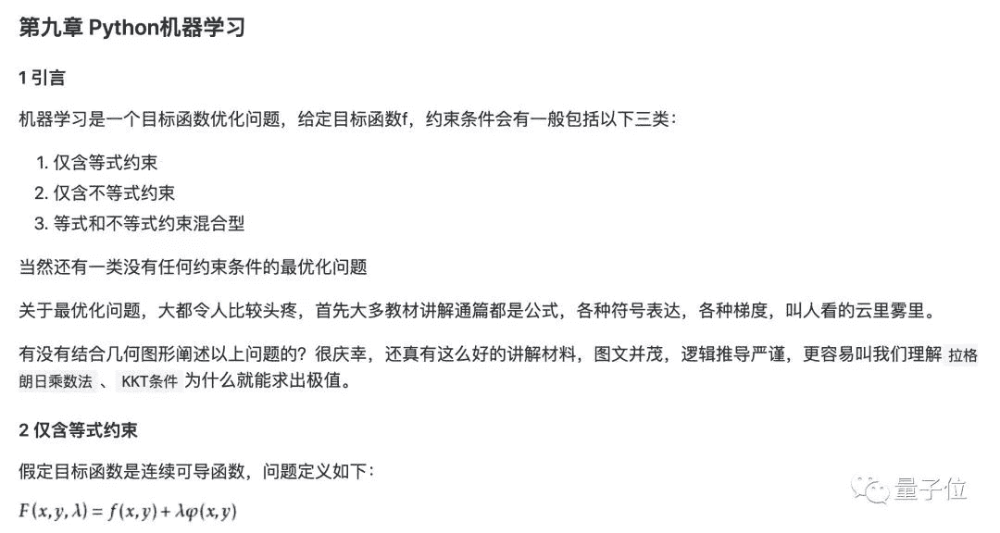

##### 鱼羊 发自 凹非寺
量子位 报道 | 公众号 QbitAI

人生苦短，编程苦手，不妨学起Python，感受一飞冲天的快乐。



不要害怕学习的过程枯燥无味，这里有程序员**jackzhenguo**打造的一份**中文**Python“糖果包”：147个代码小样，60秒一口，营养又好玩，从Python基础到机器学习尽皆囊括。

入门简单如十进制转二进制，尽显Python简洁之美：

```
In [1]: bin(10)
Out[1]: '0b1010'
```

冬天到了，就算没有点亮手绘技能，也能用简单几行代码绘出漫天雪花：


例子是有趣的例子，教程也是正经教程，学习路径清晰、系统，先一起来看看完整目录：

## 学习路径

> 施工完成：
> 
> 1、Python基础
> 
> 2、Python字符串和正则化
> 
> 3、Python文件
> 
> 4、Python日期
> 
> 5、Python利器
> 
> 6、Python画图
> 
> 7、Python实战
> 
> 施工中：
> 
> Python基础算法
> 
> python 机器学习，包括机器学习的基础概念和十大核心算法以及Sklearn和Kaggle实战的小例子
> 
> PyQt制作GUI
> 
> Flask前端开发
> 
> Python数据分析：NumPy, Pandas, Matplotlib, Plotly等

教程开篇，先用**82**段简单易懂的代码，介绍了Python的基础语法、功能。由简入繁，层层递进。





掌握了基础概念，就可以开始进一步深入学习了。比如字符串的处理。

其中，有常用知识的总结，随查随用：



从正则化起手式到简单爬虫的实现，也都一步步用代码铺开：





###### **△**urllib为内置模块，推荐第三方库requests

当然啦，学习Python，怎么能忽略三大利器：**迭代器**，**生成器**，**装饰器**。

你问啥是装饰器？Talk is cheap，show you the code，比如写一个测试运行时长的装饰器：

```
#测试函数执行时间的装饰器示例
import time
def timing(fn):
    def wrapper():
        start=time.time()
        fn()   #执行传入的fn参数
        stop=time.time()
        return (stop-start)
    return wrapper

@timing
def test_list_append():
    lst=[]
    for i in range(0,100000):
        lst.append(i)  

@timing
def test_list_compre():
    [i for i in range(0,100000)]  #列表生成式

a=test_list_append()
c=test_list_compre()
print("test list append time:",a)
print("test list comprehension time:",c)
print("append/compre:",round(a/c,3))

# test list append time: 0.0219
# test list comprehension time: 0.00798
# append/compre: 2.749
```

感受到这颗语法糖的滋味了吗~

跟随这份教程，你还能60秒get精美图表的生成方法：



60秒制作简单动画：

###### ****

###### **△**归并排序

学会用Python自动群发邮件：

```
import smtplib
from email import (header)
from email.mime import (text, application, multipart)
import time

def sender_mail():
    smt_p = smtplib.SMTP()
    smt_p.connect(host='smtp.qq.com', port=25)
    sender, password = '113097485@qq.com', "**************"
    smt_p.login(sender, password)
    receiver_addresses, count_num = [
        'guozhennianhua@163.com', 'xiaoxiazi99@163.com'], 1
    for email_address in receiver_addresses:
        try:
            msg = multipart.MIMEMultipart()
            msg['From'] = "zhenguo"
            msg['To'] = email_address
            msg['subject'] = header.Header('这是邮件主题通知', 'utf-8')
            msg.attach(text.MIMEText(
                '这是一封测试邮件，请勿回复本邮件~', 'plain', 'utf-8'))
            smt_p.sendmail(sender, email_address, msg.as_string())
            time.sleep(10)
            print('第%d次发送给%s' % (count_num, email_address))
            count_num = count_num + 1
        except Exception as e:
            print('第%d次给%s发送邮件异常' % (count_num, email_address))
            continue
    smt_p.quit()

sender_mail()
```

此外，虽然还未完工，机器学习部分作者也在积极建设中。

这一部分，不仅有基础概念，还将加入十大核心算法以及Sklearn和Kaggle实战的小例子。



就像Python学习路上的一盒巧克力，60秒一口，让你在一段段代码的实践中体验编程的乐趣，步步”打怪“进阶。

如果你在学Python，不妨mark一下~

## 传送门

GitHub：
https://github.com/jackzhenguo/python-small-examples

PDF下载：
https://github.com/jackzhenguo/python-small-examples/files/3992400/Python.V1.1.pdf

AI学习路线和优质资源，在后台回复"**AI**"获取

