选自heartbeat.fritz.ai

**作者：Derrick Mwiti**

**机器之心编译**

**参与：魔王、蛋酱**

> 对于剪枝技术，你了解多少？这里有一份秘籍，整理了 2019 年度的 6 篇论文所提到的最新剪枝方法。

剪枝是一种帮助神经网络实现规模更小、效率更高的深度学习方法。这是一种模型优化技术，它删除权重张量中不必要的值，从而使得压缩后的神经网络运行速度更快，网络训练过程中的计算成本也有所降低。在将模型部署到手机等边缘设备上时，剪枝的作用更加明显现。

本篇精选了神经网络剪枝领域的一些研究论文，供大家学习参考。

**论文 1：Pruning from Scratch (2019)**

作者提出了一种从头开始剪枝的网络剪枝流程。他们在 CIFAR10 和 ImageNet 数据集上对多个压缩分类模型进行了试验，结果表明该流程降低了正常剪枝方法的预训练开销，同时提高了网络的准确率。

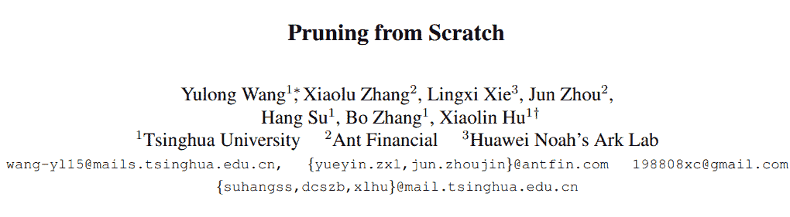

论文链接：https://arxiv.org/pdf/1909.12579.pdf

下图展示了传统剪枝流程的三个阶段：预训练、剪枝和微调。

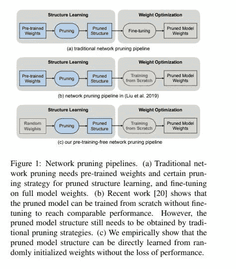

这篇论文提出的剪枝技术包括可基于随机初始化权重学得的新的剪枝流程。通道重要性（channel importance）则可通过关联标量门控（scalar gate）值和每个网络层来学得。

优化通道重要性，可在稀疏性正则化的情况下提高模型性能。在此过程中，随机权重并未得到更新。然后，基于给定资源约束，使用二分搜索策略确定剪枝后模型的通道数配置。

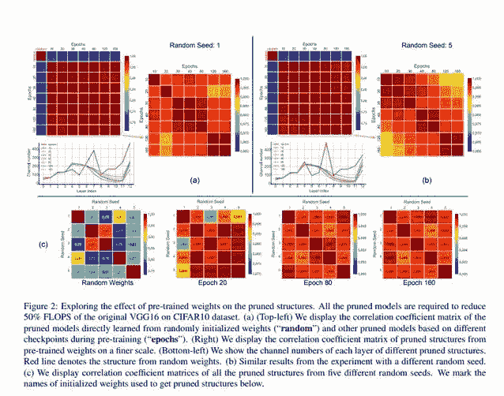

下表展示了模型在不同数据集上的准确率：

**论文 2：Adversarial Neural Pruning (2019)**

这篇论文主要探讨在遇到对抗扰动时网络隐特征的失真问题。该论文提出的方法是：学习贝叶斯剪枝掩码，来抑制较高级的失真特征，从而最大化其面对对抗扰动的稳健性。

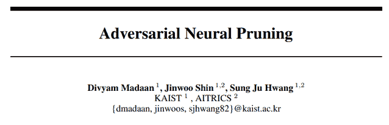

论文链接：https://arxiv.org/pdf/1908.04355.pdf

作者考虑了深度神经网络中隐特征的脆弱性。该方法提出剪除脆弱的特征，同时保留稳健的特征。这一过程可通过在贝叶斯框架中对抗地学习剪枝掩码来完成。

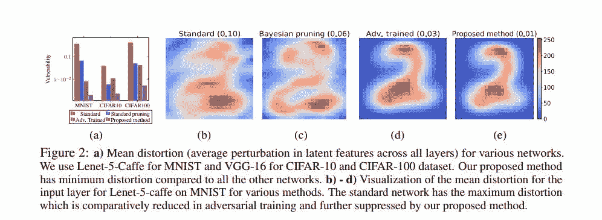

对抗神经剪枝（Adversarial Neural Pruning，ANP）结合了对抗训练和贝叶斯剪枝方法。该论文提出的新模型及其基线模型是：

*   标准的卷积神经网络（Standard）

*   使用贝塔-伯努利 dropout（beta-Bernoulli dropout）的 base 网络，即贝叶斯剪枝（BP）

*   对抗训练网络（AT）

*   使用贝塔-伯努利 dropout 的对抗神经剪枝（ANP）

*   使用脆弱抑制损失（vulnerability suppression loss）进行正则化得到的对抗训练网络（AT-VS）

*   使用脆弱抑制损失进行正则化得到的对抗神经剪枝网络（ANP-VS）

下表展示了模型的性能：

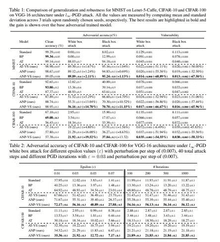

**论文 3：Rethinking the Value of Network Pruning (ICLR 2019)**

这篇论文提出的网络剪枝方法分为两类，目标剪枝模型的架构由人类或剪枝算法来决定。在实验中，作者对比了从头开始训练剪枝模型和基于继承权重进行微调得到的剪枝模型的结果，该对比针对预定义方法和自动化方法。

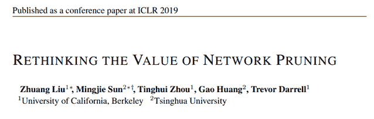

论文链接：https://arxiv.org/pdf/1810.05270v2.pdf

下图展示了使用基于 L1 范数的滤波器剪枝的预定义结构化剪枝所得到的结果。每一层都使用较小的 L1 范数剪掉一定比例的滤波器。「Pruned Model」列是用于配置每个模型的预定义目标模型列表。我们可以看到，每一行中，从头开始训练的模型性能至少与微调模型持平。

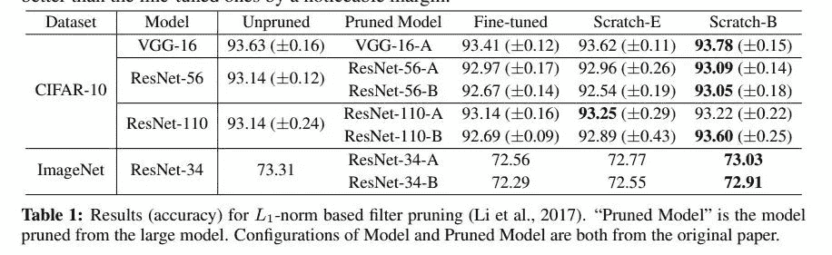

如下表所示，ThiNet 贪婪地剪去了对下一层的激活值影响最小的通道。

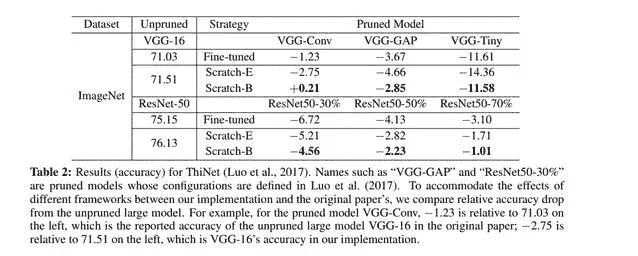

下表展示了基于回归的特征重建方法的结果。该方法最小化了下一层的特征图重建误差，从而实现对通道剪枝。该优化问题可以通过 LASSO 回归解决。

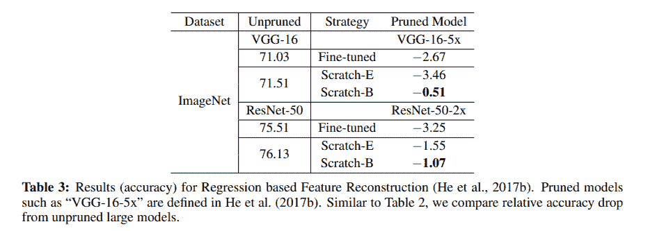

至于 Network Slimming，在训练过程中，对批归一化层中的通道级缩放因子施加 L1 稀疏性。之后，利用较低的缩放因子对通道剪枝。由于通道缩放因子经过跨层对比，因此该方法能够得到自动发现的目标架构。

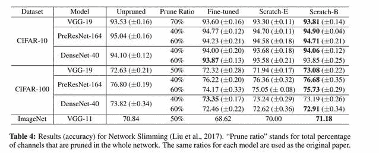

**论文 4：Network Pruning via Transformable Architecture Search (NeurIPS 2019)**

这篇论文提出了直接对具备灵活通道数和层数的网络应用神经架构搜索。实现剪枝网络的损失最小化有利于学习通道数。剪枝网络的特征图由基于概率分布采样的 K 个特征图片段组成，通过反向传播将损失传输到网络权重和参数化分布。

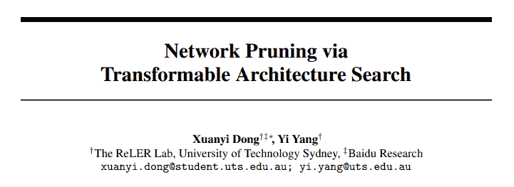

论文链接：https://arxiv.org/pdf/1905.09717v5.pdf

剪枝网络的宽度和深度是基于每个分布规模的最大概率得来的，然后通过从原始网络进行知识迁移来获取这些参数。论文作者在 CIFAR-10、CIFAR-100、ImageNet 数据集上评估了该模型。

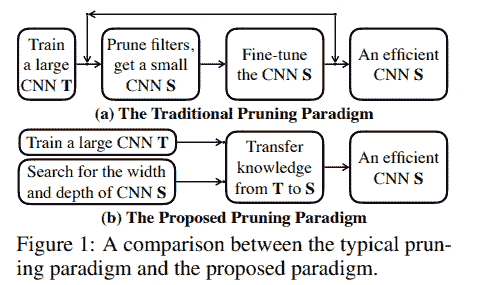

该剪枝方法包含三个步骤：

*   用标准分类训练步骤训练未经剪枝的大规模网络；

*   通过 Transformable Architecture Search (TAS) 搜索小规模网络的深度和宽度，旨在搜寻最佳规模的网络。

*   用简单的知识蒸馏（KD）方法，将未经剪枝网络的信息迁移到搜索得到的小规模网络中去。

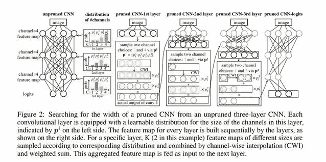

下表对比了不同 ResNet 模型经过不同剪枝算法后，所得到的模型在 ImageNet 数据集上的各自表现：

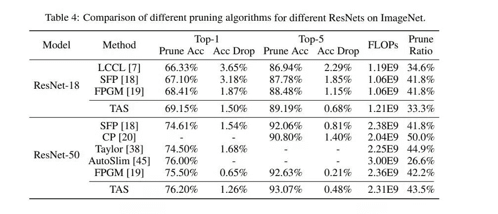

**论文 5：Self-Adaptive Network Pruning (ICONIP 2019)**

这篇论文提出通过自适应网络剪枝方法（SANP）降低 CNN 的计算成本，通过对每个卷积层引入 Saliency-and-Pruning Module (SPM) 来实现，SPM 模块可以学习预测显著性分数，并对每个通道剪枝。SANP 会根据每个层和每个样本决定对应的剪枝策略。

论文链接：https://arxiv.org/pdf/1910.08906.pdf

根据下面的架构图，SPM 模块嵌入在卷积网络的每个层中。该模块可以基于输入特征去预测通道的显著性分数，然后为每个通道生成对应的剪枝决策。

对于剪枝决策为 0 的通道，则跳过卷积运算，然后利用分类目标和成本目标联合训练骨干网络和 SPM 模块。计算成本取决于每一层的剪枝决策。

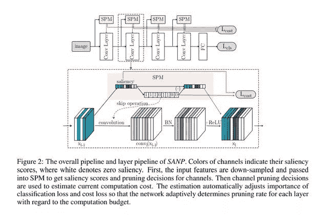

下表展示了该方法的一些结果：

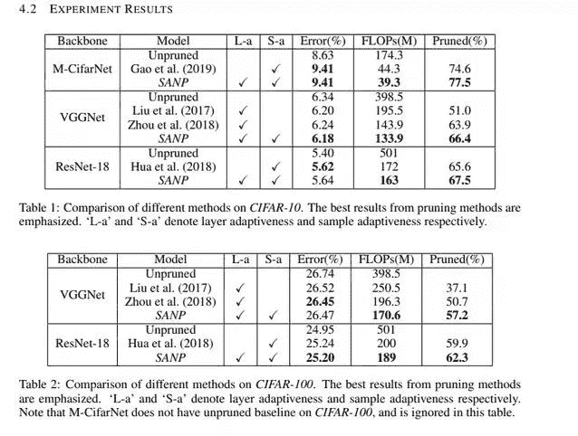

**论文 6：Structured Pruning of Large Language Models (2019)**

这篇论文提出的剪枝方法基于低秩分解和增强拉格朗日 L_0 范数正则化（augmented Lagrangian 10 norm regularization）的原理。L_0 正则化放宽了结构化剪枝带来的约束，而低秩分解则保留了矩阵的密集结构。

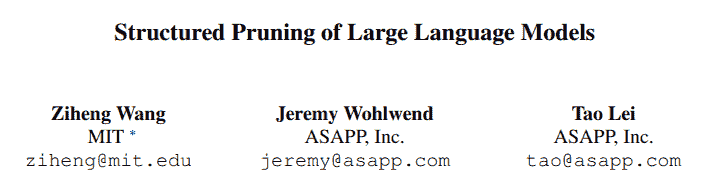

论文链接：https://arxiv.org/pdf/1910.04732.pdf

正则化让网络去选择待移除的权重。权重矩阵被分解为两个较小的矩阵，然后设置这两个矩阵之间的对角线掩码（diagonal mask）。在训练过程中，使用 L_0 正则化对该掩码执行剪枝。增强拉格朗日方法用于控制模型的最终稀疏程度, 论文作者将该方法叫做 FLOP (Factorized L0 Pruning)。

论文使用的字符级语言模型用在 enwik8 数据集的实验中，该数据集包含选取自维基百科的 100M 数据。作者在 SRU 和 Transformer-XL 模型上评估了 FLOP 方法。下表展示了部分结果：

以上就是本次为大家介绍的几种剪枝技术，本文介绍的论文也有代码实现，大家可以亲自测试。

AI学习路线和优质资源，在后台回复"**AI**"获取

