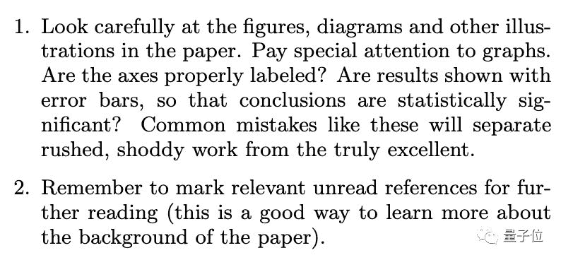

##### 鱼羊 编译整理
量子位 报道 | 公众号 QbitAI

嗑盐之始，在于读论文。

一方面，把握最前沿的研究动态，激发自身研究灵感。另一方面，不做好文献调研，自己的绝妙想法变成了重复造轮子，这种体验可不太妙。

那么，问题来了：**到底该怎么读论文？**

每天单从arxiv上就能刷出成百上千篇新论文，顶会期间，论文更是如钱塘江大潮拍岸而来。如何才能不迷失在论文烟海之中，高效获取有效信息呢？

这里奉上ACM和IEEE Fellow、剑桥大学计算机科学教授Srinivasan Keshav的论文阅读绝技**三遍论**，手把手教你如何高效读论文，告别海量精力投入却收效甚微之窘境。

嗑盐萌新必备，嗑盐老手亦可参考。

## 第一遍：快速预览，把握概要

拿到一篇新论文，第一遍阅读要花多长时间？

**5-10分钟**足以。

不是每一篇论文都干货满满，所以初次见面，先打个印象分，再决定是否继续，是更为高效的方法。

具体操作如下：

> 1、仔细阅读标题、摘要和简介。
> 
> 2、先忽略内容，读一读文章中的每个小标题。
> 
> 3、如果有数学内容，先大致浏览，确定其理论基础。
> 
> 4、读结论。
> 
> 5、浏览参考文献，如果有你已经读过的，把它们勾选出来。

如此读完第一遍，你需要问问自己以下几个问题：

> 1、**分类**：这是什么类型的论文？
> 
> 2、**背景**：与哪些其他论文相关？基于何种理论基础来分析问题？
> 
> 3、**正确性**：论文的假设看起来正确吗？
> 
> 4、**贡献**：论文的主要贡献是什么？
> 
> 5、**清晰度**：这篇论文写得好吗？

当你心中有了这些答案，你也就知道自己该不该真正精读这篇论文了。

P.S. 这里也涉及到撰写论文的一个小技巧：**结构尽量清晰，要点尽量突出**，让审稿人第一遍就能get到。

## 第二遍：抓住重点，暂略细节

当你判定一篇论文值得一读，就可以把它加入第二遍阅读的队列。

第二遍阅读，就要好好看看论文内容了，投入的时间大概在**1个小时**左右。

不过，不要纠结于没见过的术语，也不要沉迷于证明推导的细节：把它们记下来，先略过。

这一遍阅读中，有两个小技巧：

> 1、仔细查看论文中的图表。关注一下细节：坐标轴是否正确标记？结论是否具有统计意义？往往细节之中，就能窥见真正出色的工作和水文之间的区别。
> 
> 2、标记论文中涉及的、你并未读过的参考文献，之后进一步阅读。

读完第二遍，你应该能掌握论文内容，总结全文主旨了。

不过，有时候即使是这样读完一遍，也未必就能读懂论文：论文可能涉及你陌生的领域，有太多陌生术语；作者可能采用了你不了解的证明或实验技术；甚至，这篇论文可能写得不行。

那么，就进入最后一步吧。

## 第三遍：重构论文，注重细节

要想完全理解论文，就需要展开第三遍阅读：跟随作者的思路，在脑海中重现论文内容。

将重现的结果与实际论文进行比较，就可以轻松看出论文的创新点，找到文中隐含的假设，捕获隐藏在实验和技术分析中的潜在问题和引文缺失。

进入第三遍，最重要的事情强调三遍：**细节**！**细节**！**细节**！

找出作者陈述中的每一个假设，亲自挑战它，提出自己的思考。如此，对于论文的证明和其中的技术，你便会有更为深刻的理解。

## One More Thing：文献调研怎么做？

说到读论文，是不是想起了被文献综述统治的恐惧？

Srinivasan Keshav教授同样有“三步法”要传授诸位。

首先，善用学术搜索引擎（如谷歌学术），找出3-5篇相关领域近期最高引用的论文。

了解这些论文的工作原理，阅读其中related work的部分。幸运的话，这些内容能直接帮你完成文献综述。

第二步，在这些论文的参考文献中找出其共同引用的论文，或重复出现的作者姓名。

访问这些关键人物的网站，查看他们近期发表的论文，也可以看看他们都参加了哪些顶级会议。

第三步，访问顶级会议的网站，浏览它们最近的会议记录。

通过“三遍论”的第一遍阅读快速识别高质量的相关工作。

汇总这一步中查找出的论文和第二步中的高引论文，基本上就能构成你文献综述的初版内容啦。

最后，三步法可以迭代进行。

祝诸位同学嗑盐顺利~

## 传送门

https://blizzard.cs.uwaterloo.ca/keshav/home/Papers/data/07/paper-reading.pdf

AI学习路线和优质资源，在后台回复"**AI**"获取

