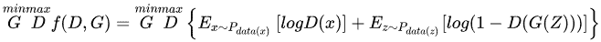

本文主要是对论文：**王坤峰, 苟超, 段艳杰, 林懿伦, 郑心湖, 王飞跃. 生成式对抗网络GAN的研究进展与展望. 自动化学报, 2017, 43(3): 321-332.** 进行总结。

**相关博客地址：**生成式对抗网络GAN的研究进展与展望，http://blog.sciencenet.cn/blog-2374-1040501.html

读后总结：该论文在总结GAN的提出背景和对GAN的思考与展望方面讲解的非常细致，值得细细品味。在讲解GAN的理论与实现模型方面，对GAN的基本原理、基本概念讲解非常清楚；在GAN的变体讲解上，也是由目前GAN存在问题引入，可以说在变体的讲解上有总结有深入。这篇文章发表于2017年3月，现在来读，也是一篇很好的GAN综述文章，很适合想入门GAN的同学。

我读《生成式对抗网络GAN的研究进展与展望》文章时形成的思维导图分享给大家，如图1所示，希望大家在读综述性文章的时候也能画出文章的思维导图，辅助自己更好的理解文章。另外，如果大家在读非综述性文章的时候，应该带着这四个问题读：1）这篇论文要解决什么问题？2）用了什么方法解决？3）效果如何？4）还存在什么问题？那么读文章的目的性会更强，也能快速的梳理文章要点。

图1：《生成式对抗网络GAN的研究进展与展望》思维导图

## **0\. GAN简介**

生成式对抗网络GAN (Generative adversarial networks) 是Goodfellow等在2014年提出的一种生成式模型。GAN在结构上受博弈论中的二人零和博弈(即二人的利益之和为零, 一方的所得正是另一方的所失)的启发，系统由一个生成器和一个判别器构成。生成器捕捉真实数据样本的潜在分布，并生成新的数据样本；判别器是一个二分类器，判别输入是真实数据还是生成的样本。生成器和判别器均可以采用目前研究火热的深度神经网络。GAN的优化过程是一个极小极大博弈(Minimax game)问题，优化目标是达到纳什均衡，使生成器估测到数据样本的分布。

> 纳什均衡，又称为非合作博弈均衡，是博弈论的一个重要术语，以约翰.纳什命名。在一个博弈过程中，无论对方的策略选择如何，当事人一方都会选择某个确定的策略，则该策略被称作支配性策略。如果两个博弈的当事人的策略组合分别构成各自的支配性策略，那么这个组合就被定义为纳什均衡。

目前， 图像和视觉领域是对GAN研究和应用最广泛的一个领域，已经可以生成数字、人脸等物体对象，构成各种逼真的室内外场景，从分割图像恢复原图像，给黑白图像上色，从物体轮廓恢复物体图像，从低分辨率图像生成高分辨率图像等。此外，GAN已经开始被应用到语音和语言处理、电脑病毒监测、棋类比赛程序等问题的研究中。

## **1\. GAN提出的背景**

**1.1 人工智能的热潮**

学术界普遍认为人工智能分为两个阶段：感知阶段和认知阶段。在感知阶段，机器能够接收来自外界的各种信号，例如视觉信号、听觉信号等， 并对此作出判断，对应的研究领域有图像识别、语音识别等。在认知阶段，机器能够对世界的本质有一定的理解，不再是单纯、机械地做出判断。基于多年的研究经验, 论文作者认为人工智能的表现层次包括判断、生成、理解和创造及应用，如图2所示。一方面，这些层次相互联系相互促进；另一方面，各个层次之间又有很大的鸿沟，有待新的研究突破。

无论是普遍认为的人工智能两阶段还是论文作者总结的人工智能四个层次，其中都涉及理解这个环节。而GAN作为典型的生成式模型，其生成器具有生成数据样本的能力。这种能力在一定程度上反映了它对事物的理解。因此，GAN有望加深人工智能的理解层面的研究。

图2：人工智能的研究层次

**1.2 生成式模型的积累**

生成式模型不仅在人工智能领域占有重要地位，生成方法本身也具有很大的研究价值。生成方法和判别方法是机器学习中监督学习方法的两个分支。生成式模型是生成方法学习得到的模型。生成方法涉及对数据的分布假设和分布参数学习，并能够根据学习而来的模型采样出新的样本。**本文认为生成式模型从研究出发点的角度可以分为两类: 人类理解数据的角度和机器理解数据的角度。**

**从人类理解数据的角度出发**，典型的做法是先对数据的显式变量或者隐含变量进行分布假设， 然后利用真实数据对分布的参数或包含分布的模型进行拟合或训练，最后利用学习到的分布或模型生成新的样本。这类生成式模型涉及的主要方法有最大似然估计法、近似法、马尔科夫链方法等。这些方法学习到的模型对机器学习来说具有不同的限制。以真实样本进行最大似然估计，参数更新直接来自于数据样本，导致学习到的生成式模型受到限制。采用近似法学习到的生成式模型由于目标函数难解一般只能在学习过程中逼近目标函数的下界，并不是直接对目标函数的逼近。马尔科夫链方法既可以用于生成式模型的训练又可以用于新样本的生成，但是马尔科夫链的计算复杂度较高。

**从机器理解数据的角度出发**，建立的生成式模型一般不直接估计或拟合分布，而是从未明确假设的分布中获取采样的数据，通过这些数据对模型进行修正。这样得到的生成式模型对人类来说缺乏可解释性，但是生成的样本却是人类可以理解的。在GAN 提出之前，这种从机器理解数据的角度建立的生成式模型一般需要使用马尔科夫链进行模型训练，效率较低，一定程度上限制了其系统应用。

**1.3 神经网络的深化**

神经网络作为深度学习的模型结构，得益于计算能力的提升和数据量的增大，一定程度上解决了自身参数多、训练难的问题，被广泛应用于解决各类问题中。**在训练方面**，神经网络能够采用通用的反向传播算法，训练过程容易实现；**在结构方面**，神经网络的结构设计自由灵活，局限性小；**在建模能力方面**，神经网络理论上能够逼近任意函数，应用范围广。另外，计算能力的提升使得神经网络能够更快地训练更多的参数，进一步推动了神经网络的流行。

**1.4 对抗思想的成功**

从机器学习到人工智能，对抗思想被成功引入若干领域并发挥作用。博弈、竞争中均包含着对抗的思想。**博弈机器学习**将博弈论的思想与机器学习结合，对人的动态策略以博弈论的方法进行建模，优化广告竞价机制，并在实验中证明了该方法的有效性。**研究者采用对抗思想来训练领域适应的神经网络**：特征生成器将源领域数据和目标领域数据变换为高层抽象特征，尽可能使特征的产生领域难以判别；领域判别器基于变换后的特征，尽可能准确地判别特征的领域。**对抗样本也包含着对抗的思想**，指的是那些和真实样本差别甚微却被误分类的样本或者差异很大却被以很高置信度分为某一真实类的样本，反映了神经网络的一种诡异行为特性。

**2\. GAN的理论与实现模型**

**2.1 GAN的基本原理**

GAN的核心思想来源于博弈论的纳什均衡。它设定参与游戏双方分别为一个生成器(Generator)和一个判别器(Discriminator)，生成器的目的是尽量去学习真实的数据分布，而判别器的目的是尽量正确判别输入数据是来自真实数据还是来自生成器；为了取得游戏胜利， 这两个游戏参与者需要不断优化，各自提高自己的生成能力和判别能力，这个学习优化过程就是寻找二者之间的一个纳什均衡。GAN的计算流程与结构如图3所示。

图3：GAN的计算流程与结构

任意可微分的函数都可以用来表示GAN的生成器和判别器，由此，我们用可微分函数D和G来分别表示判别器和生成器，它们的输入分别为真实数据x和随机变量z。G(z)则为由G生成的尽量服从真实数据分布的样本。如果判别器的输入来自真实数据，标注为1。如果输入样本为G(z)，标注为0。这里D的目标是实现对数据来源的二分类判别: 真(来源于真实数据x的分布)或者伪(来源于生成器的伪数据G(z))，而G的目标是使自己生成的伪数据G(z)在D上的表现D(G(z)) 和真实数据x在D上的表现D(x)一致，这两个相互对抗并迭代优化的过程使得D和G的性能不断提升，当最终D的判别能力提升到一定程度，并且无法正确判别数据来源时，可以认为这个生成器G已经学到了真实数据的分布。

**2.2 GAN的学习方法**

GAN的目标函数如下：

对于判别器D来说，这是一个二分类问题，f(D,G)为二分类问题中常见的交叉损失函数。对于生成器G来说，为了尽可能欺骗D，所以需要最大化生成样本的判别概率D(G(z))，即最小化log(1-D(G(z)))。

实际训练时，生成器和判别器采取交替训练，即先训练D，然后训练G，不断往复。值得注意的是，对于生成器，其最小化的是，即最小化f(D,G)的最大值。为了保证f(D,G)取得最大值，所以我们通常会训练迭代k次判别器，然后再迭代1次生成器。当生成器G固定时，我们对f(D,G)求导，求出最优判别器：

把最优判别器带入上述目标函数，可以进一步求出在最优判别器下，生成器的目标函数等价于优化和的JS散度。

**2.3 GAN的衍生模型**

Goodfellow等于2014年首次提出GAN模型。

GAN在基于梯度下降训练时存在梯度消失的问题，因为当真实样本和生成样本之间具有极小重叠甚至没有重叠时，其目标函数的Jensen-Shannon散度是一个常数，导致优化目标不连续。为了解决训练梯度消失问题，Arjovsky 等于2017年提出了Wasser-stein GAN (W-GAN)。W-GAN用Earth-Mover代替Jensen-Shannon 散度来度量真实样本和生成样本分布之间的距离，用一个批评函数f来对应GAN的判别器，而且批评函数f需要建立在Lipschitz连续性假设上。

GAN的判别器D具有无限的建模能力，无论真实样本和生成的样本有多复杂，判别器D都能把它们区分开，这容易导致过拟合问题。为了限制模型的建模能力，Qi于2017年提出了Loss-sensitive GAN (LS-GAN)，将最小化目标函数得到的损失函数限定在满足Lipschitz连续性函数类上，Qi还给出了梯度消失时的定量分析结果。需要指出，W-GAN和LS-GAN并没有改变GAN 模型的结构，只是在优化方法上进行了改进。

GAN的训练只需要数据源的标注信息(真或伪)，并根据判别器输出来优化。Odena于2016年提出了Semi-GAN，将真实数据的标注信息加入判别器D的训练。

Mirza等人于2014年提出Conditional GAN (CGAN)，它加入额外的信息y到G、D和真实数据来建模，这里的y可以是标签或其他辅助信息。

传统GAN都是学习一个生成式模型来把隐变量分布映射到复杂真实数据分布上, Donahue等于2016年提出一种Bidirectional GANs (BiGANs) 来实现将复杂数据映射到隐变量空间，从而实现特征学习。除了GAN的基本框架，BiGANs 额外加入了一个解码器Q用于将真实数据x映射到隐变量空间，其优化问题转换为。

GAN能够学得有效的语义特征，但是输入噪声变量z的特定变量维数和特定语义之间的关系不明确，而Chen等人于2016年提出的InfoGAN 能够获取输入的隐层变量和具体语义之间的互信息。

Odena等人于2016年提出的Auxiliary Classifier GAN (AC-GAN) 可以实现多分类问题，它的判别器输出相应的标签概率。在实际训练中，目标函数则包含真实数据来源的似然和正确分类标签的似然，不再单独由判别器二分类损失来反传调节参数，可以进一步调节损失函数使得分类正确率更高，AC-GAN 的关键是可以利用输入生成器的标注信息来生成对应的图像标签，同时还可以在判别器扩展调节损失函数，从而进一步提高对抗网络的生成和判别能力。

考虑到GAN的输出为连续实数分布而无法产生离散空间的分布，Yu等人于2016年提出了一种能够生成离散序列的生成式模型Seq-GAN。他们用RNN实现生成器G，用CNN 实现判别器D，用D的输出判别概率通过增强学习来更新G。增强学习中的奖励通过D来计算，对于后面可能的行为采用了蒙特卡洛搜索实现，计算D的输出平均作为奖励值反馈。

**3\. GAN的应用领域**

**3.1 图像和视觉领域**

GAN能够生成与真实数据分布一致的图像，用GAN来将一个低清模糊图像变换为具有丰富细节的高清图像。

GAN也开始用于生成自动驾驶场景，利用GAN来生成与实际交通场景分布一致的图像，再训练一个基于RNN 的转移模型实现预测的目的。

基于GAN模型可以利用仿真图像和真实图像实现人眼检测。

**3.2 语音和语言领域**

Li等于2017年提出用GAN来表征对话之间的隐式关联性，从而生成对话文本。Zhang等与2016年提出基于GAN 的文本生成。

SeqGAN在语音、诗词和音乐生成方面可以超过传统方法。

Reed 等于2016年提出用GAN基于文本描述来生成图像。

**3.3 其它领域**

GAN还可以与强化学习相结合，例如SeqGAN。

有研究者将GAN和模仿学习融合、将GAN和Actor-critic方法结合等。

Hu等于2017年提出MalGAN帮助检测恶意代码，用GAN生成具有对抗性的病毒代码样本。

Childambaram等于2017年基于风格转换提出了一个扩展GAN的生成器。

**4\. GAN的思考与展望**

**4.1 GAN的意义和优点**

GAN对于生成式模型的发展具有重要的意义。GAN 作为一种生成式方法，有效解决了可建立自然性解释的数据的生成难题。尤其对于生成高维数据，所采用的神经网络结构不限制生成维度，大大拓宽了生成数据样本的范围。所采用的神经网络结构能够整合各类损失函数，增加了设计的自由度。GAN的训练过程创新性地将两个神经网络的对抗作为训练准则并且可以使用反向传播进行训练，训练过程不需要效率较低的马尔科夫链方法，也不需要做各种近似推理，没有复杂的变分下界，大大改善了生成式模型的训练难度和训练效率。GAN 的生成过程不需要繁琐的采样序列，可以直接进行新样本的采样和推断，提高了新样本的生成效率。对抗训练方法摒弃了直接对真实数据的复制或平均，增加了生成样本的多样性。GAN 在生成样本的实践中，生成的样本易于人类理解。例如，能够生成十分锐利清晰的图像，为创造性地生成对人类有意义的数据提供了可能的解决方法。

GAN除了对生成式模型的贡献，对于半监督学习也有启发。GAN 学习过程中不需要数据标签。虽然GAN提出的目的不是半监督学习，但是GAN的训练过程可以用来实施半监督学习中无标签数据对模型的预训练过程。具体来说，先利用无标签数据训练GAN，基于训练好的GAN对数据的理解，再利用小部分有标签数据训练判别器，用于传统的分类和回归任务。

**4.2 GAN的缺陷和发展趋势**

GAN虽然解决了生成式模型的一些问题，并且对其他方法的发展具有一定的启发意义，但是GAN并不完美，它在解决已有问题的同时也引入了一些新的问题。GAN 最突出的优点同时也是它最大的问题根源。GAN采用对抗学习的准则，理论上还不能判断模型的收敛性和均衡点的存在性。训练过程需要保证两个对抗网络的平衡和同步，否则难以得到很好的训练效果。而实际过程中两个对抗网络的同步不易把控，训练过程可能不稳定。另外，作为以神经网络为基础的生成式模型，GAN存在神经网络类模型的一般性缺陷，即可解释性差。另外，GAN 生成的样本虽然具有多样性，但是存在崩溃模式(Collapse mode)现象，可能生成多样的，但对于人类来说差异不大的样本。虽然GAN存在这些问题，但不可否认的是，GAN的研究进展表明它具有广阔的发展前景。例如，Wasserstein GAN彻底解决了训练不稳定问题，同时基本解决了崩溃模式现象。如何彻底解决崩溃模式并继续优化训练过程是GAN的一个研究方向。另外，关于GAN收敛性和均衡点存在性的理论推断也是未来的一个重要研究课题。以上研究方向是为了更好地解决GAN存在的缺陷。从发展应用GAN的角度，如何根据简单随机的输入，生成多样的、能够与人类交互的数据，是近期的一个应用发展方向。从GAN 与其他方法交叉融合的角度，如何将GAN 与特征学习、模仿学习、强化学习等技术更好地融合，开发新的人工智能应用或者促进这些方法的发展，是很有意义的发展方向。从长远来看，如何利用GAN 推动人工智能的发展与应用，提升人工智能理解世界的能力，甚至激发人工智能的创造力是值得研究者思考的问题。

**4.3 GAN与平行智能的关系**

GAN训练中真实的数据样本和生成的数据样本通过对抗网络互动，并且训练好的生成器能够生成比真实样本更多的虚拟样本。GAN可以深化平行系统的虚实互动、交互一体的理念。GAN作为一种有效的生成式模型，可以融入到平行智能研究体系。

**5\. 总结**

本文综述了生成式对抗网络GAN的研究进展。GAN提出后，立刻受到了人工智能研究者的重视。GAN的基本思想源自博弈论的二人零和博弈，由一个生成器和一个判别器构成，通过对抗学习的方式来迭代训练，逼近纳什均衡。GAN 作为一种生成式模型，不直接估计数据样本的分布，而是通过模型学习来估测其潜在分布并生成同分布的新样本。这种从潜在分布生成“无限”新样本的能力，在图像和视觉计算、语音和语言处理、信息安全等领域具有重大的应用价值。

