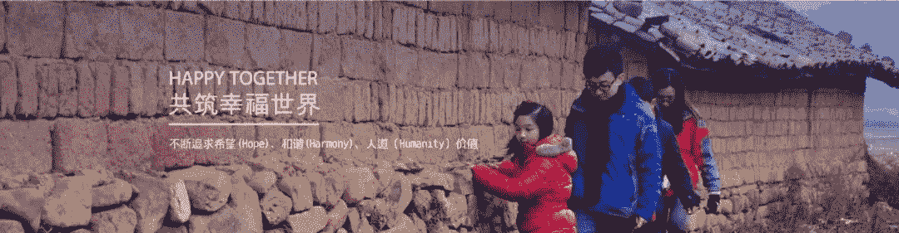

跨界，是商业创新和社会创新的突破口，是超越自我、实现共赢的第三条道路。

跨越商界、政界和公益界的领导力是时代发展的需要，是推动组织和社会进步的新动能。

之江公益学园（ZEPA）作为**中国第一所公益慈善大学**，以“立足长三角，打造能促型人才培育基地，培养和支撑社会创业者，推动社会文明进步”为宗旨。

之江公益学园与浙江大学社会治理研究院、浙江大学MPA教育中心合作举办的“之江公益讲堂”，是一个开放式的思想交流和资源共享平台。

之江公益学园联合**浙大、北大、清华等顶尖学府的学者**共同研发的“CLP跨界领导力课程”从学理建构的角度填补了公益慈善教育的空白，为公益慈善和社会创新事业培养高端人才。

**2020年1月11日**，“之江公益讲堂开讲暨CLP跨界领导力课程发布会”将在浙江大学召开，我们诚挚地邀请您拨冗参加，共襄智举！

活动详情

**活动流程：**

9:00-9:10    来宾签到

9:10-9:15    主持人致开场白

9:15-10:15  之江公益学园园长、浙江大学公共管理学院院长、浙江大学社会治理研究院 院长郁建兴教授主题演讲《公益慈善与社会治理创新》

10:15-10:20  之江公益讲堂揭牌仪式

10:20-10:25  浙江省民政厅领导致辞

10:25-10:30  全体来宾合影

10:30-12:00  北京大学国家发展研究院王超教授主题演讲《跨界公益与商业创新》

12:00-12:10  CLP课程发布

12:10  媒体自由采访，活动结束

**活动地点：**

浙江大学紫金港校区蒙民伟楼国际会议中心140报告厅

**活动费用：**公益免费

**报名方式：**

点击文末“阅读原文”报名

活动咨询 18258480142（郭老师）

