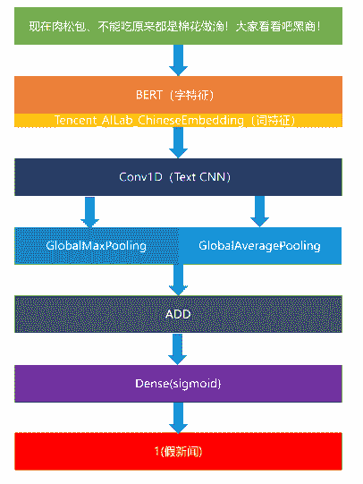
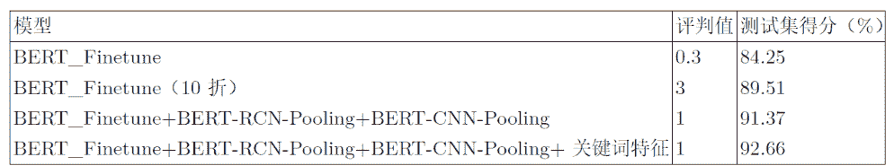

比赛链接为 

https://www.biendata.com/competition/falsenews/

比赛由智源研究院和中科院计算所主办，比赛平台为biendata。

冠军模型可以访问下述链接获取：

https://www.biendata.com/models/category/3529/L_notebook/

文章内容已由团队成员和平台授权。

任务描述

文本是新闻信息的主要载体，对新闻文本的研究有助于虚假新闻的有效识别。虚假新闻文本检测，具体任务为：给定一个新闻事件的文本，判定该事件属于真实新闻还是虚假新闻。该任务可抽象为NLP领域的文本分类任务，根据新闻文本内容，判定该新闻是真新闻还是假新闻。针对该任务，可以采用BERT-Finetune、BERT-CNN-Pooling、BERT-RCN-Pooling的多种结构进行融合，在输入上引入字词结合的形式，另外充分利用假新闻的关键词特征进行优化。在智源&计算所-互联网虚假新闻检测挑战赛的假新闻文本识别这个评测任务上，该文提出的方法在最终的评测数据上达到F1为 0.92664的成绩。

模型介绍

模型结构

本次比赛采用了多种模型，下以BERT-CNN-Pooling模型为例介绍，见下图。



该模型采用BERT模型提取出字向量（不Finetune），然后结合腾讯词向量，作为最终的词向量输入到1维卷积网络中。在池化过程中同时选择最大池化和平均池化，最后将其结果相加，接入一个Dense层中得到结果。

除了此模型外，该方案还使用了BERT-Finetune、BERT-RCN-Pooling模型。

**模型参数和融合细节**

BERT模型可采用roeberta_zh_L-24_H-1024_A-16，其优点为准确率高，缺点为显存占用率较高。以BERT-Finetune为例，在训练工程中，batch_size选择为4，maxLen选择为164，epoch数选择为3，learning_rate为前两个epoch为1e-5，后一个为1e-6。

交叉验证方面选择了10折交叉验证，每折中选择召回率较高的模型（一般为第二个epoch或第三个epoch训练出的模型）。另外，由于数据假新闻识别正确率较高，其召回率较低，因此在这10个模型进行融合时，可以将10个模型的直接结果相加，当其大于3认为是假新闻，小于3即为真新闻。

同理，在BERT-CNN-Pooling、BERT-RCN-Pooling模型中也采取以上的融合策略，在BERT-Finetune、BERT-CNN-Pooling、BERT-RCN-Pooling这3个模型间采用该策略（值改为1）。

在模型融合时发现，假新闻喜欢对部分人、地、名词、动词进行造谣。这些词的获取可通过对所有的假新闻和test集合，利用textrank4zh进行关键词获取，最后经过人工筛选，加入到模型融合的评判中，具体为当新闻的关键词含有这些词时，就有假新闻的倾向，此时评判值可以降低，利用这个关键词特征可以发现更多的假新闻，使得假新闻评判效果更好。

实验结果与分析

实验结果见下表，其中评判值即为判断真假新闻的临界值，BERT-RCN-Pooling、BERT-CNN-Pooling的实验结果基本与BERT_Finetune类似。



由表一可知：单模型在真假新闻判定的结果并不是很好，而将单模型进行10折交叉验证后准确率提升很大，说明10折交叉验证还是很有必要的。另外，融合BERT_Finetune+BERT-RCN-Pooling+BERT-CNN-Pooling这三个模型并加上关键词特征也会有不小的提升。

在比赛的后期，基本是通过交叉验证和模型融合提升测试集得分。在多模型融合上，测试了多种模型，最后处于效果和速度的考虑选择了这三种。

代码精华

**字词向量结合**

```
def remake(x,num):
    L = []
for i,each in enumerate(num):
        L += [x[i]]*each
return L
words = [t for t in jieba.cut(text)]
temp = [len(t) for t in words]
x3 = [word2id[t] if t in vocabulary else 1 for t in words]
x3 = remake(x3, temp)
if len(x3) < maxlen - 2:
x3 = [1] + x3 + [1] + [0] * (maxlen - len(x3) - 2)
else:
x3 = [1] + x3[:maxlen - 2] + [1] 
```

主要思路是把词向量映射到每个字上，如：中国，中国的词向量为a，那么体现在字上即为[a , a]，若中国的字向量为[b , c]， 相加后即为[a+b, a+c]。此处x3即为对称好的词向量，直接输入到Embedding层即可。

**支持mask的最大池化**

```
class MaskedGlobalMaxPool1D(keras.layers.Layer):
def __init__(self, **kwargs):
super(MaskedGlobalMaxPool1D, self).__init__(**kwargs)
self.supports_masking = True

def compute_mask(self, inputs, mask=None):
return None

def compute_output_shape(self, input_shape):
return input_shape[:-2] + (input_shape[-1],)

def call(self, inputs, mask=None):
if mask is not None:
            mask = K.cast(mask, K.floatx())
            inputs -= K.expand_dims((1.0 - mask) * 1e6, axis=-1)
return K.max(inputs, axis=-2) 
```

### **支持mask的平均池化**

```
class MaskedGlobalAveragePooling1D(keras.layers.Layer):

def __init__(self, **kwargs):
super(MaskedGlobalAveragePooling1D, self).__init__(**kwargs)
self.supports_masking = True

def compute_mask(self, inputs, mask=None):
return None

def compute_output_shape(self, input_shape):
return input_shape[:-2] + (input_shape[-1],)

def call(self, x, mask=None):
if mask is not None:
            mask = K.repeat(mask, x.shape[-1])
            mask = tf.transpose(mask, [0, 2, 1])
            mask = K.cast(mask, K.floatx())
            x = x * mask
return K.sum(x, axis=1) / K.sum(mask, axis=1)
else:
return K.mean(x, axis=1) 
```

### **Bert Finetune**

```
x1_in = Input(shape=(None,))
x2_in = Input(shape=(None,))
bert_model = load_trained_model_from_checkpoint(config_path, checkpoint_path)
for l in bert_model.layers:
    l.trainable = True
x = bert_model([x1_in, x2_in])
x = Lambda(lambda x: x[:, 0])(x)
x = Dropout(0.1)(x)
p = Dense(1, activation='sigmoid')(x)
model = Model([x1_in, x2_in], p)
model.compile(
        loss='binary_crossentropy',
        optimizer=Adam(1e-5),
        metrics=['accuracy']
    ) 
```

**BERT+TextCNN**

```
x1_in = Input(shape=(None,))
x2_in = Input(shape=(None,))
x3_in = Input(shape=(None,))
x1, x2,x3 = x1_in, x2_in,x3_in
x_mask = Lambda(lambda x: K.cast(K.greater(K.expand_dims(x, 2), 0), 'float32'))(x1)
bert_model = load_trained_model_from_checkpoint(config_path, checkpoint_path)
embedding1= Embedding(len(vocabulary) + 2, 200,weights=[embedding_index],mask_zero= True)
x3 = embedding1(x3)
embed_layer = bert_model([x1_in, x2_in])
embed_layer  = Concatenate()([embed_layer,x3])
x = MaskedConv1D(filters=256, kernel_size=3, padding='same', activation='relu')(embed_layer )
pool = MaskedGlobalMaxPool1D()(x)
ave = MaskedGlobalAveragePooling1D()(x)
x = Add()([pool,ave])
x = Dropout(0.1)(x)
x = Dense(32, activation = 'relu')(x)
p = Dense(1, activation='sigmoid')(x)
model = Model([x1_in, x2_in,x3_in], p)
model.compile(
    loss='binary_crossentropy',
    optimizer=Adam(1e-3),
    metrics=['accuracy']
) 
```

### **BERT + RNN + CNN**

```
x1_in = Input(shape=(None,))
x2_in = Input(shape=(None,))
x3_in = Input(shape=(None,))
x1, x2,x3 = x1_in, x2_in,x3_in
x_mask = Lambda(lambda x: K.cast(K.greater(K.expand_dims(x, 2), 0), 'float32'))(x1)
bert_model = load_trained_model_from_checkpoint(config_path, checkpoint_path)
embedding1= Embedding(len(vocabulary) + 2, 200,weights=[embedding_index],mask_zero= True)
x3 = embedding1(x3)
embed_layer = bert_model([x1_in, x2_in])
embed_layer  = Concatenate()([embed_layer,x3])
embed_layer = Bidirectional(LSTM(units=128,return_sequences=True))(embed_layer)
embed_layer = Bidirectional(LSTM(units=128,return_sequences=True))(embed_layer)
x = MaskedConv1D(filters=256, kernel_size=3, padding='same', activation='relu')(embed_layer )
pool = MaskedGlobalMaxPool1D()(x)
ave = MaskedGlobalAveragePooling1D()(x)
x = Add()([pool,ave])
x = Dropout(0.1)(x)
x = Dense(32, activation = 'relu')(x)
p = Dense(1, activation='sigmoid')(x)
model = Model([x1_in, x2_in,x3_in], p)
model.compile(
    loss='binary_crossentropy',
    optimizer=Adam(1e-3),
    metrics=['accuracy']
) 
```

### **10折交叉训练**

```
for train,test in kfold.split(train_data_X,train_data_Y):
model = getModel()
t1,t2,t3,t4 = np.array(train_data_X)[train], np.array(train_data_X)[test],np.array(train_data_Y)[train],np.array(train_data_Y)[test]
train_D = data_generator(t1.tolist(), t3.tolist())
dev_D = data_generator(t2.tolist(), t4.tolist())
evaluator = Evaluate()
model.fit_generator(train_D.__iter__(),
steps_per_epoch=len(train_D),
epochs=3,
callbacks=[evaluator,lrate]
)
del model

K.clear_session() 
```

**关键词特征**

```
def extract(L):
    return  [r.word for r in L]

tr4w = TextRank4Keyword()
result = []
for sentence in train:
tr4w.analyze(text=text, lower=True, window=2)
s =  extract(tr4w.get_keywords(10, word_min_len=1))
result = result + s

c = Counter(result)
print(c.most_common(100)) 
```

找到词后从其中人工遴选，选出每类的词，另外，在test集合中也运行该代码，同时用jieba辅助分割词的类。

**Datawhale竞赛****群已成立**

扫描下方二维码，添加**负责人微信**，可申请加入竞赛学习交流群，一起组队参赛（一定要备注：**入群+学校/公司+方向****，**例如：**入群+浙大+机器学习**）


▲长按加群

*AI学习路线和优质资源，在后台回复"AI"获取*

