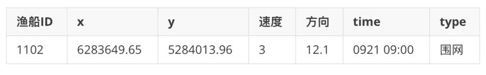
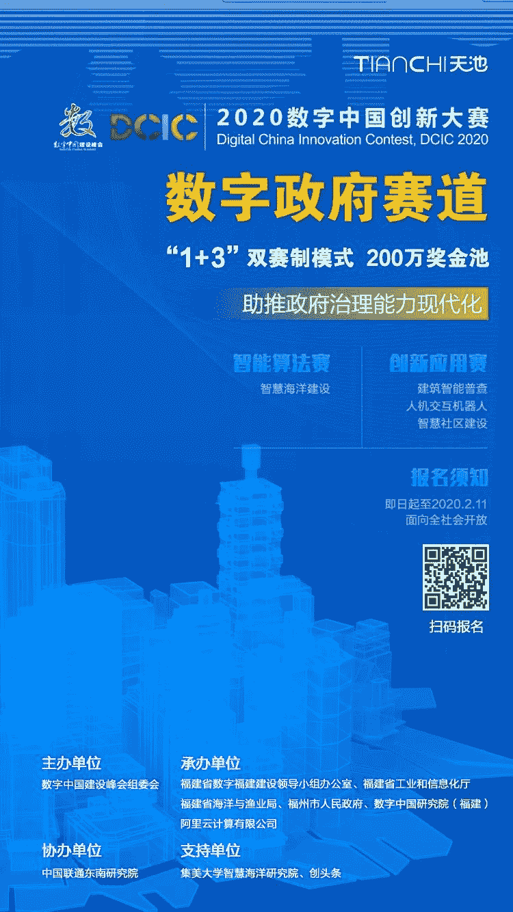

2020数字中国创新大赛(Digital China Innovation Contest, DCIC2020)，以“培育数字经济新动能，助推数字中国新发展”为主题，采取多赛道并行的竞赛形式，采用4+1的赛事架构，设置了数字政府、智慧医疗、鲲鹏计算、网络安全等4个赛道和中小学生赛道，打造具有全国影响力的顶级赛事。

**智能算法赛**：命题式竞赛，选题围绕“智慧海洋建设”中的应用展开，侧重于通过数据算法模型，产出行业痛点解决方案，提升社会效率。主要面向高校师生、科研人员、企业开发者等参赛个人，吸引全社会的参与，鼓励万众创新。

算题说明

**智慧海洋建设，赋能海上安全治理能力现代化**

提升海上安全治理能力，首要任务是“看得清”，即看得清“是什么、谁在用、做什么”。船舶避碰终端（AIS）、北斗定位终端等通信导航设备的应用，给海上交通和作业带来了极大便利，但同时存在设备信息使用不规范造成的巨大人身和财产损失，给海上安全治理带来了新的挑战。

赛题基于位置数据对海上目标进行智能识别和作业行为分析，要求选手通过分析渔船北斗设备位置数据，得出该船的生产作业行为，具体判断出是拖网作业、围网作业还是流刺网作业。同时，希望选手通过数据可视分析，挖掘更多海洋通信导航设备的应用价值。

算题数据

**本赛题基于位置数据对海上目标进行智能识别和作业行为分析，要求选手通过分析渔船北斗设备位置数据，得出该船的生产作业行为，具体判断出是拖网作业、围网作业还是流刺网作业。**初赛将提供11000条(其中7000条训练数据、2000条testA、2000条testB)渔船轨迹北斗数据。

复赛考虑以往渔船在海上作业时主要依赖AIS数据，北斗相比AIS数据，数据上报频率和数据质量均低于AIS数据，因此复赛拟加入AIS轨迹数据辅助北斗数据更好的做渔船类型识别，其中AIS数据与北斗数据的匹配需选手自行实现，具体细节复赛开赛时更新。同时，希望选手通过数据可视化与分析，挖掘更多海洋通信导航设备的应用价值。

  示例：

奖项设置

———  智能算法赛  ———

冠军：1支队伍，奖金15万

亚军：1支队伍，奖金10万

季军：1支队伍，奖金5万

报名方式

**赛道报名链接**

**竞赛组队交流群******

**答疑负责人**

鱼佬，武大硕士，2019腾讯广告算法大赛冠军

阿水，北航硕士，京东算法工程师，cv领域Top选手

识别下方二维码，添加Datawhale微信号

回复关键词：**数据挖掘** 进群

**比赛baseline参考地址**

[DCIC 2020-天池智慧海洋建设算法赛：](http://mp.weixin.qq.com/s?__biz=MzIwNDA5NDYzNA%3D%3D&chksm=96c42ffda1b3a6eb9b1b8a8c0bff66f90858f73f435ec6fd917d155fa425cf8aa0abc2f6f47a&idx=1&mid=2247483960&scene=21&sn=fe1d0fee79646459efc56795fb723fe1#wechat_redirect)[独家Baseline！](http://mp.weixin.qq.com/s?__biz=MzIwNDA5NDYzNA%3D%3D&chksm=96c42ffda1b3a6eb9b1b8a8c0bff66f90858f73f435ec6fd917d155fa425cf8aa0abc2f6f47a&idx=1&mid=2247483960&scene=21&sn=fe1d0fee79646459efc56795fb723fe1#wechat_redirect)

点击**阅读原文**，立即报名。