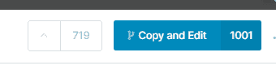
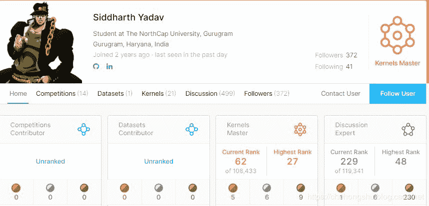
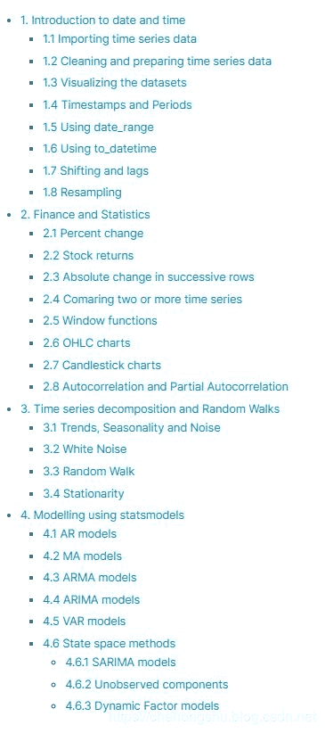
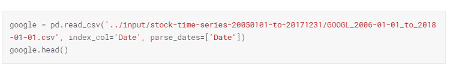
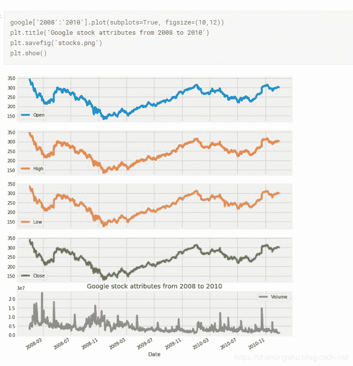
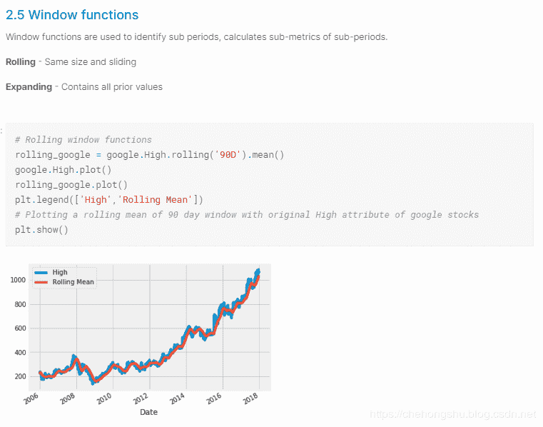
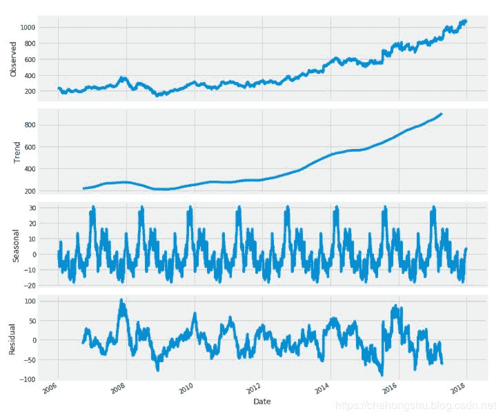
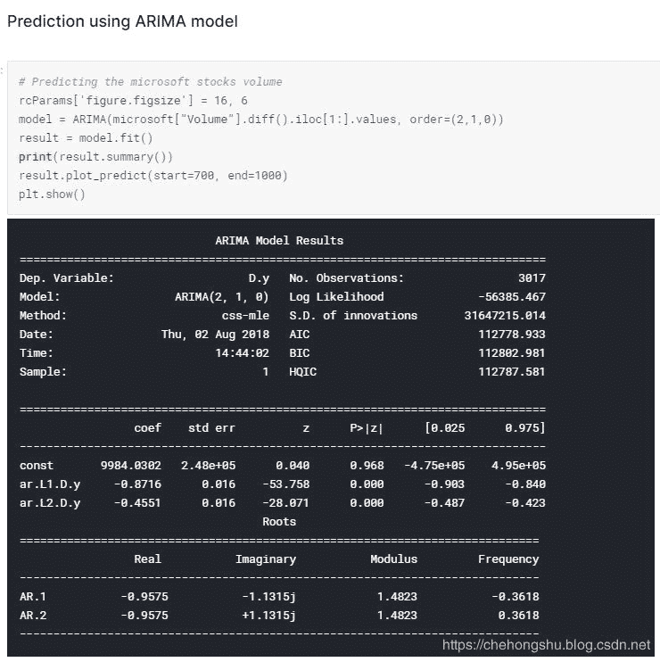
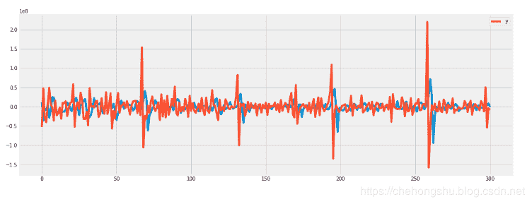

一、前言

最近逛了逛Kaggle，发现了一个非常详细的时间序列教程。

里面记载了很多关于时间序列的知识，并且一直在updating中。

可以看到这个教程已经被观看了6w多次。

点赞700+， copy and Edit 1000+（好比GitHub上的高star和fork的repo） 可以说非常牛逼的kernel了。

作者是The NorthCap University的一名学生，是一名kernels Master，看来也是一位热衷开源的coder啊。

## 二、教程介绍

### 2.1 目的

该kernel将成为时间序列分析领域中许多广泛主题的一个概括。作者动机是使这个最终参考时间序列分析的初学者和有经验的人一样。

### 2.2 一些重要的事情

•这是一个正在进行的工作，所以每次你打开它，你一定会发现新鲜的内容。•作者会继续学习更先进的概念，提供更多的知识和内容。•如果有任何建议或任何具体的话题，可以在评论中提及。

### 2.3 目录

<figcaption>教程目录</figcaption>

主要包含四个部分

1.对于date和time的介绍2.金融和统计数据3.时间序列分解和随机游动4.模型

## 三、具体内容

### 3.1 对于date和time的介绍

这一部分主要包含 数据读取、清理、可视化、对时间戳转换成datetime格式

可以看出教程所用的数据为股票的时间序列一维数据

可视化时间序列数据

### 3\. 2 金融和统计数据

此部分有很多股票等知识，在python数据挖掘中的应用，以及时间序列数据的窗口操作等等

### 3.3 时间序列分解和随机游动

讲述时间序列数据中的季节性、周期性、白噪声、随机步等

### 3.4 时间序列模型

这里模型目前更新的大多都是传统并且经典的模型，如AR、 MA、 ARIMA等回归或时间序列模型。

结果

## 四、总结

这是一个我个人认为很全并且很偏实战业务的时间序列入门教程，在其中还可以学习numpy，pandas，matplotlib等python三大库的使用，文中也有很多理论知识，并且说的比较精炼，但是唯一不足就是只选用了很多较为传统的模型，如果加上机器学习树模型和深度学习中的循环神经网络模型就更好了。

**本教程资源链接：**

https://www.kaggle.com/thebrownviking20/everything-you-can-do-with-a-time-series/notebook

*AI学习路线和优质资源，在后台回复"AI"获取*

