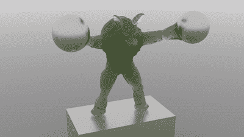
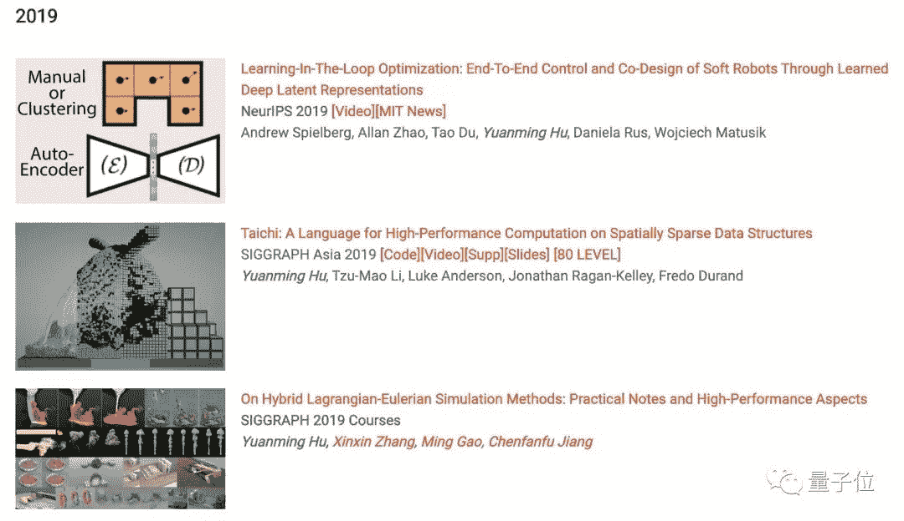

##### 边策 鱼羊 发自 凹非寺
量子位 报道 | 公众号 QbitAI

只用99行代码，你也可以像《冰雪奇缘》里的艾莎公主一样拥有冰雪魔法。

虽然你不能在现实世界中肆意变出魔法，但却能在计算机的虚拟世界挥洒特效。


或许你不知道，电影和动画中特效有时仅仅短短的一秒，却可能需要高性能计算机演算一周，花费惊人。

《冰雪奇缘》没有真人出演，预算却高达1.5亿美元，每一秒的镜头都是经费在燃烧。一般人想用电脑做出CG特效简直不可想象。

然而，最近一位来自中国的MIT博士，开发了一种新的CG特效编程语言**Taichi**（**太极**），大大降低了门槛。

###### ****

###### **△**白色：雪；红色：果冻；蓝色：水

一个简单的物理场景，普通PC仅需几分钟即可渲染完成，相比TensorFlow提速了188倍、比PyTorch快13.4倍，代码长度只有其他底层方法的十分之一。

安装它就像TensorFlow一样容易，使用起来也是差不多：

```
import taichi as ti 
```

甚至，Taichi的发明者胡渊鸣同学还为此编写了完整使用教程。

关于Taichi，胡同学已经发表了多篇文章，分别被SIGGRAGH 2018、ICRA 2019、NeurIPS2019、ICLR 2020等顶会收录。

计算机图形学知名学者、北大教授陈宝权给出很高的评价：

> 给胡渊鸣同学点赞！一己之力开发了物理模拟编程语言 Taichi！
> 
> 像渊鸣这样如此投入写有影响力的开源代码实在是难能可贵。
> 
> 像SIGGRAPH这样的，可能要投入1~2年才会有成果，论文接受率低，即使能发表出来，引用率也不高。


网友们在围观之后也纷纷表示：渊鸣大神太强了。

> 图形+系统+编译，真是创世的快乐。


## 88行代码模拟真实物理环境

正如胡同学本人所说，99行代码很短，背后的技术故事却很长。

故事的开头，要从Material Point Method（物质点法）说起。

MPM是一种在影视特效领域广受青睐的模拟连续介质方法，迪士尼的《冰雪奇缘》就用到了这项技术。


但在早期，MPM的运行速度非常慢，比如《冰雪奇缘》里安娜过雪地的镜头，据说要在集群上跑整整一个星期。

为了提高MPM的运行速度和性能，在大四毕业的那个暑假，胡渊鸣投入了Moving Least Squares MPM（MLS-MPM）的研究。


胡渊鸣的灵感是，用**移动最小二乘法**统一APIC（The Affine Particle-In-Cell Method）中的仿射梯度场（affine velocity field）和MPM中的变形梯度更新（deformation gradient update）两种离散化。

在宾夕法尼亚大学蒋陈凡夫教授的指导下，胡渊鸣等人完成了移动最小二乘物质点法（MLS-MPM）方法的研究，不仅实现了新的应力散度离散化，使MPM的运行速度快了**两倍**，还成功模拟了MPM此前并不支持的各种新现象。

比如材料切割：



刚性体的双向耦合：


这项成果最终发表在了SIGGRAPH 2018上。

为了进一步证明MLS-MPM的简易性，胡渊鸣用**88行C++代码**实现了MLS-MPM的demo。（代码详情请戳文末 taichi_mpm 项目链接）。

这个88行版本后来也成为了入门MPM的必备参考实现。


## 乾坤（ChainQueen）可微物理引擎

2017年的夏天结束之后，胡渊鸣正式进入MIT读博。

这时候，胡渊鸣又迸发了新的灵感：求出MLS-MPM的导数。有了导数，就能只用梯度下降来优化神经网络控制器。

在这一思想的指导下，ChainQueen诞生了。

胡渊鸣解释说，chain是为了纪念他在求导过程中被链式法则折磨的经历，而ChainQueen则与**乾坤**谐音。

乾坤基于MLS-MPM，是一种针对可变形对象的、实时的可微混合拉格朗日-欧拉物理模拟器。该模拟器在前向仿真和反向梯度计算中均实现了高精度。

这项研究发表在了ICRA 2019上，胡渊鸣也以此完成了硕士论文。

## DiffTaichi

随后，胡同学将工作又推进一步，提出了可微分编程DiffTaichi，被ICLR 2020收录。

在这篇文章的代码中，胡同学创建了10个不同的物理模拟器，并根据现有基准对其性能进行基准测试。

Taichi中的可微分编程，可以通过蛮力的梯度下降有效地优化神经网络控制器，而不必使用强化学习。

10种可微分模拟器中的大多数模型可以在2-3小时内实现，而且大部分不需要GPU。这些示例中，弹性体、刚体、流体、光线的折射、弹性碰撞，常见物理环境应有尽有。

第一个示例**可微分弹性对象模拟器**，经过我们的实测，在2017版13寸的MacBook Pro上也能运行，而且完成优化只需不到十分钟的时间：


不仅是2D，更复杂的**3D弹性体**也能模拟：


还有可微分的**3D流体**模拟器，经过450步的梯度下降迭代，已经非常逼真：


DiffTaichi模拟水对光线折射的渲染器，一张图片经过它的渲染，甚至能骗过图像分类器。经过测试，VGG16将带有水波纹的松鼠图片当做金鱼，而且认为概率为99.91%。


在强化学习的模拟环境中，刚体机器人很常见，DiffTaichi也能模拟：


DiffTaichi还能模拟多个物体的复杂场景，比如台球：

 

用Taichi语言编写的模拟器大大简化了代码，可微分弹性对象模拟器只用了110行代码，而直接用CUDA编写则需要490行。

同时，Taichi的速度还很快，相比CUDA版本几乎没有什么损失，比TensorFlow快了188倍，比PyTorch快13.4倍。


而且神经网络控制器一般只需要几十次迭代，即可完成优化。

## 为何做Taichi

谈到为何要做Taichi，计算机图形学一直缺乏像TensorFlow那样的通用工具，每个要从事开发的人都必须了解基本原理，才能去做编程。

这和深度学习领域形成了鲜明的对比。

近年来，甚至有中学生，利用TensorFlow或者PyTorch，写一点代码，优化几个模型，就可以在一些顶会上发表论文，许多人看来，这是件坏事，因为让深度学习论文的含金量大大降低。

但胡渊鸣看到了另一面。他认为，深度学习这些年之所以能发展快、门槛低，就是因为有简单易用的好工具，计算机图形学让人望而却步，就是因为缺乏类似的工具，因此他开发了Taichi。

本来Taichi要做成一种单独的编程语言，但是为了方便大家使用，胡渊鸣用了一句import taichi as ti把Taichi语言假装成Python。

改成基于Python，这样做的好处不仅是降低学习门槛，还能使用很多现成的Python IDE，与numpy、matplotlib等工具库无缝衔接。

经过几个月的努力，胡渊鸣终于把Taichi改成了pypi安装包，让不同配置不同操作系统的机器都能顺利运行图形学的程序。

## 高一保送清华，博一6篇paper

说起胡渊鸣，这又是一位从少年时代起就熠熠闪光的“大神级”选手。


高一保送清华，竞赛生涯中，拿下APIO 2012、NOI 2012、ACM-ICPC 2013长沙区域赛、ACM-ICPC上海区域赛四块金牌，其中APIO 2012成绩是全场第一名。

2013年进入清华姚班，胡渊鸣与陈立杰、范浩强等人成为同班同学，这群年轻人的才华在这里汇聚、碰撞，与“姚班”二字相互成就。

本科期间，胡渊鸣先后前往东京大学、斯坦福大学访学，并曾于微软亚洲研究院实习，从事深度学习和计算机图形学研究。本科便有多篇论文中选CVPR、SIGGRAPH等国际顶会。

2017年，胡渊鸣进入MIT读博。入学13个月后，完成硕士论文ChainQueen，拿到MIT硕士学位。博一期间，共发表6篇顶会论文。




最后，如果想了解这99行代码背后更多的研究历程，不妨读一读胡渊鸣本人的知乎专栏文章。大神不仅代码写得好，码字和蒸鸡蛋也是好手呢~

## 传送门

胡渊鸣知乎原文：
https://zhuanlan.zhihu.com/p/97700605

论文地址：
https://arxiv.org/abs/1910.00935

太极项目地址：
https://github.com/yuanming-hu/taichi

taichi_mpm项目地址:
https://github.com/yuanming-hu/taichi_mpm

*AI学习路线和优质资源，在后台回复"AI"获取*

