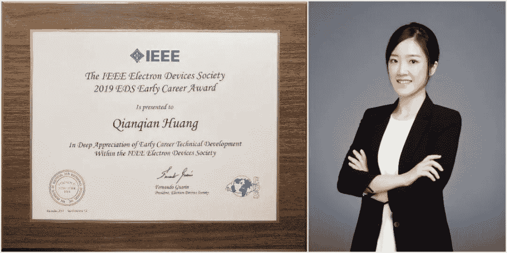
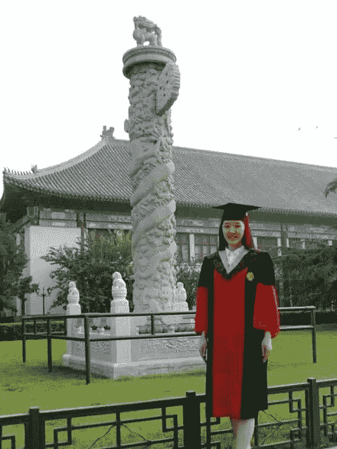
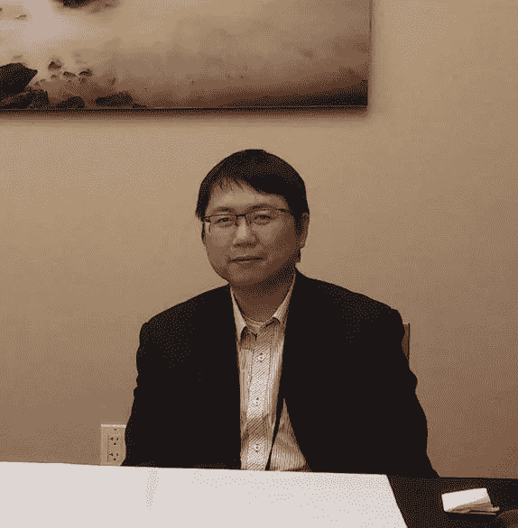
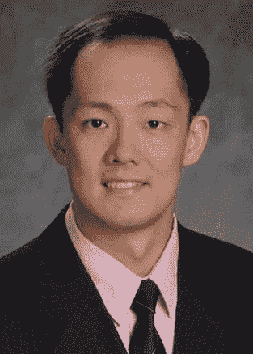

机器之心报道

**参与：张倩、蛋酱、泽南**

> 在 2019 年 IEEE 青年成就奖的颁奖典礼上，全球共有 3 位研究者获奖，来自北大的黄芊芊就是其中一位。她是亚洲地区的唯一获奖者，也是该奖项设立以来第二位来自中国科研单位的获奖者。

近日，在第 65 届 IEEE 国际电子器件会议（IEDM）上，30 岁的北京大学微纳电子学系博士生导师黄芊芊获得了 2019 IEEE Electron Devices Society Early Career Award，以表彰她在「超低功耗微纳电子新原理器件等方面的出色工作」。

IEEE 青年成就奖设立于 2009 年，旨在激励、认可及支持在 EDS（Electron Devices Society）相关领域取得技术成就的职业生涯早期学者。该奖项每年颁发一次，以表彰在该年 8 月 15 日提名截止日期前的 10 年内获得第一个专业学位（学士学位）并为该领域做出贡献的 IEEE EDS 成员。

**16 岁考入北大，28 岁留校任博士生导师**

黄芊芊出生于 1989 年，2006 年从江西上饶一中考入北京大学信息科学技术学院。

自从考入北京大学以来，黄芊芊一直在北京大学学习和工作。

她在本科毕业后直博，2015 年获得北京大学微电子学与固体电子学专业博士学位。

2017 年，黄芊芊北京大学博士后出站，同年正式成为北大微纳电子学系的研究员、博士生导师。

也是在 2017 年，黄芊芊凭借多年来在超低功耗微纳电子新原理器件研究中所取得的优秀成果，入选 2017 年度中国「未来女科学家计划」，成为该奖项设立以来首位微电子领域的青年学者。该奖项当年仅有 4 人入选。

黄芊芊的主要研究方向——超低功耗微纳电子器件及其在逻辑电路、神经形态计算等领域的应用——基本在她本科大三的时候就已经开始了。截至目前，黄芊芊共发表论文 60 余篇、申请专利 70 余项，其中以第一作者/通讯作者身份在微电子领域顶级国际会议上发表论文 9 篇（含一作 6 篇）。

据其个人学术主页显示，近十年间，黄芊芊每年都会在 IEDM、IEDL、IEEE TED 等国际顶会和期刊发表论文，总共发表过 7 篇 IEDM、4 篇 IEDL、2 篇 IEEE TED 和 1 篇 API。

‍

在神经形态计算方面，黄芊芊在国际上首次提出利用铁电材料极化翻转模拟生物神经元动态行为，并且用实验实现了基于新型超低功耗仿生铁电晶体管的脉冲神经元。这项工作极大地降低了脉冲神经元的硬件开销和能耗，为大规模、高集成的超低功耗神经形态计算芯片奠定了器件基础。

此外，黄芊芊率先在国内开展新型硅基隧穿器件的实验研究，实现了器件的开态电流、亚阈摆幅乃至综合性能的突破。通过结合现有带隧穿机制和其他具有高驱动电流的工作机制，提出了肖特基—隧穿混合调控机理；基于上述混合调控机理，研制了具备大规模集成能力的新型梳状栅杂质分凝隧穿晶体管，其最小亚阈摆幅是国内外报道的硅基隧穿器件中的最低值，同时具有目前国际报道的同类器件中最优的综合性能。

黄芊芊 28 岁成为北大博士生导师的经历此前已经受到人们广泛关注。2019 年北大发送给所有本科新生的录取通知书上，附有 7 封北大杰出校友的亲笔信，黄芊芊的信就位列其中。

**第一位美国之外的获奖者也来自北大**

自 2009 年设立以来，已有多位华人学者获得 IEEE 青年成就奖，其中包括北京大学信息科学技术学院电气工程系副教授王润声、佐治亚理工学院电气与计算机工程副教授余诗孟等，值得一提的是，两位教授也都毕业于北京大学。

**北京大学 王润声（2013）**

王润声是北京大学信息科学技术学院电气工程系副教授，本科（2005）和博士（2010）阶段都毕业于北京大学。他的研究兴趣包括纳米级 CMOS 器件和特性、技术与电路交互（设备-电路协同设计）和新范式计算。

王教授先后发表了 100 多篇学术论文，其中包括 IEEE EDL 等 IC 领域顶会论文数十篇。此外，他还拥有数十项国内外专利。2013 年，王润声荣获 IEEE EDS 青年成就奖，成为第一位来自美国以外的获奖者。

**佐治亚理工学院 余诗孟（2017）**

余诗孟（Shimeng Yu）是佐治亚理工学院电气与计算机工程副教授。他本科毕业于北京大学（2009），2013 年在斯坦福大学取得电气工程博士学位。他的研究兴趣包括纳米电子器件、非易失性存储、电路-设备交互、神经形态计算、深度学习加速器的电路等。

余教授于 2017 年获得 IEEE EDS 青年成就奖，此外，他还先后获得过 DOD-DTRA 青年研究者奖（2015）、美国国家科学基金 Faculty Early CAREER Award 奖以及 ACM SIGDA 杰出教学奖（Outstanding New Faculty Award）等。

**加州大学伯克利分校 Chen Yang（2010）**

Chen Yang 博士毕业于清华大学微电子专业，目前就职于美国亚德诺半导体技术有限公司，担任微电子机械系统高级开发工程师。

2009 年-2010 年，他曾在加州大学伯克利分校担任博士后研究员。2011 年到 2016 年间，他曾先后在中国科学院和加州大学伯克利分校担任副教授及助理项目科学家（搜索到的个人信息较少，可能存在纰漏）。

**加州大学洛杉矶分校 Chi On Chui（2009）**

Chi On Chui 现就职于台积电，从事半导体研发与制造研究。他本科毕业于香港科技大学，硕士、博士阶段就读于斯坦福大学。在进入台积电之前，他曾在加州大学洛杉矶分校担任副教授，研究兴趣包括半导体与电子器件、集成电路制造技术、生物电子与医疗设备技术、异构集成与探索性纳米技术等。Chi On Chui 是 IEEE 高级会员，于 2009 年获 IEEE EDS 青年成就奖。

*参考链接：*

*IEEE 官方网页：**https://eds.ieee.org/awards/early-career-award*

*AI学习路线和优质资源，在后台回复"AI"获取*

