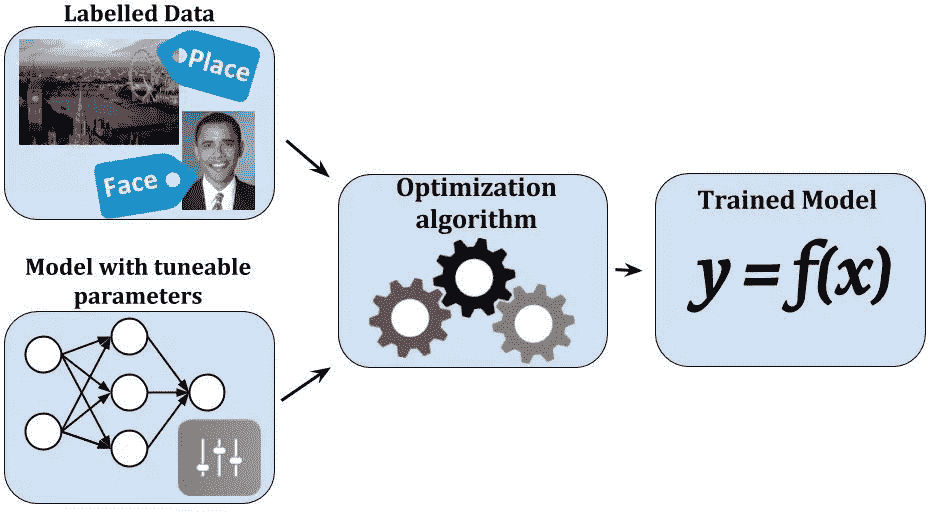

选自Medium

**作者：JP Tech等** 

**机器之心编译**

> 毕业季找工作了？如果想应聘机器学习工程师岗位，你可能会遇到技术面试，这是面试官掂量你对技术的真正理解的时候，所以还是相当重要的。近日，JP Tech 发表了一篇文章，介绍了他们面试新人时可能会提出的 12 个面试问题。问题很基础，但却值得一看。

这些问题是我在面试 AI 工程师岗位时常问到的问题。事实上，并非所有面试都需要用到所有这些问题，因为这取决于面试者的经验以及之前做过的项目。经过很多面试（尤其是与学生的面试）之后，我收集了 12 个深度学习领域的面试问题。我将在本文中将其分享给你。

**问题1：****阐述批归一化的意义**

这是一个非常好的问题，因为这涵盖了面试者在操作神经网络模型时所需知道的大部分知识。你的回答方式可以不同，但都需要说明以下主要思想：

*算法 1：**批归一化变换，在一个 mini-batch 上应用于激活 x。*

批归一化是一种用于训练神经网络模型的有效方法。这种方法的目标是对特征进行归一化处理（使每层网络的输出都经过激活），得到标准差为 1 的零均值状态。所以其相反的现象是非零均值。这将如何影响模型的训练：

首先，这可以被理解成非零均值是数据不围绕 0 值分布的现象，而是数据的大多数值大于 0 或小于 0。结合高方差问题，数据会变得非常大或非常小。在训练层数很多的神经网络时，这个问题很常见。如果特征不是分布在稳定的区间（从小到大的值）里，那么就会对网络的优化过程产生影响。我们都知道，优化神经网络将需要用到导数计算。

假设一个简单的层计算公式 y = (Wx + b)，y 在 W 上的导数就是这样：dy=dWx。因此，x 的值会直接影响导数的值（当然，神经网络模型的梯度概念不会如此之简单，但理论上，x 会影响导数）。因此，如果 x 引入了不稳定的变化，则这个导数要么过大，要么就过小，最终导致学习到的模型不稳定。而这也意味着当使用批归一化时，我们可以在训练中使用更高的学习率。

批归一化可帮助我们避免 x 的值在经过非线性激活函数之后陷入饱和的现象。也就是说，批归一化能够确保激活都不会过高或过低。这有助于权重学习——如果不使用这一方案，某些权重可能永远不会学习。这还能帮助我们降低对参数的初始值的依赖。

批归一化也可用作正则化（regularization）的一种形式，有助于实现过拟合的最小化。使用批归一化时，我们无需再使用过多的 dropout；这是很有助益的，因为我们无需担心再执行 dropout 时丢失太多信息。但是，仍然建议组合使用这两种技术。

**问题2：****阐述偏置和方差的概念以及它们之间的权衡关系**

偏置（bias）是什么？这很好理解，偏置是当前模型的平均预测结果与我们需要预测的实际结果之间的差异。当模型的偏置较高时，说明其不够关注训练数据。这会使得模型过于简单，无法在训练和测试上同时实现优良的准确度。这个现象也被称为「欠拟合」。

方差（variance）可以简单理解为是模型输出在一个数据点上的分布（或聚类）。方差越大，模型越有可能更密切关注训练数据，而无法提供在从未见过的数据上的泛化能力。由此造成的结果是，模型可在训练数据集上取得非常好的结果，但在测试数据集上的表现却非常差。这个现象被称为过拟合。

这两个概念的关系可通过下图说明：

上图中，圆圈中心是能够完美预测精准值的模型。事实上，你永远无法找到这样好的模型。随着我们离圆圈中心越来越远，模型的预测也越来越差。

我们可以改变模型，使得我们可以增大模型猜测的数量，使其尽可能多地落在圆圈中心。偏置和方差之间需要保持平衡。如果我们的模型过于简单，有非常少的参数，那么它就可能有较高的偏置和较低的方差。

另一方面，如果我们的模型有大量参数，则其将有较高的方差和较低的偏置。这是我们在设计算法时计算模型复杂度的基础。

**问题3：****假设深度学习模型已经找到了 1000 万个人脸向量，如何通过查询以最快速度找到一张新人脸？**

这个问题涉及到深度学习算法的实际应用，关键点在于**索引数据**的方法。这是将 One Shot Learning 应用于人脸识别的最后一步，但这也是最重要的步骤，让该应用易于实际部署。

基本上来说，对于这个问题，你首先应该通过 One Shot Learning 给出人脸识别方法的整体概况。这可以简单地理解成将每张脸转换成一个向量，然后识别新的人脸是寻找最接近（最相似）于输入人脸的向量。通常来说，人们会使用有三元组损失（triplet loss）的定制损失函数的深度学习模型来完成这一任务。

但是，如果有文章开头那样的图像数量增长，那么在每次识别中都计算与 1000 万个向量的距离可不是个聪明的解决方案，这会使得系统的速度非常慢。我们需要思考在真实向量空间上索引数据的方法，以便让查询更加便捷。

这些方法的主要思想是将数据划分成简单的结构，以便查询新数据（可能类似于树结构）。当有新数据时，在树中查询有助于快速找到距离最近的向量。

有一些可以用于这一目的的方法，比如局部敏感哈希（LSH）、Approximate Nearest Neighbors Oh Yeah——Annoy Indexing、Faiss等。

**问题4：****对于分类问题，准确度指数完全可靠吗？你通常使用哪些指标来评估你的模型？**

针对分类问题的评估方法有很多。准确度是一种很简单的指标，也就是用正确的预测数据除以总的数据。这听起来很合理，但现实情况是，这种度量方式对不平衡的数据问题来说并不够显著。假设我们正在构建用于预测网络攻击的预测模型（假设攻击请求大约占请求总数的 1/100000）。

如果该模型预测所有请求都是正常的，那么其准确率也高达 99.9999%，但在这个分类模型中，这个数字通常是不可靠的。上面的准确度计算得到的结果通常是被正确预测的数据的百分比，但没有详细说明每个类别的分类细节。相反，我们可以使用混淆矩阵。基本上来说，混淆矩阵展示了数据点实际属于的类别，以及模型预测的类别。其形式如下：

除了表达真正例和假正例指标对应于定义了该分类的每个阈值的变化之外，我们还有名为受试者工作特征（ROC）的图表。基于 ROC，我们可以知道该模型是否有效。

理想的 ROC 越接近左上角的橙色线（即真正例较高，假正例较低），结果就越好。

**问题5：****你怎么理解反向传播？请解释动作（action）的机制。**

这个问题的目标是测试参加面试的人是否理解神经网络的工作方式。你需要说明以下几点：

前向过程（前向计算）是帮助模型计算每层的权重的过程，所得到的计算会得到一个结果 yp。这时候会计算损失函数的值；损失函数的这个值能体现模型的优劣程度。如果这个损失函数不够好，我们就需要找到一种能够降低这个损失函数的值的方法。神经网络的训练目标实际上就是最小化某个损失函数。损失函数 L(yp,yt) 表示 yp 模型的输出值与 yt 数据标签的实际值之间的差异程度。

为了降低损失函数的值，我们需要使用导数。反向传播能帮助我们计算网络每一层的导数。基于每一层上导数的值，优化器（Adam、SGD、AdaDelta 等）可通过梯度下降来更新网络的权重。

反向传播会使用链式法则机制或导数函数，从最后一层到第一层计算每一层的梯度值。

**问题6：****激活函数有什么含义？激活函数的饱和点是什么？**

1\. 激活函数的含义

激活函数的目的是突破神经网络的线性性质。我们可以将这些函数简单理解成是一种过滤器，作用是决定信息是否可以通过神经元。在神经网络训练期间，激活函数在调整导数斜率方面具有非常重要的作用。

相比于使用线性函数，使用非线性激活函数能让神经网络学习更复杂的函数表征；但为了有效地使用它们，我们需要理解这些非线性函数的性质。大多数激活函数都是连续可微的函数。

这些函数是连续函数，也就是说如果输入有较小的可微分的变化（在其定义域中的每个点上都有导数），那么输出也会有较小的变化。当然，如前面提到的那样，导数的计算是非常重要的，而且决定了我们的神经元是否可以训练。值得提及的几种激活函数有 Sigmoid、Softmax 和 ReLU。

2\. 激活函数的饱和范围

Tanh、Sigmoid 和 ReLU 函数等非线性激活全都有饱和区间。

很容易理解，激活函数的饱和范围就是当输入值变化时输出值不再变化的区间。这个变化区间存在两个问题。

第一个问题是在神经网络的前向方向上，落在激活函数的饱和范围内的层的值将会逐渐得到许多同样的输出值。这会导致整个模型出现同样的数据流。这个现象被称为协方差偏移（covariance shifting）。

第二个问题是在反向方向上，饱和范围内的导数为零，由此导致网络几乎无法再学习到任何东西。这就是我们在批归一化问题中提到的要将值的范围设定为零均值的原因。

**问题7：****模型的超参数是什么？超参数与参数有何不同？**

1\. 模型参数是什么？

先稍微回顾一下机器学习的本质，要做机器学习，我们需要有一个数据集。没有数据我们怎么学习呢？一旦有了数据，机器需要找到数据之间的关联。

假设我们的数据是温度和湿度等天气信息，我们希望机器执行的任务是找到这些因素与我们的爱人是否生气之间的关联。这听起来似乎并无关联，但机器学习的待办事项有时候确实很可笑。现在，我们用变量 y 表示我们的爱人是否生气，变量 x_1、x_2、x_3……表示天气元素。我们用下面的函数 f(x) 表示这些变量之间的关系：

看到系数 w_1、w_2、w_3 了吗？这就代表了数据和结果之间的关系，这就是所谓的模型参数。因此，我们可以这样定义「模型参数」：

模型参数是模型基于训练数据生成的值，有助于展示数据中数据量之间的关系。

所以当我们说要为某问题找到最佳的模型时，我们的意思是要基于已有的数据集为该问题找到最合适的模型参数。模型参数有如下特性：

*   可用于预测新数据；

*   能展现我们使用的模型的能力，通常通过准确度等指标表示；

*   是直接从训练数据集学习到的；

*   不是由人类人工设置的。

模型参数也有不同的形式，比如在神经网络中是权重、在支持向量机中是支持向量、在线性回归和 logistic 回归算法中是系数。

2\. 什么是模型超参数？

可能有人认为模型超参数就是或者像是模型参数，但事实并非如此。实际上这两个概念是完全不同的。模型参数是从训练数据集建模的，而模型超参数却完全不是这样，其完全位于模型之外而且不依赖于训练数据。所以模型超参数的作用是什么？实际上它们有以下任务：

*   在训练过程中使用，帮助模型寻找最合适的参数；

*   通常是在模型设计时由人工选择的；

*   可基于几种启发式策略来定义。

对于某个具体问题，我们完全不知道最佳的超参数模型是怎样的。因此，实际上我们需要使用某些技术（比如网格搜索）来估计这些值的最佳范围（比如, k 最近邻模型中的 k 系数）。下面是模型超参数的一些示例：

*   训练人工神经网络时的学习率指数；

*   训练支持向量机时的 C 和 σ 参数；

*   k 最近邻模型中的 k 系数。

**问题8：****当学习率过高或过低时会怎样？**

当模型的学习率过低时，模型的训练速度会变得非常慢，因为其每次对权重的更新会变得非常小。模型将需要大量更新才能到达局部最优点。

如果学习率过高，模型很可能无法收敛，因为权重的更新过大。在加权的步骤中，模型有可能无法实现局部优化，然后使模型难以更新到最优点（因为每步更新都跳得过远，导致模型在局部最优点附近摇摆）。

**问题9：****当输入图像的尺寸加倍时，CNN 参数的数量会增加多少倍？为什么？**

对于参加面试的人来说，这个问题很有误导性，因为大部分人思考这个问题的方向都是 CNN 的参数数量会增加多少倍。但是，我们看看 CNN 的架构：

可以看到，CNN 模型的参数数量取决于过滤器的数量和大小，而非输入图像。因此，将输入图像的尺寸加倍不会改变模型的参数数量。

**问题10：****处理数据不平衡问题的方法有哪些？**

这个问题检验的是面试者是否知道处理有真实数据的问题的方法。通常来说，实际数据和样本数据（无需调整的标准数据集）在性质和数据量上都有很大的不同。使用真实数据集时，数据有可能是不平衡的，也就是说不同类别的数据不平衡。针对这个问题，我们可以考虑使用以下技术：

为模型的评估选择适当的指标：当使用的数据集不平衡时，使用准确度来进行评估是很不合适的（前面已经提到过），而应该选择精确度、召回率、F1 分数、AUC 等评估指标。

对训练数据集进行重新采样：除了使用不同的评估指标外，人们还可以通过某些技术来获得不同的数据集。基于不平衡的数据集创建平衡的数据集的方法有两种：欠采样和过采样，具体技术包括重复、自举或 SMOTE（合成少数过采样技术）。

集成多个不同模型：通过创建更多数据来实现模型的通用性在实践中是不可取的。举个例子，假设你有两个类别：一个有 1000 个数据样本的罕见类别以及一个有 10000 个数据样本的常见类别。我们可以不必努力为罕见类别寻找 9000 个数据样本来进行模型训练，而是可以采用一种 10 个模型的训练方案。其中每个模型都使用 1000 个罕见数据样本和 1000 个常见数据样本进行训练。然后使用集成技术得到最佳结果。

重新设计模型——成本函数：在成本函数中使用惩罚技术来严厉惩罚数据丰富的类别，以帮助模型自身更好地学习罕见类别的数据。这能使损失函数的值更全面地覆盖所有类别。

**问题11：****在训练深度学习模型时，epoch、batch（批）和 iteration（迭代）这些概念都是什么意思？**

这些是训练神经网络时非常基本的概念，但实际上很多面试者在区分这些概念时常常搞混淆。具体来说，你应该这样回答：

*   epoch：代表在整个数据集上的一次迭代（所有一切都包含在训练模型中）；

*   batch：是指当我们无法一次性将整个数据集输入神经网络时，将数据集分割成的一些更小的数据集批次；

*   iteration：是指运行一个 epoch 所需的 batch 数。举个例子，如果我们的数据集包含 10000 张图像，批大小（batch_size）是 200，则一个 epoch 就包含 50 次迭代（10000 除以 200）。

**问题12：****数据生成器的概念是什么？使用数据生成器需要什么？**

生成函数在编程中也非常重要。数据生成函数可帮助我们在每个训练 batch 中生成能直接拟合模型的数据。

使用生成函数在训练大数据时大有助益。因此数据集并不是需要全部都载入 RAM，这是浪费内存；此外，如果数据集过大，还可能导致内存溢出，对输入数据的处理时间也会变得更长。

**总结**

上面就是我常在面试过程中向参加面试的人提出的 12 个有关深度学习的面试问题。但是，根据每个面试者的情况不同，提问的方式可以也会各不相同，另外也会有其它一些根据面试者的经历而提出的问题。

尽管这篇文章只涉及技术问题，但也是与面试相关的。在我个人看来，态度是面试成功的一半。所以除了让你自己积累知识和技能之外，一定要用真正、进取又谦虚的态度展现你自己，这样能让你在对话中取得很大的成功。

*参考链接：*

*https://medium.com/@itchishikicomm/12-deep-learning-interview-questions-you-should-not-be-missed-part-1-8a61f44cadac*

*AI学习路线和优质资源，在后台回复"AI"获取*

