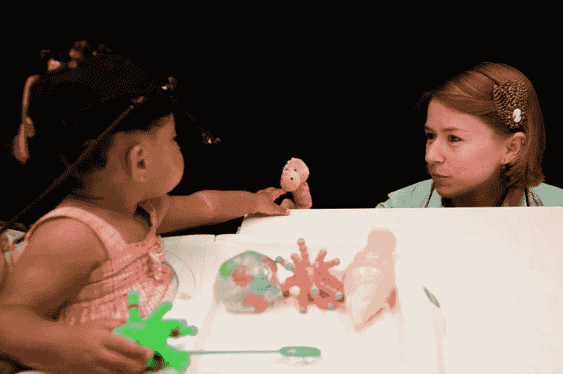
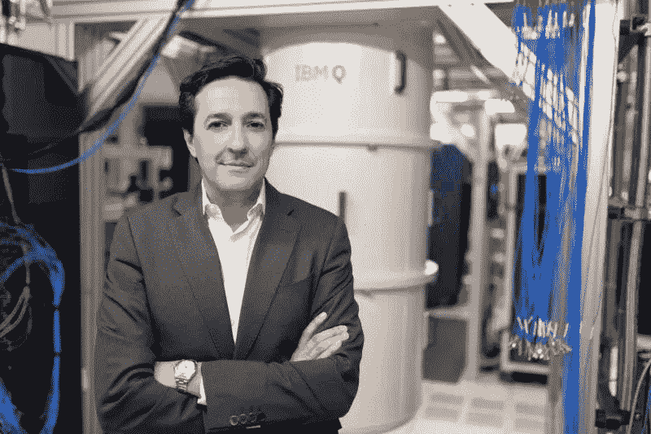

选自venturebeat

**机器之心编译**

**参与：魔王、一鸣**

> AI 领域最杰出的头脑如何总结 2019 年技术进展，又如何预测 2020 年发展趋势呢？本文介绍了 Soumith Chintala、Celeste Kidd、Jeff Dean 等人的观点。

人工智能不是将要改变世界，而是正在改变世界。在新年以及新的十年开启之际，VentureBeat 采访了人工智能领域最杰出的头脑，来回顾人工智能在 2019 年的进展，展望机器学习在 2020 年的前景。受访者包括 PyTorch 之父 Soumith Chintala、加州大学教授 Celeste Kidd、谷歌 AI 负责人 Jeff Dean、英伟达机器学习研究负责人 Anima Anandkumar，以及 IBM 研究主管 Dario Gil。

**其中部分人预测半监督学习和神经符号方法等子领域将出现进展，而几乎所有受访者一致认同 2019 年基于 Transformer 的自然语言模型取得巨大进步，也都认为对人脸识别等争议性技术的讨论仍会持续。此外，他们还期望 AI 领域不再只以准确率论输赢。**

**PyTorch 之父 Soumith Chintala**

*PyTorch 负责人、首席工程师和创造者 Soumith Chintala*

不论用哪种衡量方式，PyTorch 都是现在全世界最流行的机器学习框架。PyTorch 是基于 2002 年发布的 Torch 开源框架的衍生，于 2016 年发布初始版本，目前其扩展和库均稳步增长。

在 2019 年秋季举办的 PyTorch 开发者大会上，Facebook 发布了 PyTorch 1.3 版本，该版本支持量化和 TPU 支持。会上还发布了深度学习可解释性工具 Captum 和 PyTorch Mobile。此外，还有机器人框架 PyRobot 和代码共享神器 PyTorch Hub，鼓励机器学习从业者拥抱可复现性。

在这次 PyTorch 开发者大会上，Chintala 表示：**2019 年机器学习领域几乎没有突破性进展。**

「我认为，自 Transformer 之后，基本上没有什么突破。2012 年 CNN 在 ImageNet 大赛上夺冠，迎来了高光时刻，2017 年是 Transformer。这是我的个人看法。」他说。

他认为 DeepMind 的 AlphaGo 对强化学习的贡献是突破性的，但其结果很难在现实世界的实际任务中实现。

Chintala 还认为，PyTorch 和 TensorFlow 等机器学习框架的演化改变了研究者探索新思路和做研究的方式。「这些框架使研究者的速度比之前快了一两个数量级，从这个角度看，这是一项巨大突破。」

2019 年，谷歌和 Facebook 的开源框架都引入了量化，用于提升模型训练速度。Chintala 预测，2020 年 PyTorch 的 JIT 编译器和神经网络硬件加速器（如 Glow）等工具的重要性和采用范围将迎来「爆发」。

「从 PyTorch 和 TensorFlow 中，可以看到框架的融合趋势。量化以及大量其他较低级功能出现的原因是，**框架之争的下一战是编译器**——XLA（TensorFlow）、TVM（陈天奇团队）、Glow（PyTorch），大量创新即将出现。未来几年，你们会看到如何更智能地量化、更好地融合、更高效地使用 GPU，以及如何针对新硬件执行自动编译。」

和本文大多数受访者一样，Chintala 预测 **2020 年 AI 社区将用更多度量指标衡量 AI 模型的性能，而不仅仅是准确率**。社区将注意力转向其他因素，如创建模型所需的电量、如何向人类解释输出结果，以及如何使 AI 更好地反映人类想要构建的社会。

「回望过去五六年，我们只关注准确率和原始数据，例如『英伟达的模型更准确，还是 Facebook 的模型更准确？』我认为，2020 年我们将（以更复杂的方式）思考，如果模型不具备良好的可解释性（或满足其他标准），那就算准确率高出 3% 又怎样呢？」Chintala 表示。

**加州大学教授 Celeste Kidd**

*加州大学伯克利分校发展心理学家 Celeste Kidd。*

Celeste Kidd 是加州大学伯克利分校 Kidd 实验室的主管，她和她的团队致力于探索儿童的学习方式。他们的见解可以帮助那些尝试以类似于培养儿童的方式训练模型的神经网络创建者。

Kidd 表示：「人类婴儿不需要标注数据集，但他们也能学习得很好。这其中的关键在于我们需要理解这其中的原理。」

她认为，当你对婴儿的行为综合分析后，你确实会看到他们理解一些事物的证据，但是他们并非完美的学习者。「婴儿能自动学习很多东西」这种说法是对婴儿能力的过度美化。

「婴儿很棒，但他们也会出很多错。我看到人们随意地进行对比，将婴儿的行为理想化了。我认为人们将会更加重视如何将当前的研究和未来的研究目标之间的联系」

在 AI 领域，「黑箱」一词已诞生多年，该词常用于批评神经网络缺乏可解释性。但 Kidd 认为，在 2020 年，可能不会再有这种对神经网络的认识了。

「黑箱这个观点是虚假的……大脑也是黑箱，而我们在了解大脑工作原理方面已经获得巨大进展。」

在为「黑箱」理论祛魅的过程中，Kidd 阅读了 MIT-IBM Watson AI 实验室执行主任 Aude Oliva 的研究。

「我们当时讨论过这件事。我之前认为系统是黑箱，她批评了我，说当然不是黑箱。你当然可以将它分割开来，查看其工作方式，并运行实验，就像我们在了解认知过程时所做的实验那样。」

上个月，Kidd 在 NeurIPS 2019 开幕式上发表主旨演讲。她的演讲主要涉及人类大脑如何坚持己见、注意力系统以及贝叶斯统计。

她注意到了内容推荐系统如何操纵人类的想法。追求让用户最大程度参与的系统对人类如何形成想法和观点有着重大影响。

2020 年，她希望看到更多人意识到技术工具和技术决策对现实生活的影响，拒绝「工具创造者不对工具使用者的行为和后果负责」的观点。

「我听到太多人用『我不是卫道士』这样的说辞自我辩护。我认为必须有更多人意识到这是不诚实的。」

「作为社会一员，尤其是作为研发这些工具的人，我们需要直接正视随之而来的责任。」

**谷歌 AI 负责人 Jeff Dean**

*谷歌 AI 负责人 Jeff Dean*

Jeff Dean 在谷歌工作了二十年，现已领导谷歌 AI 近两年，他是谷歌早期很多搜索和分布式网络算法的设计师，谷歌大脑的早期成员。

Jeff Dean 在 NeurIPS 2019 会议上发表了两场演讲，这两场演讲分别关于使用机器学习设计 ASIC 半导体（ML for Systems）和 AI 社区帮助解决气候变化的方法（Tackling Climate Change with ML）。他认为后者是这个时代最重要的问题之一。在关于气候变化的演讲里，Dean 讨论了 AI 怎样能够成为零碳产业的方法，以及使用 AI 帮助改变人类的行为。

谈到对 2020 年的期待，Dean 表示，他希望看到多模型学习领域的进展。在这一领域中，多模态学习依赖多媒体数据进行训练，而多任务学习则让网络通过训练一次就可以完成多项任务。

毫无疑问，**2019 年最显著的机器学习趋势之一是：基于 Transformer 的自然语言模型的发展和壮大**（上文中 Chintala 也认为这是 AI 领域近年来的最大突破之一）。在 2018 年，谷歌开源了基于 Transformer 的模型 BERT。而 2019 年大量顶级性能的模型（如谷歌的 XLNet、微软的 MT-DNN、Facebook 的 RoBERTa）都基于 Transformer 构建。而且，谷歌发言人还告诉 VentureBeat，XLNet 2 将于本月底发布。

Jeff Dean 在谈到 Transformer 进展时表示，「基于 Transformer 实际获得的机器学习模型可以执行比之前更复杂的 NLP 任务，从这个角度看，这个领域的研究硕果累累。」但是他补充道，该领域仍有发展空间。「我们还是希望能够使**模型更多地理解语境**。现在 BERT 等模型可以很好地处理数百个单词的语境，但如果语境包含 10000 个单词就不行了。这是一个有趣的研究方向。」

Dean 表示他希望社区更少去强调微小的 SOTA 进展，而是多关注如何创建更稳健的模型。

谷歌 AI 将推进新计划，如 2019 年 11 月开启的内部项目「Everyday Robot」，该项目旨在创造在家庭和工作环境中完成常见任务的机器人。

**英伟达机器学习研究负责人 Anima Anandkumar**

*英伟达机器学习研究负责人 Anima Anandkumar*

英伟达的 AI 研究围绕多个领域展开，从针对医疗领域的联邦学习到自动驾驶、超级计算机、显卡不一而足。

2019 年，在英伟达负责机器学习工作的 Anandkumar 的重点之一是强化学习模拟框架。目前这样的框架越来越流行，也更加成熟。

2019 年，我们看到英伟达开发了自动驾驶平台 Drive 和机器人模拟器 Isaac，以及基于模拟生成合成数据的模型和 GAN。

例如，去年 StyleGAN 和 GauGAN 等 AI 模型大出风头。而在上个月，英伟达还发布了 StyleGAN2。

这其中使用的便是 GAN 这一神经网络。这是一项能「混淆现实和虚拟界限」的技术，Anandkumar 认为该技术能够帮助解决 AI 社区面临的难题，如抓握式机器臂和自动驾驶。

Anandkumar 预测，2020 年迭代算法（iterative algorithm）、自监督和自训练方法将有新的进展。所谓自训练，指的是模型使用无监督数据，通过自我训练得到改进。

「我认为迭代算法就是未来，因为如果你只做一个前馈网络，它的稳健性可能是个问题。而如果你尝试进行多次迭代——基于数据类型或准确率要求来调试迭代，那么达到目标的可能性就会大大增加。」

Anandkumar 认为，2020 年 AI 社区将面临多项挑战，比如说，AI 社区需要和领域专家合作为特定行业创建模型。政策制定者、个人和 AI 社区还需要处理特征表示上的问题，并确保模型训练所用数据集能够代表不同群体。

「我认为人脸识别存在的问题是容易被发现的，但是，在很多领域中，人们还没有意识到数据的使用会涉及隐私问题。」Anandkumar 表示，人脸识别得到的关注最多，这是因为人们很容易理解人脸识别如何损害个人隐私，而 2020 年 AI 社区将面临更多伦理问题。

「我们需要更加审慎地审查数据收集和使用过程。欧洲正在这样做，但在美国更应该如此。出于正当理由，美国国家运输安全委员会（NTSB）和联邦公共交通管理局（FTA）等组织将更多地执行此类操作。」

Anandkumar』s 认为，2019 年的一大惊喜是文本生成模型的突飞猛进。

「2019 是语言模型之年，不是吗？现在，我们第一次得到了更连贯的文本生成结果，且其长度相当于整个段落，这在之前绝不可能，这非常棒。」

2019 年 8 月，英伟达发布了 Megatron 自然语言模型。该模型具备 80 亿参数，被认为是全球最大的 Transformer 模型。Anandkumar 表示，她被人们开始按模型是否具备人格或个性进行分类的方式震惊到了。她期待看到更加适用于特定行业的文本模型。

「我们仍然没有到达交互式对话生成阶段。在这个阶段中，我们可以追踪和进行自然对话。我认为 2020 年这一方向会有更多尝试。」

开发控制文本生成的框架比开发图像识别框架难度更大。而且文本生成模型会遇到为神经模型定义事实等方面的挑战。

**IBM 研究主管 Dario Gil**

*IBM 研究主管 Dario Gil*

Dario Gil 带领的研究者团队为白宫和全球企业提供积极指导。他认为，2019 年机器学习领域的重要进展包括生成模型和语言模型的进步。

他预测，使用较低精度架构更高效地训练模型方面会有持续进展。开发更高效的 AI 模型是 NeurIPS 的重点，IBM Research 在会上介绍了使用 8-bit 精度模型的深度学习技术。

「总体上，使用现有硬件和 GPU 架构训练深度神经网络的方式仍然是低效的。因此，从根本上重新思考非常重要。我们已经提升了 AI 的计算效率，我们还将做得更多。」

Gil 引用研究表示，机器学习训练的需求每三个半月翻一番，比摩尔定律预测的要快得多。

Gil 对 AI 加速推动科学新发现感到很振奋，但他表示，IBM 研究院的研究重点将是神经符号方法。

2020 年，Gil 希望 AI 从业者和研究者能够关注准确率以外的度量指标，考虑在生产环境中部署模型的价值。AI 领域转向构建受信任的系统，而不是准确率至上，这将是 AI 得到继续采用的关键。

「社区中有些人可能会说『不要担心，只需要提高准确率。人们会习惯黑箱这件事的。』，或者他们认为人类有时做决策时也不给出解释啊。我认为将社区的智力聚焦于比准确率更好的事情是非常非常重要的。在任务关键型应用中，AI 系统不能是黑箱。」

AI 只有少数机器学习奇才能做，具备数据科学和软件工程技能的更多人只用使用它就行了。Gil 认为这种认知应该摒弃。

「如果我们让 AI 保持神秘，只有该领域的 PhD 才能研究，这对 AI 的应用没有好处。」

2020 年，Gil 对神经符号 AI 尤其感兴趣。IBM 将寻找神经符号方法为概率编程（让 AI 学习如何编程）和能够分享决策背后原因的模型等赋能。

「采用神经符号方法，能够将学习和推理结合起来，即符号维度嵌入到学习程序中。通过这种方式，我们已经证明可使用所需数据的一部分进行学习。因为你学习了程序，你的最终输出是可解释的，因为有了这些可解释的输出，系统就更加可信。」

公平性、数据完整性和数据集选择问题仍是关注的重点。同样，和生物识别技术相关的领域也是如此。人脸识别获得了巨大关注，这只是个开始。随着语音数据的敏感度上升，其他形式的生物识别特征也会日益受到关注。

「和人类身份和生物识别特征有关的工作，以及使用 AI 分析这些信息依然是研究中的核心问题。」

除了 MIT-IBM Watson 实验室的主要项目——神经符号和常识推理以外，Gil 表示 2020 年 IBM 研究院还将探索用于 AI 的量子计算，以及较低精度架构以外的 AI 模拟硬件。

**总结**

机器学习将继续塑造商业和社会，本文采访的这些研究者和专家发现了如下趋势：

*   神经语言模型的进展是 2019 年的重大事件，Transformer 是其背后的巨大助力。2020 年会出现更多 BERT 变体和基于 Transformer 的模型。

*   AI 行业应该寻找准确率以外的模型输出度量指标。

*   2020 年，半监督学习、神经符号等方法和多任务学习、多模态学习等子领域可能出现进展。

*   和生物识别数据（如语音记录）相关的伦理挑战可能继续成为争议焦点。

*   编译器和量化等方法可能在 PyTorch 和 TensorFlow 等机器学习框架中更加流行，以作为优化模型性能的方式。

*参考链接：*

*https://thenextweb.com/podium/2020/01/02/ai-creativity-will-bloom-in-2020-all-thanks-to-true-web-machine-learning/*

*AI学习路线和优质资源，在后台回复"AI"获取*

