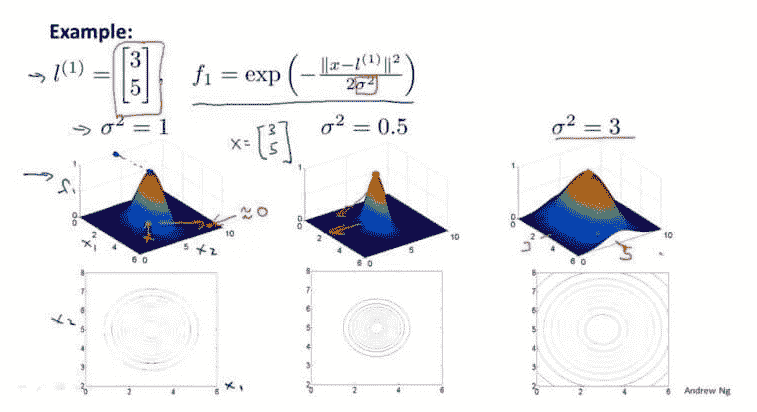

在我很早之前写过的文章《[机器学习如何入门](https://mp.weixin.qq.com/s?__biz=MzIwOTc2MTUyMg%3D%3D&chksm=976fa057a0182941e8dda24a469338100d81de848a6aad467f77c6950202ab02562739aa1c8c&idx=1&lang=zh_CN&mid=2247484874&scene=21&sn=e4a54e67d7da788c5b75acfa96763e1c&token=98277343#wechat_redirect)》中，就首推过吴恩达在 Coursera 上开设的《Machine Learning》课程。这门课最大的特点就是基本没有复杂的数学理论和公式推导，非常适合入门！

这门课是发布在 Coursera 上的，很多读者容易把它与吴恩达的另一门课 CS229 混淆。其实，今天讲的 Coursera 上的《Machine Learning》更加简单。

其课程地址为：

https://www.coursera.org/learn/machine-learning

关于这门课的官方介绍是：本课程将广泛介绍机器学习、数据挖掘和统计模式识别。相关主题包括：(i) 监督式学习（参数和非参数算法、支持向量机、核函数和神经网络）。(ii) 无监督学习（集群、降维、推荐系统和深度学习）。(iii) 机器学习实例（偏见/方差理论；机器学习和AI领域的创新）。课程将引用很多案例和应用，您还需要学习如何在不同领域应用学习算法，例如智能机器人（感知和控制）、文本理解（网络搜索和垃圾邮件过滤）、计算机视觉、医学信息学、音频、数据库挖掘等领域。 

这门课基本涵盖了机器学习的主要知识点，例如：线性回归、逻辑回归、支持向量机、神经网络、K-Means、异常检测等等。而且课程中没有复杂的公式推导和理论分析。Ng 的目的是让机器学习初学者能够快速对整个机器学习知识点有比较整体的认识，便于快速入门。 

我曾经整理了一份该门课的思维导图：


如果有读者想要看这份思维导图的清晰版（包括原 .xmind 文件），下面是下载链接：

https://pan.baidu.com/s/16065BpNAP7JEx_PpFHLSOw

提取码：xcmi

好了，回归正题！这门课的笔记网上有很多，但今天推荐一份不错的全面的笔记。该笔记的特点是所有内容都是基于 Jupyter Notebook 写的，集图片、公式、代码、练习题于一体，非常方便使用！

下面来详细看一下！

这份笔记的作者是 Halfrost-Field 冰霜之地，笔记发布地址为：

https://github.com/halfrost/Halfrost-Field

所属于 Machine Learning 一栏。


笔记包含了课程 11 周完整内容，每一周单独对应一个 Jupyter Botebook 文件。


下面举几个代表看一下！

**1. 支持向量机（SVM）**

打开 Support_Vector_Machines.ipynb文件，逻辑回归损失函数的公式推导：


高斯核函数的可视化理解：



还有作者对 SVM 重要参数的归纳总结：


笔记内容结合了吴恩达的课件，归纳的比较到位！

每一份笔记的最后，还配备相应的习题：


**2. 神经网络学习**

打开 Neural_Networks_Learning.ipynb 文件，Backpropagation Algorithm 反向传播算法的推导：


反向传播算法实现：

```
function g = sigmoid(z)
    g = 1.0 ./ (1.0 + exp(-z));
end

function g = sigmoidGradient(z)
    g = sigmoid(z) .* (1 - sigmoid(z));
end

delta3 = a3 - Y;

Theta2_grad = 1 / m * delta3' * [ones(m, 1), a2] + ...
  lambda / m * [zeros(K, 1), Theta2(:, 2:end)]; # 正规化部分

delta2 = (delta3 * Theta2 .* sigmoidGradient([ones(m, 1), z2]));
delta2 = delta2(:, 2:end); # 反向计算多一个偏移参数误差，除去

Theta1_grad = 1 / m * delta2' * [ones(m, 1), a1] + ...
  lambda / m * [zeros(H, 1), Theta1(:, 2:end)]; # 正规化部分
```

笔记内容非常详细，读者可在原笔记中查看。

**附加资源：**

这门课配套相应的练习题。Github 上已经有人把作业整理成为 Python 的形式了。有 .py 和 .ipynb 两种格式。

https://github.com/nsoojin/coursera-ml-py

https://github.com/kaleko/CourseraML 

最后，为了节省大家下载时间，我已经把这份笔记的所有 Jupyter Notebook 下载下来并打包好了。获取方式：在本公众号后台回复：**NGjupyter** 即可！

