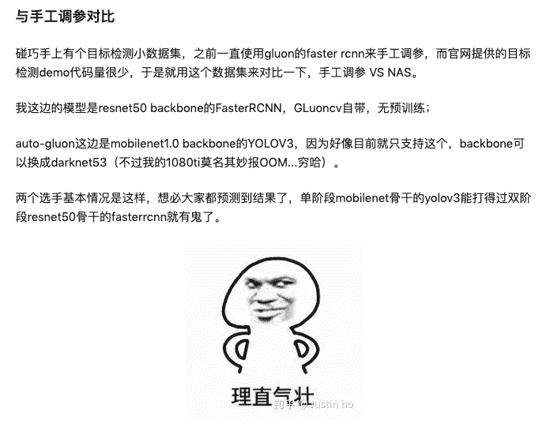
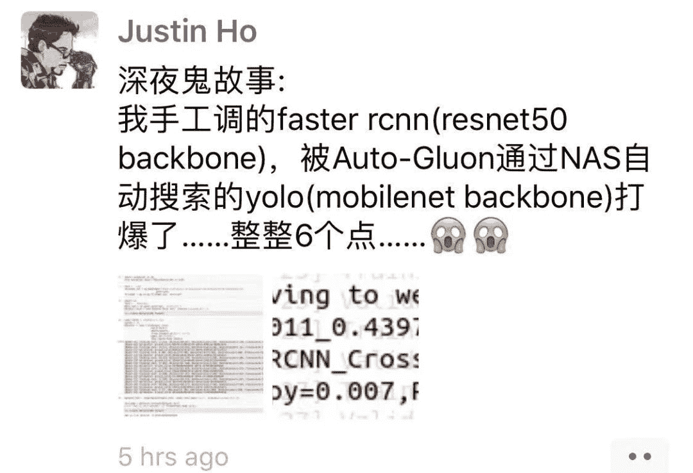
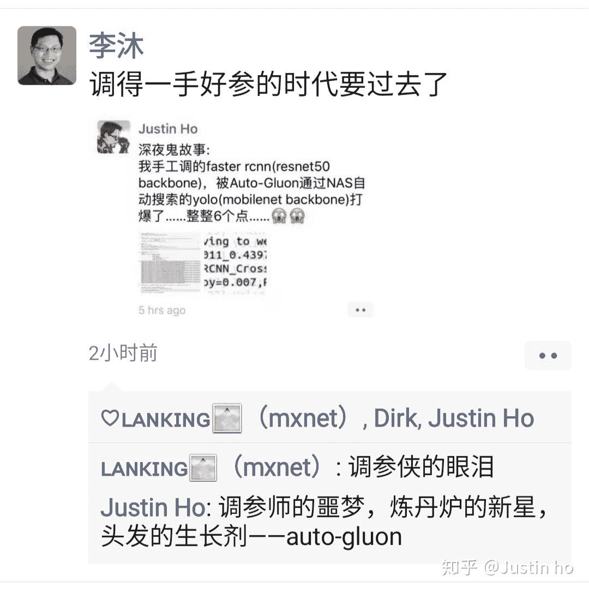
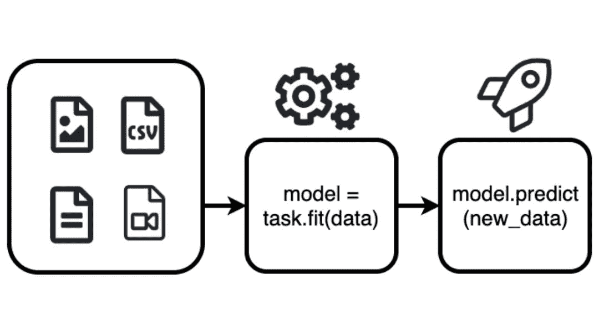
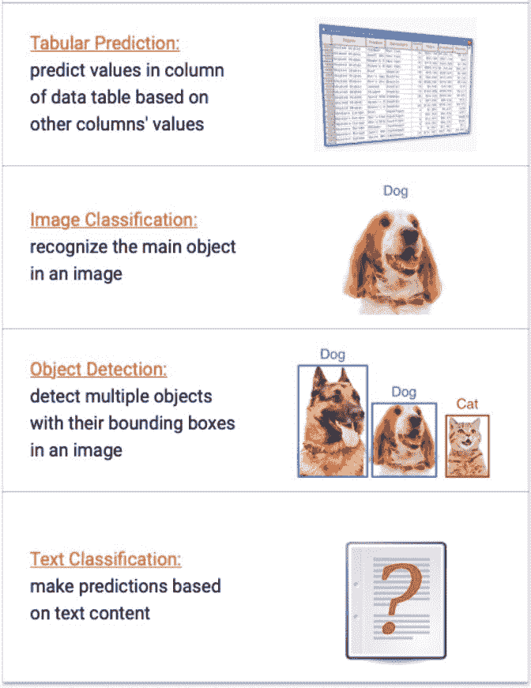
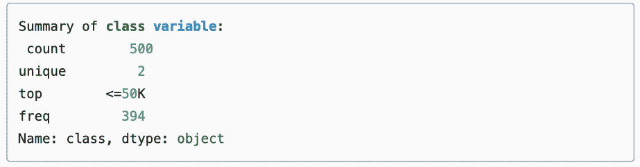
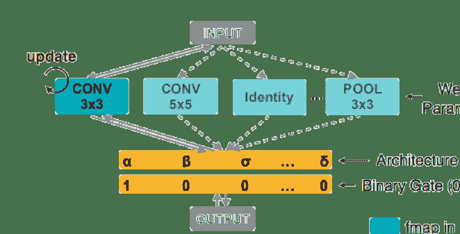

机器之心报道

**机器之心，Datawhale编辑**

> 自动机器学习效果能有多好？比如让 MobileNet1.0 backbone 的 YOLO3 超过 ResNet-50 backbone 的 faster-rcnn 六个点？AutoGluon 的问世说明，人类炼丹师可能越来越不重要了。

近日，亚马逊正式推出了开源代码库 AutoGluon。开发者依靠仅仅几行代码，就可以编写出 AI 嵌入应用程序。

一个多月前，AutoGluon 在 GitHub 已经悄悄上线，但最近几天才正式公开发布。

开发者「Justin ho」抢先体验了一下 AutoGluon，以下是他的心得体会：



「ResNet-50 backbone + FasterRCNN 骑脸怎么输嘛。」

但，最终测试集成绩非常出人意料，AutoGluon 通过 NAS 搜索的结果直接高了**六个点**。



对此，李沐表示：



*知乎用户 @Justin ho。*

李沐在知乎上回应：

> AutoML 使用大概 15 倍于单次训练的代价，得到的结果可能比手调的要好。这个主要是对于 CV 而言，尤其是 detection 模型，预计 GluonCV 里面模型很快赢来一大波提升。
> 
> AutoGluon 取了一个巧，我们目前只支持 GluonCV 和 GluonNLP 里面的任务，和额外的 Tabular 数据（因为一个小哥之前有过经验）。所以我们可以把以前的很有经验东西放进去来减小搜参空间，从而提升速度。
> 
> 当然 AutoGluon 还是早期项目，我本来想是让团队再开发一些时间再公开。还有太多有意思的应用、算法、硬件加速可以做的。非常欢迎小伙伴能一起贡献。

**AutoGluon：****新特性**

*图解 AutoGluon。*

AutoGluon 支持易使用和易扩展的 AutoML，并专注于涵盖图像、文本或表格数据的深度学习和实际应用。AutoGluon 适用于机器学习初学者和专家，能够使他们：

*   通过几行代码即可快速地为数据构建深度学习原型方案；

*   利用自动超参数微调、模型选择/架构搜索和数据处理；

*   无需专家知识即可自动使用深度学习 SOTA 方法；

*   轻松地提升现有定制模型和数据管道，或者根据用例自定义 AutoGluon。

**支持功能**

现在 AutoGluon 已经支持了以下一些应用：

*   表格预测：基于数据表中一些列的值预测其他列的值；

*   图像分类：识别图像中的主要对象；

*   对象检测：借助图像中的边界框检测多个对象；

*   文本分类：基于文本内容做出预测。



除了这些之外，AutoGluon 还可以进行神经架构搜索，使用起来较为简便。

怎样使用 AutoGluon 呢？官方文档中提供了示例代码，机器之心进行了节选：

**示例代码**

**表格预测**

对于用表格形式（存储为 CSV 文件等）来表示的标准数据集来说，AutoGluon 可以自动根据其他列的值来预测某一列值。只需要调用一次 fit()，就可以在标准的监督学习任务（包括分类和回归）中实现很高的准确性，而无需数据清洗、特征工程、超参数优化、模型选择等等繁琐的流程。

首先，导入 AutoGluon 中预测表格的相关 api。

```
import autogluon as ag
from autogluon import TabularPrediction as task 
```

加载数据（这里使用官方教程提供的数据集）。

```
train_data = task.Dataset(file_path='https://autogluon.s3.amazonaws.com/datasets/Inc/train.csv')
train_data = train_data.head(500) # subsample 500 data points for faster demo
print(train_data.head()) 
```

表格 train_data 中的每一行都对应单独的训练样本。在官方教程提供的数据集中，每一行对应单个人，并且表格列包含各种统计特征。

我们先来用这些特征预测一下某个人的收入是否超过 5 万美元，相关信息记录在该表的 class 列中。



然后进行训练：

```
dir = 'agModels-predictClass' # specifies folder where to store trained models
predictor = task.fit(train_data=train_data, label=label_column, output_directory=dir) 
```

加载测试集并测试：

```
test_data = task.Dataset(file_path='https://autogluon.s3.amazonaws.com/datasets/Inc/test.csv')
y_test = test_data[label_column] # values to predict
test_data_nolab = test_data.drop(labels=[label_column],axis=1) # delete label column to prove we're not cheating
print(test_data_nolab.head()) 
```

**图像分类**

和表格预测任务类似，AutoGluon 可以自动对图像进行分类，并使用 GPU 进行训练。

首先加载图像分类 api：

```
import autogluon as ag
from autogluon import ImageClassification as task 
```

然后只需要短短几行代码就可以构建一个图像分类器（数据集为教程自带数据集）：

```
classifier = task.fit(dataset,epochs=10,ngpus_per_trial=1,verbose=False) 
```

打印训练结果中最好的：

```
print('Top-1 val acc: %.3f' % classifier.results['best_reward']) 
```

对单一图像进行测试，这里的 ag.get_gpu_count() 用于检测是否有 GPU，如有则大于 0。

```
# skip this if training FashionMNIST on CPU.
if ag.get_gpu_count() > 0: 
  image = 'data/test/BabyShirt/BabyShirt_323.jpg' 
  ind, prob = classifier.predict(image)
print('The input picture is classified as [%s], with probability %.2f.' % (dataset.init().classes[ind.asscalar()], prob.asscalar())) 
```

在测试集上测试并打印结果：

```
test_acc = classifier.evaluate(test_dataset)print('Top-1 test acc: %.3f' % test_acc) 
```

**神经架构搜索**

对于 AutoML 的框架来说，神经架构搜索是很重要的一个应用。近来，流行的 NAS 方法，如 ENAS 和 ProxylessNAS 都通过构建一个超网络（supernet）并在不同的架构之间共享权重，从而加速搜索速度。



*ProxylessNAS 架构。*

AutoGluon 也提供了相应的功能。

以「为硬件设备搜索合适的神经网络架构」为例：

首先，导入相关 api。

```
import autogluon as ag
import mxnet as mx
import mxnet.gluon.nn as nn 
```

然后使用 MXNet 框架构建一个 CNN 的基础架构：

```
class Identity(mx.gluon.HybridBlock): 
  def hybrid_forward(self, F, x): 
    return x
class ConvBNReLU(mx.gluon.HybridBlock): 
  def __init__(self, in_channels, channels, kernel, stride): 
    super().__init__() 
    padding = (kernel - 1) // 2 
    self.conv = nn.Conv2D(channels, kernel, stride, padding, in_channels=in_channels) 
    self.bn = nn.BatchNorm(in_channels=channels) 
    self.relu = nn.Activation('relu') 
   def hybrid_forward(self, F, x): 
     return self.relu(self.bn(self.conv(x))) 
```

构建一个 ENAS 单元用于架构搜索：

```
from autogluon.contrib.enas import *

@enas_unit()
class ResUnit(mx.gluon.HybridBlock): 
  def __init__(self, in_channels, channels, hidden_channels, kernel, stride): 
  super().__init__() 
  self.conv1 = ConvBNReLU(in_channels, hidden_channels, kernel, stride) 
  self.conv2 = ConvBNReLU(hidden_channels, channels, kernel, 1) 
  if in_channels == channels and stride == 1: 
    self.shortcut = Identity() 
  else: 
    self.shortcut = nn.Conv2D(channels, 1, stride, in_channels=in_channels) 

  def hybrid_forward(self, F, x): 
    return self.conv2(self.conv1(x)) + self.shortcut(x) 
```

使用序列代码块（Sequential Block）创建 ENAS 网络。

```
mynet = ENAS_Sequential( 
  ResUnit(1, 8, hidden_channels=ag.space.Categorical(4, 8), kernel=ag.space.Categorical(3, 5), stride=2), 
  ResUnit(8, 8, hidden_channels=8, kernel=ag.space.Categorical(3, 5), stride=2), 
  ResUnit(8, 16, hidden_channels=8, kernel=ag.space.Categorical(3, 5), stride=2), 
  ResUnit(16, 16, hidden_channels=8, kernel=ag.space.Categorical(3, 5), stride=1, with_zero=True), 
  ResUnit(16, 16, hidden_channels=8, kernel=ag.space.Categorical(3, 5), stride=1, with_zero=True), 
  nn.GlobalAvgPool2D(), nn.Flatten(), nn.Activation('relu'), nn.Dense(10, in_units=16),)

mynet.initialize()
#mynet.graph 
```

定义奖励函数：

```
reward_fn = *lambda* metric, net: metric * ((net.avg_latency / net.latency) ** 0.1) 
```

最后开始训练即可：

```
scheduler = ENAS_Scheduler(mynet, train_set='mnist',reward_fn=reward_fn, batch_size=128, num_gpus=1,warmup_epochs=0, epochs=1, controller_lr=3e-3,plot_frequency=10, update_arch_frequency=5)
scheduler.run() 
```

**AutoGluon 使用怎么样**

目前 AutoGluon 网站已经有众多教程了，开发者能用它快速处理各种结构化与非结构化数据。对于资深开发者，AutoGluon 还提供了一系列定制化的指南，我们能学会如何使用 AutoGluon 的 API 自动提升预测性能。

当然，由于 AutoGluon 目前仍在完善中，有些开发者表示，目前 AutoGluon 文档主要包含了核心流程，还有一些额外的工具没有详细介绍。

在知乎评论中，很多开发者表示 AutoGluon 在视觉任务上的效果很好，甚至如果采用 AutoGluon 自带的 YOLOV3（mobilenet1.0 backbone），它的效果还要优于手动调参的 FasterRCNN（resnet50 backbone）。

这是非常令人惊讶的，毕竟 YOLOV3 是一种单阶段的检测器，它更擅长推理速度。而 FasterRCNN 这种二阶段检测器，虽然推理速度没那么快，但效果一般要更好。更不用说 AutoGluon 采用的骨干网络只是 MobileNet 1.0，它的表达能力远没有 ResNet 50 强。综合这两种因素，AutoGluon 超过手动效果，就显得非常令人惊讶了。

之前李沐就曾表示 AutoGluon 的使用代价差不多是单次训练的 15 倍，所以在 15 次尝试中，我们还真不一定能找到超越 AutoGluon 的整套超参。不过也有开发者认为要是有一个比较好的搜索空间，随机搜索 15 次也能找到比较好的超参。李沐说：「AutoGluon 15 次 Search 的结果差不多类似于 Random Search 30 次，但前提是 Search Space 构造的比较好，不要太大与太小。」

目前很多开发者与研究者都已经在尝试 AutoGluon 的效果，有些简单调参工作既然机器做得更好，那么为什么不交给它们呢？算法工程师该做的，应该是理解业务与数据，并作出新的调整与创新。

*参考链接：*

*https://github.com/awslabs/autogluon* *https://www.amazon.science/amazons-autogluon-helps-developers-get-up-and-running-with-state-of-the-art-deep-learning-models-with-just-a-few-lines-of-code
https://venturebeat.com/2020/01/09/amazons-autogluon-produces-ai-models-with-as-little-as-three-lines-of-code/*

*AI学习路线和优质资源，在后台回复"AI"获取*

