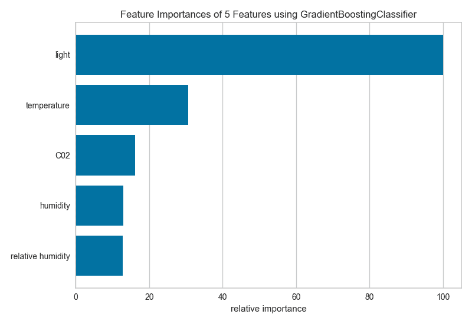

**前言**

玩过建模的朋友都知道，在建立模型之前有很长的一段特征工程工作要做，而在特征工程的过程中，探索性数据分析又是必不可少的一部分，因为如果我们要对各个特征进行细致的分析，那么必然会进行一些可视化以辅助我们来做选择和判断。

可视化的工具有很多，但是能够针对特征探索性分析而进行专门可视化的不多，今天给大家介绍一款功能十分强大的工具：**yellowbrick**，希望通过这个工具的辅助可以节省更多探索的时间，快速掌握特征信息。

**功能**

**雷达 RadViz**

RadViz雷达图是一种多变量数据可视化算法，它围绕圆周均匀地分布每个特征，并且标准化了每个特征值。一般数据科学家使用此方法来检测类之间的关联。例如，是否有机会从特征集中学习一些东西或是否有太多的噪音？

```
# Load the classification data set
data = load_data("occupancy")

# Specify the features of interest and the classes of the target
features = ["temperature", "relative humidity", "light", "C02", "humidity"]
classes = ["unoccupied", "occupied"]

# Extract the instances and target
X = data[features]
y = data.occupancy

# Import the visualizer
from yellowbrick.features import RadViz

# Instantiate the visualizer
visualizer = RadViz(classes=classes, features=features)

visualizer.fit(X, y)      # Fit the data to the visualizer
visualizer.transform(X)   # Transform the data
visualizer.poof()         # Draw/show/poof the data 
```


从上面雷达图可以看出5个维度中，温度对于目标类的影响是比较大的。

**一维排序 Rank 1D**

特征的一维排序利用排名算法，仅考虑单个特征，默认情况下使用Shapiro-Wilk算法来评估与特征相关的实例分布的正态性，然后绘制一个条形图，显示每个特征的相对等级。

```
from yellowbrick.features import Rank1D

# Instantiate the 1D visualizer with the Sharpiro ranking algorithm
visualizer = Rank1D(features=features, algorithm='shapiro')

visualizer.fit(X, y)                # Fit the data to the visualizer
visualizer.transform(X)             # Transform the data
visualizer.poof()                   # Draw/show/poof the data 
```


**PCA Projection**

PCA分解可视化利用主成分分析将高维数据分解为二维或三维，以便可以在散点图中绘制每个实例。PCA的使用意味着可以沿主要变化轴分析投影数据集，并且可以解释该数据集以确定是否可以利用球面距离度量。


**双重图 Biplot**

PCA投影可以增强到双点，其点是投影实例，其矢量表示高维空间中数据的结构。通过使用proj_features = True标志，数据集中每个要素的向量将在散点图上以该要素的最大方差方向绘制。这些结构可用于分析特征对分解的重要性或查找相关方差的特征以供进一步分析。

```
# Load the classification data set
data = load_data('concrete')

# Specify the features of interest and the target
target = "strength"
features = [
    'cement', 'slag', 'ash', 'water', 'splast', 'coarse', 'fine', 'age'
]

# Extract the instance data and the target
X = data[features]
y = data[target]

visualizer = PCADecomposition(scale=True, proj_features=True)
visualizer.fit_transform(X, y)
visualizer.poof() 
```


**特征重要性 Feature Importance**

特征工程过程涉及选择生成有效模型所需的最小特征，因为模型包含的特征越多，它就越复杂（数据越稀疏），因此模型对方差的误差越敏感。消除特征的常用方法是描述它们对模型的相对重要性，然后消除弱特征或特征组合并重新评估以确定模型在交叉验证期间是否更好。

在scikit-learn中，Decision Tree模型和树的集合（如Random Forest，Gradient Boosting和AdaBoost）在拟合时提供feature_importances_属性。Yellowbrick FeatureImportances可视化工具利用此属性对相对重要性进行排名和绘制。

```
import matplotlib.pyplot as plt

from sklearn.ensemble import GradientBoostingClassifier

from yellowbrick.features.importances import FeatureImportances

# Create a new matplotlib figure
fig = plt.figure()
ax = fig.add_subplot()

viz = FeatureImportances(GradientBoostingClassifier(), ax=ax)
viz.fit(X, y)
viz.poof() 
```



# **递归特征消除 Recursive Feature Elimination**

递归特征消除（RFE）是一种特征选择方法，它训练模型并删除最弱的特征（或多个特征），直到达到指定数量的特征。特征按模型的coef_或feature_importances_属性排序，并通过递归消除每个循环的少量特征，RFE尝试消除模型中可能存在的依赖性和共线性。  

RFE需要保留指定数量的特征，但事先通常不知道有多少特征有效。为了找到最佳数量的特征，交叉验证与RFE一起用于对不同的特征子集进行评分，并选择最佳评分特征集合。RFECV可视化绘制模型中的特征数量以及它们的交叉验证测试分数和可变性，并可视化所选数量的特征。

```
from sklearn.svm import SVC
from sklearn.datasets import make_classification

from yellowbrick.features import RFECV

# Create a dataset with only 3 informative features
X, y = make_classification(
    n_samples=1000, n_features=25, n_informative=3, n_redundant=2,
    n_repeated=0, n_classes=8, n_clusters_per_class=1, random_state=0
)

# Create RFECV visualizer with linear SVM classifier
viz = RFECV(SVC(kernel='linear', C=1))
viz.fit(X, y)
viz.poof() 
```


该图显示了理想的RFECV曲线，当捕获三个信息特征时，曲线跳跃到极好的准确度，然后随着非信息特征被添加到模型中，精度逐渐降低。阴影区域表示交叉验证的可变性，一个标准偏差高于和低于曲线绘制的平均精度得分。  

下面是一个真实数据集，我们可以看到RFECV对信用违约二元分类器的影响。

```
from sklearn.ensemble import RandomForestClassifier
from sklearn.model_selection import StratifiedKFold

df = load_data('credit')

target = 'default'
features = [col for col in data.columns if col != target]

X = data[features]
y = data[target]

cv = StratifiedKFold(5)
oz = RFECV(RandomForestClassifier(), cv=cv, scoring='f1_weighted')

oz.fit(X, y)
oz.poof() 
```


在这个例子中，我们可以看到选择了19个特征，尽管在大约5个特征之后模型的f1分数似乎没有太大改善。选择要消除的特征在确定每个递归的结果中起着重要作用；修改步骤参数以在每个步骤中消除多个特征可能有助于尽早消除最差特征，增强其余特征（并且还可用于加速具有大量特征的数据集的特征消除）。

**残差图 Residuals Plot**

在回归模型的上下文中，残差是目标变量（y）的观测值与预测值（ŷ）之间的差异，例如，预测的错误。残差图显示垂直轴上的残差与水平轴上的因变量之间的差异，允许检测目标中可能容易出错或多或少的误差的区域。

```
from sklearn.linear_model import Ridge
from yellowbrick.regressor import ResidualsPlot

# Instantiate the linear model and visualizer
ridge = Ridge()
visualizer = ResidualsPlot(ridge)

visualizer.fit(X_train, y_train)  # Fit the training data to the model
visualizer.score(X_test, y_test)  # Evaluate the model on the test data
visualizer.poof()                 # Draw/show/poof the data 
```


**正则化 Alpha Selection**

正则化旨在惩罚模型复杂性，因此α越高，模型越复杂，由于方差（过度拟合）而减少误差。另一方面，太高的Alpha会因偏差（欠调）而增加误差。因此，重要的是选择最佳α，以便在两个方向上最小化误差。  

AlphaSelection Visualizer演示了不同的α值如何影响线性模型正则化过程中的模型选择。一般而言，α增加了正则化的影响，例如，如果alpha为零，则没有正则化，α越高，正则化参数对最终模型的影响越大。

```
import numpy as np

from sklearn.linear_model import LassoCV
from yellowbrick.regressor import AlphaSelection

# Create a list of alphas to cross-validate against
alphas = np.logspace(-10, 1, 400)

# Instantiate the linear model and visualizer
model = LassoCV(alphas=alphas)
visualizer = AlphaSelection(model)

visualizer.fit(X, y)
g = visualizer.poof() 
```


**分类预测误差 Class Prediction Error**

类预测误差图提供了一种快速了解分类器在预测正确类别方面有多好的方法。

```
from sklearn.ensemble import RandomForestClassifier

from yellowbrick.classifier import ClassPredictionError

# Instantiate the classification model and visualizer
visualizer = ClassPredictionError(
    RandomForestClassifier(), classes=classes
)

# Fit the training data to the visualizer
visualizer.fit(X_train, y_train)

# Evaluate the model on the test data
visualizer.score(X_test, y_test)

# Draw visualization
g = visualizer.poof() 
```


当然也同时有分类评估指标的可视化，包括混淆矩阵、AUC/ROC、召回率/精准率等等。

# **二分类辨别阈值 Discrimination Threshold**

关于二元分类器的辨别阈值的精度，召回，f1分数和queue rate的可视化。辨别阈值是在阴性类别上选择正类别的概率或分数。通常，将其设置为50％，但可以调整阈值以增加或降低对误报或其他应用因素的敏感度。

```
from sklearn.linear_model import LogisticRegression
from yellowbrick.classifier import DiscriminationThreshold

# Instantiate the classification model and visualizer
logistic = LogisticRegression()
visualizer = DiscriminationThreshold(logistic)

visualizer.fit(X, y)  # Fit the training data to the visualizer
visualizer.poof()     # Draw/show/poof the data 
```


**聚类肘部法则 Elbow Method**

KElbowVisualizer实现了“肘部”法则，通过使模型具有K的一系列值来帮助数据科学家选择最佳簇数。如果折线图类似于手臂，那么“肘”（拐点）就是曲线）是一个很好的迹象，表明基础模型最适合那一点。  

在下面的示例中，KElbowVisualizer在具有8个随机点集的样本二维数据集上适合KMeans模型，以获得4到11的K值范围。当模型适合8个聚类时，我们可以在图中看到“肘部”，在这种情况下，我们知道它是最佳数字。

```
from sklearn.datasets import make_blobs

# Create synthetic dataset with 8 random clusters
X, y = make_blobs(centers=8, n_features=12, shuffle=True, random_state=42)

from sklearn.cluster import KMeans
from yellowbrick.cluster import KElbowVisualizer

# Instantiate the clustering model and visualizer
model = KMeans()
visualizer = KElbowVisualizer(model, k=(4,12))

visualizer.fit(X)    # Fit the data to the visualizer
visualizer.poof()    # Draw/show/poof the data 
```


**集群间距离图 Intercluster Distance Maps**

集群间距离地图以2维方式显示集群中心的嵌入，并保留与其他中心的距离。例如。中心越靠近可视化，它们就越接近原始特征空间。根据评分指标调整集群的大小。默认情况下，它们按内部数据的多少，例如属于每个中心的实例数。这给出了集群的相对重要性。但请注意，由于两个聚类在2D空间中重叠，因此并不意味着它们在原始特征空间中重叠。

```
from sklearn.datasets import make_blobs

# Make 12 blobs dataset
X, y = make_blobs(centers=12, n_samples=1000, n_features=16, shuffle=True)

from sklearn.cluster import KMeans
from yellowbrick.cluster import InterclusterDistance

# Instantiate the clustering model and visualizer
visualizer = InterclusterDistance(KMeans(9))

visualizer.fit(X) # Fit the training data to the visualizer
visualizer.poof() # Draw/show/poof the data 
```


**模型选择-学习曲线 Learning Curve **

学习曲线基于不同数量的训练样本，检验模型训练分数与交叉验证测试分数的关系。这种可视化通常用来表达两件事： 

1\. 模型会不会随着数据量增多而效果变好

2\. 模型对偏差和方差哪个更加敏感

下面是利用yellowbrick生成的学习曲线可视化图。该学习曲线对于分类、回归和聚类都可以适用。


**模型选择-验证曲线 Validation Curve**

模型验证用于确定模型对其已经过训练的数据的有效性以及它对新输入的泛化程度。为了测量模型的性能，我们首先将数据集拆分为训练和测试，将模型拟合到训练数据上并在保留的测试数据上进行评分。 

为了最大化分数，必须选择模型的超参数，以便最好地允许模型在指定的特征空间中操作。大多数模型都有多个超参数，选择这些参数组合的最佳方法是使用网格搜索。然而，绘制单个超参数对训练和测试数据的影响有时是有用的，以确定模型是否对某些超参数值不适合或过度拟合。

```
import numpy as np

from sklearn.tree import DecisionTreeRegressor
from yellowbrick.model_selection import ValidationCurve

# Load a regression dataset
data = load_data('energy')

# Specify features of interest and the target
targets = ["heating load", "cooling load"]
features = [col for col in data.columns if col not in targets]

# Extract the instances and target
X = data[features]
y = data[targets[0]]

viz = ValidationCurve(
    DecisionTreeRegressor(), param_name="max_depth",
    param_range=np.arange(1, 11), cv=10, scoring="r2"
)

# Fit and poof the visualizer
viz.fit(X, y)
viz.poof() 
```


**总结**

个人认为yellowbrick这个工具非常好，一是因为解决了特征工程和建模过程中的可视化问题，极大地简化了操作；二是通过各种可视化也可以补充自己对建模的一些盲区。

本篇仅展示了建模中部分可视化功能，详细的完整功能请参考：

https://www.scikit-yb.org/en/latest/index.html

*AI学习路线和优质资源，在后台回复"AI"获取*

