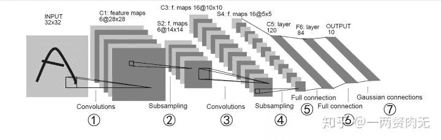

Datawhale

**Datawhale，和鲸社区编辑**

PyTorch是一个基于Python的库，提供了一个具有灵活易用的深度学习框架，是近年来最受欢迎的深度学习框架之一。

未经授权，禁止转载。

**1  初识PyTorch**

1.1 张量

1.导入pytorch包

```
import torch
```

2.创建一个空的5x3张量

```
x = torch.empty(5, 3)
print(x)
```

3.创建一个随机初始化的5x3张量

```
x = torch.rand(5, 3)
print(x)
```

4.创建一个5x3的0张量，类型为long

```
x = torch.zeros(5, 3, dtype=torch.long)
print(x)
```

5.直接从数组创建张量

```
x = torch.tensor([5.5, 3])
print(x)
```

6.创建一个5x3的单位张量，类型为double

```
x = torch.ones(5, 3, dtype=torch.double)
print(x)
```

7.从已有的张量创建相同维度的新张量，并且重新定义类型为float

```
x = torch.randn_like(x, dtype=torch.float)
print(x)
```

8.打印一个张量的维度

```
print(x.size())
```

9.将两个张量相加

```
y = torch.rand(5, 3)
print(x + y)

# 方法二
# print(torch.add(x, y))

# 方法三
# result = torch.empty(5, 3)
# torch.add(x, y, out=result)
# print(result)

# 方法四
# y.add_(x)
# print(y)
```

10.取张量的第一列

```
print(x[:, 1])
```

11.将一个4x4的张量resize成一个一维张量

```
x = torch.randn(4, 4)
y = x.view(16)
print(x.size(),y.size())
```

12.将一个4x4的张量，resize成一个2x8的张量

```
y = x.view(2, 8)
print(x.size(),y.size())

# 方法二
z = x.view(-1, 8) # 确定一个维度，-1的维度会被自动计算
print(x.size(),z.size())
```

13.从张量中取出数字

```
x = torch.randn(1)
print(x)
print(x.item())
```

1.2 Numpy的操作

14.将张量装换成numpy数组

```
a = torch.ones(5)
print(a)

b = a.numpy()
print(b)
```

15.将张量+1，并观察上题中numpy数组的变化

```
a.add_(1)
print(a)
print(b)
```

16.从numpy数组创建张量

```
import numpy as np
a = np.ones(5)
b = torch.from_numpy(a)
print(a)
print(b)
```

17.将numpy数组+1并观察上题中张量的变化

```
np.add(a, 1, out=a)
print(a)
print(b)
```

2 自动微分

2.1 张量的自动微分

18.新建一个张量，并设置`requires_grad=True`

```
x = torch.ones(2, 2, requires_grad=True)
print(x)
```

19.对张量进行任意操作（y = x + 2）

```
y = x + 2
print(y)
print(y.grad_fn) # y就多了一个AddBackward
```

20.再对y进行任意操作

```
z = y * y * 3
out = z.mean()

print(z) # z多了MulBackward
print(out) # out多了MeanBackward
```

2.2 梯度

21.对out进行反向传播

```
out.backward()
```

22.打印梯度d(out)/dx

```
print(x.grad) #out=0.25*Σ3(x+2)^2
```

23.创建一个结果为矢量的计算过程（y=x*2^n）

```
x = torch.randn(3, requires_grad=True)

y = x * 2
while y.data.norm() < 1000:
    y = y * 2

print(y)
```

24.计算`v = [0.``1, 1.0, 0.0001]`处的梯度

```
v = torch.tensor([0.1, 1.0, 0.0001], dtype=torch.float)
y.backward(v)

print(x.grad)
```

25.关闭梯度的功能

```
print(x.requires_grad)
print((x ** 2).requires_grad)

with torch.no_grad():
    print((x ** 2).requires_grad)

# 方法二
# print(x.requires_grad)
# y = x.detach()
# print(y.requires_grad)
# print(x.eq(y).all())
```

3 神经网络

这部分会实现LeNet5，结构如下所示



```
import torch
import torch.nn as nn
import torch.nn.functional as F

class Net(nn.Module):

    def __init__(self):
        super(Net, self).__init__()
        # 26.定义①的卷积层，输入为32x32的图像，卷积核大小5x5卷积核种类6
        self.conv1 = nn.Conv2d(3, 6, 5)
        # 27.定义③的卷积层，输入为前一层6个特征，卷积核大小5x5，卷积核种类16
        self.conv2 = nn.Conv2d(6, 16, 5)
        # 28.定义⑤的全链接层，输入为16*5*5，输出为120
        self.fc1 = nn.Linear(16 * 5 * 5, 120)  # 6*6 from image dimension
        # 29.定义⑥的全连接层，输入为120，输出为84
        self.fc2 = nn.Linear(120, 84)
        # 30.定义⑥的全连接层，输入为84，输出为10
        self.fc3 = nn.Linear(84, 10)

    def forward(self, x):
        # 31.完成input-S2，先卷积+relu，再2x2下采样
        x = F.max_pool2d(F.relu(self.conv1(x)), (2, 2))
        # 32.完成S2-S4，先卷积+relu，再2x2下采样
        x = F.max_pool2d(F.relu(self.conv2(x)), 2) #卷积核方形时，可以只写一个维度
        # 33.将特征向量扁平成列向量
        x = x.view(-1, 16 * 5 * 5)
        # 34.使用fc1+relu
        x = F.relu(self.fc1(x))
        # 35.使用fc2+relu
        x = F.relu(self.fc2(x))
        # 36.使用fc3
        x = self.fc3(x)
        return x

net = Net()
print(net)
```

37.打印网络的参数

```
params = list(net.parameters())
# print(params)
print(len(params))
```

38.打印某一层参数的形状

```
print(params[0].size())
```

39.随机输入一个向量，查看前向传播输出

```
input = torch.randn(1, 1, 32, 32)
out = net(input)
print(out)
```

40.将梯度初始化

```
net.zero_grad()
```

41.随机一个梯度进行反向传播

```
out.backward(torch.randn(1, 10))
```

## **3.2 损失函数**

42.用自带的MSELoss()定义损失函数

```
criterion = nn.MSELoss()
```

43.随机一个真值，并用随机的输入计算损失

```
target = torch.randn(10)  # 随机真值
target = target.view(1, -1)  # 变成列向量

output = net(input)  # 用随机输入计算输出

loss = criterion(output, target)  # 计算损失
print(loss)
```

44.将梯度初始化，计算上一步中loss的反向传播

```
net.zero_grad()

print('conv1.bias.grad before backward')
print(net.conv1.bias.grad)
```

45.计算43中loss的反向传播

```
loss.backward()

print('conv1.bias.grad after backward')
print(net.conv1.bias.grad)
```

## 3.3 更新权重

46.定义SGD优化器算法，学习率设置为0.01

```
import torch.optim as optim
optimizer = optim.SGD(net.parameters(), lr=0.01)
```

47.使用优化器更新权重

```
optimizer.zero_grad()
output = net(input)
loss = criterion(output, target)
loss.backward()

# 更新权重
optimizer.step()
```

## 4 训练一个分类器

## 4.1 读取CIFAR10数据，做标准化

48.构造一个transform，将三通道(0,1)区间的数据转换成(-1,1)的数据

```
import torchvision
import torchvision.transforms as transforms

transform = transforms.Compose(
    [transforms.ToTensor(),
     transforms.Normalize((0.5, 0.5, 0.5), (0.5, 0.5, 0.5))])
```

读取数据集

```
trainset = cifar(root = './input/cifar10', segmentation='train', transforms=transform)
testset = cifar(root = './input/cifar10', segmentation='test', transforms=transform)
trainloader = torch.utils.data.DataLoader(trainset, batch_size=batch_size,shuffle=True, num_workers=2)
testloader = torch.utils.data.DataLoader(testset, batch_size=batch_size,shuffle=False, num_workers=2)

classes = ('plane', 'car', 'bird', 'cat',
           'deer', 'dog', 'frog', 'horse', 'ship', 'truck')
```

## **4.2 建立网络**

这部分沿用前面的网络

```
net2 = Net()
```

## 4.3 定义损失函数和优化器

49.定义交叉熵损失函数

```
criterion2 = nn.CrossEntropyLoss()
```

50.定义SGD优化器算法，学习率设置为0.001，`momentum=0.9`

```
optimizer2 = optim.SGD(net2.parameters(), lr=0.001, momentum=0.9)
```

## **4.4训练网络**

```
for epoch in range(2):

    running_loss = 0.0
    for i, data in enumerate(trainloader, 0):
        # 获取X,y对
        inputs, labels = data

        # 51.初始化梯度
        optimizer2.zero_grad()

        # 52.前馈
        outputs = net2(inputs)
        # 53.计算损失
        loss = criterion2(outputs, labels)
        # 54.计算梯度
        loss.backward()
        # 55.更新权值
        optimizer2.step()

        # 每2000个数据打印平均代价函数值
        running_loss += loss.item()
        if i % 2000 == 1999:    # print every 2000 mini-batches
            print('[%d, %5d] loss: %.3f' %
                  (epoch + 1, i + 1, running_loss / 2000))
            running_loss = 0.0

print('Finished Training')
```

## 4.5 使用模型预测

取一些数据

```
dataiter = iter(testloader)
images, labels = dataiter.next()

# print images
imshow(torchvision.utils.make_grid(images))
print('GroundTruth: ', ' '.join('%5s' % classes[labels[j]] for j in range(4)))
```

56.使用模型预测

```
outputs = net2(images)

_, predicted = torch.max(outputs, 1)

print('Predicted: ', ' '.join('%5s' % classes[predicted[j]]
                              for j in range(4)))
```

57.在测试集上进行打分

```
correct = 0
total = 0
with torch.no_grad():
    for data in testloader:
        images, labels = data
        outputs = net2(images)
        _, predicted = torch.max(outputs.data, 1)
        total += labels.size(0)
        correct += (predicted == labels).sum().item()

print('Accuracy of the network on the 10000 test images: %d %%' % (
    100 * correct / total))
```

## **4.6 存取模型**

58.保存训练好的模型

```
PATH = './cifar_net.pth'
torch.save(net.state_dict(), PATH)
```

59.读取保存的模型

```
pretrained_net = torch.load(PATH)
```

60.加载模型

```
net3 = Net()
net3.load_state_dict(pretrained_net)
```

*PDF下载：**https://pan.baidu.com/s/1UBMJk99edfMvM8CckCiO9w*

*AI学习路线和优质资源，在后台回复"AI"获取*

