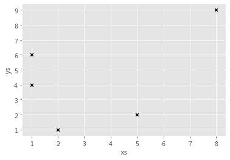
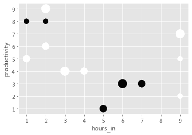
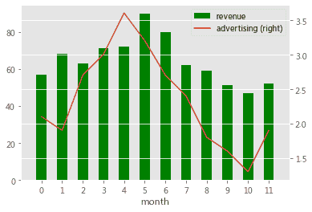

Datawhale

**Datawhale，和鲸社区编辑**

Pandas 是基于 NumPy 的一种数据处理工具，该工具为了解决数据分析任务而创建。Pandas 纳入了大量库和一些标准的数据模型，提供了高效地操作大型数据集所需的函数和方法。这些练习着重DataFrame和Series对象的基本操作，包括数据的索引、分组、统计和清洗。友情提示：代码虽好，自己动手才算学到。

未经授权，禁止转载。

### 基本操作

## 1.导入 Pandas 库并简写为 pd，并输出版本号

```
import pandas as pd
pd.__version__ 
```

## 2.从列表创建 Series

```
arr = [0, 1, 2, 3, 4]
df = pd.Series(arr) # 如果不指定索引，则默认从 0 开始
df 
```

## 3.从字典创建 Series

```
d = {'a':1,'b':2,'c':3,'d':4,'e':5}
df = pd.Series(d)
df 
```

## 4.从 NumPy 数组创建 DataFrame

```
dates = pd.date_range('today',periods=6) # 定义时间序列作为 index
num_arr = np.random.randn(6,4) # 传入 numpy 随机数组
columns = ['A','B','C','D'] # 将列表作为列名
df1 = pd.DataFrame(num_arr, index = dates, columns = columns)
df1 
```

## 5.从CSV中创建 DataFrame，分隔符为;，编码格式为gbk

```
# df = pd.read_csv('test.csv', encoding='gbk, sep=';') 
```

## 6.从字典对象data创建DataFrame，设置索引为labels

```
import numpy as np

data = {'animal': ['cat', 'cat', 'snake', 'dog', 'dog', 'cat', 'snake', 'cat', 'dog', 'dog'],
        'age': [2.5, 3, 0.5, np.nan, 5, 2, 4.5, np.nan, 7, 3],
        'visits': [1, 3, 2, 3, 2, 3, 1, 1, 2, 1],
        'priority': ['yes', 'yes', 'no', 'yes', 'no', 'no', 'no', 'yes', 'no', 'no']}

labels = ['a', 'b', 'c', 'd', 'e', 'f', 'g', 'h', 'i', 'j']

df = pd.DataFrame(data, index=labels)
df 
```

## 7.显示DataFrame的基础信息，包括行的数量；列名；每一列值的数量、类型

```
df.info()
# 方法二
# df.describe() 
```

## 8.展示df的前3行

```
df.iloc[:3]
# 方法二
#df.head(3) 
```

## 9.取出df的animal和age列

```
df.loc[:, ['animal', 'age']]
# 方法二
# df[['animal', 'age']] 
```

## 10.取出索引为[3, 4, 8]行的animal和age列

```
df.loc[df.index[[3, 4, 8]], ['animal', 'age']] 
```

## 11.取出age值大于3的行

```
df[df['age'] > 3] 
```

## 12.取出age值缺失的行

```
df[df['age'].isnull()] 
```

## 13.取出age在2,4间的行（不含）

```
df[(df['age']>2) & (df['age']>4)]
#
#df[df['age'].between(2, 4)] 
```

## 14.f行的age改为1.5

```
df.loc['f', 'age'] = 1.5 
```

## 15.计算visits的总和

```
df['visits'].sum() 
```

## 16.计算每个不同种类animal的age的平均数

```
df.groupby('animal')['age'].mean() 
```

## 17.在df中插入新行k，然后删除该行

```
#插入
df.loc['k'] = [5.5, 'dog', 'no', 2]
# 删除
df = df.drop('k')
df 
```

## 18.计算df中每个种类animal的数量

```
df['animal'].value_counts() 
```

## 19.先按age降序排列，后按visits升序排列

```
df.sort_values(by=['age', 'visits'], ascending=[False, True]) 
```

## 20.将priority列中的yes, no替换为布尔值True, False

```
df['priority'] = df['priority'].map({'yes': True, 'no': False})
df 
```

## 21.将animal列中的snake替换为python

```
df['animal'] = df['animal'].replace('snake', 'python')
df 
```

## 22.对每种animal的每种不同数量visits，计算平均age，即，返回一个表格，行是aniaml种类，列是visits数量，表格值是行动物种类列访客数量的平均年龄

```
df.pivot_table(index='animal', columns='visits', values='age', aggfunc='mean') 
```

### 进阶操作

## 23.有一列整数列A的DatraFrame，删除数值重复的行

```
df = pd.DataFrame({'A': [1, 2, 2, 3, 4, 5, 5, 5, 6, 7, 7]})
print(df)
df1 = df.loc[df['A'].shift() != df['A']]
# 方法二
# df1 = df.drop_duplicates(subset='A')
print(df1) 
```

## 24.一个全数值DatraFrame，每个数字减去该行的平均数

```
df = pd.DataFrame(np.random.random(size=(5, 3)))
print(df)
df1 = df.sub(df.mean(axis=1), axis=0)
print(df1) 
```

## 25.一个有5列的DataFrame，求哪一列的和最小

```
df = pd.DataFrame(np.random.random(size=(5, 5)), columns=list('abcde'))
print(df)
df.sum().idxmin() 
```

## 26.给定DataFrame，求A列每个值的前3大的B的和

```
df = pd.DataFrame({'A': list('aaabbcaabcccbbc'), 
                   'B': [12,345,3,1,45,14,4,52,54,23,235,21,57,3,87]})
print(df)
df1 = df.groupby('A')['B'].nlargest(3).sum(level=0)
print(df1) 
```

## 27.给定DataFrame，有列A, B，A的值在1-100（含），对A列每10步长，求对应的B的和

```
df = pd.DataFrame({'A': [1,2,11,11,33,34,35,40,79,99], 
                   'B': [1,2,11,11,33,34,35,40,79,99]})
print(df)
df1 = df.groupby(pd.cut(df['A'], np.arange(0, 101, 10)))['B'].sum()
print(df1) 
```

## 28.给定DataFrame，计算每个元素至左边最近的0（或者至开头）的距离，生成新列y

```
df = pd.DataFrame({'X': [7, 2, 0, 3, 4, 2, 5, 0, 3, 4]})

izero = np.r_[-1, (df['X'] == 0).to_numpy().nonzero()[0]] # 标记0的位置
idx = np.arange(len(df))
df['Y'] = idx - izero[np.searchsorted(izero - 1, idx) - 1]
print(df)

# 方法二
# x = (df['X'] != 0).cumsum()
# y = x != x.shift()
# df['Y'] = y.groupby((y != y.shift()).cumsum()).cumsum()

# 方法三
# df['Y'] = df.groupby((df['X'] == 0).cumsum()).cumcount()
#first_zero_idx = (df['X'] == 0).idxmax()
# df['Y'].iloc[0:first_zero_idx] += 1 
```

## 29.一个全数值的DataFrame，返回最大3值的坐标

```
df = pd.DataFrame(np.random.random(size=(5, 3)))
print(df)
df.unstack().sort_values()[-3:].index.tolist() 
```

## 30.给定DataFrame，将负值代替为同组的平均值

```
df = pd.DataFrame({'grps': list('aaabbcaabcccbbc'), 
                   'vals': [-12,345,3,1,45,14,4,-52,54,23,-235,21,57,3,87]})
print(df)

def replace(group):
    mask = group<0
    group[mask] = group[~mask].mean()
    return group

df['vals'] = df.groupby(['grps'])['vals'].transform(replace)
print(df) 
```

## 31.计算3位滑动窗口的平均值，忽略NAN

```
df = pd.DataFrame({'group': list('aabbabbbabab'),
                    'value': [1, 2, 3, np.nan, 2, 3, np.nan, 1, 7, 3, np.nan, 8]})
print(df)

g1 = df.groupby(['group'])['value']
g2 = df.fillna(0).groupby(['group'])['value'] 

s = g2.rolling(3, min_periods=1).sum() / g1.rolling(3, min_periods=1).count()

s.reset_index(level=0, drop=True).sort_index() 
```

### Series 和 Datetime索引

## 32.创建Series s，将2015所有工作日作为随机值的索引

```
dti = pd.date_range(start='2015-01-01', end='2015-12-31', freq='B') 
s = pd.Series(np.random.rand(len(dti)), index=dti)

s.head(10) 
```

## 33.所有礼拜三的值求和

```
s[s.index.weekday == 2].sum() 
```

## 34.求每个自然月的平均数

```
s.resample('M').mean() 
```

## 35.每连续4个月为一组，求最大值所在的日期

```
s.groupby(pd.Grouper(freq='4M')).idxmax() 
```

## 36.创建2015-2016每月第三个星期四的序列

```
pd.date_range('2015-01-01', '2016-12-31', freq='WOM-3THU') 
```

### 数据清洗

```
df = pd.DataFrame({'From_To': ['LoNDon_paris', 'MAdrid_miLAN', 'londON_StockhOlm', 
                               'Budapest_PaRis', 'Brussels_londOn'],
              'FlightNumber': [10045, np.nan, 10065, np.nan, 10085],
              'RecentDelays': [[23, 47], [], [24, 43, 87], [13], [67, 32]],
                   'Airline': ['KLM(!)', '<Air France> (12)', '(British Airways. )', 
                               '12. Air France', '"Swiss Air"']})
df 
```

## 37.FlightNumber列中有些值缺失了，他们本来应该是每一行增加10，填充缺失的数值，并且令数据类型为整数

```
df['FlightNumber'] = df['FlightNumber'].interpolate().astype(int)
df 
```

## 38.将From_To列从_分开，分成From, To两列，并删除原始列

```
temp = df.From_To.str.split('_', expand=True)
temp.columns = ['From', 'To']
df = df.join(temp)
df = df.drop('From_To', axis=1)
df 
```

## 39.将From, To大小写统一

```
df['From'] = df['From'].str.capitalize()
df['To'] = df['To'].str.capitalize()
df 
```

## 40.Airline列，有一些多余的标点符号，需要提取出正确的航司名称。举例：'(British Airways. )' 应该改为 'British Airways'.

```
df['Airline'] = df['Airline'].str.extract('([a-zA-Z\s]+)', expand=False).str.strip()
df 
```

## 41.Airline列，数据被以列表的形式录入，但是我们希望每个数字被录入成单独一列，delay_1, delay_2, …没有的用NAN替代。

```
delays = df['RecentDelays'].apply(pd.Series)
delays.columns = ['delay_{}'.format(n) for n in range(1, len(delays.columns)+1)]
df = df.drop('RecentDelays', axis=1).join(delays)

df 
```

### 层次化索引

## 42.用 letters = ['A', 'B', 'C'] 和 numbers = list(range(10))的组合作为系列随机值的层次化索引

```
letters = ['A', 'B', 'C']
numbers = list(range(4))

mi = pd.MultiIndex.from_product([letters, numbers])
s = pd.Series(np.random.rand(12), index=mi)
s 
```

## 43.检查s是否是字典顺序排序的

```
s.index.is_lexsorted()
# 方法二
# s.index.lexsort_depth == s.index.nlevels 
```

## 44.选择二级索引为1, 3的行

```
s.loc[:, [1, 3]] 
```

## 45.对s进行切片操作，取一级索引从头至B，二级索引从2开始到最后

```
s.loc[pd.IndexSlice[:'B', 2:]]
# 方法二
# s.loc[slice(None, 'B'), slice(2, None)] 
```

## 46.计算每个一级索引的和（A, B, C每一个的和）

```
s.sum(level=0)
#方法二
#s.unstack().sum(axis=0) 
```

## 47.交换索引等级，新的Series是字典顺序吗？不是的话请排序

```
new_s = s.swaplevel(0, 1)
print(new_s)
print(new_s.index.is_lexsorted())
new_s = new_s.sort_index()
print(new_s) 
```

### 可视化

```
import matplotlib.pyplot as plt
df = pd.DataFrame({"xs":[1,5,2,8,1], "ys":[4,2,1,9,6]})
plt.style.use('ggplot') 
```

## 48.画出df的散点图

```
df.plot.scatter("xs", "ys", color = "black", marker = "x") 
```



## 49.可视化指定4维DataFrame

```
df = pd.DataFrame({"productivity":[5,2,3,1,4,5,6,7,8,3,4,8,9],
                   "hours_in"    :[1,9,6,5,3,9,2,9,1,7,4,2,2],
                   "happiness"   :[2,1,3,2,3,1,2,3,1,2,2,1,3],
                   "caffienated" :[0,0,1,1,0,0,0,0,1,1,0,1,0]})

df.plot.scatter("hours_in", "productivity", s = df.happiness * 100, c = df.caffienated) 
```



## 50.在同一个图中可视化2组数据，共用X轴，但y轴不同

```
df = pd.DataFrame({"revenue":[57,68,63,71,72,90,80,62,59,51,47,52],
                   "advertising":[2.1,1.9,2.7,3.0,3.6,3.2,2.7,2.4,1.8,1.6,1.3,1.9],
                   "month":range(12)})

ax = df.plot.bar("month", "revenue", color = "green")
df.plot.line("month", "advertising", secondary_y = True, ax = ax)
ax.set_xlim((-1,12)); 
```



*原文地址：**https://www.kesci.com/home/project/5ddc974ef41512002cec1dca*

*AI学习路线和优质资源，在后台回复"AI"获取*

